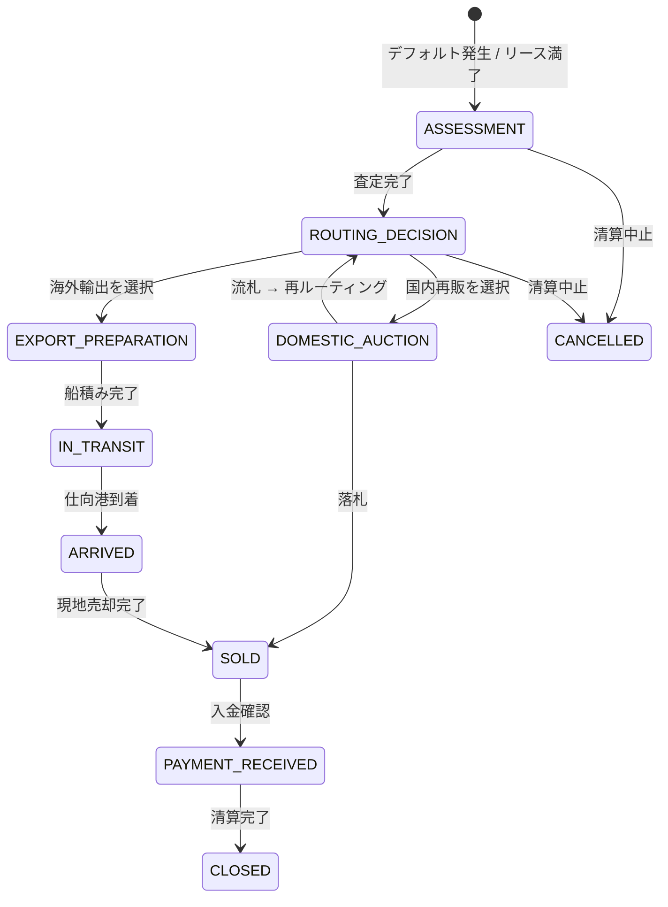
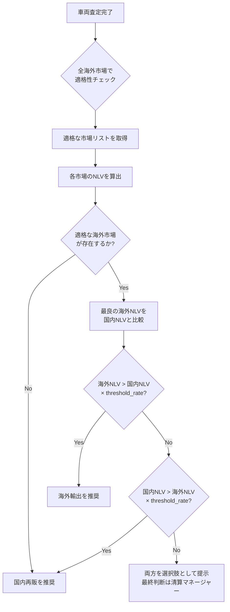
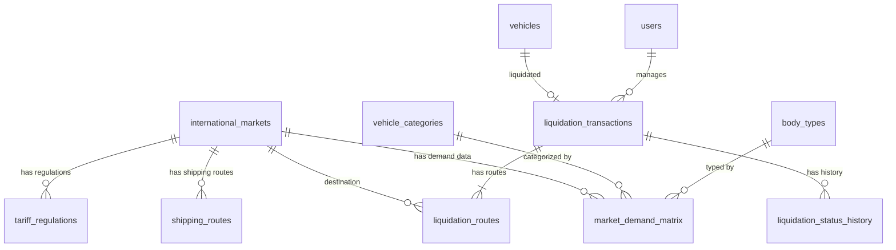
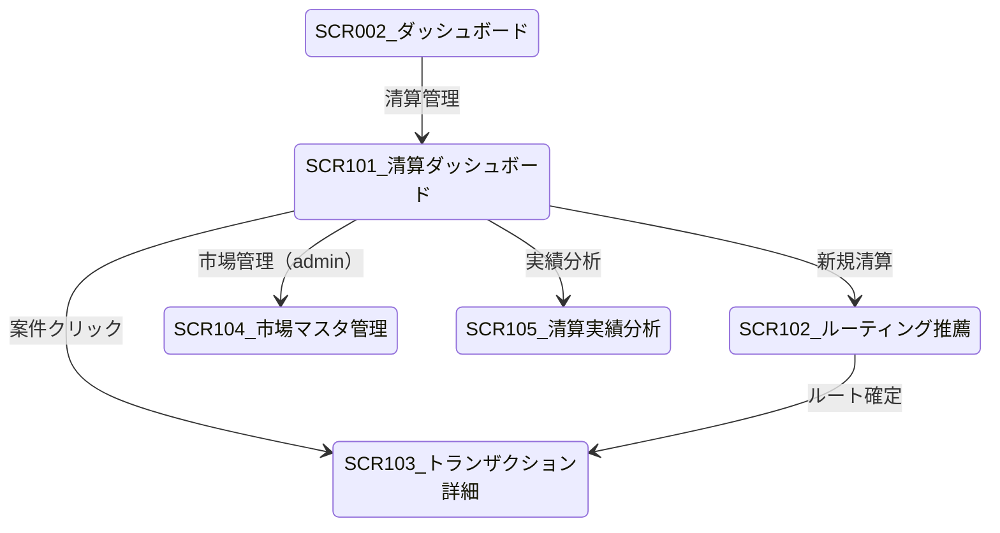

# グローバル清算（リクイデーション）システム — 仕様書

**Global Liquidation System Specification**

| 項目 | 内容 |
|------|------|
| 文書バージョン | 1.0 |
| 作成日 | 2026-04-06 |
| ステータス | 初版 |
| 親文書 | 商用車リースバック価格最適化システム (CVLPOS) 仕様書 |

---

## 目次

1. [概要と目的](#1-概要と目的)
2. [国際市場データベース](#2-国際市場データベース)
3. [最適ルーティングエンジン](#3-最適ルーティングエンジン)
4. [清算プロセス管理](#4-清算プロセス管理)
5. [国内再販 vs 海外輸出の判定ロジック](#5-国内再販-vs-海外輸出の判定ロジック)
6. [データベース設計](#6-データベース設計)
7. [APIエンドポイント](#7-apiエンドポイント)
8. [画面設計](#8-画面設計)
9. [非機能要件](#9-非機能要件)
10. [開発フェーズ](#10-開発フェーズ)

---

## 1. 概要と目的

### 1.1 背景

ピッチデック（Page 2）に記載の通り、商用トラックは乗用車と異なり「スクラップ価値に減衰しない」性質を持つ。大型トラックには世界規模での巨大な二次市場需要（Massive secondary market demand globally）が存在し、リース期間満了時または債務不履行（デフォルト）発生時の「Terminal Value」が事業収益に大きく寄与する。

ピッチデック（Page 8）では、デフォルト後 T+10日 において「Carchs独自の国際ルーティングにより、即座に現金化し、プレミアムマージンを確保する」と定義されている。

本仕様書は、この「グローバル清算」機能を実現するシステムの技術仕様を定義する。

### 1.2 ビジョン

**「デフォルト発生時にも資産価値を最大化し、国際二次市場へ即座にルーティングすることで、ファンドの損失を最小化し、むしろ利益機会に転換する」**

### 1.3 システムスコープ

| 区分 | 対象内容 |
|------|---------|
| 国際市場データ管理 | 地域別需要マトリクス、車種×地域の価格テーブル、輸送コスト・関税データベース |
| 最適ルーティング | 車両スペックに基づく売却先市場の推薦、純売却額の算出 |
| 清算プロセス管理 | 査定から入金までのステータス管理、各ステージのSLA |
| 国内/海外判定 | 国内オークション vs 海外輸出の利益比較と推奨アクション |

### 1.4 用語定義

| 用語 | 英語 | 定義 |
|------|------|------|
| **清算（リクイデーション）** | Liquidation | デフォルトまたはリース満了後の車両売却による現金化プロセス |
| **ルーティング** | Routing | 車両を最適な売却先市場へ振り分けること |
| **純清算価値** | Net Liquidation Value (NLV) | 海外市場売却価格から輸送費・関税・検査費用等を差し引いた実質手取り額 |
| **需要プレミアム** | Demand Premium | 特定地域で特定車種の需要が高いことにより上乗せされる価格 |
| **FOB価格** | FOB Price | 本船渡し価格。港湾での船積み完了時点の価格 |
| **CIF価格** | CIF Price | 運賃・保険料込み価格。仕向港到着時の価格 |
| **HS Code** | HS Code | 商品の分類に用いられる国際統一コード（関税分類番号） |
| **JEVIC** | JEVIC | 日本輸出車両検査センター。輸出前の車両検査機関 |

---

## 2. 国際市場データベース

### 2.1 地域別需要マトリクス

グローバル二次市場を以下の主要地域に分類し、車種カテゴリごとの需要レベルを管理する。

#### 対象地域一覧

| 地域コード | 地域名 | 主要国 | 概要 |
|-----------|--------|--------|------|
| `SEA` | 東南アジア | ミャンマー、フィリピン、ベトナム、カンボジア、ラオス | 日本製中古トラック最大の需要地域。右ハンドル受容度が高い |
| `AFR_E` | 東アフリカ | ケニア、タンザニア、ウガンダ、モザンビーク | 右ハンドル文化圏。日本製車両への信頼が厚い |
| `AFR_W` | 西アフリカ | ナイジェリア、ガーナ、コートジボワール | 左ハンドル圏だが大型トラック需要旺盛 |
| `MDE` | 中東 | UAE（ドバイ）、サウジアラビア、ヨルダン | ドバイが中継貿易ハブ。再輸出拠点 |
| `SAM` | 南米 | チリ、ペルー、ボリビア、パラグアイ | 鉱山・農業用途で大型車需要あり |
| `CIS` | 旧ソ連諸国 | ロシア、カザフスタン、ウズベキスタン | 寒冷地仕様に需要。規制が流動的 |
| `OCE` | オセアニア | パプアニューギニア、フィジー、サモア | 小規模市場だが右ハンドル需要安定 |
| `DOM` | 国内 | 日本 | 国内オークション再販 |

#### 車種×地域 需要レベルマトリクス

需要レベル: `S`(極めて高い) / `A`(高い) / `B`(中程度) / `C`(低い) / `N`(需要なし)

| 車種カテゴリ | SEA | AFR_E | AFR_W | MDE | SAM | CIS | OCE |
|-------------|-----|-------|-------|-----|-----|-----|-----|
| 大型トラック（ウイング） | S | A | B | A | B | A | C |
| 大型トラック（冷凍冷蔵） | A | B | B | S | B | B | C |
| 大型トラック（ダンプ） | A | S | A | B | S | A | B |
| 大型トラック（平ボディ） | A | A | A | B | A | B | B |
| 中型トラック（全般） | S | A | A | B | B | B | B |
| 小型トラック（全般） | A | S | A | B | C | B | A |
| トレーラーヘッド | B | A | B | A | A | S | C |
| クレーン付き | B | B | C | A | A | B | C |
| タンクローリー | C | B | B | S | B | A | N |

#### 価格プレミアム/ディスカウントテーブル

国内オークション価格を基準 (1.0) とした倍率。

| 車種カテゴリ | SEA | AFR_E | AFR_W | MDE | SAM | CIS | OCE |
|-------------|-----|-------|-------|-----|-----|-----|-----|
| 大型トラック（ウイング） | 1.15 | 1.05 | 0.95 | 1.10 | 0.90 | 1.05 | 0.85 |
| 大型トラック（冷凍冷蔵） | 1.10 | 0.95 | 0.90 | 1.25 | 0.95 | 0.90 | 0.80 |
| 大型トラック（ダンプ） | 1.10 | 1.20 | 1.10 | 0.95 | 1.25 | 1.15 | 0.90 |
| 大型トラック（平ボディ） | 1.10 | 1.10 | 1.05 | 1.00 | 1.05 | 0.95 | 0.90 |
| 中型トラック（全般） | 1.20 | 1.10 | 1.05 | 0.95 | 0.90 | 0.90 | 0.95 |
| 小型トラック（全般） | 1.10 | 1.15 | 1.10 | 0.90 | 0.85 | 0.85 | 1.05 |
| トレーラーヘッド | 0.95 | 1.05 | 0.90 | 1.10 | 1.10 | 1.20 | 0.80 |
| クレーン付き | 0.95 | 0.90 | 0.80 | 1.15 | 1.10 | 0.95 | 0.75 |
| タンクローリー | 0.85 | 0.90 | 0.85 | 1.30 | 0.95 | 1.10 | 0.70 |

> 注: 上記倍率は初期シード値であり、売却実績データの蓄積に伴い四半期ごとに更新する。

#### 大型トラック海外輸出需要ランキング（初期設定値）

| 順位 | 地域 | 需要スコア | 主な用途 | 備考 |
|------|------|-----------|---------|------|
| 1 | 東南アジア (SEA) | 95 | 長距離輸送・物流 | ミャンマー・フィリピンが中心。右ハンドル車の最大市場 |
| 2 | 東アフリカ (AFR_E) | 85 | 建設・鉱山・農産物輸送 | ケニア・タンザニアで日本製トラック支持が高い |
| 3 | 中東 (MDE) | 80 | 建設・石油関連・中継貿易 | ドバイがアフリカ・中央アジアへの再輸出ハブ |
| 4 | 旧ソ連諸国 (CIS) | 75 | 鉱山・長距離輸送 | トレーラーヘッド需要が特に高い |
| 5 | 南米 (SAM) | 70 | 鉱山・農業 | ダンプ需要が突出 |
| 6 | 西アフリカ (AFR_W) | 65 | インフラ整備・物流 | 左ハンドル要求あり。改造コスト発生の場合あり |
| 7 | オセアニア (OCE) | 45 | 離島物流 | 市場規模小だが安定 |

### 2.2 輸出コスト・規制データベース

#### 地域別輸送コスト基準（日本の主要港 → 仕向港）

| 仕向地域 | 代表港 | 海上輸送費（40ft コンテナ） | 海上輸送費（RoRo） | 所要日数 | 備考 |
|---------|--------|---------------------------|-------------------|---------|------|
| SEA（マニラ） | Manila | ¥250,000 | ¥180,000 | 7-10日 | 大型トラックはRoRo推奨 |
| SEA（ヤンゴン） | Yangon | ¥300,000 | ¥220,000 | 10-14日 | ミャンマーは輸入規制変動に注意 |
| AFR_E（モンバサ） | Mombasa | ¥450,000 | ¥350,000 | 25-30日 | ケニア・ウガンダの玄関口 |
| AFR_W（ラゴス） | Lagos | ¥500,000 | ¥400,000 | 30-35日 | 港湾混雑による遅延リスクあり |
| MDE（ジュベルアリ） | Jebel Ali | ¥380,000 | ¥280,000 | 18-22日 | ドバイ・再輸出ハブ |
| SAM（カヤオ） | Callao | ¥550,000 | ¥450,000 | 30-40日 | 南米西海岸拠点 |
| CIS（ウラジオストク） | Vladivostok | ¥200,000 | ¥150,000 | 3-5日 | 最短航路だがロシア規制に注意 |
| OCE（ラエ） | Lae | ¥400,000 | ¥320,000 | 12-16日 | 便数が限られる |

#### 国内発生コスト（輸出準備）

| 費用項目 | 概算金額 | 備考 |
|---------|---------|------|
| 抹消登録手続き | ¥5,000 | 運輸支局での手続き |
| JEVIC検査費用 | ¥12,000〜¥18,000 | 車両サイズによる |
| 放射線検査（必要時） | ¥8,000 | 東日本発の車両で要求される場合 |
| ヤード保管費（日額） | ¥1,500〜¥3,000 | 横浜・名古屋・神戸等 |
| 国内陸送費 | ¥30,000〜¥150,000 | 距離と車種による |
| 通関手数料 | ¥15,000〜¥25,000 | 乙仲業者への手数料 |
| 船積み費用 | ¥20,000〜¥40,000 | ラッシング費用含む |

#### 仕向国別 関税・規制サマリ

| 地域 | 代表国 | 関税率（大型トラック） | 年式制限 | ハンドル規制 | 排ガス基準 | 特記事項 |
|------|--------|---------------------|---------|------------|-----------|---------|
| SEA | フィリピン | 5-10% | なし | 左ハンドルのみ（例外あり） | Euro 4 | MVUC（自動車利用者税）別途 |
| SEA | ミャンマー | 30-40% | 製造後10年以内推奨 | 右ハンドル可 | なし | 輸入許可制。政変リスク |
| SEA | ベトナム | 15-25% | 製造後5年以内 | 右ハンドル不可 | Euro 4 | 厳格な年式制限 |
| AFR_E | ケニア | 25% | 製造後8年以内 | 右ハンドル可 | なし | KBS規格適合必要 |
| AFR_E | タンザニア | 25% + VAT 18% | 製造後10年以内 | 右ハンドル可 | なし | TBSの事前検査必要 |
| AFR_W | ナイジェリア | 35% | 制限なし | 右ハンドル不可 | なし | 港湾での追加検査多い |
| MDE | UAE | 5% | 制限なし | 両方可 | なし | 自由貿易地区で免税の場合あり |
| SAM | チリ | 6% | 制限なし | 右ハンドル不可 | Euro 3 | 比較的低関税 |
| CIS | ロシア | 15-25% | 制限なし | 右ハンドル制限あり（地域差） | Euro 5 | 制裁に伴う貿易制限に注意 |
| OCE | PNG | 0-10% | 制限なし | 右ハンドル可 | なし | 関税優遇あり |

> 注: 関税率・規制は頻繁に変更されるため、`last_verified_date` を各レコードに保持し、90日以上未更新のデータには警告を表示する。

---

## 3. 最適ルーティングエンジン

### 3.1 ルーティングアルゴリズム概要

車両のスペック情報を入力として、全候補市場の純清算価値（NLV）を算出し、最も高いNLVを提示する市場を推薦する。

```
入力: vehicle_spec (車種, メーカー, 年式, 走行距離, 架装, 状態, 所在地)
     ↓
[1] 適格性フィルタ (年式制限・ハンドル規制・排ガス基準で不適格な市場を除外)
     ↓
[2] 各市場の推定売却価格を算出
     ↓
[3] 各市場の総コストを算出
     ↓
[4] NLV = 推定売却価格 - 総コスト を全市場で計算
     ↓
[5] NLVの高い順にランキング化
     ↓
[6] 国内再販NLVとの比較 → 最終推薦
     ↓
出力: ranked_routes[] (市場, 推定売却価格, コスト内訳, NLV, 推奨度)
```

### 3.2 スコアリングモデル

#### 3.2.1 純清算価値（Net Liquidation Value）

```
net_liquidation_value = foreign_market_price - (transport_cost + customs_duty + inspection_cost + misc_cost)
```

| 変数名 | 説明 | 算出方法 |
|--------|------|---------|
| `foreign_market_price` | 仕向地市場での推定売却価格 | `domestic_auction_price × region_premium_rate × demand_adjustment` |
| `transport_cost` | 輸送費合計 | `domestic_transport + port_handling + ocean_freight + destination_handling` |
| `customs_duty` | 関税 | `fob_price × tariff_rate` |
| `inspection_cost` | 検査費用 | `jevic_fee + radiation_check (if applicable) + destination_inspection` |
| `misc_cost` | その他費用 | `deregistration + customs_broker + yard_storage × estimated_days` |

#### 3.2.2 推定売却価格の算出

```python
def estimate_foreign_price(
    domestic_auction_price: int,
    region_code: str,
    vehicle_category: str,
    body_type: str,
    model_year: int,
    mileage_km: int
) -> int:
    # 基本プレミアム率（車種×地域テーブルから取得）
    base_premium = get_premium_rate(region_code, vehicle_category, body_type)

    # 需要レベル調整（S=1.05, A=1.00, B=0.95, C=0.90, N=除外）
    demand_level = get_demand_level(region_code, vehicle_category, body_type)
    demand_adjustment = {
        "S": 1.05, "A": 1.00, "B": 0.95, "C": 0.90
    }.get(demand_level, 0)

    # 年式調整（古い車両ほど新興国でのプレミアムが高い傾向）
    vehicle_age = current_year - model_year
    age_factor = calculate_age_factor(region_code, vehicle_age)

    # 走行距離調整
    mileage_factor = calculate_mileage_factor(region_code, mileage_km, vehicle_category)

    foreign_price = int(
        domestic_auction_price
        * base_premium
        * demand_adjustment
        * age_factor
        * mileage_factor
    )
    return foreign_price
```

#### 3.2.3 年式係数 (age_factor)

| 車齢 | SEA | AFR_E | AFR_W | MDE | SAM | CIS | OCE |
|------|-----|-------|-------|-----|-----|-----|-----|
| 1-3年 | 1.00 | 0.95 | 0.95 | 1.05 | 0.95 | 1.00 | 1.00 |
| 4-6年 | 1.05 | 1.00 | 1.00 | 1.00 | 1.00 | 1.00 | 0.95 |
| 7-10年 | 1.10 | 1.10 | 1.05 | 0.90 | 1.05 | 0.95 | 0.90 |
| 11-15年 | 1.05 | 1.15 | 1.10 | 0.75 | 1.00 | 0.85 | 0.85 |
| 16年以上 | 0.90 | 1.10 | 1.05 | 0.60 | 0.90 | 0.75 | 0.75 |

> 東南アジア・アフリカでは車齢7-15年の中古トラックに最も高い需要プレミアムが付く傾向がある。一方、中東は比較的新しい車両を好む。

#### 3.2.4 総コストの算出

```python
def calculate_total_cost(
    vehicle_spec: VehicleSpec,
    destination: MarketRegion,
    fob_price: int
) -> CostBreakdown:
    # 国内コスト
    domestic_transport = estimate_domestic_transport(
        origin_prefecture=vehicle_spec.location,
        nearest_port=destination.recommended_port
    )
    deregistration_fee = 5_000
    jevic_fee = get_jevic_fee(vehicle_spec.vehicle_class)
    radiation_check = 8_000 if vehicle_spec.requires_radiation_check else 0
    customs_broker_fee = 20_000
    port_handling = 30_000
    yard_storage = 2_000 * destination.estimated_storage_days  # 平均5日

    # 海上輸送
    ocean_freight = get_ocean_freight(
        origin_port=destination.recommended_port,
        destination_port=destination.port,
        shipping_method=determine_shipping_method(vehicle_spec)
    )

    # 仕向地コスト
    customs_duty = int(fob_price * destination.tariff_rate)
    destination_handling = destination.destination_handling_fee

    total = (
        domestic_transport + deregistration_fee + jevic_fee +
        radiation_check + customs_broker_fee + port_handling +
        yard_storage + ocean_freight + customs_duty + destination_handling
    )

    return CostBreakdown(
        domestic_transport=domestic_transport,
        deregistration_fee=deregistration_fee,
        jevic_fee=jevic_fee,
        radiation_check=radiation_check,
        customs_broker_fee=customs_broker_fee,
        port_handling=port_handling,
        yard_storage=yard_storage,
        ocean_freight=ocean_freight,
        customs_duty=customs_duty,
        destination_handling=destination_handling,
        total=total
    )
```

### 3.3 適格性フィルタ

ルーティング推薦の前段階で、車両が各市場の輸入規制を満たすかを判定する。

```python
def check_eligibility(vehicle: VehicleSpec, market: MarketRegion) -> EligibilityResult:
    reasons = []

    # 年式制限チェック
    if market.max_vehicle_age is not None:
        vehicle_age = current_year - vehicle.model_year
        if vehicle_age > market.max_vehicle_age:
            reasons.append(f"年式制限超過: 車齢{vehicle_age}年 > 上限{market.max_vehicle_age}年")

    # ハンドル規制チェック
    if market.steering_requirement == "LHD" and vehicle.steering == "RHD":
        if not market.allows_steering_conversion:
            reasons.append("右ハンドル車の輸入不可")
        else:
            # 改造コストを加算
            pass

    # 排ガス基準チェック
    if market.emission_standard is not None:
        if vehicle.emission_level < market.emission_standard:
            reasons.append(f"排ガス基準未達: {vehicle.emission_level} < {market.emission_standard}")

    return EligibilityResult(
        eligible=len(reasons) == 0,
        reasons=reasons
    )
```

### 3.4 ルーティング結果の出力フォーマット

```json
{
  "vehicle_id": "uuid",
  "domestic_auction_estimate": 3500000,
  "domestic_nlv": 3200000,
  "recommended_route": {
    "rank": 1,
    "region_code": "SEA",
    "country": "ミャンマー",
    "port": "Yangon",
    "estimated_sale_price": 4200000,
    "cost_breakdown": {
      "domestic_transport": 80000,
      "deregistration_fee": 5000,
      "jevic_fee": 15000,
      "radiation_check": 0,
      "customs_broker_fee": 20000,
      "port_handling": 30000,
      "yard_storage": 10000,
      "ocean_freight": 220000,
      "customs_duty": 1260000,
      "destination_handling": 50000,
      "total_cost": 1690000
    },
    "net_liquidation_value": 2510000,
    "margin_vs_domestic": -690000,
    "estimated_days_to_cash": 35,
    "confidence_score": 0.82
  },
  "alternative_routes": [
    {
      "rank": 2,
      "region_code": "AFR_E",
      "country": "ケニア",
      "net_liquidation_value": 2350000,
      "estimated_days_to_cash": 55
    }
  ],
  "recommendation": "DOMESTIC",
  "recommendation_reason": "国内NLV ¥3,200,000 が最良の海外NLV ¥2,510,000 を上回るため、国内再販を推奨"
}
```

> 注: 上記の例ではミャンマー向けは関税30%が大きく、国内再販の方が有利なケースを示している。関税が低い地域（UAE 5%等）では海外輸出が有利になるケースが多い。

---

## 4. 清算プロセス管理

### 4.1 清算ステータスフロー



### 4.2 ステータス定義と所要日数目標

| ステータス | コード | 説明 | 所要日数目標 | 累積日数目標 |
|-----------|--------|------|------------|------------|
| 査定中 | `ASSESSMENT` | 車両の現物確認・状態評価・市場価格調査 | 2日 | T+2 |
| ルーティング決定 | `ROUTING_DECISION` | 最適売却先の選定・承認 | 1日 | T+3 |
| 国内オークション出品 | `DOMESTIC_AUCTION` | 国内業者間オークションへの出品・落札待ち | 7日 | T+10 |
| 輸出準備 | `EXPORT_PREPARATION` | 抹消登録・JEVIC検査・通関・船積み | 7日 | T+10 |
| 輸送中 | `IN_TRANSIT` | 海上輸送期間 | 7-40日 | T+17〜T+50 |
| 仕向港到着 | `ARRIVED` | 仕向港での通関・引渡し | 5-10日 | T+22〜T+60 |
| 売却完了 | `SOLD` | 現地バイヤーへの引渡し・売買契約完了 | 3日 | T+25〜T+63 |
| 入金確認 | `PAYMENT_RECEIVED` | 売却代金の着金確認 | 5-10日 | T+30〜T+73 |
| 清算完了 | `CLOSED` | 全処理完了・帳簿反映 | 1日 | T+31〜T+74 |
| 中止 | `CANCELLED` | 何らかの理由による清算中止 | - | - |

> ピッチデック（Page 8）の「T+10で即座に現金化」は、国内オークションでの即時売却、または輸出準備完了（FOBベースでのバイヤーへの権利移転）を指す。最終入金は仕向地により T+30〜T+74 を見込む。

### 4.3 各ステージの処理詳細

#### 4.3.1 査定 (ASSESSMENT)

| 項目 | 内容 |
|------|------|
| 実施者 | 査定担当者 |
| 入力 | 車両基本情報（vehicles テーブル参照）、現物写真、走行距離確認 |
| 処理 | CVLPOS の価格最適化エンジン（既存）で国内市場価格を推定。併せて状態評価を入力 |
| 出力 | `domestic_auction_estimate`（国内推定価格）、`condition_grade`（A/B/C/D） |
| SLA | 車両回収完了から2営業日以内 |

#### 4.3.2 ルーティング決定 (ROUTING_DECISION)

| 項目 | 内容 |
|------|------|
| 実施者 | システム自動 → 清算マネージャーが承認 |
| 入力 | 査定結果 + 車両スペック |
| 処理 | ルーティングエンジンが全市場のNLVを算出 → 国内/海外の判定ロジック実行 → 推薦結果を提示 |
| 出力 | 推薦売却先、NLV、コスト内訳 |
| SLA | 査定完了から1営業日以内（システム自動算出は即時、承認が1日） |

#### 4.3.3 輸出準備 (EXPORT_PREPARATION)

| 項目 | 内容 |
|------|------|
| 実施者 | 輸出オペレーション担当 |
| サブステータス | `DEREGISTRATION`（抹消登録）→ `INSPECTION`（JEVIC検査）→ `CUSTOMS`（通関）→ `LOADING`（船積み） |
| 所要日数 | 合計7営業日目標 |
| 連携先 | 運輸支局、JEVIC、乙仲業者、船会社 |

### 4.4 売却実績の記録と分析

#### 記録項目

| 項目 | 説明 |
|------|------|
| `actual_sale_price` | 実際の売却価格 |
| `estimated_sale_price` | ルーティング時の推定売却価格 |
| `price_accuracy_rate` | `actual / estimated` （予測精度） |
| `actual_total_cost` | 実際に発生した総コスト |
| `actual_nlv` | 実績ベースの純清算価値 |
| `total_days` | 清算開始から入金までの総日数 |
| `stage_durations` | 各ステージの実績所要日数（JSON） |

#### 分析ダッシュボード指標

| KPI | 算出方法 | 目標値 |
|-----|---------|--------|
| 平均清算日数 | `avg(total_days)` | 国内: 15日以内、海外: 60日以内 |
| 価格予測精度 | `avg(actual_sale_price / estimated_sale_price)` | 0.90〜1.10 |
| 清算利益率 | `avg(actual_nlv / domestic_auction_estimate)` | 1.00 以上 |
| 海外輸出比率 | `count(export) / count(all)` | 参考値（目標設定せず） |
| 地域別NLV中央値 | 地域×車種カテゴリ別のNLV中央値 | - |
| ステージ別遅延率 | SLA超過件数の比率 | 10% 以下 |

---

## 5. 国内再販 vs 海外輸出の判定ロジック

### 5.1 基本判定フロー



### 5.2 判定しきい値と推奨アクション

```python
# 判定パラメータ
EXPORT_SUPERIORITY_THRESHOLD = 1.10  # 海外NLVが国内NLVの110%以上で海外推奨
DOMESTIC_SUPERIORITY_THRESHOLD = 1.10  # 国内NLVが海外NLVの110%以上で国内推奨
TIME_DISCOUNT_RATE_DAILY = 0.0003  # 日次時間割引率（年率約11%）

def determine_route(
    domestic_nlv: int,
    best_export_nlv: int,
    export_estimated_days: int,
    domestic_estimated_days: int
) -> RouteRecommendation:
    """
    国内再販と海外輸出を比較し、推奨ルートを決定する。

    時間価値を考慮した正味現在価値（NPV）ベースで比較する。
    海外輸出は入金までの期間が長いため、時間割引を適用する。
    """
    # 時間割引を適用した NPV
    domestic_npv = domestic_nlv * (1 - TIME_DISCOUNT_RATE_DAILY * domestic_estimated_days)
    export_npv = best_export_nlv * (1 - TIME_DISCOUNT_RATE_DAILY * export_estimated_days)

    if export_npv >= domestic_npv * EXPORT_SUPERIORITY_THRESHOLD:
        return RouteRecommendation(
            action="EXPORT",
            confidence="HIGH",
            reason=f"海外NPV ¥{export_npv:,} が国内NPV ¥{domestic_npv:,} の "
                   f"{export_npv/domestic_npv:.0%} であり、しきい値 {EXPORT_SUPERIORITY_THRESHOLD:.0%} を超過"
        )
    elif domestic_npv >= export_npv * DOMESTIC_SUPERIORITY_THRESHOLD:
        return RouteRecommendation(
            action="DOMESTIC",
            confidence="HIGH",
            reason=f"国内NPV ¥{domestic_npv:,} が海外NPV ¥{export_npv:,} の "
                   f"{domestic_npv/export_npv:.0%} であり、しきい値を超過"
        )
    else:
        return RouteRecommendation(
            action="MANUAL_REVIEW",
            confidence="LOW",
            reason=f"国内NPV ¥{domestic_npv:,} と海外NPV ¥{export_npv:,} が近接 "
                   f"({export_npv/domestic_npv:.0%})。清算マネージャーの判断を要請"
        )
```

### 5.3 特殊判定ルール

| 条件 | 判定結果 | 理由 |
|------|---------|------|
| 国内オークション推定価格 < ¥500,000 | 海外輸出を優先検討 | 国内市場で低評価でも海外では需要がある場合が多い |
| 車齢15年以上 | 海外ルーティング優先 | 国内需要が極端に低下するが、アフリカ・東南アジアでは依然需要あり |
| 過走行（大型100万km超、中型60万km超） | 海外ルーティング優先 | 同上 |
| デフォルト案件で即時現金化が必要 | 国内再販を優先 | 入金までの日数を最小化 |
| 季節性（年度末3月） | 国内再販を優先 | 国内オークション相場が上昇する傾向 |

### 5.4 判定結果の分類と表示

| 推奨アクション | バッジカラー | 説明 |
|--------------|-------------|------|
| `EXPORT` | 緑 | 海外輸出を強く推奨。NLVが有意に高い |
| `DOMESTIC` | 青 | 国内再販を推奨。NLVまたは入金速度が優位 |
| `MANUAL_REVIEW` | 黄 | 差が僅少。清算マネージャーの判断を要請 |
| `NO_VIABLE_ROUTE` | 赤 | 国内・海外いずれも十分なNLVが見込めない。スクラップ処分を検討 |

---

## 6. データベース設計

### 6.1 テーブル一覧（追加分）

| # | テーブル名 | 概要 |
|---|-----------|------|
| 10 | `international_markets` | 国際市場マスタ（地域・需要・規制情報） |
| 11 | `market_demand_matrix` | 車種×地域の需要レベル・プレミアム率 |
| 12 | `shipping_routes` | 輸送ルート情報（港湾・運賃・日数） |
| 13 | `tariff_regulations` | 関税・輸入規制情報 |
| 14 | `liquidation_routes` | 清算ルーティング（推薦結果・コスト計算記録） |
| 15 | `liquidation_transactions` | 清算トランザクション（プロセス全体の管理） |
| 16 | `liquidation_status_history` | ステータス遷移履歴 |

### 6.2 ER図（清算系テーブル）



### 6.3 テーブル定義

#### `international_markets` — 国際市場マスタ

```sql
CREATE TABLE public.international_markets (
  id                    uuid        PRIMARY KEY DEFAULT gen_random_uuid(),
  region_code           text        NOT NULL UNIQUE,
  region_name           text        NOT NULL,
  region_name_en        text        NOT NULL,
  representative_country text       NOT NULL,
  primary_countries     text[]      NOT NULL DEFAULT '{}',
  primary_port          text        NOT NULL,
  steering_requirement  text        NOT NULL DEFAULT 'BOTH'
                                    CHECK (steering_requirement IN ('LHD', 'RHD', 'BOTH')),
  allows_steering_conversion boolean NOT NULL DEFAULT false,
  emission_standard     text,
  max_vehicle_age       int,
  base_tariff_rate      numeric(5,4) NOT NULL DEFAULT 0,
  destination_handling_fee int      NOT NULL DEFAULT 0,
  estimated_storage_days int        NOT NULL DEFAULT 5,
  demand_rank           int,
  risk_level            text        NOT NULL DEFAULT 'MEDIUM'
                                    CHECK (risk_level IN ('LOW', 'MEDIUM', 'HIGH', 'CRITICAL')),
  notes                 text,
  last_verified_date    date        NOT NULL DEFAULT CURRENT_DATE,
  is_active             boolean     NOT NULL DEFAULT true,
  created_at            timestamptz NOT NULL DEFAULT now(),
  updated_at            timestamptz NOT NULL DEFAULT now()
);

COMMENT ON TABLE public.international_markets IS 'International market master data for vehicle export destinations';

CREATE INDEX idx_intl_markets_region_code ON public.international_markets (region_code);
CREATE INDEX idx_intl_markets_demand_rank ON public.international_markets (demand_rank) WHERE is_active = true;

CREATE TRIGGER trg_international_markets_updated_at
  BEFORE UPDATE ON public.international_markets
  FOR EACH ROW
  EXECUTE FUNCTION public.set_updated_at();
```

#### `market_demand_matrix` — 車種×地域 需要マトリクス

```sql
CREATE TABLE public.market_demand_matrix (
  id                    uuid        PRIMARY KEY DEFAULT gen_random_uuid(),
  market_id             uuid        NOT NULL REFERENCES public.international_markets(id),
  category_id           uuid        NOT NULL REFERENCES public.vehicle_categories(id),
  body_type_id          uuid        REFERENCES public.body_types(id),
  demand_level          text        NOT NULL
                                    CHECK (demand_level IN ('S', 'A', 'B', 'C', 'N')),
  premium_rate          numeric(5,4) NOT NULL DEFAULT 1.0000,
  age_factor_json       jsonb       NOT NULL DEFAULT '{}',
  mileage_factor_json   jsonb       NOT NULL DEFAULT '{}',
  sample_count          int         NOT NULL DEFAULT 0,
  last_updated_from_actuals date,
  created_at            timestamptz NOT NULL DEFAULT now(),
  updated_at            timestamptz NOT NULL DEFAULT now(),
  UNIQUE (market_id, category_id, body_type_id)
);

COMMENT ON TABLE public.market_demand_matrix IS 'Demand level and price premium by vehicle category and international market';
COMMENT ON COLUMN public.market_demand_matrix.premium_rate IS 'Price multiplier relative to domestic auction price (1.0 = parity)';
COMMENT ON COLUMN public.market_demand_matrix.age_factor_json IS 'JSON: {"1-3": 1.00, "4-6": 1.05, "7-10": 1.10, ...} age range to factor mapping';

CREATE INDEX idx_demand_matrix_market ON public.market_demand_matrix (market_id);
CREATE INDEX idx_demand_matrix_category ON public.market_demand_matrix (category_id, body_type_id);

CREATE TRIGGER trg_market_demand_matrix_updated_at
  BEFORE UPDATE ON public.market_demand_matrix
  FOR EACH ROW
  EXECUTE FUNCTION public.set_updated_at();
```

#### `shipping_routes` — 輸送ルート情報

```sql
CREATE TABLE public.shipping_routes (
  id                    uuid        PRIMARY KEY DEFAULT gen_random_uuid(),
  market_id             uuid        NOT NULL REFERENCES public.international_markets(id),
  origin_port           text        NOT NULL,
  destination_port      text        NOT NULL,
  shipping_method       text        NOT NULL
                                    CHECK (shipping_method IN ('RORO', 'CONTAINER_40FT', 'CONTAINER_20FT', 'BREAKBULK')),
  freight_cost_yen      int         NOT NULL,
  transit_days_min      int         NOT NULL,
  transit_days_max      int         NOT NULL,
  carrier_name          text,
  frequency             text,
  is_active             boolean     NOT NULL DEFAULT true,
  last_verified_date    date        NOT NULL DEFAULT CURRENT_DATE,
  created_at            timestamptz NOT NULL DEFAULT now(),
  updated_at            timestamptz NOT NULL DEFAULT now()
);

COMMENT ON TABLE public.shipping_routes IS 'Shipping route information from Japanese ports to international destinations';

CREATE INDEX idx_shipping_routes_market ON public.shipping_routes (market_id) WHERE is_active = true;
CREATE INDEX idx_shipping_routes_origin ON public.shipping_routes (origin_port);

CREATE TRIGGER trg_shipping_routes_updated_at
  BEFORE UPDATE ON public.shipping_routes
  FOR EACH ROW
  EXECUTE FUNCTION public.set_updated_at();
```

#### `tariff_regulations` — 関税・輸入規制

```sql
CREATE TABLE public.tariff_regulations (
  id                    uuid        PRIMARY KEY DEFAULT gen_random_uuid(),
  market_id             uuid        NOT NULL REFERENCES public.international_markets(id),
  country_code          text        NOT NULL,
  country_name          text        NOT NULL,
  hs_code               text        NOT NULL DEFAULT '8704',
  tariff_rate           numeric(5,4) NOT NULL,
  vat_rate              numeric(5,4) NOT NULL DEFAULT 0,
  excise_rate           numeric(5,4) NOT NULL DEFAULT 0,
  max_vehicle_age       int,
  steering_requirement  text        CHECK (steering_requirement IN ('LHD', 'RHD', 'BOTH')),
  emission_standard     text,
  pre_shipment_inspection boolean NOT NULL DEFAULT false,
  inspection_agency     text,
  additional_requirements text,
  effective_from        date        NOT NULL DEFAULT CURRENT_DATE,
  effective_until       date,
  last_verified_date    date        NOT NULL DEFAULT CURRENT_DATE,
  is_active             boolean     NOT NULL DEFAULT true,
  created_at            timestamptz NOT NULL DEFAULT now(),
  updated_at            timestamptz NOT NULL DEFAULT now()
);

COMMENT ON TABLE public.tariff_regulations IS 'Customs tariffs and import regulations by country';

CREATE INDEX idx_tariff_regulations_market ON public.tariff_regulations (market_id) WHERE is_active = true;
CREATE INDEX idx_tariff_regulations_country ON public.tariff_regulations (country_code);

CREATE TRIGGER trg_tariff_regulations_updated_at
  BEFORE UPDATE ON public.tariff_regulations
  FOR EACH ROW
  EXECUTE FUNCTION public.set_updated_at();
```

#### `liquidation_transactions` — 清算トランザクション

```sql
CREATE TABLE public.liquidation_transactions (
  id                    uuid        PRIMARY KEY DEFAULT gen_random_uuid(),
  vehicle_id            uuid        NOT NULL REFERENCES public.vehicles(id),
  initiated_by          uuid        NOT NULL REFERENCES public.users(id),
  approved_by           uuid        REFERENCES public.users(id),

  -- トリガー情報
  trigger_type          text        NOT NULL
                                    CHECK (trigger_type IN ('DEFAULT', 'LEASE_END', 'EARLY_TERMINATION', 'VOLUNTARY')),
  trigger_date          date        NOT NULL,

  -- 査定情報
  condition_grade       text        CHECK (condition_grade IN ('A', 'B', 'C', 'D')),
  domestic_auction_estimate int,
  assessment_notes      text,

  -- ルーティング結果
  recommended_route     text        CHECK (recommended_route IN ('EXPORT', 'DOMESTIC', 'MANUAL_REVIEW', 'SCRAP')),
  selected_route        text        CHECK (selected_route IN ('EXPORT', 'DOMESTIC', 'SCRAP')),
  selected_market_id    uuid        REFERENCES public.international_markets(id),

  -- 売却結果
  actual_sale_price     int,
  actual_total_cost     int,
  actual_nlv            int,
  sale_currency         text        NOT NULL DEFAULT 'JPY',
  exchange_rate         numeric(10,4),

  -- ステータス
  status                text        NOT NULL DEFAULT 'ASSESSMENT'
                                    CHECK (status IN (
                                      'ASSESSMENT', 'ROUTING_DECISION', 'DOMESTIC_AUCTION',
                                      'EXPORT_PREPARATION', 'IN_TRANSIT', 'ARRIVED',
                                      'SOLD', 'PAYMENT_RECEIVED', 'CLOSED', 'CANCELLED'
                                    )),

  -- 日程
  assessment_completed_at timestamptz,
  routing_decided_at    timestamptz,
  shipped_at            timestamptz,
  arrived_at            timestamptz,
  sold_at               timestamptz,
  payment_received_at   timestamptz,
  closed_at             timestamptz,
  cancelled_at          timestamptz,
  cancellation_reason   text,

  -- メタ
  created_at            timestamptz NOT NULL DEFAULT now(),
  updated_at            timestamptz NOT NULL DEFAULT now()
);

COMMENT ON TABLE public.liquidation_transactions IS 'End-to-end liquidation process tracking from assessment to cash receipt';

CREATE INDEX idx_liq_tx_vehicle ON public.liquidation_transactions (vehicle_id);
CREATE INDEX idx_liq_tx_status ON public.liquidation_transactions (status) WHERE status NOT IN ('CLOSED', 'CANCELLED');
CREATE INDEX idx_liq_tx_trigger_date ON public.liquidation_transactions (trigger_date DESC);
CREATE INDEX idx_liq_tx_market ON public.liquidation_transactions (selected_market_id) WHERE selected_market_id IS NOT NULL;

CREATE TRIGGER trg_liquidation_transactions_updated_at
  BEFORE UPDATE ON public.liquidation_transactions
  FOR EACH ROW
  EXECUTE FUNCTION public.set_updated_at();
```

#### `liquidation_routes` — 清算ルーティング（推薦結果）

```sql
CREATE TABLE public.liquidation_routes (
  id                    uuid        PRIMARY KEY DEFAULT gen_random_uuid(),
  transaction_id        uuid        NOT NULL REFERENCES public.liquidation_transactions(id) ON DELETE CASCADE,
  market_id             uuid        NOT NULL REFERENCES public.international_markets(id),
  rank                  int         NOT NULL,

  -- 推定価格
  estimated_sale_price  int         NOT NULL,
  premium_rate_applied  numeric(5,4) NOT NULL,

  -- コスト内訳
  domestic_transport    int         NOT NULL DEFAULT 0,
  deregistration_fee    int         NOT NULL DEFAULT 5000,
  jevic_fee             int         NOT NULL DEFAULT 15000,
  radiation_check       int         NOT NULL DEFAULT 0,
  customs_broker_fee    int         NOT NULL DEFAULT 20000,
  port_handling         int         NOT NULL DEFAULT 30000,
  yard_storage          int         NOT NULL DEFAULT 10000,
  ocean_freight         int         NOT NULL DEFAULT 0,
  customs_duty          int         NOT NULL DEFAULT 0,
  destination_handling  int         NOT NULL DEFAULT 0,
  total_cost            int         NOT NULL,

  -- NLV
  net_liquidation_value int         NOT NULL,
  nlv_vs_domestic       int,

  -- 所要日数
  estimated_days_to_cash int       NOT NULL,

  -- 品質指標
  confidence_score      numeric(3,2) NOT NULL DEFAULT 0.50,
  eligibility_status    text        NOT NULL DEFAULT 'ELIGIBLE'
                                    CHECK (eligibility_status IN ('ELIGIBLE', 'CONDITIONAL', 'INELIGIBLE')),
  eligibility_notes     text,

  created_at            timestamptz NOT NULL DEFAULT now()
);

COMMENT ON TABLE public.liquidation_routes IS 'Calculated liquidation route options with cost breakdown and NLV for each market';

CREATE INDEX idx_liq_routes_transaction ON public.liquidation_routes (transaction_id);
CREATE INDEX idx_liq_routes_market ON public.liquidation_routes (market_id);
CREATE INDEX idx_liq_routes_nlv ON public.liquidation_routes (net_liquidation_value DESC);

-- ランキングのユニーク制約
ALTER TABLE public.liquidation_routes
  ADD CONSTRAINT uq_liq_routes_rank UNIQUE (transaction_id, rank);
```

#### `liquidation_status_history` — ステータス遷移履歴

```sql
CREATE TABLE public.liquidation_status_history (
  id                    uuid        PRIMARY KEY DEFAULT gen_random_uuid(),
  transaction_id        uuid        NOT NULL REFERENCES public.liquidation_transactions(id) ON DELETE CASCADE,
  from_status           text,
  to_status             text        NOT NULL,
  changed_by            uuid        NOT NULL REFERENCES public.users(id),
  notes                 text,
  created_at            timestamptz NOT NULL DEFAULT now()
);

COMMENT ON TABLE public.liquidation_status_history IS 'Audit trail of liquidation status transitions';

CREATE INDEX idx_liq_status_history_tx ON public.liquidation_status_history (transaction_id, created_at);
```

### 6.4 Supabase RLS ポリシー設計（追加分）

| テーブル | SELECT | INSERT | UPDATE | DELETE |
|---------|--------|--------|--------|--------|
| `international_markets` | 認証済み全員 | `admin`のみ | `admin`のみ | 不可 |
| `market_demand_matrix` | 認証済み全員 | `admin`のみ | `admin`のみ | 不可 |
| `shipping_routes` | 認証済み全員 | `admin`のみ | `admin`のみ | 不可 |
| `tariff_regulations` | 認証済み全員 | `admin`のみ | `admin`のみ | 不可 |
| `liquidation_transactions` | 自分の作成分。`admin`は全件 | 認証済み全員 | 自分の作成分のみ。`admin`は全件 | 不可 |
| `liquidation_routes` | 親トランザクションの閲覧権限に準ずる | `service_role`のみ | 不可 | 不可 |
| `liquidation_status_history` | 親トランザクションの閲覧権限に準ずる | 認証済み全員 | 不可 | 不可 |

### 6.5 マイグレーションファイル

```
supabase/migrations/
├── ... (既存マイグレーション)
├── 20260406000000_create_international_markets.sql
├── 20260406000001_create_market_demand_matrix.sql
├── 20260406000002_create_shipping_routes.sql
├── 20260406000003_create_tariff_regulations.sql
├── 20260406000004_create_liquidation_transactions.sql
├── 20260406000005_create_liquidation_routes.sql
├── 20260406000006_create_liquidation_status_history.sql
├── 20260406000007_enable_rls_liquidation.sql
└── 20260406000008_seed_international_markets.sql
```

---

## 7. APIエンドポイント

### 7.1 清算ルーティング API

#### `POST /api/v1/liquidation/recommend-route`

車両情報を入力として、最適な清算ルートを推薦する。

**リクエスト:**

```json
{
  "vehicle_id": "uuid (既存車両を指定する場合)",
  "vehicle_spec": {
    "category_id": "uuid",
    "manufacturer_id": "uuid",
    "body_type_id": "uuid",
    "model_name": "スーパーグレート",
    "model_year": 2018,
    "mileage_km": 450000,
    "location_prefecture": "愛知県",
    "steering": "RHD",
    "emission_level": "Euro 5",
    "condition_grade": "B"
  },
  "domestic_auction_estimate": 3500000,
  "trigger_type": "DEFAULT",
  "options": {
    "include_ineligible_markets": false,
    "max_results": 5,
    "time_priority": "NORMAL"
  }
}
```

**レスポンス:**

```json
{
  "status": "success",
  "data": {
    "transaction_id": "uuid (新規作成された清算トランザクションID)",
    "vehicle_summary": {
      "category": "大型トラック",
      "body_type": "ウイング",
      "model": "スーパーグレート 2018年式",
      "mileage": "450,000km"
    },
    "domestic_nlv": 3200000,
    "recommended_route": {
      "action": "EXPORT",
      "confidence": "HIGH",
      "reason": "海外NPV ¥3,850,000 が国内NPV ¥3,200,000 の 120% であり、しきい値を超過"
    },
    "routes": [
      {
        "rank": 1,
        "region_code": "MDE",
        "region_name": "中東",
        "country": "UAE",
        "port": "Jebel Ali",
        "estimated_sale_price": 4375000,
        "cost_breakdown": {
          "domestic_transport": 50000,
          "deregistration_fee": 5000,
          "jevic_fee": 15000,
          "radiation_check": 0,
          "customs_broker_fee": 20000,
          "port_handling": 30000,
          "yard_storage": 10000,
          "ocean_freight": 280000,
          "customs_duty": 218750,
          "destination_handling": 40000,
          "total_cost": 668750
        },
        "net_liquidation_value": 3706250,
        "nlv_vs_domestic": 506250,
        "estimated_days_to_cash": 45,
        "confidence_score": 0.85,
        "eligibility_status": "ELIGIBLE"
      },
      {
        "rank": 2,
        "region_code": "SEA",
        "region_name": "東南アジア",
        "country": "ミャンマー",
        "estimated_sale_price": 4025000,
        "net_liquidation_value": 2850000,
        "estimated_days_to_cash": 35,
        "confidence_score": 0.78,
        "eligibility_status": "ELIGIBLE"
      }
    ]
  }
}
```

**エラーコード:**

| コード | 説明 |
|--------|------|
| `VEHICLE_NOT_FOUND` | 指定された vehicle_id が存在しない |
| `INVALID_VEHICLE_SPEC` | 車両スペックのバリデーションエラー |
| `NO_ELIGIBLE_MARKETS` | 適格な海外市場が存在しない |
| `MARKET_DATA_STALE` | 市場データが90日以上更新されていない（警告レベル） |

---

#### `GET /api/v1/liquidation/markets`

国際市場マスタの一覧を取得する。

**クエリパラメータ:**

| パラメータ | 型 | 必須 | 説明 |
|-----------|-----|------|------|
| `region_code` | string | No | 地域コードで絞り込み |
| `demand_level_min` | string | No | 最低需要レベル（S/A/B/C） |
| `category_id` | uuid | No | 車種カテゴリで需要マトリクスを絞り込み |
| `include_inactive` | boolean | No | 非アクティブ市場も含める（デフォルト: false） |
| `page` | int | No | ページ番号（デフォルト: 1） |
| `per_page` | int | No | 1ページあたり件数（デフォルト: 20） |

**レスポンス:**

```json
{
  "status": "success",
  "data": [
    {
      "id": "uuid",
      "region_code": "SEA",
      "region_name": "東南アジア",
      "representative_country": "ミャンマー",
      "primary_countries": ["ミャンマー", "フィリピン", "ベトナム", "カンボジア"],
      "demand_rank": 1,
      "risk_level": "MEDIUM",
      "steering_requirement": "BOTH",
      "base_tariff_rate": 0.30,
      "last_verified_date": "2026-03-15",
      "demand_matrix": [
        {
          "category": "大型トラック",
          "body_type": "ウイング",
          "demand_level": "S",
          "premium_rate": 1.15
        }
      ]
    }
  ],
  "meta": {
    "total_count": 7,
    "page": 1,
    "per_page": 20,
    "total_pages": 1
  }
}
```

---

#### `POST /api/v1/liquidation/execute`

清算プロセスを開始（ルーティング結果を確定）し、選択されたルートでの清算を実行する。

**リクエスト:**

```json
{
  "transaction_id": "uuid",
  "selected_route": "EXPORT",
  "selected_market_id": "uuid (EXPORTの場合は必須)",
  "selected_route_id": "uuid (liquidation_routes.id)",
  "approved_by": "uuid (承認者のユーザーID)",
  "notes": "ドバイ向け輸出で確定。バイヤー候補2社あり。"
}
```

**レスポンス:**

```json
{
  "status": "success",
  "data": {
    "transaction_id": "uuid",
    "status": "EXPORT_PREPARATION",
    "selected_route": "EXPORT",
    "selected_market": {
      "region_code": "MDE",
      "region_name": "中東",
      "country": "UAE"
    },
    "next_steps": [
      {
        "step": "DEREGISTRATION",
        "description": "車両の抹消登録手続き",
        "target_date": "2026-04-08"
      },
      {
        "step": "JEVIC_INSPECTION",
        "description": "JEVIC輸出前検査",
        "target_date": "2026-04-10"
      },
      {
        "step": "CUSTOMS_CLEARANCE",
        "description": "輸出通関手続き",
        "target_date": "2026-04-12"
      },
      {
        "step": "LOADING",
        "description": "船積み",
        "target_date": "2026-04-13"
      }
    ],
    "estimated_completion_date": "2026-05-21"
  }
}
```

**エラーコード:**

| コード | 説明 |
|--------|------|
| `TRANSACTION_NOT_FOUND` | 指定されたトランザクションが存在しない |
| `INVALID_STATUS` | 現在のステータスからの遷移が不正 |
| `ROUTE_NOT_FOUND` | 指定されたルートが存在しない |
| `APPROVAL_REQUIRED` | 承認者IDが未指定 |
| `MARKET_INACTIVE` | 選択された市場が非アクティブ |

---

#### `GET /api/v1/liquidation/transactions`

清算トランザクション一覧を取得する。

**クエリパラメータ:**

| パラメータ | 型 | 必須 | 説明 |
|-----------|-----|------|------|
| `status` | string | No | ステータスで絞り込み（カンマ区切りで複数指定可） |
| `trigger_type` | string | No | トリガー種別で絞り込み |
| `selected_route` | string | No | `EXPORT` / `DOMESTIC` で絞り込み |
| `market_id` | uuid | No | 仕向先市場で絞り込み |
| `date_from` | date | No | 開始日（trigger_date） |
| `date_to` | date | No | 終了日（trigger_date） |
| `page` | int | No | ページ番号 |
| `per_page` | int | No | 1ページあたり件数 |

---

#### `PUT /api/v1/liquidation/transactions/{transaction_id}/status`

清算トランザクションのステータスを更新する。

**リクエスト:**

```json
{
  "new_status": "IN_TRANSIT",
  "changed_by": "uuid",
  "notes": "4/13 名古屋港より船積み完了。B/L No: ABCD12345",
  "actual_data": {
    "shipped_at": "2026-04-13T10:00:00+09:00"
  }
}
```

---

#### `GET /api/v1/liquidation/analytics`

清算実績の分析データを取得する。

**クエリパラメータ:**

| パラメータ | 型 | 必須 | 説明 |
|-----------|-----|------|------|
| `period_from` | date | No | 集計開始日 |
| `period_to` | date | No | 集計終了日 |
| `group_by` | string | No | `region` / `category` / `month`（デフォルト: `region`） |

**レスポンス:**

```json
{
  "status": "success",
  "data": {
    "summary": {
      "total_transactions": 156,
      "total_domestic": 89,
      "total_export": 67,
      "avg_liquidation_days_domestic": 12.3,
      "avg_liquidation_days_export": 48.7,
      "avg_price_accuracy": 0.94,
      "total_nlv_realized": 485000000
    },
    "by_region": [
      {
        "region_code": "MDE",
        "region_name": "中東",
        "count": 25,
        "avg_nlv": 3200000,
        "avg_days": 42,
        "avg_price_accuracy": 0.96
      }
    ]
  }
}
```

### 7.2 APIエンドポイント一覧（サマリ）

| HTTPメソッド | パス | 概要 |
|---|---|---|
| `POST` | `/api/v1/liquidation/recommend-route` | 最適清算ルート推薦 |
| `GET` | `/api/v1/liquidation/markets` | 国際市場マスタ一覧取得 |
| `GET` | `/api/v1/liquidation/markets/{market_id}` | 国際市場詳細取得 |
| `POST` | `/api/v1/liquidation/markets` | 国際市場登録（admin） |
| `PUT` | `/api/v1/liquidation/markets/{market_id}` | 国際市場更新（admin） |
| `POST` | `/api/v1/liquidation/execute` | 清算プロセス実行（ルート確定） |
| `GET` | `/api/v1/liquidation/transactions` | 清算トランザクション一覧 |
| `GET` | `/api/v1/liquidation/transactions/{id}` | 清算トランザクション詳細 |
| `PUT` | `/api/v1/liquidation/transactions/{id}/status` | ステータス更新 |
| `GET` | `/api/v1/liquidation/analytics` | 清算実績分析 |

---

## 8. 画面設計

### 8.1 追加画面一覧

| 画面ID | 画面名 | URL | 認証要否 |
|--------|--------|-----|----------|
| SCR-101 | 清算ダッシュボード | `/liquidation` | 必要 |
| SCR-102 | ルーティング推薦画面 | `/liquidation/recommend` | 必要 |
| SCR-103 | 清算トランザクション詳細 | `/liquidation/{id}` | 必要 |
| SCR-104 | 国際市場マスタ管理 | `/liquidation/markets` | 必要（admin） |
| SCR-105 | 清算実績分析 | `/liquidation/analytics` | 必要 |

### 8.2 画面遷移図



### 8.3 テンプレート構成

```
templates/
├── pages/
│   ├── liquidation_dashboard.html
│   ├── liquidation_recommend.html
│   ├── liquidation_detail.html
│   ├── liquidation_markets.html
│   └── liquidation_analytics.html
└── fragments/
    ├── _liquidation_route_card.html       # ルート推薦カード（NLV・コスト内訳）
    ├── _liquidation_status_timeline.html   # ステータスタイムライン
    ├── _liquidation_cost_breakdown.html    # コスト内訳テーブル
    ├── _liquidation_comparison.html        # 国内 vs 海外比較表
    ├── _market_demand_heatmap.html         # 需要ヒートマップ
    └── _liquidation_analytics_chart.html   # 実績分析グラフ
```

---

## 9. 非機能要件

### 9.1 パフォーマンス要件（追加分）

| 処理 | 目標値（95パーセンタイル） |
|---|---|
| ルーティング推薦算出（全市場NLV計算） | 800ms以下 |
| 市場マスタ一覧取得 | 200ms以下 |
| 清算トランザクション一覧取得 | 300ms以下 |
| 清算実績分析（集計クエリ） | 2,000ms以下 |

### 9.2 データ鮮度要件

| データ種別 | 更新頻度 | 陳腐化警告 |
|-----------|---------|-----------|
| 需要マトリクス（demand_level, premium_rate） | 四半期ごと + 売却実績反映 | 180日超で警告 |
| 輸送コスト（shipping_routes） | 月次 | 90日超で警告 |
| 関税率（tariff_regulations） | 変更検知時即時 + 月次確認 | 90日超で警告 |
| 国内オークション相場 | 日次（既存スクレイピング連携） | 7日超で警告 |

### 9.3 為替リスク管理

売却代金がUSD建てとなる場合があるため、以下の方針で管理する。

| 項目 | 方針 |
|------|------|
| 推薦時の為替レート | 算出時点の中値を使用。データソースは外部API（例: ExchangeRate-API） |
| レート更新頻度 | 日次 |
| 為替バッファ | 推薦NLVに対し ±5% のレンジを表示 |
| 確定レート | 売却代金受領時の実勢レートで確定 |

---

## 10. 開発フェーズ

本機能は CVLPOS の Phase 3（拡張フェーズ）で実装する。

### 10.1 サブフェーズ定義

| サブフェーズ | 名称 | 期間 | 内容 |
|------------|------|------|------|
| Phase 3.1 | 市場データ基盤 | 2週間 | 国際市場マスタ・需要マトリクス・輸送ルートのDB構築とシードデータ投入 |
| Phase 3.2 | ルーティングエンジン | 2週間 | NLV算出ロジック、適格性フィルタ、判定ロジックの実装 |
| Phase 3.3 | 清算プロセス管理 | 2週間 | トランザクション管理、ステータス遷移、画面実装 |
| Phase 3.4 | 分析・最適化 | 1週間 | 実績分析ダッシュボード、プレミアム率の自動調整機能 |

### 10.2 ディレクトリ構成（追加分）

```
app/
├── api/
│   └── liquidation.py              # 清算APIエンドポイント
├── core/
│   ├── liquidation_engine.py        # ルーティングエンジン
│   ├── liquidation_cost.py          # コスト算出ロジック
│   └── liquidation_eligibility.py   # 適格性判定
├── models/
│   ├── liquidation.py               # Pydanticスキーマ（リクエスト/レスポンス）
│   └── international_market.py      # 国際市場スキーマ
└── db/
    └── repositories/
        ├── liquidation_repo.py       # 清算トランザクションのCRUD
        └── market_repo.py            # 国際市場マスタのCRUD
```

---

*本仕様書は CVLPOS 仕様書の拡張仕様として位置付けられ、開発の進行に伴い随時更新する。*
