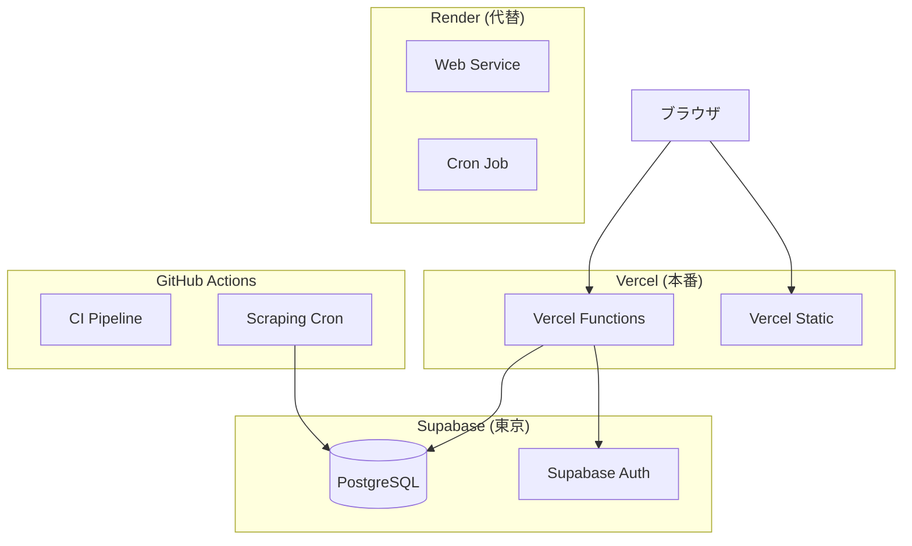
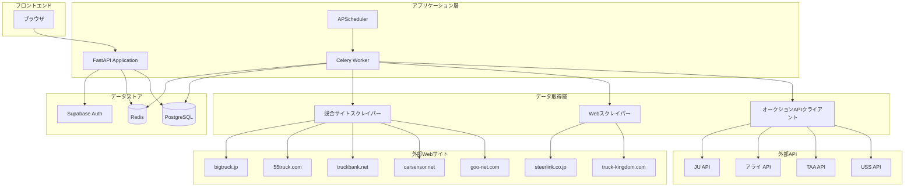
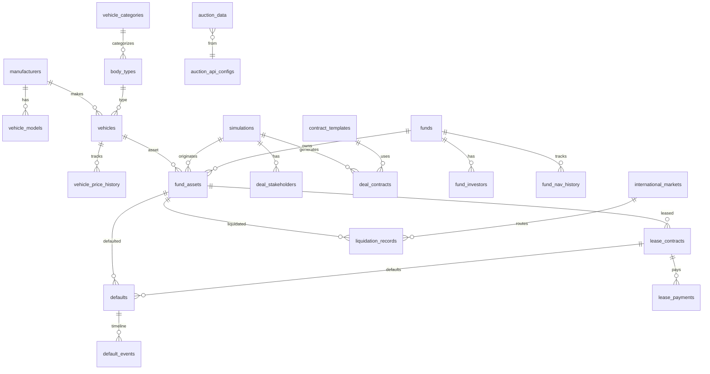
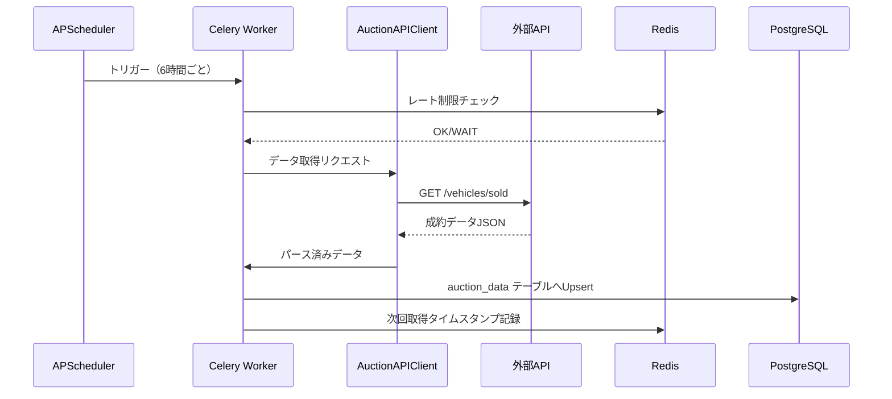
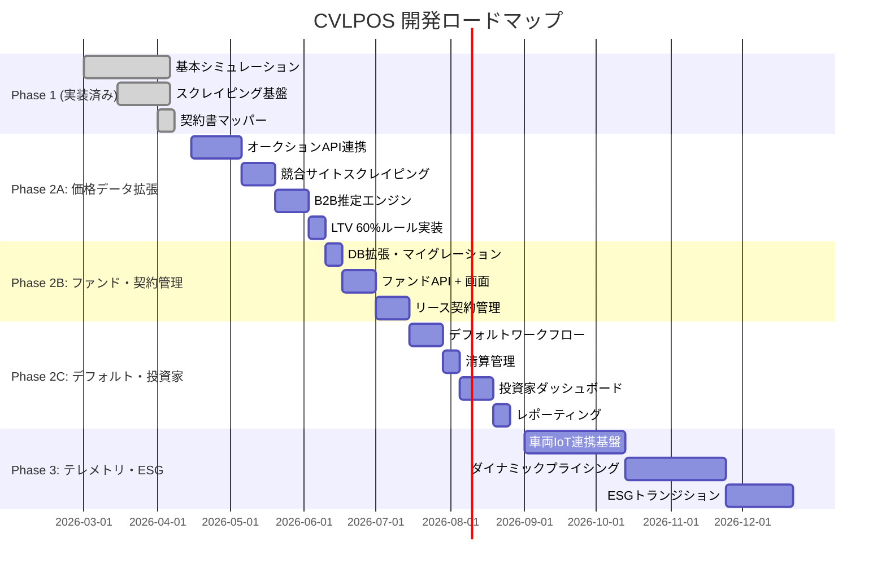

# CVLPOS 統合ソフトウェア開発仕様書 v3.0

**システム名称:** 商用車リースバック価格最適化システム (CVLPOS)  
**英語名称:** Commercial Vehicle Leaseback Pricing Optimization System  
**プロジェクト名:** `auction` (v0.1.0)  
**バージョン:** 3.0  
**作成日:** 2026年4月8日  
**本番URL:** https://auction-ten-iota.vercel.app  
**GitHub:** https://github.com/marbeau17/auction  
**データベース:** Supabase PostgreSQL（東京リージョン）  
**ステータス凡例:** ✅ 実装済み / 🔲 未実装（あるべき姿）

---

## 目次

1. [エグゼクティブサマリー](#1-エグゼクティブサマリー)
2. [システムアーキテクチャ](#2-システムアーキテクチャ)
3. [認証・認可・セキュリティ](#3-認証認可セキュリティ)
4. [データベース設計](#4-データベース設計)
5. [価格データ取得エンジン](#5-価格データ取得エンジン)
   - 5.1 ✅ Webスクレイピング（現行）
   - 5.2 🔲 オークションAPI連携（新規）
   - 5.3 🔲 競合サイトスクレイピング拡張（新規）
   - 5.4 ✅ データクレンジング・正規化
   - 5.5 🔲 B2B卸売価格推定エンジン
6. [計算ロジック](#6-計算ロジック)
7. [シミュレーション機能](#7-シミュレーション機能)
8. [契約書自動生成・ビジュアルマッピング](#8-契約書自動生成ビジュアルマッピング)
9. [画面・UI設計](#9-画面ui設計)
10. [ビジュアライゼーション](#10-ビジュアライゼーション)
11. [テスト・CI/CD](#11-テストcicd)
12. [将来ビジョン（Phase 2-3）](#12-将来ビジョンphase-2-3)
13. [付録](#13-付録)

---

## 1. エグゼクティブサマリー

### 1.1 システムの目的

CVLPOSは、商用車両（トラック等）のリースバック取引における価格最適化を実現するWebアプリケーションである。運送会社が保有する商用車両をファンド（SPC）が買い取り、リースバックする取引スキームにおいて、適正な買取価格・月額リース料・残価予測を算出し、投資家・運送会社・Carchsの三者全てにとって最適な取引条件を提示する。

### 1.2 ビジネスモデル概要

```
┌─────────────┐     買取代金      ┌─────────────┐     月額リース料      ┌─────────────┐
│   投資家     │ ──────────────→ │  Carchs SPC │ ←───────────────── │  運送会社    │
│ (Fund LP)   │ ←────────────── │  (Fund GP)  │ ──────────────→   │ (Lessee)    │
│             │   利回り分配     │             │   車両使用権       │             │
└─────────────┘                 └─────────────┘                   └─────────────┘
                                      │
                                      │ 所有権保持
                                      ▼
                                ┌─────────────┐
                                │  車両資産    │
                                │ (SAB Block)  │
                                └─────────────┘
```

### 1.3 現行システムの概要

| 項目 | 現状 |
|------|------|
| Pythonファイル数 | 61 |
| HTMLテンプレート数 | 25 |
| SQLマイグレーション数 | 10 |
| Gitコミット数 | 31 |
| Python行数 | 14,852 |
| HTML行数 | 2,290 |
| 仕様書数 | 15（約750KB） |
| データベーステーブル数 | 15 |
| テストケース数 | 163 + 35（QA） |

### 1.4 技術スタック

#### ✅ 実装済み

| カテゴリ | 技術 | バージョン要件 |
|---|---|---|
| 言語 | Python | >= 3.11 |
| Webフレームワーク | FastAPI | >= 0.104.0 |
| ASGIサーバー | Uvicorn (standard) | >= 0.24.0 |
| テンプレートエンジン | Jinja2 | >= 3.1.0 |
| フロントエンド（動的UI） | HTMX | CDN配信 |
| チャート描画 | Chart.js v4 | CDN配信 |
| データベース / BaaS | Supabase (supabase-py) | >= 2.0.0 |
| HTTPクライアント | httpx | >= 0.25.0 |
| 設定管理 | pydantic-settings | >= 2.0.0 |
| 認証 (JWT) | python-jose[cryptography] | >= 3.3.0 |
| パスワードハッシュ | passlib[bcrypt] | >= 1.7.4 |
| ログ | structlog | >= 23.0.0 |
| キャッシュ | cachetools | >= 5.3.0 |
| 数値計算 | numpy | >= 1.24.0 |
| スクレイピング | beautifulsoup4, lxml | >= 4.12.0, >= 4.9.0 |
| スクレイピング（ブラウザ） | Playwright | >= 1.40.0 |
| レポート生成 | pandas, openpyxl, reportlab | >= 2.0.0 |
| フォームパース | python-multipart | >= 0.0.6 |
| ビルドシステム | Hatchling | latest |

#### 🔲 追加予定

| カテゴリ | 技術 | 用途 |
|---|---|---|
| タスクキュー | Celery + Redis | 非同期API取得・スクレイピングジョブ |
| APIクライアントSDK | aiohttp | オークションAPI並列リクエスト |
| キャッシュ（分散） | Redis | API応答キャッシュ、レート制限管理 |
| スケジューラ | APScheduler | 定期データ取得スケジュール |
| 機械学習 | scikit-learn | 価格推定モデル |
| PDF生成 | WeasyPrint | 契約書PDF出力 |

### 1.5 環境変数一覧

#### ✅ 実装済み

| 環境変数名 | デフォルト値 | 説明 |
|---|---|---|
| `APP_ENV` | `"development"` | 実行環境（development / production / test） |
| `APP_DEBUG` | `False` | デバッグモード |
| `APP_PORT` | `8000` | アプリケーションポート |
| `APP_SECRET_KEY` | `"change-me"` | アプリケーション秘密鍵（CSRF等） |
| `SUPABASE_URL` | `""` | Supabase プロジェクトURL |
| `SUPABASE_ANON_KEY` | `""` | Supabase 匿名キー |
| `SUPABASE_SERVICE_ROLE_KEY` | `""` | Supabase サービスロールキー |
| `DATABASE_URL` | `""` | PostgreSQL 接続文字列 |
| `SUPABASE_JWT_SECRET` | `""` | JWT 検証用シークレット |
| `SCRAPER_REQUEST_INTERVAL_SEC` | `3` | スクレイパーのリクエスト間隔（秒） |
| `SCRAPER_MAX_RETRIES` | `3` | スクレイパーの最大リトライ回数 |
| `SCRAPER_USER_AGENT` | `"CommercialVehicleResearchBot/1.0"` | スクレイパーのUser-Agent文字列 |

#### 🔲 追加予定

| 環境変数名 | デフォルト値 | 説明 |
|---|---|---|
| `USS_API_KEY` | `""` | USS オークションAPI キー |
| `USS_API_SECRET` | `""` | USS オークションAPI シークレット |
| `USS_API_BASE_URL` | `"https://api.uss.co.jp/v1"` | USS API ベースURL |
| `TAA_API_KEY` | `""` | TAA オークションAPI キー |
| `TAA_API_BASE_URL` | `"https://api.taa.co.jp/v1"` | TAA API ベースURL |
| `ARAI_API_KEY` | `""` | アライオートオークションAPI キー |
| `JU_API_KEY` | `""` | JU オークションAPI キー |
| `REDIS_URL` | `"redis://localhost:6379/0"` | Redis接続文字列 |
| `CELERY_BROKER_URL` | `"redis://localhost:6379/1"` | Celeryブローカー |
| `AUCTION_DATA_REFRESH_HOURS` | `6` | オークションデータ更新間隔（時間） |
| `SCRAPER_COMPETITOR_INTERVAL_HOURS` | `12` | 競合サイトスクレイピング間隔（時間） |
| `B2B_PRICE_CONFIDENCE_THRESHOLD` | `0.70` | B2B推定価格の最低信頼度 |

---

## 2. システムアーキテクチャ

### 2.1 ✅ デプロイ構成（現行）



#### 本番環境（Vercel）

| 項目 | 値 |
|---|---|
| 本番URL | https://auction-ten-iota.vercel.app |
| ランタイム | `@vercel/python` (Serverless Functions) |
| エントリポイント | `api/index.py` |
| Lambda最大サイズ | 50MB |
| 静的ファイル配信 | `@vercel/static` (`/static/**`) |
| ルーティング | `/static/*` は静的配信、それ以外は全て `api/index.py` へプロキシ |

#### Render構成（render.yaml 定義済み）

| サービス | 種別 | ランタイム | 備考 |
|---|---|---|---|
| `auction-web` | Web Service | Docker | ポート8000、ヘルスチェック `/health` |
| `auction-scraper` | Cron Job | Docker | 毎日 03:00 UTC 実行 |

#### Docker構成

- ベースイメージ: `python:3.11-slim`
- Chromium（Playwright用）をインストール済み
- 実行コマンド: `uvicorn app.main:app --host 0.0.0.0 --port 8000`

### 2.2 ✅ ミドルウェア構成

ミドルウェアは `create_app()` 内で以下の順序で登録される:

#### 1. CORS（CORSMiddleware）

| 設定項目 | 値 |
|---|---|
| 許可オリジン | `http://localhost:{APP_PORT}`, `http://localhost:3000`, `https://auction-ten-iota.vercel.app`, Supabase URL |
| 認証情報 | `allow_credentials=True` |
| 許可メソッド | GET, POST, PUT, DELETE, OPTIONS |
| 許可ヘッダー | Content-Type, Authorization, X-CSRF-Token, HX-Request, HX-Target, HX-Trigger |

#### 2. セキュリティヘッダー（カスタムHTTPミドルウェア）

| ヘッダー | 値 |
|---|---|
| `X-Content-Type-Options` | `nosniff` |
| `X-Frame-Options` | `DENY` |
| `Referrer-Policy` | `strict-origin-when-cross-origin` |

#### 3. CSRF（CSRFMiddleware）

- `app.middleware.csrf.CSRFMiddleware` として実装
- `X-CSRF-Token` ヘッダーによるトークン検証
- 除外パス: `/auth/*` および `/health`

### 2.3 🔲 拡張アーキテクチャ（あるべき姿）



---

## 3. 認証・認可・セキュリティ

### 3.1 ✅ 認証方式

本システムは **Supabase Auth** を認証基盤として採用。JWT（JSON Web Token）の検証は2つのアルゴリズムに対応する。

| アルゴリズム | 方式 | 検証キー |
|---|---|---|
| **ES256** | 非対称鍵（Supabase デフォルト） | JWKS エンドポイント |
| **HS256** | 対称鍵（レガシー） | `SUPABASE_JWT_SECRET` 環境変数 |

- JWKSは `TTLCache` により **1時間キャッシュ**
- ES256の場合は `audience="authenticated"` を検証
- トークンの `sub` クレームからユーザーID、`email` からメールアドレス、`user_metadata.role` または `role` からロールを取得

### 3.2 ✅ ログインフロー

**エンドポイント:** `POST /auth/login`

```
[ブラウザ] → Form Data (email, password)
    → [FastAPI /auth/login]
        → supabase.auth.sign_in_with_password()
            → [Supabase Auth]
    ← access_token + refresh_token
    ← Set-Cookie (HttpOnly)
    ← 302 Redirect → /dashboard
```

**Cookie設定:**

| Cookie名 | HttpOnly | Secure | SameSite | Path |
|---|---|---|---|---|
| `access_token` | `True` | `True` | `lax` | `/` |
| `refresh_token` | `True` | `True` | `lax` | `/` |

### 3.3 ✅ ログアウト

**エンドポイント:** `POST /auth/logout`

1. `supabase.auth.sign_out()` でサーバーサイドのセッションを無効化
2. Cookie削除
3. `/login` へリダイレクト

### 3.4 ✅ パスワードリセット

**ページ表示:** `GET /auth/forgot-password`  
**リセット実行:** `POST /auth/forgot-password`

- `supabase.auth.reset_password_email(email)` でリセットメールを送信
- セキュリティ: メールアドレスの存在有無にかかわらず同一レスポンス（ユーザー列挙攻撃防止）

### 3.5 ✅ ロール定義（現行）

| ロール | 説明 |
|---|---|
| `admin` | 管理者。全機能にアクセス可能 |
| `sales` | 営業担当。業務機能にアクセス可能 |
| `viewer` | 閲覧者。参照のみ |

**`require_role` 依存性ファクトリ:**

```python
require_role(roles: list[str]) -> Callable
```

### 3.6 🔲 拡張ロール定義

| ロール | 説明 | アクセス範囲 |
|---|---|---|
| `admin` | システム管理者 | 全機能 |
| `fund_manager` | ファンドマネージャー | ファンド管理、NAV、投資家管理、デフォルト管理 |
| `investor` | 投資家 | 投資家ダッシュボード、レポート閲覧 |
| `operator` | オペレーター（営業） | シミュレーション、契約管理、市場データ |
| `viewer` | 閲覧者 | 参照のみ |

### 3.7 ✅ セッション管理

- JWT有効期限: Supabase Auth デフォルト（通常1時間）
- トークンリフレッシュ: `POST /auth/refresh`
- `_get_optional_user` 関数: 認証不要ページでの任意ユーザー取得

### 3.8 ✅ CSRF保護

**ミドルウェア:** `CSRFMiddleware`（`app/middleware/csrf.py`）

| 項目 | 値 |
|---|---|
| トークン生成 | `secrets.token_urlsafe(32)` |
| Cookie名 | `csrf_token` |
| HttpOnly | `False`（JS読み取り可） |
| 検証方法 | `X-CSRF-Token` ヘッダー vs Cookie |
| 除外パス | `/auth/*`, `/health` |

### 3.9 ✅ ユーザーアカウント

| メールアドレス | ロール |
|---|---|
| `admin@carchs.com` | admin |
| `sales@carchs.com` | sales |

### 3.10 🔲 セキュリティ改善項目

| 項目 | 現状 | あるべき姿 | 優先度 |
|---|---|---|---|
| CSRF厳格化 | 厳格な強制は未有効化 | 全POSTエンドポイントで厳格検証 | 高 |
| `APP_SECRET_KEY` | デフォルト`"change-me"` | 本番で必ず変更、起動時チェック | 高 |
| RLS | `equipment_options`/`vehicle_models`で無効 | 全テーブルでRLS有効化 | 中 |
| Rate Limiting | 未実装 | API エンドポイントにレート制限 | 中 |
| 監査ログ | 未実装 | 全操作の監査証跡記録 | 中 |

---

## 4. データベース設計

### 4.1 ✅ 現行テーブル一覧

| テーブル名 | レコード数 | 概要 |
|---|---|---|
| `users` | 2 | システムユーザー（Supabase Auth連携） |
| `manufacturers` | 4 | メーカーマスタ |
| `body_types` | 10 | 架装タイプマスタ |
| `vehicle_categories` | 5 | 車両カテゴリマスタ |
| `vehicle_models` | 12 | 車種マスタ（メーカー別） |
| `equipment_options` | 22 | 装備オプションマスタ |
| `vehicles` | 64 | 車両相場データ（スクレイピング取得） |
| `simulations` | 18 | シミュレーション実行履歴 |
| `simulation_params` | 120 | シミュレーションパラメータ |
| `scraping_logs` | 14 | スクレイピング実行ログ |
| `depreciation_curves` | 10 | 減価償却カーブ設定 |
| `vehicle_price_history` | 20 | 車両価格変動履歴 |
| `deal_stakeholders` | - | 取引ステークホルダー |
| `contract_templates` | - | 契約書テンプレート |
| `deal_contracts` | - | 生成済み契約書 |

**合計: 15テーブル**

### 4.2 ✅ 現行テーブル詳細スキーマ

#### manufacturers

```sql
CREATE TABLE public.manufacturers (
    id              uuid PRIMARY KEY DEFAULT gen_random_uuid(),
    name            text NOT NULL UNIQUE,
    name_en         text,
    country         text DEFAULT 'JP',
    is_active       boolean DEFAULT true,
    display_order   integer DEFAULT 0,
    created_at      timestamptz NOT NULL DEFAULT now(),
    updated_at      timestamptz NOT NULL DEFAULT now()
);
```

**登録データ:** いすゞ、日野、三菱ふそう、UDトラックス

#### body_types

```sql
CREATE TABLE public.body_types (
    id              uuid PRIMARY KEY DEFAULT gen_random_uuid(),
    name            text NOT NULL,
    name_en         text,
    category_id     uuid REFERENCES public.vehicle_categories(id),
    is_active       boolean DEFAULT true,
    display_order   integer DEFAULT 0,
    created_at      timestamptz NOT NULL DEFAULT now(),
    updated_at      timestamptz NOT NULL DEFAULT now()
);
```

**登録データ:** 平ボディ、バン、ウイング、冷凍車、ダンプ、クレーン、トラクタ、塵芥車、タンク車、脱着ボディ

#### vehicle_categories

```sql
CREATE TABLE public.vehicle_categories (
    id              uuid PRIMARY KEY DEFAULT gen_random_uuid(),
    name            text NOT NULL,
    code            text NOT NULL UNIQUE,
    description     text,
    is_active       boolean DEFAULT true,
    created_at      timestamptz NOT NULL DEFAULT now(),
    updated_at      timestamptz NOT NULL DEFAULT now()
);
```

**登録データ:** SMALL（小型）, MEDIUM（中型）, LARGE（大型）, TRAILER_HEAD, TRAILER_CHASSIS

#### vehicle_models

```sql
CREATE TABLE public.vehicle_models (
    id              uuid PRIMARY KEY DEFAULT gen_random_uuid(),
    name            text NOT NULL,
    name_en         text,
    manufacturer_id uuid REFERENCES public.manufacturers(id),
    category_code   text,
    is_active       boolean DEFAULT true,
    display_order   integer DEFAULT 0,
    created_at      timestamptz NOT NULL DEFAULT now(),
    updated_at      timestamptz NOT NULL DEFAULT now()
);
```

**メーカー別モデル一覧（12車種）:**

| メーカー | 大型 (LARGE) | 中型 (MEDIUM) | 小型 (SMALL) |
|---------|-------------|-------------|-------------|
| 日野 | プロフィア | レンジャー | デュトロ |
| UDトラックス | クオン | コンドル | カゼット |
| 三菱ふそう | スーパーグレート | ファイター | キャンター |
| いすゞ | ギガ | フォワード | エルフ |

#### equipment_options

```sql
CREATE TABLE public.equipment_options (
    id                  uuid PRIMARY KEY DEFAULT gen_random_uuid(),
    name                text NOT NULL,
    name_en             text,
    category            text,
    estimated_value_yen integer DEFAULT 0,
    depreciation_rate   numeric DEFAULT 0.150,
    affects_lease_price boolean DEFAULT true,
    display_order       integer DEFAULT 0,
    is_active           boolean DEFAULT true,
    created_at          timestamptz NOT NULL DEFAULT now(),
    updated_at          timestamptz NOT NULL DEFAULT now()
);
```

**カテゴリ別オプション一覧（全22件）:**

| カテゴリ | オプション名 | 新品参考価格 |
|---------|-------------|----------:|
| loading | パワーゲート | 350,000 |
| loading | 床フック・ラッシングレール | 80,000 |
| loading | ジョルダー（荷寄せ装置） | 200,000 |
| loading | ウイング開閉装置（電動） | 150,000 |
| crane | 小型クレーン（2.9t吊） | 1,500,000 |
| crane | 中型クレーン（4.9t吊） | 2,500,000 |
| crane | ラジコン操作装置 | 300,000 |
| refrigeration | 冷凍ユニット（-25度） | 1,200,000 |
| refrigeration | 冷蔵ユニット（+5度） | 800,000 |
| refrigeration | 二温度帯仕様 | 1,800,000 |
| refrigeration | スタンバイ電源装置 | 250,000 |
| safety | バックカメラ | 80,000 |
| safety | ドライブレコーダー | 50,000 |
| safety | 衝突被害軽減ブレーキ | 200,000 |
| safety | 車線逸脱警報装置 | 120,000 |
| comfort | エアサス（全輪） | 500,000 |
| comfort | リターダ | 350,000 |
| comfort | アルミホイール | 200,000 |
| comfort | ハイルーフキャブ | 150,000 |
| other | ETC車載器 | 30,000 |
| other | アルミウイングボディ（特注） | 800,000 |
| other | ステンレス製荷台 | 400,000 |

#### vehicles

```sql
CREATE TABLE public.vehicles (
    id                      uuid PRIMARY KEY DEFAULT gen_random_uuid(),
    source_site             text,
    source_url              text,
    source_id               text,
    maker                   text,
    model_name              text,
    body_type               text,
    model_year              integer,
    mileage_km              integer,
    price_yen               bigint,
    price_tax_included      boolean DEFAULT false,
    tonnage_class           text,
    location_prefecture     text,
    image_url               text,
    listing_status          text DEFAULT 'active',
    is_active               boolean DEFAULT true,
    manufacturer_id         uuid REFERENCES public.manufacturers(id),
    body_type_id            uuid REFERENCES public.body_types(id),
    category_id             uuid REFERENCES public.vehicle_categories(id),
    scraped_at              timestamptz,
    created_at              timestamptz NOT NULL DEFAULT now(),
    updated_at              timestamptz NOT NULL DEFAULT now(),
    -- 追加テキストフィールド
    color                   text,
    engine_type             text,
    fuel_type               text,
    transmission            text,
    drive_type              text,
    equipment               text,
    description             text,
    chassis_number          text,
    model_number            text,
    inspection              text,
    -- 追加数値フィールド
    horse_power             integer,
    max_load_kg             integer,
    vehicle_weight_kg       integer,
    gross_vehicle_weight_kg integer,
    length_cm               integer,
    width_cm                integer,
    height_cm               integer,
    displacement_cc         integer,
    CONSTRAINT uq_source UNIQUE (source_site, source_id)
);
```

#### simulations

```sql
CREATE TABLE public.simulations (
    id                      uuid PRIMARY KEY DEFAULT gen_random_uuid(),
    user_id                 uuid REFERENCES auth.users(id),
    title                   text,
    target_model_name       text,
    target_model_year       integer,
    target_mileage_km       integer,
    purchase_price_yen      bigint,
    market_price_yen        bigint,
    lease_monthly_yen       bigint,
    lease_term_months       integer,
    total_lease_revenue_yen bigint,
    expected_yield_rate     numeric(8,4),
    status                  text DEFAULT 'draft',
    result_summary_json     jsonb,
    created_at              timestamptz NOT NULL DEFAULT now(),
    updated_at              timestamptz NOT NULL DEFAULT now()
);
```

#### deal_stakeholders

```sql
CREATE TABLE public.deal_stakeholders (
    id                   uuid PRIMARY KEY DEFAULT gen_random_uuid(),
    simulation_id        uuid NOT NULL,
    role_type            text NOT NULL,
    company_name         text,
    representative_name  text,
    address              text,
    phone                text,
    email                text,
    registration_number  text,
    seal_required        boolean DEFAULT false,
    display_order        integer DEFAULT 0,
    created_at           timestamptz NOT NULL DEFAULT now(),
    updated_at           timestamptz NOT NULL DEFAULT now()
);
```

#### contract_templates

```sql
CREATE TABLE public.contract_templates (
    id                uuid PRIMARY KEY DEFAULT gen_random_uuid(),
    contract_name     text NOT NULL,
    contract_type     text,
    description       text,
    required_roles    jsonb DEFAULT '{}',
    template_content  text,
    is_active         boolean DEFAULT true,
    display_order     integer DEFAULT 0,
    created_at        timestamptz NOT NULL DEFAULT now(),
    updated_at        timestamptz NOT NULL DEFAULT now()
);
```

#### deal_contracts

```sql
CREATE TABLE public.deal_contracts (
    id                uuid PRIMARY KEY DEFAULT gen_random_uuid(),
    simulation_id     uuid NOT NULL,
    template_id       uuid REFERENCES public.contract_templates(id),
    contract_name     text,
    status            text DEFAULT 'draft',
    generated_context jsonb,
    generated_at      timestamptz,
    created_at        timestamptz NOT NULL DEFAULT now(),
    updated_at        timestamptz NOT NULL DEFAULT now()
);
```

### 4.3 🔲 新規テーブル（Phase 2）

#### 4.3.1 vehicles テーブル追加カラム

```sql
ALTER TABLE public.vehicles ADD COLUMN price_type text DEFAULT 'retail'
    CHECK (price_type IN ('b2b_wholesale', 'auction', 'retail'));
ALTER TABLE public.vehicles ADD COLUMN b2b_wholesale_price_yen bigint;
ALTER TABLE public.vehicles ADD COLUMN has_power_gate boolean DEFAULT false;
ALTER TABLE public.vehicles ADD COLUMN has_cold_storage boolean DEFAULT false;
ALTER TABLE public.vehicles ADD COLUMN has_crane boolean DEFAULT false;
ALTER TABLE public.vehicles ADD COLUMN option_details jsonb DEFAULT '{}';
ALTER TABLE public.vehicles ADD COLUMN data_source text DEFAULT 'scraping'
    CHECK (data_source IN ('scraping', 'auction_api', 'competitor_scraping', 'manual'));
ALTER TABLE public.vehicles ADD COLUMN auction_grade text;
ALTER TABLE public.vehicles ADD COLUMN auction_site text;
ALTER TABLE public.vehicles ADD COLUMN auction_date date;
```

#### 4.3.2 🔲 auction_data テーブル（新規）

```sql
CREATE TABLE public.auction_data (
    id                  uuid PRIMARY KEY DEFAULT gen_random_uuid(),
    auction_site        text NOT NULL,
    auction_date        date NOT NULL,
    lot_number          text,
    maker               text NOT NULL,
    model_name          text NOT NULL,
    model_year          integer,
    mileage_km          integer,
    body_type           text,
    grade               text CHECK (grade IN ('S', '6', '5', '4.5', '4', '3.5', '3', '2', '1', 'R', 'RA', '***')),
    start_price_yen     bigint,
    sold_price_yen      bigint,
    is_sold             boolean DEFAULT false,
    repair_history      boolean DEFAULT false,
    equipment_list      jsonb DEFAULT '[]',
    region              text,
    chassis_number      text,
    model_number        text,
    color               text,
    inspection_date     date,
    tonnage_class       text,
    displacement_cc     integer,
    transmission        text,
    fuel_type           text,
    image_urls          jsonb DEFAULT '[]',
    raw_data            jsonb DEFAULT '{}',
    fetched_at          timestamptz NOT NULL DEFAULT now(),
    created_at          timestamptz NOT NULL DEFAULT now(),
    updated_at          timestamptz NOT NULL DEFAULT now(),
    CONSTRAINT uq_auction_lot UNIQUE (auction_site, auction_date, lot_number)
);

CREATE INDEX idx_auction_data_maker ON public.auction_data (maker);
CREATE INDEX idx_auction_data_model ON public.auction_data (model_name);
CREATE INDEX idx_auction_data_date ON public.auction_data (auction_date);
CREATE INDEX idx_auction_data_sold ON public.auction_data (is_sold);
```

#### 4.3.3 🔲 auction_api_configs テーブル（新規）

```sql
CREATE TABLE public.auction_api_configs (
    id                  uuid PRIMARY KEY DEFAULT gen_random_uuid(),
    site_name           text NOT NULL UNIQUE,
    api_type            text NOT NULL CHECK (api_type IN ('rest', 'soap', 'graphql')),
    base_url            text NOT NULL,
    auth_type           text NOT NULL CHECK (auth_type IN ('api_key', 'oauth2', 'basic', 'bearer')),
    auth_config         jsonb DEFAULT '{}',
    rate_limit_per_min  integer DEFAULT 60,
    rate_limit_per_hour integer DEFAULT 1000,
    retry_max           integer DEFAULT 3,
    retry_backoff_sec   numeric DEFAULT 2.0,
    data_fields_map     jsonb DEFAULT '{}',
    is_active           boolean DEFAULT true,
    last_fetched_at     timestamptz,
    last_error          text,
    created_at          timestamptz NOT NULL DEFAULT now(),
    updated_at          timestamptz NOT NULL DEFAULT now()
);
```

#### 4.3.4 🔲 competitor_prices テーブル（新規）

```sql
CREATE TABLE public.competitor_prices (
    id                  uuid PRIMARY KEY DEFAULT gen_random_uuid(),
    source_site         text NOT NULL,
    source_url          text,
    source_id           text,
    maker               text NOT NULL,
    model_name          text NOT NULL,
    model_year          integer,
    mileage_km          integer,
    body_type           text,
    listed_price_yen    bigint,
    estimated_b2b_yen   bigint,
    price_type          text DEFAULT 'retail'
        CHECK (price_type IN ('retail', 'dealer', 'b2b')),
    confidence_score    numeric(4,3),
    region              text,
    listing_days        integer,
    equipment_list      jsonb DEFAULT '[]',
    tonnage_class       text,
    is_active           boolean DEFAULT true,
    scraped_at          timestamptz NOT NULL DEFAULT now(),
    created_at          timestamptz NOT NULL DEFAULT now(),
    updated_at          timestamptz NOT NULL DEFAULT now(),
    CONSTRAINT uq_competitor UNIQUE (source_site, source_id)
);

CREATE INDEX idx_competitor_maker ON public.competitor_prices (maker);
CREATE INDEX idx_competitor_model ON public.competitor_prices (model_name);
CREATE INDEX idx_competitor_price_type ON public.competitor_prices (price_type);
```

#### 4.3.5 🔲 price_normalization_rules テーブル（新規）

```sql
CREATE TABLE public.price_normalization_rules (
    id                  uuid PRIMARY KEY DEFAULT gen_random_uuid(),
    source_type         text NOT NULL CHECK (source_type IN ('auction', 'retail', 'dealer', 'b2b')),
    target_type         text NOT NULL DEFAULT 'b2b_wholesale',
    vehicle_category    text,
    body_type           text,
    region              text,
    discount_rate       numeric(6,4) NOT NULL,
    seasonal_adjustment jsonb DEFAULT '{}',
    min_samples         integer DEFAULT 5,
    confidence_weight   numeric(4,3) DEFAULT 1.000,
    valid_from          date,
    valid_to            date,
    is_active           boolean DEFAULT true,
    created_at          timestamptz NOT NULL DEFAULT now(),
    updated_at          timestamptz NOT NULL DEFAULT now()
);
```

#### 4.3.6 🔲 ファンド関連テーブル

```sql
-- funds: ファンド（SPC）管理
CREATE TABLE public.funds (
    id              uuid PRIMARY KEY DEFAULT gen_random_uuid(),
    name            text NOT NULL,
    fund_code       text NOT NULL UNIQUE,
    fund_type       text NOT NULL DEFAULT 'spc'
        CHECK (fund_type IN ('spc', 'gk_tk', 'tmi')),
    target_aum_yen  bigint,
    current_aum_yen bigint DEFAULT 0,
    nav_yen         bigint DEFAULT 0,
    nav_ratio       numeric(6,4),
    status          text NOT NULL DEFAULT 'active'
        CHECK (status IN ('preparing', 'active', 'closed', 'liquidating')),
    inception_date  date,
    manager_user_id uuid REFERENCES public.users(id),
    created_at      timestamptz NOT NULL DEFAULT now(),
    updated_at      timestamptz NOT NULL DEFAULT now()
);

-- fund_investors: 投資家配分
CREATE TABLE public.fund_investors (
    id              uuid PRIMARY KEY DEFAULT gen_random_uuid(),
    fund_id         uuid NOT NULL REFERENCES public.funds(id),
    user_id         uuid NOT NULL REFERENCES public.users(id),
    investment_yen  bigint NOT NULL,
    ownership_ratio numeric(8,6) NOT NULL,
    status          text NOT NULL DEFAULT 'active'
        CHECK (status IN ('committed', 'active', 'redeemed')),
    invested_at     timestamptz,
    created_at      timestamptz NOT NULL DEFAULT now(),
    updated_at      timestamptz NOT NULL DEFAULT now(),
    CONSTRAINT uq_fund_investor UNIQUE (fund_id, user_id)
);

-- fund_assets: ファンド保有車両
CREATE TABLE public.fund_assets (
    id                  uuid PRIMARY KEY DEFAULT gen_random_uuid(),
    fund_id             uuid NOT NULL REFERENCES public.funds(id),
    vehicle_id          uuid REFERENCES public.vehicles(id),
    simulation_id       uuid REFERENCES public.simulations(id),
    lease_contract_id   uuid,
    purchase_price_yen  bigint NOT NULL,
    b2b_wholesale_yen   bigint NOT NULL,
    ltv_ratio           numeric(6,4) NOT NULL,
    current_value_yen   bigint,
    option_premium_yen  bigint DEFAULT 0,
    status              text NOT NULL DEFAULT 'active'
        CHECK (status IN ('acquired', 'active', 'defaulted', 'liquidated', 'disposed')),
    acquired_at         timestamptz,
    created_at          timestamptz NOT NULL DEFAULT now(),
    updated_at          timestamptz NOT NULL DEFAULT now()
);

-- fund_nav_history: NAV推移
CREATE TABLE public.fund_nav_history (
    id          uuid PRIMARY KEY DEFAULT gen_random_uuid(),
    fund_id     uuid NOT NULL REFERENCES public.funds(id),
    nav_yen     bigint NOT NULL,
    nav_ratio   numeric(6,4) NOT NULL,
    calc_date   date NOT NULL,
    created_at  timestamptz NOT NULL DEFAULT now()
);

-- lease_contracts: リース契約
CREATE TABLE public.lease_contracts (
    id                    uuid PRIMARY KEY DEFAULT gen_random_uuid(),
    fund_asset_id         uuid NOT NULL REFERENCES public.fund_assets(id),
    lessee_name           text NOT NULL,
    lessee_company_id     text,
    contract_number       text NOT NULL UNIQUE,
    start_date            date NOT NULL,
    end_date              date NOT NULL,
    term_months           int NOT NULL,
    monthly_fee_yen       bigint NOT NULL,
    residual_value_yen    bigint,
    security_deposit_yen  bigint DEFAULT 0,
    status                text NOT NULL DEFAULT 'active'
        CHECK (status IN ('draft', 'active', 'overdue', 'defaulted', 'terminated', 'completed')),
    created_at            timestamptz NOT NULL DEFAULT now(),
    updated_at            timestamptz NOT NULL DEFAULT now()
);

-- lease_payments: 支払い追跡
CREATE TABLE public.lease_payments (
    id                  uuid PRIMARY KEY DEFAULT gen_random_uuid(),
    lease_contract_id   uuid NOT NULL REFERENCES public.lease_contracts(id),
    payment_month       int NOT NULL,
    due_date            date NOT NULL,
    amount_due_yen      bigint NOT NULL,
    amount_paid_yen     bigint DEFAULT 0,
    paid_at             timestamptz,
    status              text NOT NULL DEFAULT 'pending'
        CHECK (status IN ('pending', 'paid', 'partial', 'overdue', 'waived')),
    days_overdue        int DEFAULT 0,
    created_at          timestamptz NOT NULL DEFAULT now(),
    updated_at          timestamptz NOT NULL DEFAULT now()
);

-- defaults: デフォルト案件
CREATE TABLE public.defaults (
    id                    uuid PRIMARY KEY DEFAULT gen_random_uuid(),
    lease_contract_id     uuid NOT NULL REFERENCES public.lease_contracts(id),
    fund_asset_id         uuid NOT NULL REFERENCES public.fund_assets(id),
    default_date          date NOT NULL,
    current_phase         text NOT NULL DEFAULT 't0_detection'
        CHECK (current_phase IN ('t0_detection', 't1_recovery', 't3_repossession', 't10_liquidation', 'resolved')),
    total_outstanding_yen bigint,
    recovery_amount_yen   bigint DEFAULT 0,
    loss_amount_yen       bigint DEFAULT 0,
    status                text NOT NULL DEFAULT 'active'
        CHECK (status IN ('active', 'resolved', 'written_off')),
    resolved_at           timestamptz,
    created_at            timestamptz NOT NULL DEFAULT now(),
    updated_at            timestamptz NOT NULL DEFAULT now()
);

-- default_events: デフォルトタイムラインイベント
CREATE TABLE public.default_events (
    id              uuid PRIMARY KEY DEFAULT gen_random_uuid(),
    default_id      uuid NOT NULL REFERENCES public.defaults(id),
    event_type      text NOT NULL
        CHECK (event_type IN ('detection', 'notice_sent', 'contact_attempt', 'repossession_order', 'vehicle_recovered', 'liquidation_started', 'liquidation_completed', 'write_off')),
    event_date      timestamptz NOT NULL DEFAULT now(),
    description     text,
    performed_by    uuid REFERENCES public.users(id),
    metadata        jsonb DEFAULT '{}',
    created_at      timestamptz NOT NULL DEFAULT now()
);

-- liquidation_records: 清算記録
CREATE TABLE public.liquidation_records (
    id                    uuid PRIMARY KEY DEFAULT gen_random_uuid(),
    default_id            uuid REFERENCES public.defaults(id),
    fund_asset_id         uuid NOT NULL REFERENCES public.fund_assets(id),
    liquidation_type      text NOT NULL
        CHECK (liquidation_type IN ('domestic_auction', 'domestic_direct', 'international', 'scrap')),
    target_market_id      uuid REFERENCES public.international_markets(id),
    asking_price_yen      bigint,
    sold_price_yen        bigint,
    liquidation_cost_yen  bigint DEFAULT 0,
    net_recovery_yen      bigint,
    status                text NOT NULL DEFAULT 'pending'
        CHECK (status IN ('pending', 'listed', 'sold', 'cancelled')),
    listed_at             timestamptz,
    sold_at               timestamptz,
    created_at            timestamptz NOT NULL DEFAULT now(),
    updated_at            timestamptz NOT NULL DEFAULT now()
);

-- international_markets: 海外市場マスタ
CREATE TABLE public.international_markets (
    id                uuid PRIMARY KEY DEFAULT gen_random_uuid(),
    country_code      text NOT NULL,
    country_name      text NOT NULL,
    market_name       text NOT NULL,
    currency_code     text NOT NULL DEFAULT 'USD',
    avg_recovery_rate numeric(6,4),
    shipping_cost_yen bigint,
    is_active         boolean DEFAULT true,
    created_at        timestamptz NOT NULL DEFAULT now(),
    updated_at        timestamptz NOT NULL DEFAULT now()
);
```

### 4.4 ER図（Mermaid）



---

## 5. 価格データ取得エンジン

### 5.1 ✅ Webスクレイピング（現行）

#### 5.1.1 アーキテクチャ

```
BaseScraper (抽象基底クラス) ── scraper/base.py
    ├── TruckKingdomScraper (truck-kingdom.com) ── scraper/sites/truck_kingdom.py
    └── SteerlinkScraper (steerlink.co.jp) ── scraper/sites/steerlink.py
            ↓ raw dict[]
        VehicleParser (正規化・バリデーション) ── scraper/parsers/vehicle_parser.py
            ↓ cleaned dict[]
        ScraperScheduler (オーケストレーション) ── scraper/scheduler.py
            ↓ upsert
        Supabase (vehicles / vehicle_price_history / scraping_logs)
```

#### 5.1.2 BaseScraper 抽象インターフェース

```python
class BaseScraper(ABC):
    """Abstract base class for all site scrapers."""
    
    def __init__(self, config: dict):
        self.config = config
        self.logger = logging.getLogger(self.__class__.__name__)
        self.stats = {"pages_crawled": 0, "records_fetched": 0, "errors": 0}
    
    @abstractmethod
    async def scrape_listing_page(self, page: Page, url: str) -> list[dict]:
        """一覧ページから車両カードを抽出"""
    
    @abstractmethod
    async def scrape_detail_page(self, page: Page, url: str) -> dict:
        """個別車両ページからスペック情報を抽出"""
    
    @abstractmethod
    def get_listing_urls(self) -> list[str]:
        """クロール対象URLリストを生成"""
    
    @property
    @abstractmethod
    def site_name(self) -> str:
        """サイト識別子"""
    
    async def run(self, mode: str = "full") -> list[dict]:
        """実行メソッド: 'full' or 'listing'"""
```

#### 5.1.3 対象サイト

| サイト | クラス | カテゴリ | 最大ページ数 |
|---|---|---|---|
| truck-kingdom.com | `TruckKingdomScraper` | large-truck, medium-truck, small-truck, trailer | 30 |
| steerlink.co.jp | `SteerlinkScraper` | large, medium, small, trailer, tractor, bus | 20 |

#### 5.1.4 レジリエント・セレクタ戦略

両スクレイパーとも複数のCSSセレクタ候補を優先度順に試行する戦略を採用:

```python
CARD_SELECTORS = [
    ".vehicle-card",
    ".p-searchResultItem",
    ".search-result-item",
    "article.listing",
    ".result-item",
    "[data-vehicle-id]",
    ".vehicle-list-item",
]
```

#### 5.1.5 レート制限・リトライ

- リクエスト間隔: `delay_min`〜`delay_max` 秒のランダムスリープ（デフォルト3〜7秒）
- リトライ: 最大3回、指数バックオフ（`2^attempt + random(0,1)` 秒）

#### 5.1.6 取得データ項目

| フィールド | 型 | 説明 |
|---|---|---|
| `source_site` | str | スクレイピング元サイト識別子 |
| `source_url` | str | 元URL |
| `source_id` | str | サイト内の車両ID |
| `maker` | str | メーカー名（正規化済み） |
| `model_name` | str | 車種名（正規化済み） |
| `body_type` | str | 架装タイプ（正規化済み） |
| `model_year` | int | 年式（西暦） |
| `mileage_km` | int | 走行距離（km） |
| `price_yen` | int | 価格（円） |
| `price_tax_included` | bool | 税込みかどうか |
| `tonnage_class` | str | トン数区分 |
| `location_prefecture` | str | 所在都道府県 |
| `image_url` | str | 車両画像URL |
| `scraped_at` | str (ISO) | スクレイピング日時 |

#### 5.1.7 Upsert戦略

一意キー: `(source_site, source_id)` の組み合わせ

```
1. source_site + source_id が空 → "skipped"
2. vehicles テーブルを検索（既存レコード確認）
3. 既存レコードあり:
   a. price_yen 変化 → vehicle_price_history に新レコード挿入
   b. vehicles テーブルを UPDATE → "updated"
4. 既存レコードなし:
   a. vehicles テーブルに INSERT
   b. vehicle_price_history に初期価格を記録 → "new"
```

#### 5.1.8 バッチ実行

**GitHub Actions 自動実行** (`.github/workflows/scrape.yml`):

| 設定 | 値 |
|---|---|
| スケジュール | 毎日JST 03:00（UTC 18:00） |
| 並列実行 | matrix: `truck_kingdom`, `steerlink` |
| タイムアウト | 120分 |
| fail-fast | false |
| concurrency | `scraping` グループ |

**手動実行:**

```bash
python -m scripts.run_scraper [--site SITE] [--mode MODE] [--max-pages N] [--dry-run] [--output FILE]
```

---

### 5.2 🔲 オークションAPI連携（新規）

#### 5.2.1 対象オークションサイト

| サイト | API種別 | データ内容 | 優先度 | 推定エンドポイント |
|---|---|---|---|---|
| USS（ユー・エス・エス） | REST API | オークション成約価格、車両スペック、評価点 | **高** | `https://api.uss.co.jp/v1/` |
| TAA（トヨタオートオークション） | REST API | トヨタ系車両の成約データ | 中 | `https://api.taa.co.jp/v1/` |
| HAA（ホンダオートオークション） | SOAP/REST | ホンダ系車両データ | 低 | WSDL/REST |
| JU（全国ジェイユー） | Web API | 地方オークション成約データ | 中 | `https://api.jucda.or.jp/v1/` |
| アライオートオークション | REST API | 商用車特化オークション | **高** | `https://api.arai-aa.co.jp/v1/` |

#### 5.2.2 API連携アーキテクチャ



#### 5.2.3 AuctionAPIClient クラス設計

```python
# app/integrations/auction_api/base.py

from abc import ABC, abstractmethod
from typing import Any, Optional
from datetime import date, datetime
from pydantic import BaseModel

class AuctionSearchParams(BaseModel):
    """オークション検索パラメータ"""
    maker: Optional[str] = None
    model_name: Optional[str] = None
    body_type: Optional[str] = None
    year_from: Optional[int] = None
    year_to: Optional[int] = None
    mileage_from: Optional[int] = None
    mileage_to: Optional[int] = None
    grade_min: Optional[str] = None
    auction_date_from: Optional[date] = None
    auction_date_to: Optional[date] = None
    is_sold: Optional[bool] = True
    page: int = 1
    per_page: int = 100

class AuctionRecord(BaseModel):
    """オークション成約データ"""
    auction_site: str
    auction_date: date
    lot_number: str
    maker: str
    model_name: str
    model_year: Optional[int] = None
    mileage_km: Optional[int] = None
    body_type: Optional[str] = None
    grade: Optional[str] = None
    start_price_yen: Optional[int] = None
    sold_price_yen: Optional[int] = None
    is_sold: bool = False
    repair_history: bool = False
    equipment_list: list[str] = []
    region: Optional[str] = None
    chassis_number: Optional[str] = None
    model_number: Optional[str] = None
    raw_data: dict = {}

class BaseAuctionAPIClient(ABC):
    """オークションAPIクライアント基底クラス"""
    
    def __init__(self, config: dict):
        self.config = config
        self.base_url = config["base_url"]
        self.rate_limiter = RateLimiter(
            max_per_minute=config.get("rate_limit_per_min", 60),
            max_per_hour=config.get("rate_limit_per_hour", 1000),
        )
    
    @abstractmethod
    async def authenticate(self) -> str:
        """認証してアクセストークンを取得"""
    
    @abstractmethod
    async def search_vehicles(self, params: AuctionSearchParams) -> list[AuctionRecord]:
        """車両データを検索"""
    
    @abstractmethod
    async def get_vehicle_detail(self, lot_id: str) -> AuctionRecord:
        """車両詳細を取得"""
    
    @abstractmethod
    async def get_sold_results(
        self,
        date_from: date,
        date_to: date,
        **filters,
    ) -> list[AuctionRecord]:
        """成約結果を期間指定で取得"""
    
    @property
    @abstractmethod
    def site_name(self) -> str:
        """サイト識別子"""
    
    async def fetch_with_retry(
        self,
        method: str,
        url: str,
        **kwargs,
    ) -> dict:
        """リトライ付きHTTPリクエスト"""
        for attempt in range(self.config.get("retry_max", 3)):
            try:
                await self.rate_limiter.wait()
                async with httpx.AsyncClient() as client:
                    resp = await client.request(method, url, **kwargs)
                    resp.raise_for_status()
                    return resp.json()
            except httpx.HTTPStatusError as e:
                if e.response.status_code == 429:
                    wait = 2 ** attempt + random.random()
                    await asyncio.sleep(wait)
                    continue
                raise
            except httpx.RequestError:
                if attempt < self.config.get("retry_max", 3) - 1:
                    await asyncio.sleep(2 ** attempt)
                    continue
                raise
```

#### 5.2.4 USS APIクライアント実装

```python
# app/integrations/auction_api/uss.py

class USSAuctionClient(BaseAuctionAPIClient):
    """USS (ユー・エス・エス) オークションAPIクライアント"""
    
    site_name = "uss"
    
    async def authenticate(self) -> str:
        """API Key認証"""
        resp = await self.fetch_with_retry(
            "POST",
            f"{self.base_url}/auth/token",
            json={
                "api_key": self.config["api_key"],
                "api_secret": self.config["api_secret"],
            },
        )
        self._token = resp["access_token"]
        self._token_expires = datetime.utcnow() + timedelta(seconds=resp["expires_in"])
        return self._token
    
    async def search_vehicles(self, params: AuctionSearchParams) -> list[AuctionRecord]:
        """USS車両検索"""
        headers = await self._get_auth_headers()
        query = {
            "maker": params.maker,
            "model": params.model_name,
            "body_type": params.body_type,
            "year_from": params.year_from,
            "year_to": params.year_to,
            "km_from": params.mileage_from,
            "km_to": params.mileage_to,
            "grade_min": params.grade_min,
            "sold_date_from": params.auction_date_from.isoformat() if params.auction_date_from else None,
            "sold_date_to": params.auction_date_to.isoformat() if params.auction_date_to else None,
            "is_sold": params.is_sold,
            "page": params.page,
            "limit": params.per_page,
        }
        query = {k: v for k, v in query.items() if v is not None}
        
        resp = await self.fetch_with_retry(
            "GET",
            f"{self.base_url}/vehicles/search",
            headers=headers,
            params=query,
        )
        
        return [self._parse_record(r) for r in resp.get("data", [])]
    
    async def get_sold_results(
        self,
        date_from: date,
        date_to: date,
        **filters,
    ) -> list[AuctionRecord]:
        """USS成約結果取得"""
        headers = await self._get_auth_headers()
        all_records = []
        page = 1
        
        while True:
            resp = await self.fetch_with_retry(
                "GET",
                f"{self.base_url}/results/sold",
                headers=headers,
                params={
                    "date_from": date_from.isoformat(),
                    "date_to": date_to.isoformat(),
                    "vehicle_type": "truck",
                    "page": page,
                    "limit": 100,
                    **filters,
                },
            )
            
            records = [self._parse_record(r) for r in resp.get("data", [])]
            all_records.extend(records)
            
            if not resp.get("has_next", False):
                break
            page += 1
        
        return all_records
    
    def _parse_record(self, raw: dict) -> AuctionRecord:
        """生データをAuctionRecordに変換"""
        return AuctionRecord(
            auction_site="uss",
            auction_date=date.fromisoformat(raw.get("auction_date", "")),
            lot_number=raw.get("lot_no", ""),
            maker=normalize_maker(raw.get("maker", "")),
            model_name=normalize_model(raw.get("model", "")),
            model_year=raw.get("year"),
            mileage_km=raw.get("mileage"),
            body_type=normalize_body_type(raw.get("body_type", "")),
            grade=raw.get("grade"),
            start_price_yen=raw.get("start_price"),
            sold_price_yen=raw.get("sold_price"),
            is_sold=raw.get("is_sold", False),
            repair_history=raw.get("repair_history", False),
            equipment_list=raw.get("equipment", []),
            region=raw.get("venue"),
            chassis_number=raw.get("chassis_no"),
            model_number=raw.get("model_no"),
            raw_data=raw,
        )
```

#### 5.2.5 アライオートオークション クライアント

```python
# app/integrations/auction_api/arai.py

class AraiAuctionClient(BaseAuctionAPIClient):
    """アライオートオークション APIクライアント（商用車特化）"""
    
    site_name = "arai"
    
    # アライは商用車に特化しており、商用車データの品質が最も高い
    TRUCK_CATEGORIES = [
        "large_truck",      # 大型トラック
        "medium_truck",     # 中型トラック
        "small_truck",      # 小型トラック
        "trailer_head",     # トレーラヘッド
        "special_vehicle",  # 特装車
        "bus",              # バス
    ]
```

#### 5.2.6 取得データ項目

| 項目 | 型 | USS | TAA | アライ | JU |
|---|---|---|---|---|---|
| 成約価格（落札価格） | int | ○ | ○ | ○ | ○ |
| 出品開始価格 | int | ○ | ○ | ○ | △ |
| 車両スペック（型式・年式） | str/int | ○ | ○ | ○ | ○ |
| 評価点 | str | ○ (S-RA) | ○ (S-RA) | ○ (S-RA) | ○ |
| 走行距離 | int | ○ | ○ | ○ | ○ |
| 修復歴 | bool | ○ | ○ | ○ | ○ |
| 出品地域 | str | ○ | ○ | ○ | ○ |
| 装備一覧 | list | ○ | ○ | ○ | △ |
| 画像 | list[str] | ○ | ○ | ○ | △ |
| 車台番号 | str | ○ | ○ | ○ | ○ |

#### 5.2.7 評価点体系

| 評価点 | 意味 | 活用方法 |
|---|---|---|
| S | 新車同様 | 最高ランク。プレミアム価格 |
| 6 | 非常に良い | 走行少・程度良好 |
| 5 | 良い | 年式相応の使用感 |
| 4.5 | やや良い | 軽微な傷・凹みあり |
| 4 | 普通 | 標準的な中古車状態 |
| 3.5 | やや悪い | 使用感が目立つ |
| 3 | 悪い | 傷・凹み多い |
| 2 | かなり悪い | 大きな損傷あり |
| 1 | 粗悪 | 走行に問題あり |
| R | 修復歴あり | 修復歴判定車。フレーム損傷あり |
| RA | 修復歴あり（軽微） | 修復歴判定車。軽微な修復 |

#### 5.2.8 API連携スケジュール

```python
# app/integrations/auction_api/scheduler.py

class AuctionAPIScheduler:
    """オークションAPIデータ取得スケジューラ"""
    
    SCHEDULE = {
        "uss": {
            "interval_hours": 6,
            "batch_size": 500,
            "lookback_days": 90,
            "priority": 1,
        },
        "arai": {
            "interval_hours": 6,
            "batch_size": 200,
            "lookback_days": 90,
            "priority": 1,
        },
        "taa": {
            "interval_hours": 12,
            "batch_size": 300,
            "lookback_days": 60,
            "priority": 2,
        },
        "ju": {
            "interval_hours": 24,
            "batch_size": 200,
            "lookback_days": 60,
            "priority": 2,
        },
    }
    
    async def run_scheduled_fetch(self, site_name: str):
        """スケジュールに基づくデータ取得"""
        config = self.SCHEDULE[site_name]
        client = self._get_client(site_name)
        
        date_to = date.today()
        date_from = date_to - timedelta(days=config["lookback_days"])
        
        records = await client.get_sold_results(
            date_from=date_from,
            date_to=date_to,
            vehicle_type="truck",
        )
        
        await self._upsert_auction_data(records)
        await self._update_last_fetched(site_name)
        
        return {"site": site_name, "records": len(records)}
```

#### 5.2.9 B2B卸売価格としての位置づけ

```
┌──────────────────────────────────────────────────┐
│           価格データ階層（Valuation Stack）          │
│                                                    │
│  ┌────────────────────────────────────────────┐   │
│  │ Layer 1: B2B Wholesale Floor (最重要)        │   │
│  │ ← オークション成約価格（USS, アライ）          │   │
│  │ ← LTV 60% ルールの基礎データ                 │   │
│  │ b2b_wholesale_floor = percentile(P, 25)     │   │
│  └────────────────────────────────────────────┘   │
│  ┌────────────────────────────────────────────┐   │
│  │ Layer 2: Auction Reference                   │   │
│  │ ← オークション出品・不成約データ                │   │
│  │ ← トレンド分析のソースデータ                   │   │
│  └────────────────────────────────────────────┘   │
│  ┌────────────────────────────────────────────┐   │
│  │ Layer 3: Retail Reference (参考値のみ)       │   │
│  │ ← スクレイピング小売価格                      │   │
│  │ ← 競合サイトデータ                           │   │
│  │ ※ バリュエーションには使用しない               │   │
│  └────────────────────────────────────────────┘   │
└──────────────────────────────────────────────────┘
```

**LTV 60%ルールとの連携:**

```python
max_purchase_price = b2b_wholesale_floor * effective_ltv

# effective_ltv は以下の要素で調整:
effective_ltv = ltv_ratio(0.60) * category_adj * age_adj * volatility_adj
# 結果的な effective_ltv 範囲: 0.45 〜 0.60
```

---

### 5.3 🔲 競合サイトスクレイピング拡張（新規）

#### 5.3.1 追加対象サイト

| サイト | URL | 種別 | 取得データ | 優先度 |
|---|---|---|---|---|
| グーネット商用車 | goo-net.com | 小売価格 | 販売価格、スペック、在庫日数 | 高 |
| カーセンサー商用車 | carsensor.net | 小売価格 | 販売価格、状態、画像 | 高 |
| トラックバンク | truckbank.net | 業者間 | 業者販売価格、業販情報 | 高 |
| ゴーゴートラック | 55truck.com | 小売/業者 | 販売価格、架装詳細 | 中 |
| BIGトラック | bigtruck.jp | 小売価格 | 販売価格、架装情報 | 中 |

#### 5.3.2 CompetitorScraper クラス設計

```python
# scraper/competitor/base.py

class BaseCompetitorScraper(BaseScraper):
    """競合サイトスクレイパー基底クラス"""
    
    @abstractmethod
    def estimate_b2b_price(self, listing: dict) -> tuple[int, float]:
        """小売価格からB2B推定価格と信頼度を算出
        
        Returns:
            (estimated_b2b_yen, confidence_score)
        """
    
    @abstractmethod
    def detect_listing_days(self, listing: dict) -> Optional[int]:
        """掲載日数を推定"""
    
    def to_competitor_record(self, listing: dict) -> dict:
        """パース結果をcompetitor_pricesテーブル形式に変換"""
        b2b_yen, confidence = self.estimate_b2b_price(listing)
        return {
            "source_site": self.site_name,
            "source_url": listing.get("url"),
            "source_id": listing.get("id"),
            "maker": normalize_maker(listing.get("maker", "")),
            "model_name": normalize_model(listing.get("model", "")),
            "model_year": listing.get("year"),
            "mileage_km": listing.get("mileage"),
            "body_type": normalize_body_type(listing.get("body_type", "")),
            "listed_price_yen": listing.get("price"),
            "estimated_b2b_yen": b2b_yen,
            "price_type": self._classify_price_type(listing),
            "confidence_score": confidence,
            "region": listing.get("region"),
            "listing_days": self.detect_listing_days(listing),
            "equipment_list": listing.get("equipment", []),
            "tonnage_class": listing.get("tonnage"),
        }
```

#### 5.3.3 グーネットスクレイパー

```python
# scraper/competitor/goonet.py

class GooNetScraper(BaseCompetitorScraper):
    """グーネット商用車スクレイパー"""
    
    site_name = "goonet"
    BASE_URL = "https://www.goo-net.com/usedcar/truck/"
    
    # グーネット固有のカテゴリマッピング
    CATEGORY_MAP = {
        "大型トラック": "large",
        "中型トラック": "medium",
        "小型トラック": "small",
        "トレーラー": "trailer",
        "バス": "bus",
    }
    
    def estimate_b2b_price(self, listing: dict) -> tuple[int, float]:
        """グーネット小売価格→B2B推定"""
        retail_price = listing.get("price", 0)
        if not retail_price:
            return (0, 0.0)
        
        # 基本割引率（小売→B2B）
        base_discount = 0.75  # 小売価格の75%がB2B推定
        
        # 在庫日数による調整
        listing_days = self.detect_listing_days(listing)
        if listing_days and listing_days > 60:
            base_discount -= 0.05  # 長期在庫はさらに5%割引
        if listing_days and listing_days > 120:
            base_discount -= 0.05  # 超長期在庫はさらに5%割引
        
        # 地域調整
        region = listing.get("region", "")
        if region in ("東京都", "神奈川県", "大阪府"):
            base_discount += 0.03  # 都市部はプレミアム
        
        estimated = int(retail_price * base_discount)
        confidence = 0.65  # グーネットの基本信頼度
        
        if listing_days:
            confidence += 0.05  # 在庫日数が分かれば信頼度UP
        
        return (estimated, min(confidence, 0.95))
    
    async def scrape_listing_page(self, page: Page, url: str) -> list[dict]:
        """グーネット一覧ページスクレイピング"""
        await page.goto(url, wait_until="domcontentloaded")
        await asyncio.sleep(random.uniform(2, 4))
        
        cards = await page.query_selector_all(".car_list_item, .search-result-item")
        results = []
        for card in cards:
            try:
                result = {
                    "maker": await self._extract_text(card, ".maker_name"),
                    "model": await self._extract_text(card, ".car_name"),
                    "year": await self._extract_text(card, ".year"),
                    "mileage": await self._extract_text(card, ".mileage"),
                    "price": await self._extract_text(card, ".price"),
                    "region": await self._extract_text(card, ".area"),
                    "url": await self._extract_href(card, "a.car_link"),
                }
                results.append(result)
            except Exception:
                self.stats["errors"] += 1
        
        return results
```

#### 5.3.4 トラックバンクスクレイパー

```python
# scraper/competitor/truckbank.py

class TruckBankScraper(BaseCompetitorScraper):
    """トラックバンク スクレイパー（業者間取引サイト）"""
    
    site_name = "truckbank"
    BASE_URL = "https://www.truckbank.net/"
    
    def estimate_b2b_price(self, listing: dict) -> tuple[int, float]:
        """トラックバンク業者価格→B2B推定"""
        price = listing.get("price", 0)
        if not price:
            return (0, 0.0)
        
        # トラックバンクは業者間取引なので、B2B価格に近い
        base_discount = 0.90  # 業者間価格の90%がB2B推定
        
        estimated = int(price * base_discount)
        confidence = 0.80  # 業者間サイトなので信頼度が高い
        
        return (estimated, confidence)
    
    def _classify_price_type(self, listing: dict) -> str:
        """トラックバンクは業者間価格"""
        return "dealer"
```

#### 5.3.5 価格正規化エンジン

```python
# app/core/price_normalization.py

class PriceNormalizationEngine:
    """小売価格→B2B推定価格への変換エンジン"""
    
    # ベース割引率（小売 → B2B 卸売推定）
    BASE_DISCOUNT_RATES = {
        "retail": 0.75,    # 小売価格の75%
        "dealer": 0.90,    # 業者間価格の90%
        "auction": 0.95,   # オークション価格の95%（手数料分）
        "b2b": 1.00,       # B2B価格はそのまま
    }
    
    # 地域別価格補正係数
    REGIONAL_ADJUSTMENTS = {
        "北海道": 0.95,
        "東北": {"青森": 0.93, "岩手": 0.93, "宮城": 0.97, "秋田": 0.92, "山形": 0.93, "福島": 0.95},
        "関東": {"東京都": 1.05, "神奈川県": 1.03, "千葉県": 1.00, "埼玉県": 1.00, "茨城県": 0.97, "栃木県": 0.96, "群馬県": 0.96},
        "中部": {"愛知県": 1.02, "静岡県": 0.98, "新潟県": 0.95, "長野県": 0.95},
        "関西": {"大阪府": 1.03, "兵庫県": 1.00, "京都府": 0.98},
        "中国": 0.95,
        "四国": 0.93,
        "九州": {"福岡県": 0.98, "その他": 0.93},
        "沖縄": 0.90,
    }
    
    # 季節変動補正（月別係数）
    SEASONAL_ADJUSTMENTS = {
        1: 0.97,   # 1月：年始、需要低
        2: 0.98,   # 2月：
        3: 1.05,   # 3月：決算期、需要最高
        4: 1.02,   # 4月：新年度、需要高
        5: 1.00,   # 5月：標準
        6: 0.99,   # 6月：
        7: 0.98,   # 7月：
        8: 0.97,   # 8月：夏季、需要低
        9: 1.03,   # 9月：中間決算
        10: 1.01,  # 10月：
        11: 1.00,  # 11月：
        12: 1.02,  # 12月：年末需要
    }
    
    def normalize_to_b2b(
        self,
        listed_price: int,
        price_type: str,
        region: Optional[str] = None,
        listing_days: Optional[int] = None,
        body_type: Optional[str] = None,
        current_month: Optional[int] = None,
    ) -> tuple[int, float]:
        """小売/業者価格をB2B推定価格に正規化
        
        Returns:
            (estimated_b2b_yen, confidence_score)
        """
        if not listed_price or listed_price <= 0:
            return (0, 0.0)
        
        # Step 1: ベース割引
        base_rate = self.BASE_DISCOUNT_RATES.get(price_type, 0.75)
        estimated = listed_price * base_rate
        confidence = 0.60
        
        # Step 2: 地域補正
        if region:
            regional_adj = self._get_regional_adjustment(region)
            estimated *= regional_adj
            confidence += 0.05
        
        # Step 3: 季節変動補正
        if current_month:
            seasonal_adj = self.SEASONAL_ADJUSTMENTS.get(current_month, 1.00)
            estimated *= seasonal_adj
        
        # Step 4: 在庫日数による値引き推定
        if listing_days is not None:
            days_adj = self._listing_days_adjustment(listing_days)
            estimated *= days_adj
            confidence += 0.05
        
        # Step 5: 架装タイプ補正
        if body_type:
            body_adj = self._body_type_adjustment(body_type)
            estimated *= body_adj
        
        return (int(estimated), min(confidence, 0.95))
    
    def _listing_days_adjustment(self, days: int) -> float:
        """在庫日数に基づく値引き推定"""
        if days <= 14:
            return 1.02   # 新着は強気価格の可能性
        elif days <= 30:
            return 1.00
        elif days <= 60:
            return 0.97   # 1ヶ月超は若干値引き
        elif days <= 90:
            return 0.93   # 2ヶ月超はかなり値引き
        elif days <= 120:
            return 0.88   # 3ヶ月超は大幅値引き
        else:
            return 0.82   # 4ヶ月超は処分価格
    
    def _get_regional_adjustment(self, region: str) -> float:
        """地域別補正係数を取得"""
        for area, adj in self.REGIONAL_ADJUSTMENTS.items():
            if isinstance(adj, dict):
                if region in adj:
                    return adj[region]
            elif region == area or region.startswith(area):
                return adj
        return 1.00
    
    def _body_type_adjustment(self, body_type: str) -> float:
        """架装タイプ別の流通性補正"""
        ADJUSTMENTS = {
            "平ボディ": 1.02,    # 汎用性高い
            "バン": 1.00,
            "ウイング": 1.03,     # 物流需要高い
            "冷凍車": 0.95,       # 冷凍機の状態に依存
            "ダンプ": 1.05,       # 建設需要で安定
            "クレーン": 0.93,     # 特殊用途
            "トラクタ": 1.00,
            "塵芥車": 0.88,       # 特殊用途、需要限定
            "タンク車": 0.85,     # 特殊用途、需要限定
        }
        return ADJUSTMENTS.get(body_type, 1.00)
```

#### 5.3.6 クロスサイト価格統合

```python
# app/core/price_aggregation.py

class CrossSitePriceAggregator:
    """複数サイトの価格データを統合して信頼性の高い推定価格を算出"""
    
    # データソース信頼度の重み付け
    SOURCE_WEIGHTS = {
        "uss": 1.00,           # オークション成約価格（最高信頼度）
        "arai": 1.00,          # 商用車特化オークション
        "taa": 0.95,           # トヨタ系オークション
        "ju": 0.90,            # 地方オークション
        "truckbank": 0.80,     # 業者間取引サイト
        "truck_kingdom": 0.65, # 小売サイト（現行スクレイピング）
        "steerlink": 0.65,     # 小売サイト（現行スクレイピング）
        "goonet": 0.60,        # 小売サイト
        "carsensor": 0.60,     # 小売サイト
        "55truck": 0.55,       # 小売サイト
        "bigtruck": 0.55,      # 小売サイト
    }
    
    def aggregate_prices(
        self,
        maker: str,
        model: str,
        year: int,
        mileage_km: int,
        body_type: str,
        tolerance_year: int = 2,
        tolerance_mileage_pct: float = 0.30,
    ) -> dict:
        """同一条件の車両価格を複数ソースから集約
        
        Returns:
            {
                "b2b_wholesale_floor": int,
                "b2b_wholesale_median": int,
                "auction_median": int,
                "retail_median": int,
                "confidence_score": float,
                "sample_count": int,
                "sources": list[dict],
                "price_range": {"min": int, "max": int},
            }
        """
    
    def match_vehicles_cross_site(
        self,
        vehicle: dict,
    ) -> list[dict]:
        """同一車両を複数サイト間でマッチング
        
        マッチング基準:
        1. 車台番号（完全一致）→ 確度最高
        2. 型式 + 年式 + 走行距離（近似一致）→ 確度高
        3. メーカー + モデル + 年式 + ボディタイプ（条件一致）→ 確度中
        """
    
    def calculate_integrated_score(
        self,
        prices: list[dict],
    ) -> dict:
        """統合価格スコアの算出
        
        加重平均方式:
        integrated_price = sum(price_i * weight_i * confidence_i) / sum(weight_i * confidence_i)
        """
        total_weight = 0.0
        weighted_sum = 0.0
        
        for p in prices:
            source = p["source_site"]
            weight = self.SOURCE_WEIGHTS.get(source, 0.50)
            confidence = p.get("confidence_score", 0.50)
            price = p.get("estimated_b2b_yen") or p.get("sold_price_yen") or p.get("price_yen", 0)
            
            if price > 0:
                effective_weight = weight * confidence
                weighted_sum += price * effective_weight
                total_weight += effective_weight
        
        if total_weight == 0:
            return {"integrated_price": 0, "confidence": 0.0}
        
        return {
            "integrated_price": int(weighted_sum / total_weight),
            "confidence": min(total_weight / len(prices), 0.95) if prices else 0.0,
            "source_count": len(prices),
        }
```

---

### 5.4 ✅ データクレンジング・正規化

#### 5.4.1 文字列前処理

| 関数 | 処理 | 例 |
|---|---|---|
| `zenkaku_to_hankaku()` | 全角英数字を半角に変換 | `１２３ＡＢＣ` → `123ABC` |
| `clean_text()` | 全角変換 + 空白正規化 + strip | |

#### 5.4.2 価格正規化 (`normalize_price`)

| 入力 | 出力 |
|---|---|
| `"450万円(税込)"` | `(4_500_000, True)` |
| `"12,500,000円"` | `(12_500_000, False)` |
| `"ASK"` / `"応談"` | `(None, False)` |

#### 5.4.3 走行距離正規化 (`normalize_mileage`)

| 入力 | 出力 |
|---|---|
| `"18.5万km"` | `185_000` |
| `"185,000km"` | `185_000` |
| `"不明"` | `None` |

#### 5.4.4 年式正規化 (`normalize_year`)

| 入力 | 出力 |
|---|---|
| `"R1"` | `2019` |
| `"H30"` | `2018` |
| `"S63"` | `1988` |
| `"2019年"` | `2019` |

和暦対応: `R`/`令和`/`令`, `H`/`平成`/`平`, `S`/`昭和`/`昭`

#### 5.4.5 メーカー名正規化 (`normalize_maker`)

`MAKER_MAP` で16社の表記ゆれを吸収:

| 正規名 | バリエーション例 |
|---|---|
| いすゞ | いすず, イスズ, ISUZU |
| 日野 | ヒノ, HINO |
| 三菱ふそう | 三菱, ミツビシ, フソウ, FUSO, MITSUBISHI |
| UDトラックス | UD, 日産ディーゼル, ニッサンディーゼル |

#### 5.4.6 車種名正規化 (`normalize_model`)

`MODEL_MAP` で約20車種を統一表記: `FORWARD` → `フォワード`, `GIGA` → `ギガ`

#### 5.4.7 架装タイプ正規化 (`normalize_body_type`)

`BODY_TYPE_MAP` で約50パターンを約20カテゴリに集約。部分一致時は最長一致を優先。

#### 5.4.8 バリデーション (`is_valid_vehicle`)

| チェック | 条件 |
|---|---|
| 必須フィールド | `maker`, `model`, `year`, `price` |
| 年式範囲 | 1980〜2030 |
| 価格範囲 | 1万円〜5億円 |
| 走行距離範囲 | 0〜500万km（任意） |

#### 5.4.9 トン数自動分類

- 最大積載量: 3t以下→小型、3〜8t→中型、8t超→大型
- GVW: 5t以下→小型、5〜11t→中型、11t超→大型

---

### 5.5 🔲 B2B卸売価格推定エンジン

#### 5.5.1 推定アルゴリズム

```python
# app/core/b2b_estimator.py

class B2BWholesaleEstimator:
    """B2B卸売価格推定エンジン
    
    オークション成約データ、競合サイト価格、スクレイピングデータを
    統合してB2B卸売フロア価格を推定する。
    """
    
    def estimate_b2b_wholesale_floor(
        self,
        maker: str,
        model: str,
        year: int,
        mileage_km: int,
        body_type: str,
        options: Optional[list[str]] = None,
    ) -> dict:
        """B2B卸売フロア価格を推定
        
        算出手順:
        1. オークション成約データ（直近90日）から類似車両を検索
        2. 競合サイト価格データから類似車両を検索
        3. 既存スクレイピングデータから類似車両を検索
        4. 各データソースをPriceNormalizationEngineでB2B推定に変換
        5. CrossSitePriceAggregatorで統合
        6. P25（第1四分位）をB2B wholesale floorとして算出
        
        Returns:
            {
                "b2b_wholesale_floor": int,    # B2B卸売フロア価格
                "b2b_wholesale_median": int,   # B2B卸売中央値
                "confidence_score": float,      # 信頼度(0.0-1.0)
                "sample_count": int,            # サンプル数
                "data_sources": list[str],      # 使用データソース
                "estimation_method": str,       # "full" | "auction_only" | "estimated" | "manual_required"
                "warnings": list[str],          # 警告メッセージ
            }
        """
        # Step 1: データ収集
        auction_prices = self._fetch_auction_prices(maker, model, year, mileage_km, body_type)
        competitor_prices = self._fetch_competitor_prices(maker, model, year, mileage_km, body_type)
        scraping_prices = self._fetch_scraping_prices(maker, model, year, mileage_km, body_type)
        
        # Step 2: B2B推定価格に正規化
        all_b2b_estimates = []
        for p in auction_prices:
            all_b2b_estimates.append({
                "price": p["sold_price_yen"],
                "source": p["auction_site"],
                "confidence": 0.95,
                "is_direct": True,
            })
        
        normalizer = PriceNormalizationEngine()
        for p in competitor_prices:
            b2b, conf = normalizer.normalize_to_b2b(
                p["listed_price_yen"], p["price_type"], p.get("region"),
                p.get("listing_days"), body_type,
            )
            if b2b > 0:
                all_b2b_estimates.append({
                    "price": b2b,
                    "source": p["source_site"],
                    "confidence": conf,
                    "is_direct": False,
                })
        
        # Step 3: 外れ値除去（IQR法）
        prices = [e["price"] for e in all_b2b_estimates if e["price"] > 0]
        prices = self._remove_outliers_iqr(prices)
        
        # Step 4: サンプル数に基づく推定方法の決定
        sample_count = len(prices)
        
        if sample_count >= 10:
            method = "full"
            floor = int(np.percentile(prices, 25))
            median = int(np.median(prices))
            confidence = 0.90
        elif sample_count >= 5:
            method = "auction_only"
            floor = int(np.percentile(prices, 25))
            median = int(np.median(prices))
            confidence = 0.75
        elif sample_count >= 3:
            method = "estimated"
            median = int(np.median(prices))
            floor = int(median * 0.85)  # 保守的割引
            confidence = 0.55
        else:
            method = "manual_required"
            floor = 0
            median = int(np.median(prices)) if prices else 0
            confidence = 0.30
        
        return {
            "b2b_wholesale_floor": floor,
            "b2b_wholesale_median": median,
            "confidence_score": confidence,
            "sample_count": sample_count,
            "data_sources": list(set(e["source"] for e in all_b2b_estimates)),
            "estimation_method": method,
            "warnings": self._generate_warnings(sample_count, method, prices),
        }
    
    def _remove_outliers_iqr(self, prices: list[int]) -> list[int]:
        """IQR法による外れ値除去"""
        if len(prices) < 4:
            return prices
        q1 = np.percentile(prices, 25)
        q3 = np.percentile(prices, 75)
        iqr = q3 - q1
        lower = q1 - 1.5 * iqr
        upper = q3 + 1.5 * iqr
        return [p for p in prices if lower <= p <= upper]
    
    def _generate_warnings(self, count: int, method: str, prices: list[int]) -> list[str]:
        """推定結果に対する警告メッセージ生成"""
        warnings = []
        if count < 5:
            warnings.append(f"サンプル数が不足しています（{count}件）。手動確認を推奨します。")
        if method == "manual_required":
            warnings.append("MANUAL_REVIEW_REQUIRED: データ不足のため自動推定できません。")
        if prices:
            cv = np.std(prices) / np.mean(prices) if np.mean(prices) > 0 else 0
            if cv > 0.30:
                warnings.append(f"価格のばらつきが大きいです（CV={cv:.2f}）。")
        return warnings
```

#### 5.5.2 データ鮮度フィルタ

```python
# 90日以内のデータのみを使用
FRESHNESS_WINDOW_DAYS = 90

# データ鮮度に基づく重み付け
def freshness_weight(days_old: int) -> float:
    if days_old <= 7:
        return 1.00
    elif days_old <= 30:
        return 0.95
    elif days_old <= 60:
        return 0.85
    elif days_old <= 90:
        return 0.70
    else:
        return 0.50  # 90日超は大幅に減衰
```

---

## 6. 計算ロジック

### 6.1 ✅ 計算エンジン概要（現行）

本システムには2系統の計算パスが存在する:

| 系統 | クラス/関数 | 呼び出し元 | 特徴 |
|---|---|---|---|
| PricingEngine | `PricingEngine.calculate()` | `POST /api/v1/simulations` | フル機能OOP。市場データ分析、残価計算、リース料構造化 |
| ラッパー関数群 | `_max_purchase_price()` 他 | `POST /api/v1/simulations/calculate` | HTMXフォーム用簡易計算。レガシー |

> **注意:** 🔲 この二重計算ロジックは統合予定（IMP-006）。`PricingEngine`への一本化が推奨される。

### 6.2 ✅ 買取上限価格

#### PricingEngine.calculate_max_purchase_price（本格版）

```python
max_price = base_market_price * condition_factor * trend_factor * (1 - safety_margin_rate)
```

**base_market_price の算出:**

```python
deviation = |auction_median - retail_median| / ((auction_median + retail_median) / 2)

if deviation > acceptable_deviation_threshold (0.15):
    w = elevated_auction_weight  # 0.85
else:
    w = auction_weight  # 0.70

base_market_price = w * auction_median + (1 - w) * retail_median
```

**trend_factor の算出:**

```python
raw_factor = median(recent_prices) / median(baseline_prices)
trend_factor = clamp(raw_factor, 0.80, 1.20)
```

**safety_margin_rate の算出:**

```python
cv = std(prices) / mean(prices)
dynamic = base_safety_margin(0.05) + cv * volatility_premium(1.5)
safety_margin = clamp(dynamic, 0.03, 0.20)
```

**カテゴリ別デフォルト安全マージン:**

| カテゴリ | マージン |
|---|---|
| SMALL | 0.05 |
| MEDIUM | 0.05 |
| LARGE | 0.07 |
| TRAILER_HEAD | 0.08 |
| TRAILER_CHASSIS | 0.06 |

#### ラッパー関数 `_max_purchase_price`（簡易版）

```python
anchor = max(book_value, market_median)
max_price = int(anchor * 1.10) + body_option_value
recommended_price = int(max_price * 0.95)
```

### 6.3 🔲 LTV 60%ルール（あるべき姿）

```python
# 変更後のロジック
b2b_wholesale = calculate_b2b_wholesale_price(b2b_prices, auction_prices, params)
max_purchase_price_raw = calculate_max_purchase_price(...)
ltv_cap = params.get("ltv_cap", 0.60)
max_purchase_price = min(max_purchase_price_raw, b2b_wholesale * ltv_cap)

# effective_ltv の段階的安全マージン
effective_ltv = ltv_ratio * category_adjustment * age_adjustment * volatility_adjustment
# 結果的な実効LTV: 0.45 〜 0.60
```

**追加パラメータ（`PricingEngine.DEFAULT_PARAMS`）:**

```python
"ltv_cap": 0.60,
"valuation_base": "b2b_wholesale",
"retail_reference_only": True,
```

### 6.4 ✅ 残価計算

#### ResidualValueCalculator.predict()

**Step 1: 中古車耐用年数（簡便法）**

```python
remaining = legal_life - elapsed_years
if remaining > 0:
    useful_life = max(remaining, 2)
else:
    useful_life = max(int(elapsed_years * 0.2), 2)
```

**法定耐用年数テーブル:**

| カテゴリ | 年数 |
|---|---|
| 普通貨物 | 5 |
| ダンプ | 4 |
| 小型貨物 | 3 |
| 特種自動車 | 4 |
| 被けん引車 | 4 |

**Step 2-4: 定額法・200%定率法**

```python
# 定額法
annual_depreciation = (purchase_price - salvage_value) / legal_life
sl_value = max(purchase_price - annual_depreciation * elapsed_years, salvage_value)

# 200%定率法
rate = 2.0 / useful_life
# 各年の償却: depreciation = value * rate
# guarantee下回り時に定額法切替
```

**Step 5-6: シャーシ理論値 + ボディ減価**

```python
chassis_value = (sl_value + db_value) / 2.0
body_value = purchase_price * 0.30 * (body_retention ^ (elapsed_years / legal_life))
theoretical_value = chassis_component + body_value
```

**BODY_RETENTION テーブル:**

| ボディタイプ | 残存率係数 |
|---|---|
| 平ボディ | 0.85 |
| バン | 0.90 |
| 冷凍冷蔵 | 0.75 |
| ウイング | 0.80 |
| ダンプ | 0.88 |
| タンク | 0.70 |
| クレーン | 0.65 |
| 塵芥車 | 0.60 |

**Step 7: 走行距離調整**

| ratio (実走行/期待走行) | 調整係数 |
|---|---|
| <= 0.5 | 1.10 |
| <= 0.8 | 1.05 |
| <= 1.0 | 1.00 |
| <= 1.3 | 0.93 |
| <= 1.5 | 0.85 |
| <= 2.0 | 0.75 |
| > 2.0 | 0.60 |

**Step 8: ハイブリッド予測**

```python
market_weight = 0.6 * (sample_count / min_samples) * max(0, 1.0 - volatility * 0.5)
predicted = (1 - market_weight) * theoretical_value + market_weight * median_price
residual_value = round(predicted / 10000) * 10000  # 万円単位丸め
```

### 6.5 ✅ 月額リース料

#### ラッパー関数 `_monthly_lease_fee`（PMT方式）

```python
depreciable = purchase_price - residual_value
mr = target_yield_rate / 12

factor = (mr * (1 + mr)**n) / ((1 + mr)**n - 1)
base = int(depreciable * factor)
residual_cost = int(residual_value * mr)

monthly_fee = base + residual_cost + insurance_monthly(15000) + maintenance_monthly(10000)
```

#### PricingEngine.calculate_monthly_lease_payment（コスト積み上げ方式）

```python
principal_recovery = (purchase_price - residual_value) / lease_term_months

annual_rate = fund_cost_rate(0.020) + credit_spread(0.015) + liquidity_premium(0.005)  # = 0.040
average_balance = (purchase_price + residual_value) / 2
interest_charge = average_balance * annual_rate / 12

management_fee = purchase_price * 0.002 + 5000

subtotal = principal_recovery + interest_charge + management_fee
profit_margin = subtotal * 0.08

total = subtotal + profit_margin
```

### 6.6 ✅ 判定ロジック

#### ラッパー関数 `_assessment`

```python
if effective_yield >= target_yield AND |market_deviation| <= 0.05:
    return "推奨"
if effective_yield < target_yield * 0.5 OR |market_deviation| > 0.10:
    return "非推奨"
return "要検討"
```

#### PricingEngine.determine_assessment

```python
breakeven_ratio = breakeven_month / lease_term

if effective_yield < 0.02 or breakeven_month is None or breakeven_ratio > 0.90:
    return "非推奨"
if effective_yield >= 0.05 and breakeven_ratio <= 0.70:
    return "推奨"
return "要検討"
```

### 6.7 ✅ 月次スケジュール

```python
# 各月 m (1..n):
dep_per_month = (recommended_price - residual) / lease_term_months
asset_value = max(recommended_price - dep_per_month * m, residual)
cumulative_income += monthly_fee

dep_expense = prev_asset - asset_value
fin_cost = int(prev_asset * (target_yield_rate / 100 / 12))
net_income = monthly_fee - 15000 - 10000
profit = net_income - dep_expense - fin_cost
cumulative_profit += profit

net_fund_value = asset_value + cumulative_income
nav_ratio = net_fund_value / recommended_price
```

### 6.8 🔲 オプション調整バリュエーション

```python
# app/core/option_valuation.py

class OptionAdjustedValuator:
    OPTION_PREMIUMS = {
        "power_gate":   {"premium_rate": 0.05, "depreciation_rate": 0.12},
        "cold_storage": {"premium_rate": 0.08, "depreciation_rate": 0.18},
        "crane":        {"premium_rate": 0.07, "depreciation_rate": 0.15},
        "tail_lift":    {"premium_rate": 0.04, "depreciation_rate": 0.10},
    }
    
    # 適格3条件
    ELIGIBILITY_CRITERIA = {
        "min_samples": 10,        # 統計的有意性
        "min_premium_pct": 0.05,  # 価格プレミアム実証
        "max_cv": 0.30,           # プレミアム安定性
    }
    
    def calculate_option_adjusted_value(
        self,
        base_value: float,
        options: list[dict],
        elapsed_months: int,
    ) -> dict:
        """オプション込みの調整後価値を算出"""

    def calculate_option_premium(
        self,
        option_type: str,
        original_cost: float,
        elapsed_months: int,
    ) -> float:
        """個別オプションのプレミアム算出"""
```

### 6.9 🔲 ValueTransferEngine

```python
# app/core/value_transfer.py

class ValueTransferEngine:
    NAV_FLOOR = 0.60  # Net Fund Asset Valueの下限

    def calculate_nav(self, fund_id: str, assets: list[dict]) -> dict:
        """ファンドのNAVを算出"""

    def validate_acquisition(
        self, fund_id: str, proposed_price: float,
        b2b_value: float, current_nav: dict,
    ) -> dict:
        """新規取得がNAV > 60%を維持できるか検証"""

    def recalculate_nav_after_default(
        self, fund_id: str, defaulted_value: float, recovery_estimate: float,
    ) -> dict:
        """デフォルト発生後のNAV再計算"""
```

---

## 7. シミュレーション機能

### 7.1 ✅ APIエンドポイント一覧

#### 認証API (`/auth/*`)

| メソッド | パス | 認証 | 概要 |
|---|---|---|---|
| POST | `/auth/login` | 不要 | メール/パスワードログイン |
| POST | `/auth/logout` | 不要 | ログアウト |
| GET | `/auth/me` | 必要 | ユーザー情報取得 |
| POST | `/auth/refresh` | Cookie | トークンリフレッシュ |
| GET | `/auth/forgot-password` | 不要 | パスワードリセットページ |
| POST | `/auth/forgot-password` | 不要 | パスワードリセット実行 |

#### シミュレーションAPI (`/api/v1/simulations/*`)

| メソッド | パス | 認証 | 概要 |
|---|---|---|---|
| POST | `/api/v1/simulations` | 必要 | シミュレーション実行・保存 |
| GET | `/api/v1/simulations` | 必要 | 履歴一覧（ページネーション） |
| GET | `/api/v1/simulations/{id}` | 必要 | 詳細取得 |
| DELETE | `/api/v1/simulations/{id}` | 必要 | 削除（draftのみ） |
| POST | `/api/v1/simulations/compare` | 必要 | 2件比較 |
| POST | `/api/v1/simulations/calculate` | 不要 | 簡易計算（HTMX用） |
| POST | `/api/v1/simulations/calculate-form` | 必要 | フォーム簡易計算 |
| POST | `/api/v1/simulations/save` | Cookie | 手動保存 |

#### 相場データAPI (`/api/v1/market-prices/*`)

| メソッド | パス | 認証 | 概要 |
|---|---|---|---|
| GET | `/api/v1/market-prices/` | 不要 | 検索・一覧（統計付き） |
| GET | `/api/v1/market-prices/statistics` | 不要 | 統計サマリー |
| GET | `/api/v1/market-prices/export` | 不要 | CSVエクスポート |
| POST | `/api/v1/market-prices/import` | admin | CSVインポート |
| GET | `/api/v1/market-prices/{id}` | 不要 | 詳細 |
| POST | `/api/v1/market-prices/` | admin | 新規作成 |
| PUT | `/api/v1/market-prices/{id}` | admin | 更新 |
| DELETE | `/api/v1/market-prices/{id}` | admin | 論理削除 |

#### マスタAPI (`/api/v1/masters/*`)

| メソッド | パス | 認証 | 概要 |
|---|---|---|---|
| GET | `/api/v1/masters/makers` | 必要 | メーカー一覧 |
| POST | `/api/v1/masters/makers` | admin | メーカー作成 |
| GET | `/api/v1/masters/makers/{id}/models` | 必要 | モデル一覧 |
| POST | `/api/v1/masters/makers/{id}/models` | admin | モデル作成 |
| GET | `/api/v1/masters/body-types` | 必要 | ボディタイプ一覧 |
| POST/PUT/DELETE | `/api/v1/masters/body-types/{id}` | admin | CRUD |
| GET | `/api/v1/masters/categories` | 必要 | カテゴリ一覧 |
| GET | `/api/v1/masters/depreciation-curves` | 必要 | 減価償却カーブ |
| GET | `/api/v1/masters/models-by-maker` | 不要 | HTMX用モデル一覧 |

#### ダッシュボードAPI (`/api/v1/dashboard/*`)

| メソッド | パス | 認証 | 概要 |
|---|---|---|---|
| GET | `/api/v1/dashboard/kpi` | 不要 | KPI HTMLフラグメント |

#### 契約書API (`/api/v1/contracts/*`)

| メソッド | パス | 認証 | 概要 |
|---|---|---|---|
| GET | `/api/v1/contracts/mapper/{sim_id}` | - | ビジュアルスキームマッパー |
| POST | `/api/v1/contracts/stakeholders` | - | ステークホルダー保存 |
| POST | `/api/v1/contracts/generate/{sim_id}` | - | 契約書一括生成（ZIP） |

### 7.2 ✅ 自動保存ロジック

1. JWT認証確認（Cookie `access_token`）
2. JWTデコード（ES256/HS256デュアル検証）
3. Supabase `simulations` テーブルへinsert
4. 保存成功時: `自動保存済み` バッジ + 結果確認リンク表示
5. 未認証時: 手動保存フォーム表示

### 7.3 🔲 追加APIエンドポイント

#### ファンド管理 (`/api/v1/funds/*`)

| メソッド | パス | 用途 |
|---|---|---|
| POST | `/api/v1/funds` | ファンド新規作成 |
| GET | `/api/v1/funds` | ファンド一覧 |
| GET | `/api/v1/funds/{id}` | ファンド詳細 |
| PUT | `/api/v1/funds/{id}` | ファンド更新 |
| GET | `/api/v1/funds/{id}/nav` | NAV算出 |
| GET | `/api/v1/funds/{id}/nav/history` | NAV推移 |
| GET | `/api/v1/funds/{id}/assets` | 保有資産一覧 |
| POST | `/api/v1/funds/{id}/assets` | 資産追加（LTV検証込み） |
| GET | `/api/v1/funds/{id}/investors` | 投資家一覧 |
| POST | `/api/v1/funds/{id}/distributions` | 利回り分配 |

#### リース契約管理 (`/api/v1/lease-contracts/*`)

| メソッド | パス | 用途 |
|---|---|---|
| POST | `/api/v1/lease-contracts` | 契約作成 |
| GET | `/api/v1/lease-contracts` | 契約一覧 |
| GET | `/api/v1/lease-contracts/{id}` | 契約詳細 |
| PUT | `/api/v1/lease-contracts/{id}` | 契約更新 |
| GET | `/api/v1/lease-contracts/{id}/payments` | 支払い一覧 |
| POST | `/api/v1/lease-contracts/{id}/payments` | 入金記録 |

#### デフォルト管理 (`/api/v1/defaults/*`)

| メソッド | パス | 用途 |
|---|---|---|
| POST | `/api/v1/defaults` | デフォルト登録 |
| GET | `/api/v1/defaults` | 一覧 |
| POST | `/api/v1/defaults/{id}/events` | イベント追加 |
| PUT | `/api/v1/defaults/{id}/phase` | フェーズ更新 |

#### オークションデータAPI (`/api/v1/auction-data/*`) 🔲

| メソッド | パス | 用途 |
|---|---|---|
| GET | `/api/v1/auction-data/` | オークションデータ検索 |
| GET | `/api/v1/auction-data/statistics` | 成約価格統計 |
| GET | `/api/v1/auction-data/trends` | 価格トレンド分析 |
| POST | `/api/v1/auction-data/fetch` | 手動データ取得トリガー |
| GET | `/api/v1/auction-data/sources` | API接続状態確認 |

#### 価格統合API (`/api/v1/price-intelligence/*`) 🔲

| メソッド | パス | 用途 |
|---|---|---|
| GET | `/api/v1/price-intelligence/estimate` | B2B推定価格取得 |
| GET | `/api/v1/price-intelligence/cross-site` | クロスサイト価格比較 |
| GET | `/api/v1/price-intelligence/history` | 価格推移分析 |
| GET | `/api/v1/price-intelligence/report` | 価格レポート生成 |

---

## 8. 契約書自動生成・ビジュアルマッピング

### 8.1 ✅ ビジュアルスキームマッパー

**エンドポイント:** `GET /api/v1/contracts/mapper/{simulation_id}`

シミュレーション結果をもとに、リースバック取引の三者間スキームを視覚的に表示し、各ステークホルダーの情報を入力・管理する画面。

#### 機能概要

1. シミュレーションデータの取得
2. ステークホルダー（投資家、SPC、運送会社）情報の表示/編集
3. 契約テンプレートの一覧表示
4. 生成済み契約書の管理

#### ステークホルダーロール

| ロール | 説明 |
|---|---|
| `investor` | 投資家（ファンドLP） |
| `spc` | SPC/ファンド（GP） |
| `lessee` | リース対象者（運送会社） |
| `guarantor` | 保証人 |

### 8.2 ✅ ステークホルダー管理

**エンドポイント:** `POST /api/v1/contracts/stakeholders`

フォームデータ:
- `simulation_id`: シミュレーションID
- `role_type`: ロール種別
- `company_name`: 会社名
- `representative_name`: 代表者名
- `address`: 住所
- `phone`: 電話番号
- `email_addr`: メールアドレス
- `registration_number`: 法人番号
- `seal_required`: 実印要否

### 8.3 ✅ 契約書一括生成

**エンドポイント:** `POST /api/v1/contracts/generate/{simulation_id}`

1. シミュレーションデータ取得
2. 全ステークホルダー情報取得
3. アクティブな契約テンプレートを順に処理
4. `required_roles`（party_a, party_b）に基づき当事者を特定
5. テンプレートコンテキスト（契約条件、金額、日付等）を構築
6. `deal_contracts`テーブルに保存
7. ZIP形式でテキスト契約書をダウンロード

**出力:** `StreamingResponse`（application/zip）

### 8.4 🔲 契約書PDF生成

```python
# app/core/contract_generator.py

class ContractPDFGenerator:
    """WeasyPrint/ReportLabを使用した契約書PDF生成"""
    
    def generate_pdf(
        self,
        template_id: str,
        context: dict,
    ) -> bytes:
        """テンプレートとコンテキストからPDFを生成"""
    
    def generate_docx(
        self,
        template_id: str,
        context: dict,
    ) -> bytes:
        """python-docxを使用したWord文書生成"""
```

---

## 9. 画面・UI設計

### 9.1 ✅ 画面遷移図

```
[ログイン画面]
    |
    +---> [パスワードリセット画面] ---> [ログイン画面]
    |
    +---(認証成功)---> [ダッシュボード]
                          |
                          +---> [シミュレーション新規作成] ---> [シミュレーション結果]
                          |         ^                              |
                          |         +------(条件変更して再計算)------+
                          |
                          +---> [シミュレーション履歴一覧] ---> [シミュレーション結果]
                          |
                          +---> [相場データ一覧] ---> [相場データ詳細]
                          |                              |
                          |                              +---> [シミュレーション新規作成]
                          |
                          +---> [契約スキームマッパー]
                          |
                          +---> [ログアウト] ---> [ログイン画面]
```

### 9.2 ✅ 各画面詳細

#### 9.2.1 ログイン画面 (SCR-LOGIN)

| 項目 | 内容 |
|---|---|
| URL | `/login` |
| テンプレート | `pages/login.html` |
| 認証 | 不要 |

- 中央揃えカード型フォーム
- HTMX: `hx-post="/auth/login"` → `#login-error` にエラー表示
- CSRF: `X-CSRF-Token` ヘッダー送信

#### 9.2.2 パスワードリセット画面 (SCR-FORGOT-PW)

| 項目 | 内容 |
|---|---|
| URL | `/auth/forgot-password` |
| テンプレート | `pages/forgot_password.html` |
| 認証 | 不要 |

#### 9.2.3 ダッシュボード (SCR-DASHBOARD)

| 項目 | 内容 |
|---|---|
| URL | `/dashboard` |
| テンプレート | `pages/dashboard.html` |
| 認証 | 必要 |

**KPIカード（3枚）:**
- シミュレーション数
- 平均利回り（%）
- 相場変動アラート（件数）

**クイックアクション:**
- 「新規シミュレーション」→ `/simulation/new`
- 「相場データ確認」→ `/market-data`

**最近のシミュレーション:**
- 直近5件のテーブル
- HTMX 60秒自動リフレッシュ

#### 9.2.4 シミュレーション新規作成 (SCR-SIM-NEW)

| 項目 | 内容 |
|---|---|
| URL | `/simulation/new` |
| テンプレート | `pages/simulation.html` |
| 認証 | 必要 |

**2カラムグリッドレイアウト:**

左カラム（車両情報）:
- メーカー（HTMX連動ドロップダウン）
- 車種（動的更新 + 手動入力切替）
- 年式、走行距離、クラス、ボディタイプ
- 取得価格、簿価
- 装備オプション（カテゴリ別チェックボックス）

右カラム（リース条件）:
- 目標利回り（step=0.1、初期値8%）
- リース期間（12/24/36/48/60ヶ月）

#### 9.2.5 シミュレーション結果 (SCR-SIM-RESULT)

| 項目 | 内容 |
|---|---|
| URL | `/simulation/{id}/result` |
| テンプレート | `pages/simulation_result.html` |
| 認証 | 必要 |

- KPIサマリーカード（4枚）: 買取価格、月額リース、リース料総額、利回り
- 車両情報テーブル
- 計算結果詳細テーブル
- 装備オプションリスト
- Chart.jsチャート3種（バリュートランスファー、NAV推移、月次損益）

#### 9.2.6 シミュレーション履歴一覧 (SCR-SIM-LIST)

| 項目 | 内容 |
|---|---|
| URL | `/simulations` |
| テンプレート | `pages/simulation_list.html` |
| 認証 | 必要 |

#### 9.2.7 相場データ一覧 (SCR-MARKET-LIST)

| 項目 | 内容 |
|---|---|
| URL | `/market-data` |
| テンプレート | `pages/market_data_list.html` |
| 認証 | 必要 |

- フィルターバー（メーカー、ボディタイプ、年式範囲、価格帯、キーワード）
- HTMX部分更新対応
- ページネーション

#### 9.2.8 相場データ詳細 (SCR-MARKET-DETAIL)

| 項目 | 内容 |
|---|---|
| URL | `/market-data/{id}` |
| テンプレート | `pages/market_data_detail.html` |
| 認証 | 必要 |

- 価格カード、車両スペック、類似車両テーブル
- 「この車種でシミュレーション」ボタン

### 9.3 ✅ デザインシステム

#### カラーパレット

| 名前 | CSS変数 | 値 | 用途 |
|---|---|---|---|
| Primary | `--primary` | `#2563eb` | メインアクション |
| Success | `--success` | `#16a34a` | 完了ステータス |
| Warning | `--warning` | `#f59e0b` | アラート |
| Danger | `--danger` | `#dc2626` | エラー |

#### タイポグラフィ

- サンセリフ: `Inter`, `Noto Sans JP`, system fonts
- 等幅: `JetBrains Mono`, `Fira Code`

#### コンポーネント

- ボタン: `btn--primary`, `btn--outline`, `btn--text`, `btn--block`, `btn--lg/sm`
- カード: `card`, `card__header`, `card__body`
- KPIカード: `kpi-card`
- バッジ: `badge--success/warning/danger/primary`
- データテーブル: `data-table`, `data-table--hover`
- トースト通知: `showToast()`, 4.2秒自動消去

#### ダークモード

`@media (prefers-color-scheme: dark)` による自動追従。手動切替トグルは未実装。

#### レスポンシブ

- モバイル（< 768px）: サイドバー非表示、1カラムスタック
- タブレット（768-1023px）: 2カラムKPI
- デスクトップワイド（1440px+）: max-width 1600px

### 9.4 🔲 追加画面一覧

| # | 画面名 | URL | Phase |
|---|---|---|---|
| 1 | ファンド一覧 | `/funds` | 2B |
| 2 | ファンド詳細 | `/funds/{id}` | 2B |
| 3 | ファンド作成/編集 | `/funds/new` | 2B |
| 4 | リース契約一覧 | `/lease-contracts` | 2B |
| 5 | リース契約詳細 | `/lease-contracts/{id}` | 2B |
| 6 | リース入金管理 | `/lease-contracts/{id}/payments` | 2B |
| 7 | 投資家ダッシュボード | `/investor` | 2C |
| 8 | 投資家ファンド詳細 | `/investor/funds/{id}` | 2C |
| 9 | デフォルト管理一覧 | `/defaults` | 2C |
| 10 | デフォルト詳細 | `/defaults/{id}` | 2C |
| 11 | 清算管理一覧 | `/liquidations` | 2C |
| 12 | 清算詳細 | `/liquidations/{id}` | 2C |
| 13 | オークションデータ一覧 | `/auction-data` | 2A |
| 14 | 価格インテリジェンス | `/price-intelligence` | 2A |

---

## 10. ビジュアライゼーション

### 10.1 ✅ Chart.js構成

Chart.js v4（CDN配信）を使用。3種類のチャートを2つのコンテキスト（リアルタイム計算・保存済み結果）で描画。

#### 10.1.1 バリュートランスファー分析チャート

| 項目 | 値 |
|---|---|
| Canvas ID | `chart-value-transfer` / `chart-vt` |
| タイプ | `line` |
| データセット | 資産簿価（Indigo `#6366f1`）、累積リース収入（Emerald `#10b981`） |

#### 10.1.2 NAV推移チャート

| 項目 | 値 |
|---|---|
| Canvas ID | `chart-nav` |
| タイプ | `line` |
| データセット | NAV比率 %（Blue `#2563eb`）、60%安全ライン（Amber `#f59e0b` 破線） |

#### 10.1.3 月次損益推移チャート

| 項目 | 値 |
|---|---|
| Canvas ID | `chart-pnl` |
| タイプ | `bar`（複合） |
| データセット | 月次損益（棒: 緑/赤）、累積損益（折れ線: Blue `#2563eb`） |

### 10.2 ✅ HTMX連携

```javascript
// スワップ前に既存チャートを破棄
document.body.addEventListener('htmx:beforeSwap', function(event) {
    destroyCharts(event.detail.target);
});

// スワップ完了後に新規チャートを初期化
document.body.addEventListener('htmx:afterSettle', function(event) {
    initCharts(event.detail.target);
});
```

### 10.3 🔲 追加チャート（投資家ダッシュボード用）

| チャート | タイプ | データ |
|---|---|---|
| NFAV推移 | 折れ線 | NAV比率（60%ライン付き） |
| クロスオーバーチャート | 折れ線 | 物理的車両価値 vs 累積リース料 |
| 利回り実績 vs 目標 | 棒+折れ線 | 実績利回り/目標利回り |
| LTV分布 | ヒストグラム | ポートフォリオLTV分布 |
| デフォルト率推移 | 折れ線 | 月次デフォルト率 |

---

## 11. テスト・CI/CD

### 11.1 ✅ テスト構成

```
tests/
├── conftest.py                          # 共通フィクスチャ
├── unit/                                # ユニットテスト
│   ├── test_residual_value.py           # (14 tests)
│   ├── test_market_analysis.py          # (17 tests)
│   ├── test_scraper_utils.py            # (40 tests)
│   └── test_pricing.py                  # (35 tests)
├── integration/                         # 統合テスト
│   ├── conftest.py
│   ├── test_api_auth.py                 # (9 tests)
│   ├── test_api_market_prices.py        # (10 tests)
│   ├── test_api_simulation.py           # (8 tests)
│   └── test_api_masters.py              # (10 tests)
├── e2e/                                 # E2Eテスト
│   ├── conftest.py
│   ├── test_full_workflow.py            # (6 tests)
│   └── test_monkey.py                   # (14 tests)
scripts/
└── qa_e2e_test.py                       # (35 assertions)
```

| カテゴリ | ファイル数 | テストケース数 |
|---|---|---|
| Unit | 4 | 106 |
| Integration | 4 | 37 |
| E2E | 1 | 6 |
| Monkey | 1 | 14 |
| QA E2E | 1 | 35 assertions |
| **合計** | **11** | **163 + 35** |

### 11.2 ✅ CI/CDパイプライン

#### ci.yml

```
トリガー: push (main, develop) / PR (main)
lint → test → monkey-test + e2e-test
```

| ジョブ | 内容 |
|---|---|
| `lint` | `ruff check .` + `ruff format --check .` |
| `test` | ユニット + 統合テスト（カバレッジ計測） |
| `monkey-test` | モンキーテスト |
| `e2e-test` | E2Eテスト |

#### deploy.yml

```
トリガー: push (main) / workflow_dispatch
deploy: curl -X POST $RENDER_DEPLOY_HOOK
```

#### scrape.yml

```
トリガー: cron 0 18 * * * (JST 03:00) / workflow_dispatch
scrape: matrix [truck_kingdom, steerlink]
```

### 11.3 🔲 追加テスト計画

| ファイル | テスト数 | 内容 |
|---|---|---|
| `tests/unit/test_ltv_pricing.py` | ~20 | LTV 60%ルール |
| `tests/unit/test_option_valuation.py` | ~15 | オプション調整 |
| `tests/unit/test_value_transfer.py` | ~15 | NAV計算 |
| `tests/unit/test_b2b_estimator.py` | ~20 | B2B推定エンジン |
| `tests/unit/test_price_normalization.py` | ~25 | 価格正規化 |
| `tests/unit/test_auction_api_client.py` | ~15 | オークションAPIクライアント |
| `tests/unit/test_competitor_scraper.py` | ~15 | 競合スクレイパー |
| `tests/integration/test_api_funds.py` | ~20 | ファンドAPI |
| `tests/integration/test_api_lease.py` | ~18 | リースAPI |
| `tests/integration/test_api_auction_data.py` | ~12 | オークションデータAPI |
| `tests/e2e/test_fund_workflow.py` | ~8 | ファンドE2E |
| `tests/e2e/test_default_workflow.py` | ~8 | デフォルトE2E |
| **合計追加** | **~191** | |

### 11.4 ✅ デプロイフロー

| 環境 | 方法 |
|---|---|
| フロントエンド | Vercel自動デプロイ（`git push`） |
| バックエンド | Render自動デプロイ（GitHub Actions → Deploy Hook） |
| スクレイピング | GitHub Actions Cron |

---

## 12. 将来ビジョン（Phase 2-3）

### 12.1 実装フェーズ計画



### 12.2 Phase 2A: 価格データ拡張（6週間）

| 週 | タスク | 成果物 |
|---|---|---|
| Week 1-3 | オークションAPI連携 | `app/integrations/auction_api/`, `auction_data`テーブル |
| Week 4-5 | 競合サイトスクレイピング | `scraper/competitor/`, `competitor_prices`テーブル |
| Week 5-6 | B2B推定エンジン + LTV | `app/core/b2b_estimator.py`, `PricingEngine`改修 |

### 12.3 Phase 2B: ファンド・契約管理（4週間）

| 週 | タスク | 成果物 |
|---|---|---|
| Week 7 | DBマイグレーション | `funds`, `fund_assets`, `lease_contracts`, `lease_payments` |
| Week 8-9 | ファンドAPI + 画面 | `app/api/funds.py`, `fund_list.html`, `fund_detail.html` |
| Week 10-11 | リース契約管理 | `app/api/lease_contracts.py`, 支払い追跡 |

### 12.4 Phase 2C: デフォルト・投資家（5週間）

| 週 | タスク | 成果物 |
|---|---|---|
| Week 12-13 | デフォルトワークフロー | T+0→T+10フェーズ管理 |
| Week 14 | 清算管理 | 国内/海外市場ルーティング |
| Week 15-16 | 投資家ダッシュボード | ポートフォリオビュー、NAVグラフ |
| Week 17 | レポーティング | NAV/リスクレポートPDF生成 |

### 12.5 Phase 3: テレメトリ・ESG（16週間）

| サブフェーズ | 期間 | 内容 |
|---|---|---|
| 3a | 6週間 | 車両IoTデータ連携基盤（MQTT, OBD-II） |
| 3b | 6週間 | ダイナミックプライシング（`telemetry_health_score`） |
| 3c | 4週間 | ESGトランジション支援 |

### 12.6 未実装機能一覧（GAP表）

| # | 領域 | 現行 | あるべき姿 | GAP | Phase |
|---|---|---|---|---|---|
| 1 | 価格算出ベース | auction×retail加重平均 | B2B卸売フロアP25 | 大 | 2A |
| 2 | 最大購入価格 | `base * condition * trend * (1-margin)` | `b2b_floor * effective_ltv` (60%キャップ) | 大 | 2A |
| 3 | データソース | スクレイピング2サイト | オークションAPI + 競合5サイト + 既存2サイト | 大 | 2A |
| 4 | 価格3層構造 | auction/retailの2分類 | B2B/Auction/Retailの3層 | 中 | 2A |
| 5 | オプション調整 | 一律body_option_value | オプション別プレミアム率+適格3条件 | 大 | 2A |
| 6 | NAVエンジン | 未実装 | ValueTransferEngine | 大 | 2A |
| 7 | ファンド管理 | 未実装 | funds/fund_investors/fund_assets | 大 | 2B |
| 8 | リース契約 | simulationsテーブルのみ | lease_contracts + payments | 大 | 2B |
| 9 | デフォルト管理 | 未実装 | T+0→T+10ワークフロー | 大 | 2C |
| 10 | グローバル清算 | 国内のみ | 7地域国際市場ルーティング | 大 | 2C |
| 11 | 投資家ダッシュボード | 自分のシミュレーション履歴のみ | ポートフォリオ/NAV/リスク | 大 | 2C |
| 12 | 車両テレメトリ | 未実装 | OBD-II/CAN-Bus連携 | 大 | 3 |
| 13 | ダイナミックプライシング | 静的trend_factor | リアルタイム連続評価 | 大 | 3 |
| 14 | ESG | 未実装 | CO2計算/グリーンボンド | 大 | 3 |
| 15 | ユーザーロール | admin/sales/viewer | admin/fund_manager/investor/operator/viewer | 中 | 2B |
| 16 | 二重計算統合 | PricingEngine + quick共存 | PricingEngine一本化 | 中 | 2A |
| 17 | CSRF厳格化 | 未厳格化 | 全POSTで検証 | 高 | 即時 |
| 18 | エラーハンドリング | silent failure | structlogログ + UI通知 | 高 | 即時 |

---

## 13. 付録

### 13.1 ファイル構成

```
auction/
├── api/
│   └── index.py                    # Vercelエントリポイント
├── app/
│   ├── main.py                     # FastAPI アプリケーション
│   ├── config.py                   # 設定管理（pydantic-settings）
│   ├── dependencies.py             # 依存性注入（認証、DB）
│   ├── api/
│   │   ├── auth.py                 # 認証API
│   │   ├── simulation.py           # シミュレーションAPI
│   │   ├── market_prices.py        # 相場データAPI
│   │   ├── masters.py              # マスタAPI
│   │   ├── dashboard.py            # ダッシュボードAPI
│   │   ├── contracts.py            # 契約書API
│   │   └── pages.py                # ページルート（SSR）
│   ├── core/
│   │   ├── pricing.py              # 価格計算エンジン
│   │   ├── residual_value.py       # 残価計算
│   │   └── market_analysis.py      # 市場分析
│   ├── db/
│   │   ├── supabase_client.py      # Supabaseクライアント
│   │   └── repositories/
│   │       ├── simulation_repo.py  # シミュレーションリポジトリ
│   │       └── ...
│   ├── middleware/
│   │   └── csrf.py                 # CSRFミドルウェア
│   ├── models/
│   │   ├── simulation.py           # シミュレーションモデル
│   │   └── common.py               # 共通モデル
│   └── templates/
│       ├── base.html               # ベーステンプレート
│       ├── pages/                   # ページテンプレート
│       └── partials/               # パーシャルテンプレート
├── scraper/
│   ├── base.py                     # BaseScraper抽象クラス
│   ├── scheduler.py                # スケジューラ
│   ├── utils.py                    # 正規化ユーティリティ
│   ├── parsers/
│   │   └── vehicle_parser.py       # VehicleParser
│   └── sites/
│       ├── truck_kingdom.py        # TruckKingdomScraper
│       └── steerlink.py            # SteerlinkScraper
├── static/
│   ├── css/style.css               # メインスタイルシート
│   └── js/app.js                   # メインJavaScript
├── supabase/
│   └── migrations/                 # SQLマイグレーション
├── tests/
│   ├── unit/                       # ユニットテスト
│   ├── integration/                # 統合テスト
│   └── e2e/                        # E2Eテスト
├── scripts/
│   ├── run_scraper.py              # スクレイパー手動実行
│   ├── export_report.py            # レポートエクスポート
│   └── qa_e2e_test.py              # QA E2Eテスト
├── docs/                           # ドキュメント群
├── .github/workflows/
│   ├── ci.yml                      # CI
│   ├── deploy.yml                  # デプロイ
│   └── scrape.yml                  # スクレイピング
├── Dockerfile
├── render.yaml
├── vercel.json
├── pyproject.toml
└── .env.example
```

### 13.2 🔲 追加予定ファイル構成

```
app/
├── integrations/
│   └── auction_api/
│       ├── __init__.py
│       ├── base.py                 # BaseAuctionAPIClient
│       ├── uss.py                  # USSAuctionClient
│       ├── arai.py                 # AraiAuctionClient
│       ├── taa.py                  # TAAAuctionClient
│       ├── ju.py                   # JUAuctionClient
│       ├── rate_limiter.py         # レート制限管理
│       └── scheduler.py           # API取得スケジューラ
├── core/
│   ├── b2b_estimator.py            # B2B推定エンジン
│   ├── price_normalization.py      # 価格正規化エンジン
│   ├── price_aggregation.py        # クロスサイト価格統合
│   ├── option_valuation.py         # オプション調整バリュエーション
│   ├── value_transfer.py           # ValueTransferEngine
│   ├── default_detection.py        # デフォルト検知
│   ├── default_workflow.py         # デフォルトワークフロー
│   ├── liquidation_router.py       # 清算ルーティング
│   ├── reporting.py                # レポート生成
│   ├── notifications.py            # 通知サービス
│   └── contract_generator.py       # 契約書PDF生成
├── api/
│   ├── funds.py                    # ファンドAPI
│   ├── lease_contracts.py          # リース契約API
│   ├── defaults.py                 # デフォルトAPI
│   ├── liquidation.py              # 清算API
│   ├── investor.py                 # 投資家API
│   └── auction_data.py             # オークションデータAPI
├── models/
│   ├── fund.py                     # ファンドモデル
│   ├── lease.py                    # リースモデル
│   ├── default.py                  # デフォルトモデル
│   ├── liquidation.py              # 清算モデル
│   ├── investor.py                 # 投資家モデル
│   └── option.py                   # オプションモデル
└── db/repositories/
    ├── fund_repo.py                # ファンドリポジトリ
    ├── lease_repo.py               # リースリポジトリ
    ├── default_repo.py             # デフォルトリポジトリ
    └── liquidation_repo.py         # 清算リポジトリ

scraper/
└── competitor/
    ├── __init__.py
    ├── base.py                     # BaseCompetitorScraper
    ├── goonet.py                   # GooNetScraper
    ├── carsensor.py                # CarSensorScraper
    ├── truckbank.py                # TruckBankScraper
    ├── gogotruck.py                # GoGoTruckScraper
    └── bigtruck.py                 # BigTruckScraper
```

### 13.3 改善バックログ（優先度順）

#### 優先度: 高（即時対応）

| ID | 課題 | 影響範囲 | 工数 |
|---|---|---|---|
| IMP-001 | CSRF保護が未厳格化 | 全POSTエンドポイント | 1日 |
| IMP-002 | 年式フィールドYYYY-MM不一致 | simulation関連 | 0.5日 |
| IMP-003 | シミュレーション保存とHTMXレスポンス不整合 | simulation関連 | 1日 |
| IMP-004 | エラーハンドリングの全面的黙殺 | pages.py全体 | 1日 |

#### 優先度: 中

| ID | 課題 | 影響範囲 | 工数 |
|---|---|---|---|
| IMP-006 | 二重計算ロジック統合 | pricing.py, simulation.py | 2日 |
| IMP-007 | シミュレーション結果DB列名不一致 | simulation_result.html | 1日 |
| IMP-008 | ページネーション不完全 | market_data関連 | 0.5日 |
| IMP-009 | CORS設定改善 | main.py | 0.5日 |

#### 優先度: 低

| ID | 課題 | 影響範囲 | 工数 |
|---|---|---|---|
| IMP-010 | チャート生成が簡易的 | pages.py, simulation_result.html | 1日 |

### 13.4 その他検出事項

| # | カテゴリ | 内容 |
|---|---|---|
| A | セキュリティ | `APP_SECRET_KEY`のデフォルト値が`"change-me"` |
| B | セキュリティ | `calculate_simulation_quick`が認証不要 |
| C | データ品質 | メーカー名の完全一致フィルタで表記揺れヒットしない |
| D | UX | 「条件変更して再計算」が前回入力値を引き継がない |
| E | UX | 「相場変動アラート」KPIの名称と実態が不一致 |
| F | パフォーマンス | 市場データ統計計算で全件取得 |
| G | UX | サイドバーの`current_user.display_name`が空欄 |
| H | コード品質 | HTMLフラグメントをPython文字列で組み立て（XSSリスク） |

### 13.5 用語集

| 用語 | 英語 | 説明 |
|---|---|---|
| リースバック | Leaseback | 資産を売却し、売却先からリースを受ける取引 |
| SPC | Special Purpose Company | 特別目的会社。ファンドの法的器 |
| NAV | Net Asset Value | 純資産価値 |
| NFAV | Net Fund Asset Value | ファンド純資産価値 |
| LTV | Loan to Value | 融資対価値比率 |
| AUM | Assets Under Management | 運用資産総額 |
| SAB | Secured Asset Block | 担保資産ブロック |
| B2B Wholesale Floor | - | B2B卸売フロア価格（P25基準） |
| PMT | Payment | 金融のPMT関数（定期支払い額の算出） |
| IQR | Interquartile Range | 四分位範囲（外れ値除去に使用） |
| DPF | Diesel Particulate Filter | ディーゼル微粒子フィルター |
| OBD-II | On-Board Diagnostics II | 車両診断インターフェース |
| CAN-Bus | Controller Area Network Bus | 車両内通信バス |
| GVW | Gross Vehicle Weight | 車両総重量 |
| CV | Coefficient of Variation | 変動係数（標準偏差/平均） |

---

**文書管理:**

| バージョン | 日付 | 変更内容 |
|---|---|---|
| 1.0 | 2026-04-06 | 初版（current_system_spec.md） |
| 2.0 | 2026-04-07 | 全面再編・統合（software_specification_v2.md） |
| 3.0 | 2026-04-08 | 統合仕様書: オークションAPI連携、競合サイトスクレイピング、B2B推定エンジン、価格正規化を追加 |
