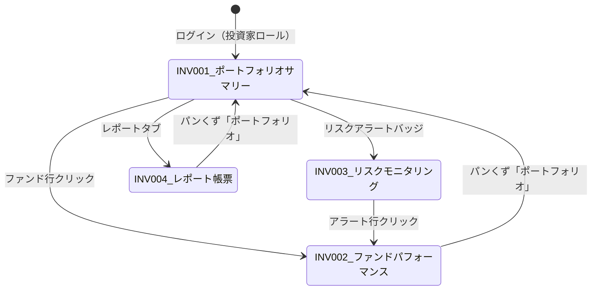

# 投資家ダッシュボード機能仕様書

**Investor Dashboard Feature Specification for CVLPOS**

| 項目 | 内容 |
|------|------|
| 文書バージョン | 1.0 |
| 作成日 | 2026-04-06 |
| ステータス | 初版 |
| 対象ユーザー | 投資家（ファンド出資者） |
| 前提仕様書 | `docs/specification.md`（商用車リースバック価格最適化システム） |

---

## 目次

1. [概要](#1-概要)
2. [ビジネスコンテキスト](#2-ビジネスコンテキスト)
3. [画面定義一覧](#3-画面定義一覧)
4. [画面詳細仕様](#4-画面詳細仕様)
5. [HTMX部分更新パターン](#5-htmx部分更新パターン)
6. [Chart.jsグラフ仕様](#6-chartjsグラフ仕様)
7. [APIエンドポイント仕様](#7-apiエンドポイント仕様)
8. [データベース追加スキーマ](#8-データベース追加スキーマ)
9. [セキュリティ・認可](#9-セキュリティ認可)
10. [非機能要件](#10-非機能要件)

---

## 1. 概要

### 1.1 本仕様書の目的

Carchsが運営する商用車リースバックスキームにおいて、ファンド（SPC）に出資する投資家向けのダッシュボード機能を定義する。投資家は「ハードアセットに裏付けされた安定的・非相関のインカム収益」を期待しており、本ダッシュボードはその投資の透明性・健全性をリアルタイムに可視化する。

### 1.2 対象ステークホルダー

| ステークホルダー | 役割 | 本機能との関わり |
|----------------|------|----------------|
| **投資家** | ファンド（SPC）への出資者 | 主たるエンドユーザー。ポートフォリオ・パフォーマンス・リスクを閲覧 |
| **Carchs** | オペレーター / アセットマネージャー | 車両の調達・管理・リース運営。投資家向けデータの提供元 |
| **運送会社** | リースバックのレッシー（借主） | リース料の支払い者。投資家向け画面には直接表示されないが、デフォルトリスクの源泉 |

### 1.3 バリュートランスファーモデル

ファンドの36ヶ月リース期間における価値移転の概念：

```
Month 01: [物理的車両価値: 100%] [累積キャッシュ回収:  0%] → Net Fund Asset Value: 100%
Month 12: [物理的車両価値:  77%] [累積キャッシュ回収: 27%] → Net Fund Asset Value: 104%
Month 24: [物理的車両価値:  53%] [累積キャッシュ回収: 53%] → Net Fund Asset Value: 106%
Month 36: [物理的車両価値:  30%] [累積キャッシュ回収: 80%] → Net Fund Asset Value: 110%
```

**制約条件**: Net Fund Asset Value（物理的車両価値 + 累積キャッシュ回収）は、リース期間を通じて常に **60%以上** を維持すること。この閾値を下回った場合、投資家に即時アラートを発行する。

---

## 2. ビジネスコンテキスト

### 2.1 投資家にとっての主要KPI

| KPI | 定義 | 表示形式 |
|-----|------|----------|
| **総運用資産額（AUM）** | 投資家が出資する全ファンドの純資産合計 | 円（億円単位） |
| **加重平均利回り（年率）** | 各ファンドのAUMウェイトで加重した年率利回り | %（小数点第2位） |
| **Net Fund Asset Value** | 物理的車両価値 + 累積キャッシュ回収（ファンド単位） | %（初期投資額比） |
| **LTV（Loan-to-Value）** | 残存リース元本 / 車両時価 | %（60%ラインが閾値） |
| **デフォルト率** | デフォルト案件数 / 全案件数 | %（件数ベース） |

### 2.2 用語定義

| 用語 | 英語 | 定義 |
|------|------|------|
| ファンド | Fund (SPC) | 車両資産を保有しリースバック契約の貸主となる特別目的会社 |
| Net Fund Asset Value | Net Fund Asset Value | 車両の物理的残存価値 + 累積リース料回収額の合計 |
| LTV | Loan-to-Value | 残存リース元本に対する車両時価の比率。60%超で要注意 |
| クロスオーバーポイント | Crossover Point | 累積キャッシュ回収が物理的車両価値を上回る月 |
| デフォルト | Default | 運送会社がリース料の支払いを90日以上延滞した状態 |
| 回収進捗 | Recovery Progress | デフォルト案件における車両売却・保証金充当等の回収額 / 残債 |

---

## 3. 画面定義一覧

| 画面ID | 画面名 | URL | 認証要否 | ロール |
|--------|--------|-----|----------|--------|
| INV-001 | ポートフォリオサマリー | `/investor/portfolio` | 必要 | `investor` |
| INV-002 | ファンドパフォーマンス | `/investor/funds/{fund_id}/performance` | 必要 | `investor` |
| INV-003 | リスクモニタリング | `/investor/risk` | 必要 | `investor` |
| INV-004 | レポート・帳票 | `/investor/reports` | 必要 | `investor` |

### 画面遷移図



---

## 4. 画面詳細仕様

### 4.1 INV-001: ポートフォリオサマリー画面

#### 画面概要

投資家が保有する全ファンドのサマリーを一画面で俯瞰する。

#### 画面構成

```
+---------------------------------------------------------------+
| パンくず: ホーム > ポートフォリオ                                   |
+---------------------------------------------------------------+
| [KPIカード群]                                                    |
| +-------------+ +-------------+ +-------------+ +-------------+ |
| | 総運用資産額  | | 平均利回り   | | ファンド数   | | 車両数      | |
| | (AUM)       | | (年率)      | |             | |             | |
| | ¥12.5億     | | 7.8%        | | 5           | | 142         | |
| | +2.1% MoM   | | +0.3pp MoM  | |             | |             | |
| +-------------+ +-------------+ +-------------+ +-------------+ |
+---------------------------------------------------------------+
| [LTV分布ヒストグラム]              | [ファンド一覧テーブル]         |
| +--------------------------+     | +---------------------------+ |
| |  ██                      |     | | ファンド名 | AUM | 利回り   | |
| |  ████                    |     | | Fund A   | 3.2 | 8.1%   | |
| |  ██████                  |     | | Fund B   | 2.8 | 7.5%   | |
| |  ████████  60%ライン      |     | | Fund C   | ...           | |
| |  ██████████              |     | |                           | |
| +--------------------------+     | +---------------------------+ |
+---------------------------------------------------------------+
```

#### KPIカード定義

| # | KPI名 | データソース | 表示形式 | 前月比表示 |
|---|--------|------------|----------|-----------|
| 1 | 総運用資産額（AUM） | 全ファンドの `net_asset_value` 合計 | `¥XX.X億` | `+X.X% MoM` |
| 2 | 平均利回り（年率） | AUM加重平均 `effective_yield_rate` | `X.X%` | `+X.Xpp MoM` |
| 3 | ファンド数 | ステータス `active` のファンド件数 | 整数 | 増減数 |
| 4 | 車両数 | 全アクティブファンド内の車両台数合計 | 整数 | 増減数 |

#### LTV分布ヒストグラム仕様

| 項目 | 仕様 |
|------|------|
| グラフ種別 | 棒グラフ（横向き） |
| X軸 | 車両数（台） |
| Y軸（カテゴリ） | LTV区間: `0-20%`, `20-40%`, `40-60%`, `60-80%`, `80-100%`, `100%超` |
| 色分け | 0-60%: `#22c55e`（緑）、60-80%: `#f59e0b`（黄）、80%超: `#ef4444`（赤） |
| 60%ライン | 水平の破線（`borderDash: [5, 5]`）でLTV=60%を表示 |
| ツールチップ | 区間名、車両数、全体比率 |

#### ファンド一覧テーブル

| カラム | 型 | ソート | 説明 |
|--------|-----|--------|------|
| ファンド名 | string | -- | クリックでINV-002へ遷移 |
| 設定日 | date | asc/desc | ファンド設立日 |
| リース残月数 | int | asc/desc | 最短リース残月 |
| AUM（億円） | decimal | asc/desc | ファンド純資産 |
| 利回り（年率） | % | asc/desc | 実績利回り |
| Net Fund Asset Value | % | asc/desc | 初期投資額比 |
| LTV（最大） | % | asc/desc | ファンド内最大LTV。60%超は赤 |
| ステータス | badge | -- | `運用中` / `償還準備` / `償還済` |

---

### 4.2 INV-002: ファンドパフォーマンス画面

#### 画面概要

個別ファンドの月次パフォーマンスを詳細に表示する。

#### 画面構成

```
+---------------------------------------------------------------+
| パンくず: ホーム > ポートフォリオ > Fund A パフォーマンス            |
+---------------------------------------------------------------+
| [ファンド概要カード]                                              |
| ファンド名: Fund A-2024  | 設定日: 2024-01  | リース期間: 36M     |
| 車両数: 28台  | AUM: ¥3.2億  | 利回り: 8.1%  | NFAV: 104.2%     |
+---------------------------------------------------------------+
| [タブ: NFAV推移 | クロスオーバー | 利回り比較]                      |
+---------------------------------------------------------------+
| [Net Fund Asset Value推移グラフ]                                 |
| +-----------------------------------------------------------+ |
| | 110% ─────────────────────────────────── ← 目標ライン        | |
| | 100% ━━━━━━━━━━━━━━━━━━━━━━━━━ ← 実績ライン                | |
| |  60% - - - - - - - - - - - - - - - - ← 最低保証ライン       | |
| |   0% ─────────────────────────────────                     | |
| |      M01  M06  M12  M18  M24  M30  M36                    | |
| +-----------------------------------------------------------+ |
+---------------------------------------------------------------+
| [月次明細テーブル]                                                |
| +-----------------------------------------------------------+ |
| | 月 | 車両価値 | 累積回収 | NFAV | 利回り | リース料入金 | 延滞  | |
| | M01| 100%    | 0%     | 100% | --    | ¥XXX万     | 0件   | |
| | M02| 97%     | 2.7%   | 99.7%| 8.1%  | ¥XXX万     | 0件   | |
| +-----------------------------------------------------------+ |
+---------------------------------------------------------------+
```

#### Net Fund Asset Value推移グラフ

| 項目 | 仕様 |
|------|------|
| グラフ種別 | 折れ線グラフ |
| X軸 | リース月（M01〜M36） |
| Y軸 | NFAV（%）、初期投資額=100% |
| データ系列1 | 実績NFAV（実線、`#3b82f6` 青、`lineWidth: 3`） |
| データ系列2 | 計画NFAV（破線、`#94a3b8` グレー、`borderDash: [8, 4]`） |
| 閾値ライン | 60%水平線（`#ef4444` 赤、`borderDash: [5, 5]`、annotation plugin使用） |
| 塗りつぶし | 実績ラインから60%ラインまでグラデーション（`rgba(59, 130, 246, 0.1)`） |
| ツールチップ | 月、実績NFAV、計画NFAV、差異 |
| インタラクション | ホバーで垂直クロスヘア表示 |

#### クロスオーバーチャート（物理的車両価値 vs 累積リース料回収）

| 項目 | 仕様 |
|------|------|
| グラフ種別 | 折れ線グラフ（2系列 + 積み上げエリア） |
| X軸 | リース月（M01〜M36） |
| Y軸 | 金額（万円） or 初期投資額比（%） |
| 系列1: 物理的車両価値 | 右肩下がり曲線。`#f97316` オレンジ、塗りつぶし `rgba(249, 115, 22, 0.2)` |
| 系列2: 累積リース料回収 | 右肩上がり直線。`#22c55e` 緑、塗りつぶし `rgba(34, 197, 94, 0.2)` |
| クロスオーバーポイント | 交差点にマーカー表示（`pointRadius: 8`、`#6366f1` 紫） |
| アノテーション | クロスオーバー月にラベル「損益分岐: MXX」表示 |
| 合計ライン | 系列1 + 系列2 = NFAV（細い破線、`#64748b`） |
| ツールチップ | 月、車両価値、累積回収、NFAV、クロスオーバーまでの残月 |

#### 利回り実績 vs 目標利回り比較

| 項目 | 仕様 |
|------|------|
| グラフ種別 | 棒グラフ（実績） + 折れ線（目標） |
| X軸 | 月次（M01〜M36） |
| Y軸 | 利回り（年率換算 %） |
| 棒グラフ | 月次実績利回り。目標以上: `#22c55e`、目標未満: `#f59e0b` |
| 折れ線 | 目標利回り。`#ef4444` 赤、`borderDash: [6, 3]` |
| ツールチップ | 月、実績利回り、目標利回り、差異 |

#### 月次明細テーブル

| カラム | 型 | 説明 |
|--------|-----|------|
| 月 | string | `M01`〜`M36` |
| 物理的車両価値 | currency / % | 減価償却後の車両時価合計 |
| 累積リース料回収 | currency / % | 当月までの累積リース料入金 |
| Net Fund Asset Value | % | 車両価値 + 累積回収（初期投資額比） |
| 月次利回り（年率換算） | % | 当月リース料 / AUM * 12 |
| リース料入金額 | currency | 当月入金合計 |
| 延滞件数 | int | 30日以上延滞の件数 |
| 備考 | string | 特記事項（車両入替・売却等） |

---

### 4.3 INV-003: リスクモニタリング画面

#### 画面概要

投資家が注視すべきリスク指標をリアルタイムに表示する。

#### 画面構成

```
+---------------------------------------------------------------+
| パンくず: ホーム > リスクモニタリング                                |
+---------------------------------------------------------------+
| [リスクサマリーカード群]                                          |
| +------------------+ +------------------+ +------------------+ |
| | LTV超過アラート    | | デフォルト件数     | | 集中リスクスコア   | |
| | 3件 (!)          | | 1件              | | 中               | |
| +------------------+ +------------------+ +------------------+ |
+---------------------------------------------------------------+
| [タブ: LTVアラート | デフォルト案件 | 集中リスク]                    |
+---------------------------------------------------------------+
| [LTV 60%ライン超過アラート一覧]                                   |
| +-----------------------------------------------------------+ |
| | 重要度 | ファンド | 車両 | LTV | 超過日 | 原因 | 対応状況     | |
| | 高    | FundA  | XX  | 72% | 4/1  | 市場下落 | 対応中      | |
| +-----------------------------------------------------------+ |
+---------------------------------------------------------------+
```

#### LTV 60%ライン超過アラート一覧

| カラム | 型 | 説明 |
|--------|-----|------|
| 重要度 | badge | `高`（LTV>80%: 赤）/ `中`（LTV 60-80%: 黄） |
| ファンド名 | string | 該当ファンド名。クリックでINV-002遷移 |
| 車両識別 | string | 車台番号またはメーカー・車種・年式 |
| 現在LTV | % | 現在のLTV値。色分け表示 |
| 超過検知日 | date | 60%を初めて超過した日 |
| 超過原因 | string | `市場価格下落` / `延滞発生` / `車両損傷` |
| 対応状況 | badge | `未対応` / `対応中` / `解消済` |
| 推定回復月 | string | LTVが60%以下に戻る推定月（自動計算） |

#### デフォルト案件一覧と回収進捗

| カラム | 型 | 説明 |
|--------|-----|------|
| ファンド名 | string | 該当ファンド |
| 運送会社（匿名化） | string | `Company-A` 等の匿名表記 |
| 車両台数 | int | デフォルト対象車両数 |
| 残債額 | currency | 未回収リース料残高 |
| 車両売却見込額 | currency | 直近相場に基づく見込額 |
| 回収進捗 | progress bar | 回収額 / 残債（%） |
| デフォルト発生日 | date | 90日延滞到達日 |
| 回収ステータス | badge | `交渉中` / `法的手続中` / `車両回収済` / `売却完了` / `損失確定` |

#### 車両カテゴリ別集中リスク

| 項目 | 仕様 |
|------|------|
| 表示形式 | ドーナツチャート + テーブル |
| カテゴリ | 小型トラック / 中型トラック / 大型トラック / トレーラーヘッド / 特装車 |
| ドーナツ | AUM比率。中央に総車両数を表示 |
| テーブルカラム | カテゴリ / 車両数 / AUM比率 / 平均LTV / 平均利回り / 集中度評価 |
| 集中度評価 | 単一カテゴリ40%超: `高`（赤）、30-40%: `中`（黄）、30%未満: `低`（緑） |

---

### 4.4 INV-004: レポート・帳票画面

#### 画面概要

月次レポートと配当金計算書のPDF生成・ダウンロード機能を提供する。

#### 画面構成

```
+---------------------------------------------------------------+
| パンくず: ホーム > レポート                                       |
+---------------------------------------------------------------+
| [期間選択]  [2026年] [3月 ▼]  [レポート生成]                      |
+---------------------------------------------------------------+
| [レポート一覧テーブル]                                            |
| +-----------------------------------------------------------+ |
| | 期間    | レポート種別      | ステータス | 生成日 | DL        | |
| | 2026-03 | 月次投資家レポート  | 生成済    | 4/1   | [PDF]     | |
| | 2026-03 | 配当金計算書       | 生成済    | 4/1   | [PDF]     | |
| | 2026-02 | 月次投資家レポート  | 生成済    | 3/1   | [PDF]     | |
| +-----------------------------------------------------------+ |
+---------------------------------------------------------------+
```

#### 月次投資家レポート（PDF）構成

| セクション | 内容 |
|-----------|------|
| 1. エグゼクティブサマリー | 当月のAUM、利回り、NFAV推移ハイライト |
| 2. ポートフォリオ概況 | ファンド別パフォーマンス一覧表 |
| 3. バリュートランスファー推移 | クロスオーバーチャート（全ファンド集計） |
| 4. リスクレポート | LTV分布、デフォルト状況、集中リスク |
| 5. 配当金情報 | 当月配当額、累計配当額、次回配当予定日 |
| 6. 市場環境 | 商用車市場の動向サマリー |
| 7. 注記・免責事項 | 法的注記 |

#### 配当金計算書（PDF）構成

| セクション | 内容 |
|-----------|------|
| 投資家情報 | 投資家名（法人名/個人名）、口座番号 |
| 配当計算期間 | 対象月 |
| ファンド別配当明細 | ファンド名、出資額、利回り、配当額 |
| 源泉徴収 | 源泉徴収税額（該当する場合） |
| 差引支払額 | 手取り配当額 |
| 振込予定日 | 配当金支払日 |

---

## 5. HTMX部分更新パターン

### 5.1 投資家ダッシュボード共通パターン

| パターン | 適用画面 | HTMX属性 | 説明 |
|----------|---------|----------|------|
| KPI自動更新 | INV-001 | `hx-get`, `hx-trigger="every 300s"` | 5分ごとにKPIカードを自動更新 |
| タブ切替 | INV-002, INV-003 | `hx-get`, `hx-target="#tab-content"`, `hx-swap="innerHTML"` | グラフ/テーブルの切替 |
| テーブルソート | INV-001, INV-003 | `hx-get`, `hx-include`, `hx-target` | カラムヘッダクリックでソート |
| 期間フィルタ | INV-002, INV-004 | `hx-get`, `hx-trigger="change"`, `hx-target` | 年月選択でデータ再取得 |
| PDF生成 | INV-004 | `hx-post`, `hx-indicator` | 非同期PDF生成、完了後DLリンク表示 |
| アラート既読 | INV-003 | `hx-patch`, `hx-swap="outerHTML"` | アラート行の対応状況更新 |

### 5.2 画面別HTMX実装仕様

#### INV-001: ポートフォリオサマリー

```html
<!-- KPIカード自動更新（5分間隔） -->
<div id="kpi-cards"
     hx-get="/investor/partials/kpi-cards"
     hx-trigger="every 300s"
     hx-swap="innerHTML"
     hx-indicator="#kpi-spinner">
    
</div>

<!-- LTV分布ヒストグラム -->
<div id="ltv-histogram"
     hx-get="/investor/partials/ltv-histogram"
     hx-trigger="load"
     hx-swap="innerHTML">
    <div class="skeleton skeleton--chart"></div>
</div>

<!-- ファンド一覧テーブル（ソート対応） -->
<table id="fund-table">
    <thead>
        <tr>
            <th hx-get="/investor/partials/fund-table?sort=fund_name&order=asc"
                hx-target="#fund-table-body"
                hx-swap="innerHTML"
                hx-indicator="#table-spinner"
                class="sortable">ファンド名</th>
            <!-- 他のカラムも同様 -->
        </tr>
    </thead>
    <tbody id="fund-table-body">
        
    </tbody>
</table>
```

#### INV-002: ファンドパフォーマンス

```html
<!-- タブ切替 -->
<div class="tab-group" role="tablist">
    <button role="tab"
            hx-get="/investor/funds/{{ fund_id }}/partials/nfav-chart"
            hx-target="#chart-container"
            hx-swap="innerHTML"
            class="tab tab--active">NFAV推移</button>
    <button role="tab"
            hx-get="/investor/funds/{{ fund_id }}/partials/crossover-chart"
            hx-target="#chart-container"
            hx-swap="innerHTML"
            class="tab">クロスオーバー</button>
    <button role="tab"
            hx-get="/investor/funds/{{ fund_id }}/partials/yield-chart"
            hx-target="#chart-container"
            hx-swap="innerHTML"
            class="tab">利回り比較</button>
</div>

<div id="chart-container">
    
</div>

<!-- 月次明細テーブル（ページネーション） -->
<div id="monthly-detail"
     hx-get="/investor/funds/{{ fund_id }}/partials/monthly-table?page=1"
     hx-trigger="load"
     hx-swap="innerHTML">
</div>
```

#### INV-004: レポート帳票

```html
<!-- PDF生成リクエスト -->
<form hx-post="/api/v1/investor/reports/generate"
      hx-target="#report-status"
      hx-swap="innerHTML"
      hx-indicator="#generate-spinner"
      hx-disabled-elt="button[type='submit']">
    <select name="year">...</select>
    <select name="month">...</select>
    <select name="report_type">
        <option value="monthly_report">月次投資家レポート</option>
        <option value="dividend_statement">配当金計算書</option>
    </select>
    <button type="submit" class="btn btn--primary">レポート生成</button>
</form>

<!-- 生成ステータス（ポーリング） -->
<div id="report-status"
     hx-get="/investor/partials/report-status?job_id={{ job_id }}"
     hx-trigger="every 3s [!reportReady]"
     hx-swap="innerHTML">
</div>
```

### 5.3 Chart.js再生成パターン

HTMX部分更新後のChart.jsインスタンス管理:

```javascript
// グローバルチャートレジストリ
const chartRegistry = {};

document.body.addEventListener("htmx:afterSettle", function(event) {
    // 更新されたDOM内のcanvas要素を検出
    const canvases = event.detail.elt.querySelectorAll("canvas[data-chart-config]");
    canvases.forEach(function(canvas) {
        const chartId = canvas.id;
        // 既存インスタンスを破棄
        if (chartRegistry[chartId]) {
            chartRegistry[chartId].destroy();
        }
        // サーバーから埋め込まれたJSON設定を取得
        const config = JSON.parse(canvas.dataset.chartConfig);
        chartRegistry[chartId] = new Chart(canvas.getContext("2d"), config);
    });
});
```

---

## 6. Chart.jsグラフ仕様

### 6.1 共通設定

```javascript
const investorChartDefaults = {
    responsive: true,
    maintainAspectRatio: false,
    plugins: {
        legend: {
            position: "top",
            labels: { font: { family: "'Noto Sans JP', sans-serif", size: 12 } }
        },
        tooltip: {
            backgroundColor: "rgba(15, 23, 42, 0.9)",
            titleFont: { family: "'Noto Sans JP', sans-serif" },
            bodyFont: { family: "'Noto Sans JP', sans-serif" },
            callbacks: {
                label: function(context) {
                    // 通貨・%のフォーマットはグラフごとに定義
                }
            }
        }
    },
    scales: {
        x: { grid: { display: false } },
        y: { grid: { color: "rgba(148, 163, 184, 0.2)" } }
    }
};
```

### 6.2 グラフ仕様一覧

| # | グラフ名 | 画面 | Chart.js種別 | プラグイン | キャンバスID |
|---|---------|------|-------------|-----------|-------------|
| G-01 | LTV分布ヒストグラム | INV-001 | `bar` (horizontal) | annotation | `ltv-histogram-chart` |
| G-02 | NFAV推移グラフ | INV-002 | `line` | annotation | `nfav-trend-chart` |
| G-03 | クロスオーバーチャート | INV-002 | `line` (area fill) | annotation | `crossover-chart` |
| G-04 | 利回り実績vs目標 | INV-002 | `bar` + `line` (mixed) | -- | `yield-comparison-chart` |
| G-05 | 車両カテゴリドーナツ | INV-003 | `doughnut` | doughnutlabel | `category-donut-chart` |

### 6.3 G-03 クロスオーバーチャート詳細設定

```javascript
// サーバー側でJinja2テンプレートに埋め込むデータ構造
const crossoverData = {
    type: "line",
    data: {
        labels: {{ months | tojson }},  // ["M01", "M02", ..., "M36"]
        datasets: [
            {
                label: "物理的車両価値",
                data: {{ asset_values | tojson }},  // [100, 97, 94, ...]
                borderColor: "#f97316",
                backgroundColor: "rgba(249, 115, 22, 0.15)",
                fill: true,
                tension: 0.3,
                pointRadius: 2,
                pointHoverRadius: 6
            },
            {
                label: "累積リース料回収",
                data: {{ cumulative_cash | tojson }},  // [0, 2.2, 4.4, ...]
                borderColor: "#22c55e",
                backgroundColor: "rgba(34, 197, 94, 0.15)",
                fill: true,
                tension: 0,
                pointRadius: 2,
                pointHoverRadius: 6
            },
            {
                label: "Net Fund Asset Value",
                data: {{ nfav_values | tojson }},  // [100, 99.2, 98.4, ...]
                borderColor: "#64748b",
                borderDash: [4, 4],
                borderWidth: 1.5,
                fill: false,
                pointRadius: 0
            }
        ]
    },
    options: {
        ...investorChartDefaults,
        plugins: {
            ...investorChartDefaults.plugins,
            annotation: {
                annotations: {
                    crossoverPoint: {
                        type: "point",
                        xValue: {{ crossover_month }},  // e.g. "M18"
                        yValue: {{ crossover_value }},
                        radius: 8,
                        backgroundColor: "#6366f1",
                        borderColor: "#4f46e5",
                        borderWidth: 2
                    },
                    crossoverLabel: {
                        type: "label",
                        xValue: {{ crossover_month }},
                        yValue: {{ crossover_value + 5 }},
                        content: "損益分岐: M{{ crossover_month_num }}",
                        font: { size: 11, weight: "bold" },
                        color: "#6366f1"
                    },
                    thresholdLine: {
                        type: "line",
                        yMin: 60,
                        yMax: 60,
                        borderColor: "#ef4444",
                        borderWidth: 1.5,
                        borderDash: [5, 5],
                        label: {
                            display: true,
                            content: "最低保証ライン 60%",
                            position: "start",
                            color: "#ef4444",
                            font: { size: 10 }
                        }
                    }
                }
            }
        },
        scales: {
            x: {
                title: { display: true, text: "リース月" }
            },
            y: {
                title: { display: true, text: "初期投資額比 (%)" },
                min: 0,
                max: 120,
                ticks: { callback: function(value) { return value + "%"; } }
            }
        }
    }
};
```

---

## 7. APIエンドポイント仕様

### 7.1 共通仕様

| 項目 | 仕様 |
|------|------|
| ベースURL | `/api/v1/investor` |
| 認証 | Bearer Token（JWT）またはHTTPOnly Cookie |
| 認可 | `role: investor` のみアクセス可 |
| レスポンス形式 | JSON（`Content-Type: application/json`） |
| 日時形式 | ISO 8601（`2026-04-06T00:00:00+09:00`） |
| 通貨 | 日本円（整数、銭単位なし） |
| エラー形式 | 既存仕様 `{ "status": "error", "error": { "code": "...", "message": "..." } }` に準拠 |

### 7.2 エンドポイント一覧

---

#### `GET /api/v1/investor/portfolio`

ポートフォリオサマリー情報を取得する。

**リクエストパラメータ**: なし

**レスポンス**:

```json
{
    "status": "success",
    "data": {
        "summary": {
            "total_aum": 1250000000,
            "total_aum_display": "12.5億円",
            "aum_change_mom_pct": 2.1,
            "weighted_avg_yield_annual_pct": 7.8,
            "yield_change_mom_pp": 0.3,
            "active_fund_count": 5,
            "fund_count_change": 0,
            "total_vehicle_count": 142,
            "vehicle_count_change": 3
        },
        "ltv_distribution": {
            "buckets": [
                { "range": "0-20%", "count": 12, "pct": 8.5 },
                { "range": "20-40%", "count": 45, "pct": 31.7 },
                { "range": "40-60%", "count": 62, "pct": 43.7 },
                { "range": "60-80%", "count": 18, "pct": 12.7 },
                { "range": "80-100%", "count": 4, "pct": 2.8 },
                { "range": "100%+", "count": 1, "pct": 0.7 }
            ],
            "threshold_line": 60
        },
        "funds": [
            {
                "fund_id": "fund_001",
                "fund_name": "Carchs Truck Fund A-2024",
                "inception_date": "2024-01-15",
                "remaining_months": 24,
                "aum": 320000000,
                "yield_annual_pct": 8.1,
                "nfav_pct": 104.2,
                "max_ltv_pct": 58.3,
                "status": "active"
            }
        ],
        "as_of": "2026-04-06T09:00:00+09:00"
    }
}
```

**HTTPステータス**:

| コード | 説明 |
|--------|------|
| 200 | 正常取得 |
| 401 | 未認証 |
| 403 | 投資家ロールでない |

---

#### `GET /api/v1/investor/funds/{fund_id}/performance`

個別ファンドのパフォーマンスデータを取得する。

**パスパラメータ**:

| パラメータ | 型 | 必須 | 説明 |
|-----------|-----|------|------|
| `fund_id` | string | Yes | ファンドID |

**クエリパラメータ**:

| パラメータ | 型 | 必須 | デフォルト | 説明 |
|-----------|-----|------|-----------|------|
| `from_month` | int | No | 1 | 表示開始月（1〜） |
| `to_month` | int | No | 現在月 | 表示終了月 |

**レスポンス**:

```json
{
    "status": "success",
    "data": {
        "fund_overview": {
            "fund_id": "fund_001",
            "fund_name": "Carchs Truck Fund A-2024",
            "inception_date": "2024-01-15",
            "lease_term_months": 36,
            "vehicle_count": 28,
            "aum": 320000000,
            "current_yield_annual_pct": 8.1,
            "target_yield_annual_pct": 8.0,
            "current_nfav_pct": 104.2
        },
        "nfav_trend": {
            "months": ["M01", "M02", "M03"],
            "actual_nfav_pct": [100.0, 99.8, 100.1],
            "planned_nfav_pct": [100.0, 99.5, 99.7],
            "threshold_pct": 60
        },
        "crossover": {
            "months": ["M01", "M02", "M03"],
            "asset_value_pct": [100.0, 97.2, 94.4],
            "cumulative_cash_pct": [0.0, 2.7, 5.4],
            "nfav_pct": [100.0, 99.9, 99.8],
            "crossover_month": 18,
            "crossover_value_pct": 52.3
        },
        "yield_comparison": {
            "months": ["M01", "M02", "M03"],
            "actual_yield_pct": [0.0, 8.2, 8.1],
            "target_yield_pct": [8.0, 8.0, 8.0]
        },
        "monthly_details": [
            {
                "month": 1,
                "month_label": "M01",
                "asset_value": 320000000,
                "asset_value_pct": 100.0,
                "cumulative_cash": 0,
                "cumulative_cash_pct": 0.0,
                "nfav_pct": 100.0,
                "monthly_yield_annualized_pct": 0.0,
                "lease_income": 0,
                "overdue_count": 0,
                "remarks": "ファンド設定月"
            }
        ],
        "as_of": "2026-04-06T09:00:00+09:00"
    }
}
```

**HTTPステータス**:

| コード | 説明 |
|--------|------|
| 200 | 正常取得 |
| 401 | 未認証 |
| 403 | 投資家ロールでない、またはこのファンドへのアクセス権限なし |
| 404 | 指定されたファンドが存在しない |

---

#### `GET /api/v1/investor/risk-alerts`

リスクアラート情報を取得する。

**クエリパラメータ**:

| パラメータ | 型 | 必須 | デフォルト | 説明 |
|-----------|-----|------|-----------|------|
| `alert_type` | string | No | `all` | `ltv_breach` / `default` / `concentration` / `all` |
| `status` | string | No | `active` | `active` / `resolved` / `all` |
| `severity` | string | No | `all` | `high` / `medium` / `all` |
| `page` | int | No | 1 | ページ番号 |
| `per_page` | int | No | 20 | 1ページあたり件数（max: 100） |

**レスポンス**:

```json
{
    "status": "success",
    "data": {
        "summary": {
            "ltv_breach_count": 3,
            "default_count": 1,
            "concentration_risk_level": "medium"
        },
        "ltv_alerts": [
            {
                "alert_id": "alt_001",
                "severity": "high",
                "fund_id": "fund_001",
                "fund_name": "Carchs Truck Fund A-2024",
                "vehicle_id": "veh_042",
                "vehicle_description": "日野 プロフィア 2021年式 大型",
                "current_ltv_pct": 72.3,
                "breach_date": "2026-04-01",
                "cause": "市場価格下落",
                "resolution_status": "investigating",
                "estimated_recovery_month": "2026-07"
            }
        ],
        "default_cases": [
            {
                "case_id": "def_001",
                "fund_id": "fund_002",
                "fund_name": "Carchs Truck Fund B-2024",
                "company_alias": "Company-A",
                "vehicle_count": 2,
                "outstanding_amount": 4800000,
                "estimated_liquidation_value": 3200000,
                "recovery_pct": 45.0,
                "default_date": "2026-02-15",
                "recovery_status": "vehicle_repossessed"
            }
        ],
        "concentration_risk": {
            "categories": [
                {
                    "category": "大型トラック",
                    "vehicle_count": 58,
                    "aum_pct": 42.1,
                    "avg_ltv_pct": 48.3,
                    "avg_yield_pct": 7.9,
                    "risk_level": "high"
                },
                {
                    "category": "中型トラック",
                    "vehicle_count": 45,
                    "aum_pct": 28.5,
                    "avg_ltv_pct": 44.1,
                    "avg_yield_pct": 8.2,
                    "risk_level": "low"
                }
            ]
        },
        "pagination": {
            "page": 1,
            "per_page": 20,
            "total_count": 4,
            "total_pages": 1
        },
        "as_of": "2026-04-06T09:00:00+09:00"
    }
}
```

**HTTPステータス**:

| コード | 説明 |
|--------|------|
| 200 | 正常取得 |
| 401 | 未認証 |
| 403 | 投資家ロールでない |
| 422 | クエリパラメータ不正 |

---

#### `GET /api/v1/investor/reports/{period}`

指定期間のレポート一覧・ダウンロードURLを取得する。

**パスパラメータ**:

| パラメータ | 型 | 必須 | 説明 |
|-----------|-----|------|------|
| `period` | string | Yes | 対象期間（`YYYY-MM` 形式、例: `2026-03`） |

**クエリパラメータ**:

| パラメータ | 型 | 必須 | デフォルト | 説明 |
|-----------|-----|------|-----------|------|
| `report_type` | string | No | `all` | `monthly_report` / `dividend_statement` / `all` |

**レスポンス**:

```json
{
    "status": "success",
    "data": {
        "period": "2026-03",
        "reports": [
            {
                "report_id": "rpt_001",
                "report_type": "monthly_report",
                "report_type_display": "月次投資家レポート",
                "period": "2026-03",
                "status": "generated",
                "generated_at": "2026-04-01T10:00:00+09:00",
                "download_url": "/api/v1/investor/reports/download/rpt_001",
                "file_size_bytes": 524288,
                "page_count": 8
            },
            {
                "report_id": "rpt_002",
                "report_type": "dividend_statement",
                "report_type_display": "配当金計算書",
                "period": "2026-03",
                "status": "generated",
                "generated_at": "2026-04-01T10:05:00+09:00",
                "download_url": "/api/v1/investor/reports/download/rpt_002",
                "file_size_bytes": 102400,
                "page_count": 2
            }
        ]
    }
}
```

#### `POST /api/v1/investor/reports/generate`

レポートの非同期生成をリクエストする。

**リクエストボディ**:

```json
{
    "period": "2026-03",
    "report_type": "monthly_report"
}
```

**レスポンス**:

```json
{
    "status": "success",
    "data": {
        "job_id": "job_abc123",
        "status": "queued",
        "estimated_completion_seconds": 30
    }
}
```

#### `GET /api/v1/investor/reports/download/{report_id}`

生成済みレポートPDFをダウンロードする。

**レスポンス**: `Content-Type: application/pdf`（バイナリ）

**HTTPステータス**:

| コード | 説明 |
|--------|------|
| 200 | 正常ダウンロード |
| 401 | 未認証 |
| 403 | アクセス権限なし |
| 404 | レポートが存在しない、または未生成 |

---

## 8. データベース追加スキーマ

既存の`specification.md`のスキーマに追加するテーブル:

### 8.1 追加テーブル一覧

| # | テーブル名 | 概要 |
|---|-----------|------|
| 1 | `investors` | 投資家マスタ |
| 2 | `funds` | ファンド（SPC）マスタ |
| 3 | `fund_vehicles` | ファンド-車両紐付け |
| 4 | `investor_fund_holdings` | 投資家-ファンド出資関係 |
| 5 | `fund_monthly_snapshots` | ファンド月次スナップショット |
| 6 | `risk_alerts` | リスクアラート |
| 7 | `default_cases` | デフォルト案件 |
| 8 | `investor_reports` | 投資家レポート管理 |
| 9 | `dividend_records` | 配当金記録 |

### 8.2 主要テーブル定義

```sql
-- 投資家マスタ
CREATE TABLE investors (
    id UUID PRIMARY KEY DEFAULT gen_random_uuid(),
    user_id UUID NOT NULL REFERENCES users(id),
    investor_type VARCHAR(20) NOT NULL CHECK (investor_type IN ('individual', 'corporate')),
    investor_name VARCHAR(200) NOT NULL,
    bank_account_info JSONB,
    created_at TIMESTAMPTZ NOT NULL DEFAULT NOW(),
    updated_at TIMESTAMPTZ NOT NULL DEFAULT NOW()
);

-- ファンド（SPC）マスタ
CREATE TABLE funds (
    id UUID PRIMARY KEY DEFAULT gen_random_uuid(),
    fund_name VARCHAR(200) NOT NULL,
    inception_date DATE NOT NULL,
    lease_term_months INT NOT NULL CHECK (lease_term_months BETWEEN 1 AND 120),
    target_yield_annual_pct DECIMAL(5,2) NOT NULL,
    status VARCHAR(20) NOT NULL DEFAULT 'active'
        CHECK (status IN ('active', 'winding_down', 'redeemed')),
    created_at TIMESTAMPTZ NOT NULL DEFAULT NOW(),
    updated_at TIMESTAMPTZ NOT NULL DEFAULT NOW()
);

-- ファンド-車両紐付け
CREATE TABLE fund_vehicles (
    id UUID PRIMARY KEY DEFAULT gen_random_uuid(),
    fund_id UUID NOT NULL REFERENCES funds(id),
    vehicle_id UUID NOT NULL,
    purchase_price INT NOT NULL,
    purchase_date DATE NOT NULL,
    current_market_value INT,
    current_ltv_pct DECIMAL(5,2),
    lease_monthly_fee INT NOT NULL,
    status VARCHAR(20) NOT NULL DEFAULT 'active'
        CHECK (status IN ('active', 'defaulted', 'terminated', 'sold')),
    UNIQUE (fund_id, vehicle_id)
);

-- 投資家-ファンド出資関係
CREATE TABLE investor_fund_holdings (
    id UUID PRIMARY KEY DEFAULT gen_random_uuid(),
    investor_id UUID NOT NULL REFERENCES investors(id),
    fund_id UUID NOT NULL REFERENCES funds(id),
    investment_amount INT NOT NULL,
    ownership_pct DECIMAL(5,2) NOT NULL,
    investment_date DATE NOT NULL,
    UNIQUE (investor_id, fund_id)
);

-- ファンド月次スナップショット
CREATE TABLE fund_monthly_snapshots (
    id UUID PRIMARY KEY DEFAULT gen_random_uuid(),
    fund_id UUID NOT NULL REFERENCES funds(id),
    snapshot_month DATE NOT NULL,
    month_number INT NOT NULL,
    total_asset_value INT NOT NULL,
    asset_value_pct DECIMAL(5,2) NOT NULL,
    cumulative_cash_collected INT NOT NULL,
    cumulative_cash_pct DECIMAL(5,2) NOT NULL,
    nfav_pct DECIMAL(5,2) NOT NULL,
    monthly_lease_income INT NOT NULL,
    actual_yield_annualized_pct DECIMAL(5,2),
    overdue_count INT NOT NULL DEFAULT 0,
    remarks TEXT,
    created_at TIMESTAMPTZ NOT NULL DEFAULT NOW(),
    UNIQUE (fund_id, snapshot_month)
);

-- リスクアラート
CREATE TABLE risk_alerts (
    id UUID PRIMARY KEY DEFAULT gen_random_uuid(),
    alert_type VARCHAR(30) NOT NULL
        CHECK (alert_type IN ('ltv_breach', 'default', 'concentration')),
    severity VARCHAR(10) NOT NULL CHECK (severity IN ('high', 'medium')),
    fund_id UUID NOT NULL REFERENCES funds(id),
    vehicle_id UUID,
    current_value DECIMAL(5,2),
    threshold_value DECIMAL(5,2),
    cause VARCHAR(100),
    resolution_status VARCHAR(20) NOT NULL DEFAULT 'open'
        CHECK (resolution_status IN ('open', 'investigating', 'resolved')),
    detected_at TIMESTAMPTZ NOT NULL DEFAULT NOW(),
    resolved_at TIMESTAMPTZ,
    estimated_recovery_date DATE
);

-- デフォルト案件
CREATE TABLE default_cases (
    id UUID PRIMARY KEY DEFAULT gen_random_uuid(),
    fund_id UUID NOT NULL REFERENCES funds(id),
    company_alias VARCHAR(50) NOT NULL,
    vehicle_count INT NOT NULL,
    outstanding_amount INT NOT NULL,
    estimated_liquidation_value INT,
    recovered_amount INT NOT NULL DEFAULT 0,
    default_date DATE NOT NULL,
    recovery_status VARCHAR(30) NOT NULL DEFAULT 'negotiating'
        CHECK (recovery_status IN (
            'negotiating', 'legal_proceedings',
            'vehicle_repossessed', 'sold', 'loss_confirmed'
        )),
    created_at TIMESTAMPTZ NOT NULL DEFAULT NOW(),
    updated_at TIMESTAMPTZ NOT NULL DEFAULT NOW()
);

-- 投資家レポート管理
CREATE TABLE investor_reports (
    id UUID PRIMARY KEY DEFAULT gen_random_uuid(),
    investor_id UUID NOT NULL REFERENCES investors(id),
    report_type VARCHAR(30) NOT NULL
        CHECK (report_type IN ('monthly_report', 'dividend_statement')),
    period DATE NOT NULL,
    status VARCHAR(20) NOT NULL DEFAULT 'queued'
        CHECK (status IN ('queued', 'generating', 'generated', 'failed')),
    file_path VARCHAR(500),
    file_size_bytes INT,
    page_count INT,
    generated_at TIMESTAMPTZ,
    created_at TIMESTAMPTZ NOT NULL DEFAULT NOW()
);

-- 配当金記録
CREATE TABLE dividend_records (
    id UUID PRIMARY KEY DEFAULT gen_random_uuid(),
    investor_id UUID NOT NULL REFERENCES investors(id),
    fund_id UUID NOT NULL REFERENCES funds(id),
    period DATE NOT NULL,
    gross_dividend INT NOT NULL,
    withholding_tax INT NOT NULL DEFAULT 0,
    net_dividend INT NOT NULL,
    payment_date DATE,
    payment_status VARCHAR(20) NOT NULL DEFAULT 'pending'
        CHECK (payment_status IN ('pending', 'scheduled', 'paid')),
    created_at TIMESTAMPTZ NOT NULL DEFAULT NOW()
);
```

### 8.3 RLSポリシー（Supabase）

投資家は自身が出資するファンドのデータのみ閲覧可能とする:

```sql
-- 投資家は自身のholdings経由で関連するファンドのみ参照可
ALTER TABLE funds ENABLE ROW LEVEL SECURITY;

CREATE POLICY "investors_view_own_funds" ON funds
    FOR SELECT
    USING (
        id IN (
            SELECT fund_id FROM investor_fund_holdings ifh
            JOIN investors i ON ifh.investor_id = i.id
            WHERE i.user_id = auth.uid()
        )
    );

-- fund_monthly_snapshotsも同様のポリシーを適用
ALTER TABLE fund_monthly_snapshots ENABLE ROW LEVEL SECURITY;

CREATE POLICY "investors_view_own_snapshots" ON fund_monthly_snapshots
    FOR SELECT
    USING (
        fund_id IN (
            SELECT fund_id FROM investor_fund_holdings ifh
            JOIN investors i ON ifh.investor_id = i.id
            WHERE i.user_id = auth.uid()
        )
    );

-- risk_alerts, default_cases, investor_reports, dividend_records にも同様のポリシーを適用
```

---

## 9. セキュリティ・認可

### 9.1 ロールベースアクセス制御

| ロール | アクセス可能画面 | 説明 |
|--------|----------------|------|
| `investor` | INV-001〜INV-004 | 自身が出資するファンドのデータのみ |
| `operator` | SCR-001〜SCR-006 | 既存の営業担当者画面 |
| `admin` | 全画面 | 管理者。全ファンド・全投資家のデータを参照可 |

### 9.2 データアクセス制御

- 投資家は自身の `investor_fund_holdings` に紐づくファンドのデータのみ参照可能
- 運送会社名は匿名化して表示（`company_alias` を使用）
- レポートPDFは署名付きURL（有効期限: 15分）で提供
- APIレスポンスに個人情報（運送会社の実名・連絡先等）を含めない

### 9.3 認証フロー

既存の認証基盤（Supabase Auth + JWT Cookie）を踏襲する。JWTペイロードの `role` フィールドに `investor` を追加し、APIミドルウェアでロールチェックを行う。

```python
# app/api/investor.py での認可チェック例
async def require_investor_role(user: dict = Depends(get_current_user)):
    if user.get("role") != "investor" and user.get("role") != "admin":
        raise HTTPException(status_code=403, detail="投資家権限が必要です")
    return user
```

---

## 10. 非機能要件

### 10.1 パフォーマンス

| 項目 | 要件 |
|------|------|
| ポートフォリオサマリーAPI応答時間 | 500ms以内（P95） |
| ファンドパフォーマンスAPI応答時間 | 800ms以内（P95） |
| PDF生成時間 | 30秒以内（非同期） |
| KPIカード自動更新間隔 | 300秒（5分） |
| 同時接続投資家数 | 100名 |

### 10.2 データ更新頻度

| データ | 更新頻度 | 方法 |
|--------|---------|------|
| 車両時価（LTV計算用） | 日次 | バッチ処理（既存スクレイピング基盤） |
| NFAV・利回り | 月次（月初営業日） | ファンドマネージャーが確定 |
| リスクアラート | リアルタイム（LTV閾値超過時） | トリガーベース |
| 月次レポート | 月次（翌月5営業日以内） | 自動生成 + ファンドマネージャー承認 |

### 10.3 可用性

| 項目 | 要件 |
|------|------|
| 稼働率 | 99.5%（月間ダウンタイム3.6時間以内） |
| メンテナンスウィンドウ | 毎週日曜 02:00-06:00 JST |
| データバックアップ | 日次（Supabase標準） |

---

## 付録A: テンプレートファイル構成

既存の `app/templates/` 配下に追加するファイル:

```
app/templates/
  investor/
    base_investor.html              # 投資家用ベースレイアウト（サイドバー差替え）
    pages/
      portfolio.html                # INV-001
      fund_performance.html         # INV-002
      risk_monitoring.html          # INV-003
      reports.html                  # INV-004
    partials/
      kpi_cards.html                # KPIカード群（HTMX部分更新対象）
      ltv_histogram.html            # LTV分布グラフ
      fund_table_rows.html          # ファンド一覧テーブル行
      nfav_chart.html               # NFAV推移グラフ
      crossover_chart.html          # クロスオーバーチャート
      yield_chart.html              # 利回り比較グラフ
      monthly_table.html            # 月次明細テーブル
      ltv_alert_table.html          # LTVアラート一覧
      default_case_table.html       # デフォルト案件一覧
      concentration_donut.html      # 集中リスクドーナツ
      report_list.html              # レポート一覧
      report_status.html            # レポート生成ステータス
```

## 付録B: APIルーター追加

```python
# app/api/investor.py に追加するルーター
router = APIRouter(prefix="/api/v1/investor", tags=["investor"])

# 画面ルーティング（app/api/pages.py に追加）
# GET /investor/portfolio           → INV-001
# GET /investor/funds/{id}/performance → INV-002
# GET /investor/risk                → INV-003
# GET /investor/reports             → INV-004

# HTMX部分更新エンドポイント（HTMLフラグメント返却）
# GET /investor/partials/kpi-cards
# GET /investor/partials/ltv-histogram
# GET /investor/partials/fund-table
# GET /investor/funds/{id}/partials/nfav-chart
# GET /investor/funds/{id}/partials/crossover-chart
# GET /investor/funds/{id}/partials/yield-chart
# GET /investor/funds/{id}/partials/monthly-table
# GET /investor/partials/ltv-alerts
# GET /investor/partials/default-cases
# GET /investor/partials/concentration
# GET /investor/partials/report-list
# GET /investor/partials/report-status
```
