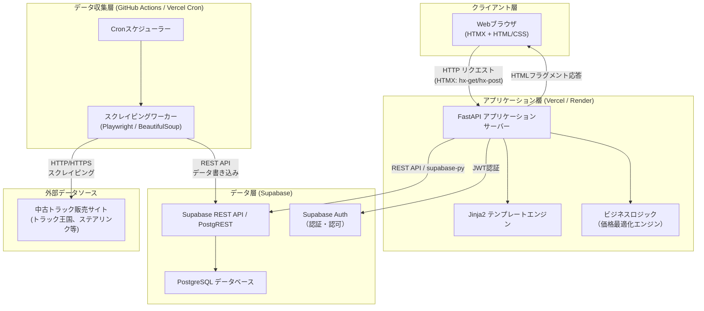
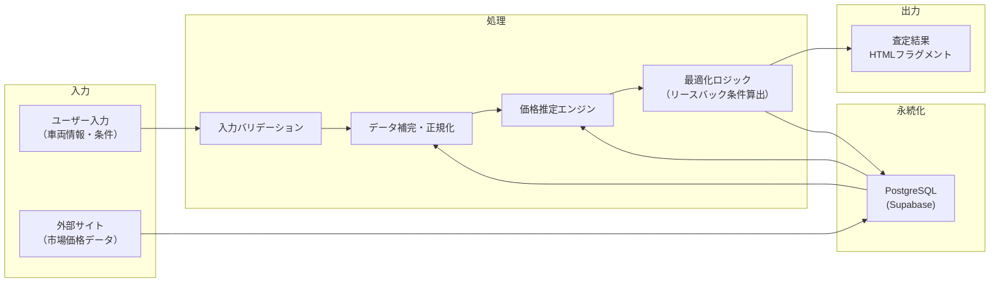
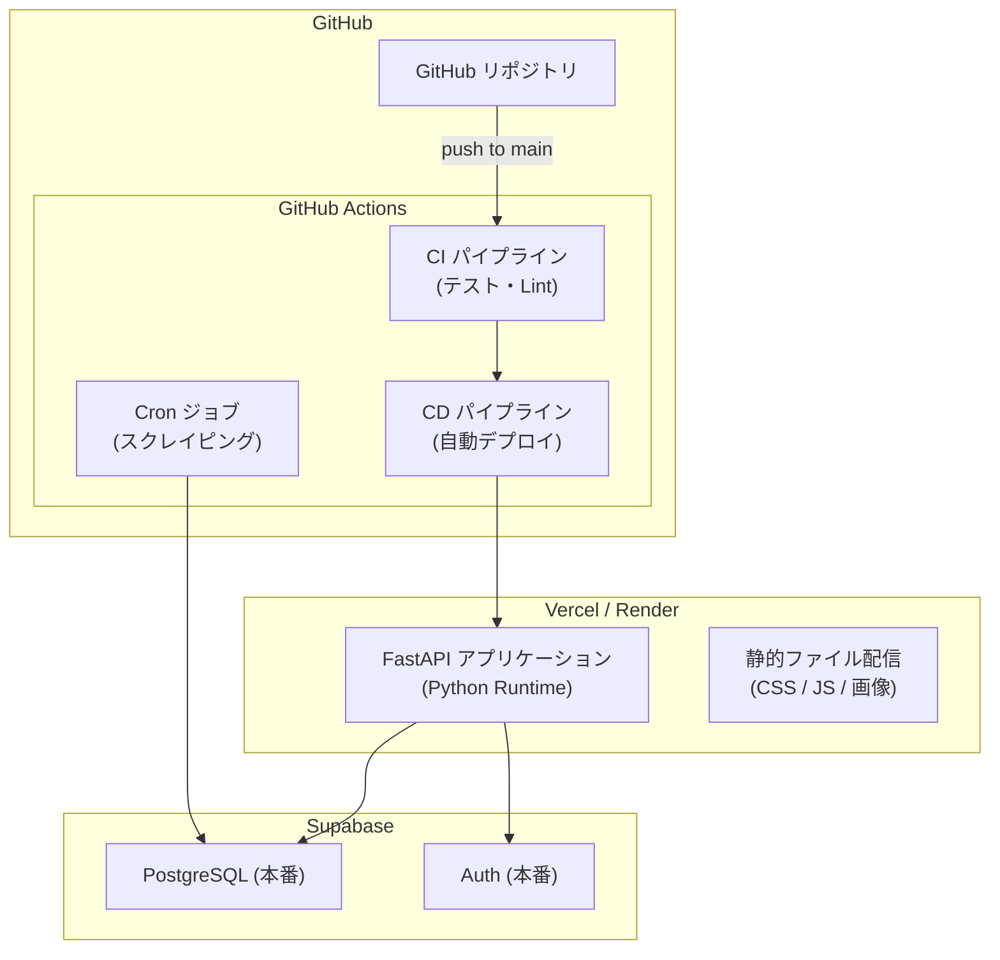
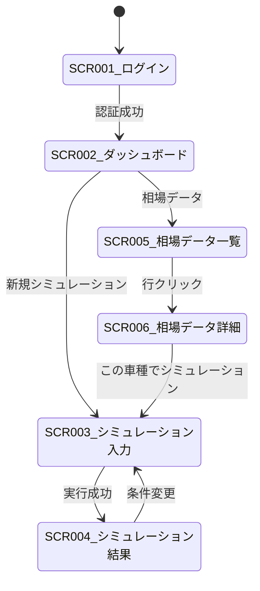
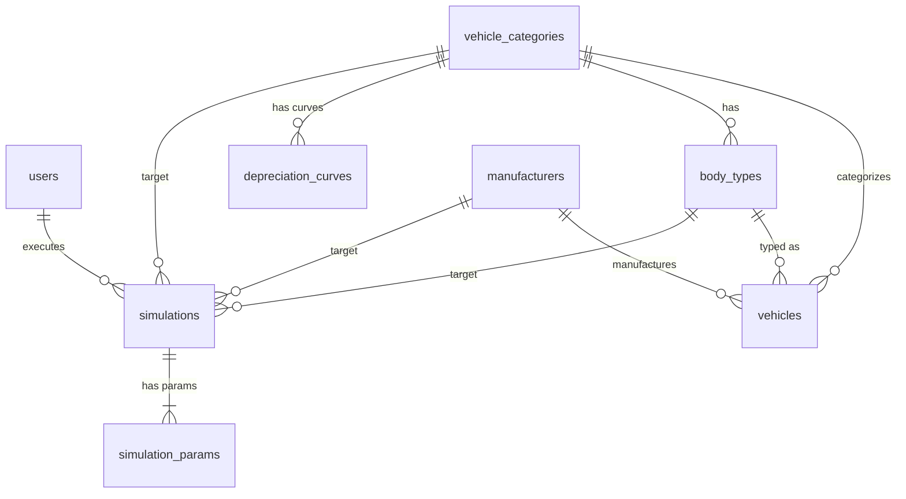

# 商用車リースバック価格最適化システム — ソフトウェア開発仕様書

**Commercial Vehicle Leaseback Pricing Optimization System (CVLPOS)**

| 項目 | 内容 |
|------|------|
| 文書バージョン | 1.0 |
| 作成日 | 2026-04-06 |
| ステータス | 初版 |

---

## 目次

1. [システム概要と目的](#1-システム概要と目的)
2. [システムアーキテクチャ](#2-システムアーキテクチャ)
3. [機能要件一覧](#3-機能要件一覧)
4. [画面遷移とUI設計要件](#4-画面遷移とui設計要件)
5. [計算ロジックの定義](#5-計算ロジックの定義)
6. [データベーススキーマ設計](#6-データベーススキーマ設計)
7. [外部データ収集（スクレイピング）仕様](#7-外部データ収集スクレイピング仕様)
8. [非機能要件](#8-非機能要件)
9. [開発フェーズとPoC（概念実証）の進め方](#9-開発フェーズとpoc概念実証の進め方)

---

## 1. システム概要と目的

### 1.1 システム名称

| 項目 | 名称 |
|------|------|
| 日本語名称 | 商用車リースバック価格最適化システム |
| 英語名称 | Commercial Vehicle Leaseback Pricing Optimization System（CVLPOS） |
| 社内略称 | リースバック価格エンジン / Leaseback Pricing Engine |

### 1.2 プロジェクトのビジョン

**「属人的な経験と勘による値付けから脱却し、データ駆動型の価格決定によりファンドの健全性と営業の迅速性を両立する」**

商用車（トラック・トレーラー等）のリースバック事業において、車両の買取価格およびリース料の算出は、これまで熟練の営業担当者の知見に大きく依存してきた。本システムは、オークション相場・減価償却モデル・オプション評価ロジックを統合し、誰が算出しても一貫性のある「安全な買取価格」と「最適な月額リース料」を即座に提示できる社内業務ツールを実現する。

### 1.3 プロジェクトの背景

本事業は、運送会社が保有するトラック等の事業用車両を買い取り、ファンド（特別目的会社等）を通じて当該運送会社にリースバックするスキームで収益を創出している。このビジネスモデルにおいて、**買取価格の妥当性**はファンドの損益を直接左右する最も重要な変数である。

現状、以下のような業務上の構造的課題が存在する。

- 買取価格の算出が担当者ごとにばらつき、**再現性・透明性が担保されていない**
- オークション相場（ボカ）と小売時価の乖離を正確に把握できず、**リスクの定量化が困難**
- 架装オプション（クレーン・冷凍機等）の価値評価に**統一基準がなく、過大評価による損失が発生**
- 車両の経年劣化・走行距離に応じた減価償却カーブが個人の感覚値に依存し、**残価リスクが潜在化**
- 営業現場での見積もり作成に時間がかかり、**商談スピードの低下と機会損失**が生じている

### 1.4 解決する課題

| # | 課題 | 現状のリスク | 本システムによる解決 |
|---|------|-------------|-------------------|
| 1 | **属人的な価格算出** | 担当者の経験・スキルにより買取価格が数十万円単位で変動する。退職・異動時にノウハウが消失する | 統一されたロジックとパラメータに基づく算出エンジンにより、誰が操作しても同一条件で同一価格を導出 |
| 2 | **オークション相場（ボカ）と実勢価格の乖離の見落とし** | ボカは業者間卸売価格であり小売時価と構造的に乖離するが、その差分を定量的に反映する仕組みがない | ボカデータの取り込みと乖離率の自動計算により、買取価格にリスクマージンを適正に織り込む |
| 3 | **架装オプション価値の過大評価** | 冷凍機・クレーン・パワーゲート等の架装オプションに対し、新品価格ベースで過大に評価してしまい、売却時に損失が発生 | オプション種別ごとの減価係数テーブルを整備し、経過年数・状態に応じた実勢価値を自動反映 |
| 4 | **減価償却リスクの潜在化** | リース期間満了時の残価（出口価格）が楽観的に設定され、ファンドが含み損を抱える構造になりやすい | 車種・年式・走行距離別の減価償却カーブをモデル化し、保守的な残価予測を提示 |
| 5 | **営業現場での見積もりリードタイムの長期化** | 見積もり作成に相場調査・社内承認を含めて数日を要し、商談の機動性を損なう | リアルタイム算出により、商談の場で即座に買取価格・月額リース料の概算を提示可能 |

### 1.5 ステークホルダー一覧

| ステークホルダー | 役割・責務 | 本システムとの関わり |
|----------------|-----------|-------------------|
| **営業担当者** | 運送会社への提案・商談の遂行 | 主たるエンドユーザー。買取価格・月額リース料の算出、見積書の出力を日常的に利用 |
| **営業マネージャー** | 案件の承認・営業戦略の策定 | 算出結果の承認ワークフロー、価格調整の上限管理 |
| **ファンドマネージャー** | ファンドの資産価値管理・リスク管理 | ポートフォリオ全体の残価リスクの監視、買取価格の妥当性検証、パラメータの承認 |
| **経営層** | 事業全体の意思決定 | ダッシュボードによる事業KPIの確認、投資判断 |
| **リスク管理部門** | 与信審査・リスク評価 | 運送会社の信用リスク情報との連携 |
| **開発チーム** | システムの設計・構築・運用保守 | 要件の実装、アルゴリズム開発、インフラ構築 |
| **データ管理チーム** | オークション相場データの取得・整備 | ボカデータの定期更新、マスタデータの維持管理 |

### 1.6 システムのスコープ

#### 1.6.1 対象範囲（In Scope）

| 区分 | 対象内容 |
|------|---------|
| 対象車種 | 事業用商用車（小型・中型・大型トラック、トレーラー、バン型車両） |
| 価格算出機能 | 安全買取価格の自動算出、月額リース料の最適化計算、残価予測 |
| 相場データ連携 | オークション相場（ボカ）データの取り込み・分析、小売時価との乖離率算出 |
| オプション評価 | 架装オプション（冷凍機、クレーン、パワーゲート、アルミウイング等）の価値算定 |
| 減価償却モデル | 車種・年式・走行距離に基づく減価償却カーブの算出 |
| パラメータ管理 | リスクマージン率、減価係数、リース料率等の管理者設定画面 |

#### 1.6.2 対象外（Out of Scope）

| 区分 | 除外内容 | 理由 |
|------|---------|------|
| 乗用車・二輪車 | 事業用商用車以外の車種 | 事業対象外。減価モデルが根本的に異なる |
| 契約書管理 | リース契約書の作成・電子署名・保管 | 既存の契約管理システムで対応 |
| 会計処理 | リース資産の仕訳・会計帳簿への計上 | 既存の会計システムで対応 |
| 与信審査 | 運送会社の信用力評価・審査プロセス | 既存の与信管理システムで対応 |
| 車両の物理的査定 | 現車確認・外装内装の傷・劣化の詳細評価 | 対面査定プロセスで実施 |

### 1.7 用語定義

| 用語 | 読み | 英語表記 | 定義 |
|------|------|---------|------|
| **ボカ** | ぼか | Wholesale Auction Price | 業者間オートオークションにおける卸売取引価格。車両の業者間流通価格の指標 |
| **リースバック** | りーすばっく | Leaseback / Sale and Leaseback | 車両の所有者から買い取り、同一の運送会社に対してリース契約により貸し出す取引形態 |
| **残価** | ざんか | Residual Value | リース期間満了時点における車両の予測市場価値 |
| **安全買取価格** | あんぜんかいとりかかく | Safe Purchase Price | リスクマージンを織り込んだ上で、ファンドが損失を被らないと見込める上限の買取価格 |
| **架装オプション** | かそうおぷしょん | Body Equipment / Mounted Options | トラック等のシャシーに後付けされる業務用装備の総称（冷凍ユニット、クレーン、パワーゲート等） |
| **減価償却カーブ** | げんかしょうきゃくかーぶ | Depreciation Curve | 車両の経過年数・走行距離に応じた市場価値の減少傾向を表すモデル曲線 |
| **リスクマージン** | りすくまーじん | Risk Margin | 市場変動・車両状態の不確実性等に対する安全バッファ |
| **乖離率** | かいりりつ | Deviation Rate | ボカ（業者間卸売価格）と小売時価との差分を比率で表したもの |
| **月額リース料** | げつがくりーすりょう | Monthly Lease Payment | リースバック契約中にリーシーが毎月支払うリース料 |
| **リーシー** | りーしー | Lessee | リース契約における借主（車両を売却しリースバックを受ける運送会社） |
| **ファンド** | ふぁんど | Fund (SPV/SPC) | 車両資産を保有し、リースバック契約の貸主となる特別目的事業体 |
| **シャシー** | しゃしー | Chassis | トラック等のフレーム・エンジン・駆動系等から成る車台部分 |

---

## 2. システムアーキテクチャ

### 2.1 システム全体アーキテクチャ図



### 2.2 データフロー図



### 2.3 各コンポーネントの役割と通信方式

| コンポーネント | 役割 | 通信方式 | 技術要素 |
|---|---|---|---|
| **Webブラウザ (HTMX)** | ユーザーインタフェース。ページ遷移なしで部分更新を実現 | HTTP (hx-get, hx-post, hx-put, hx-delete) | HTMX 2.x, HTML5, CSS3 |
| **FastAPI サーバー** | APIエンドポイント提供、ルーティング、認証処理、テンプレートレンダリング | HTTPレスポンス（HTMLフラグメント / JSON） | Python 3.11+, FastAPI, Uvicorn |
| **Jinja2 テンプレート** | サーバーサイドでHTMLを生成。フルページおよび部分テンプレートを管理 | FastAPI内部呼び出し | Jinja2 (fastapi.templating) |
| **価格最適化エンジン** | 市場データと車両情報を基にリースバック価格を算出 | FastAPI内部のPythonモジュール呼び出し | NumPy, Pandas（必要に応じて） |
| **スクレイピングワーカー** | 外部サイトから中古車市場価格を定期収集 | HTTPS（対外部サイト）、Supabase REST API（対DB） | Playwright, BeautifulSoup4 |
| **Cronスケジューラー** | スクレイピングジョブの定時実行を管理 | GitHub Actions ワークフロー / Vercel Cron | YAML定義のスケジュール |
| **Supabase (PostgreSQL)** | 全データの永続化、RLSによるアクセス制御 | PostgREST (REST API) / supabase-py | PostgreSQL 15, PostgREST |
| **Supabase Auth** | ユーザー認証・セッション管理 | JWT トークン | Supabase Auth (GoTrue) |

### 2.4 HTMX と FastAPI の連携パターン（HTML over the Wire）

本システムでは SPA フレームワーク（React/Vue等）を採用せず、HTMX による「HTML over the Wire」パターンを全面的に採用する。

#### 基本的なリクエスト・レスポンスフロー

```
ブラウザ                          FastAPI サーバー
  |                                    |
  |  hx-get="/vehicles/123/estimate"   |
  | ---------------------------------> |
  |                                    | 1. リクエスト受信
  |                                    | 2. Supabaseからデータ取得
  |                                    | 3. 価格最適化ロジック実行
  |                                    | 4. Jinja2で部分テンプレート描画
  |  <div id="result">...</div>        |
  | <--------------------------------- |
  | 5. #result 要素を差し替え           |
```

#### 主要な連携パターン一覧

| パターン | HTMX属性 | FastAPI側の処理 | 用途 |
|---|---|---|---|
| **部分更新** | `hx-get` + `hx-target` + `hx-swap="innerHTML"` | `TemplateResponse` で部分テンプレートを返却 | 査定結果の表示、一覧の絞り込み |
| **フォーム送信** | `hx-post` + `hx-target` | バリデーション後、成功時は結果HTML、失敗時はエラー付きフォームHTMLを返却 | 車両情報登録、条件入力 |
| **インライン編集** | `hx-put` + `hx-swap="outerHTML"` | 更新後の行HTMLを返却 | リースバック条件の修正 |
| **リアルタイム検索** | `hx-get` + `hx-trigger="keyup changed delay:300ms"` | クエリパラメータで検索し結果リストHTMLを返却 | 車両型式の検索・絞り込み |

#### テンプレート構成方針

```
templates/
├── base.html                    # 共通レイアウト（ヘッダ・フッタ・HTMX読み込み）
├── pages/
│   ├── dashboard.html           # ダッシュボード（フルページ）
│   ├── simulation.html          # シミュレーション画面（フルページ）
│   └── market_data.html         # 相場データ一覧（フルページ）
└── fragments/
    ├── _vehicle_list.html       # 車両一覧テーブル（部分更新用）
    ├── _estimate_result.html    # 査定結果（部分更新用）
    ├── _vehicle_form.html       # 車両入力フォーム（部分更新用）
    └── _toast.html              # 通知トースト（部分更新用）
```

### 2.5 デプロイ構成図



---

## 3. 機能要件一覧

### 3.1 機能要件サマリ

| ID | 機能名 | カテゴリ | 優先度 | 概要 |
|---|---|---|---|---|
| FR-001 | シミュレーション入力 | シミュレーション | 必須 | 車両情報・契約条件を入力し、リースバック価格を試算する |
| FR-002 | シミュレーション計算エンジン | シミュレーション | 必須 | 入力データと市場相場から上限買取価格・月額リース料等を算出する |
| FR-003 | シミュレーション結果表示 | シミュレーション | 必須 | 計算結果を一覧・グラフで表示する |
| FR-004 | シミュレーション履歴管理 | シミュレーション | 必須 | 過去のシミュレーション結果を保存・参照・比較する |
| FR-005 | 市場データスクレイピング実行 | スクレイピング | 必須 | 中古トラック販売サイトから価格・スペック情報を自動取得する |
| FR-006 | スクレイピングスケジュール管理 | スクレイピング | 必須 | 定期実行スケジュールの設定・変更・停止を行う |
| FR-007 | スクレイピングデータクレンジング | スクレイピング | 必須 | 取得した生データを正規化・重複排除し、マスタへ反映する |
| FR-008 | スクレイピング実行ログ管理 | スクレイピング | 高 | 実行結果・エラー・取得件数を記録し、閲覧する |
| FR-009 | 相場マスタ閲覧・検索 | マスタ管理 | 必須 | 蓄積された相場データをメーカー・車種・年式等で検索・閲覧する |
| FR-010 | 相場マスタ登録 | マスタ管理 | 必須 | 手動での相場データ新規登録を行う |
| FR-011 | 相場マスタ更新 | マスタ管理 | 必須 | 既存の相場データを編集・更新する |
| FR-012 | 相場マスタ削除 | マスタ管理 | 必須 | 不要な相場データを論理削除する |
| FR-013 | 相場マスタCSVインポート/エクスポート | マスタ管理 | 高 | 相場データのCSV一括取込・出力を行う |
| FR-014 | 車両マスタ管理 | マスタ管理 | 必須 | メーカー・車種・型式等の車両基本情報を管理する |
| FR-015 | 架装オプションマスタ管理 | マスタ管理 | 必須 | 架装種別とその価値係数を管理する |

### 3.2 シミュレーション入力項目一覧

| # | 項目名 | 論理名 | データ型 | 必須 | 制約・補足 |
|---|---|---|---|---|---|
| 1 | 車両メーカー | maker | string | ○ | マスタ選択（日野・いすゞ・三菱ふそう・UDトラックス等） |
| 2 | 車種 | model | string | ○ | メーカーに紐づくマスタ選択 |
| 3 | 型式 | model_code | string | − | 任意入力 |
| 4 | 年式（初度登録年月） | registration_year_month | string (YYYY-MM) | ○ | 西暦年月 |
| 5 | 走行距離 | mileage_km | integer | ○ | 単位：km |
| 6 | 取得価格（購入時価格） | acquisition_price | integer | ○ | 単位：円（税抜） |
| 7 | 帳簿価格（現在簿価） | book_value | integer | ○ | 単位：円 |
| 8 | 車両クラス | vehicle_class | string | ○ | 小型・中型・大型・特大型 |
| 9 | 積載量 | payload_ton | decimal | − | 単位：トン |
| 10 | 架装オプション種別 | body_type | string | ○ | マスタ選択（平ボディ・バン・ウイング・冷凍冷蔵・ダンプ等） |
| 11 | 架装オプション価値 | body_option_value | integer | − | 単位：円（架装部分の残存価値見込み） |
| 12 | 目標利回り（年率） | target_yield_rate | decimal | ○ | 単位：%（例：5.0） |
| 13 | リース期間 | lease_term_months | integer | ○ | 単位：月（12・24・36・48・60から選択） |
| 14 | 残価率 | residual_rate | decimal | − | 未入力時は市場相場から自動算出 |
| 15 | 保険料月額 | insurance_monthly | integer | − | 未入力時はデフォルト値を適用 |
| 16 | メンテナンス費月額 | maintenance_monthly | integer | − | 未入力時はデフォルト値を適用 |
| 17 | 備考 | remarks | string | − | 自由記述（最大500文字） |

### 3.3 シミュレーション出力項目一覧

| # | 項目名 | 論理名 | データ型 | 説明 |
|---|---|---|---|---|
| 1 | 上限買取価格 | max_purchase_price | integer | 目標利回りを満たす買取上限額（円） |
| 2 | 推奨買取価格 | recommended_purchase_price | integer | 市場相場を考慮した推奨買取額（円） |
| 3 | 想定残価（リース満了時） | estimated_residual_value | integer | リース期間終了時の推定車両価値（円） |
| 4 | 残価率 | residual_rate_result | decimal | 取得価格に対する残価の割合（%） |
| 5 | 月額リース料 | monthly_lease_fee | integer | 算出された月額リース料（円） |
| 6 | リース料総額 | total_lease_fee | integer | 全リース期間の合計支払額（円） |
| 7 | 損益分岐点 | breakeven_months | integer | 投資回収に必要な最低月数 |
| 8 | 実質利回り | effective_yield_rate | decimal | 実際の期待利回り（%） |
| 9 | 市場相場中央値 | market_median_price | integer | 同条件車両の市場中央値（円） |
| 10 | 市場相場件数 | market_sample_count | integer | 相場算出に使用したサンプル数 |
| 11 | 相場乖離率 | market_deviation_rate | decimal | 買取価格と市場相場の乖離（%） |
| 12 | 判定結果 | assessment | string | 推奨・要検討・非推奨の3段階判定 |

### 3.4 APIエンドポイント一覧

#### シミュレーション API

| HTTPメソッド | パス | 概要 |
|---|---|---|
| `POST` | `/api/v1/simulations` | シミュレーション実行 |
| `GET` | `/api/v1/simulations` | シミュレーション履歴一覧取得 |
| `GET` | `/api/v1/simulations/{simulation_id}` | シミュレーション結果詳細取得 |
| `DELETE` | `/api/v1/simulations/{simulation_id}` | シミュレーション履歴削除 |
| `GET` | `/api/v1/simulations/{simulation_id}/pdf` | シミュレーション結果PDF出力 |
| `POST` | `/api/v1/simulations/compare` | シミュレーション結果比較 |

#### スクレイピング API

| HTTPメソッド | パス | 概要 |
|---|---|---|
| `POST` | `/api/v1/scraping/execute` | スクレイピング即時実行 |
| `GET` | `/api/v1/scraping/jobs` | スクレイピングジョブ一覧取得 |
| `GET` | `/api/v1/scraping/jobs/{job_id}` | スクレイピングジョブ詳細取得 |
| `GET` | `/api/v1/scraping/logs` | 実行ログ一覧取得 |

#### 相場マスタ API

| HTTPメソッド | パス | 概要 |
|---|---|---|
| `GET` | `/api/v1/market-prices` | 相場データ検索・一覧取得 |
| `GET` | `/api/v1/market-prices/{id}` | 相場データ詳細取得 |
| `POST` | `/api/v1/market-prices` | 相場データ新規登録 |
| `PUT` | `/api/v1/market-prices/{id}` | 相場データ更新 |
| `DELETE` | `/api/v1/market-prices/{id}` | 相場データ削除（論理削除） |
| `POST` | `/api/v1/market-prices/import` | CSVインポート |
| `GET` | `/api/v1/market-prices/export` | CSVエクスポート |
| `GET` | `/api/v1/market-prices/statistics` | 相場統計情報取得 |

#### 車両・架装マスタ API

| HTTPメソッド | パス | 概要 |
|---|---|---|
| `GET` | `/api/v1/masters/makers` | メーカー一覧取得 |
| `POST` | `/api/v1/masters/makers` | メーカー登録 |
| `GET` | `/api/v1/masters/makers/{maker_id}/models` | 車種一覧取得 |
| `POST` | `/api/v1/masters/makers/{maker_id}/models` | 車種登録 |
| `GET` | `/api/v1/masters/body-types` | 架装種別一覧取得 |
| `POST` | `/api/v1/masters/body-types` | 架装種別登録 |
| `PUT` | `/api/v1/masters/body-types/{id}` | 架装種別更新 |

#### 共通レスポンス仕様

**正常時:**
```json
{
  "status": "success",
  "data": { ... },
  "meta": { "total_count": 150, "page": 1, "per_page": 20, "total_pages": 8 }
}
```

**エラー時:**
```json
{
  "status": "error",
  "error": {
    "code": "VALIDATION_ERROR",
    "message": "入力値が不正です",
    "details": [{ "field": "mileage_km", "message": "走行距離は0以上の整数で入力してください" }]
  }
}
```

---

## 4. 画面遷移とUI設計要件

### 4.1 画面一覧

| 画面ID | 画面名 | URL | 認証要否 |
|--------|--------|-----|----------|
| SCR-001 | ログイン画面 | `/login` | 不要 |
| SCR-002 | ダッシュボード | `/dashboard` | 必要 |
| SCR-003 | シミュレーション入力画面 | `/simulation/new` | 必要 |
| SCR-004 | シミュレーション結果画面 | `/simulation/{id}/result` | 必要 |
| SCR-005 | 相場データ一覧画面 | `/market-data` | 必要 |
| SCR-006 | 相場データ詳細画面 | `/market-data/{id}` | 必要 |

### 4.2 画面遷移図



### 4.3 HTMXの活用パターン体系

| パターン名 | 使用属性 | 適用場面 |
|------------|----------|----------|
| 全画面遷移 | `HX-Redirect` ヘッダ（サーバー側） | ログイン成功、シミュレーション実行成功 |
| フォーム送信→部分更新 | `hx-post`, `hx-target`, `hx-swap="innerHTML"` | ログインエラー表示、保存結果表示 |
| 動的フィルタリング | `hx-get`, `hx-trigger="change"`, `hx-include` | 相場データ絞り込み、プルダウン連動 |
| インラインバリデーション | `hx-post`, `hx-trigger="blur changed"`, `hx-target` | 入力値の即時検証 |
| 遅延検索 | `hx-trigger="keyup changed delay:400ms"` | キーワードによるインクリメンタルサーチ |
| ページネーション | `hx-get`, `hx-target`, `hx-push-url` | テーブルのページ送り |
| タブ切替 | `hx-get`, `hx-target`, `hx-swap="innerHTML"` | シナリオ切替、グラフ期間切替 |
| 定期ポーリング | `hx-trigger="every 60s"` | ダッシュボードKPI自動更新 |
| 確認ダイアログ | `hx-confirm` | 保存前確認 |
| 操作中状態表示 | `hx-indicator`, `hx-disabled-elt` | 送信中スピナー、ボタン無効化 |

### 4.4 HTMX連動の具体例

#### メーカー→車種プルダウン連動

```html
<select name="maker"
        hx-get="/api/models"
        hx-target="#model-select"
        hx-swap="innerHTML"
        hx-trigger="change">
    <option value="">選択してください</option>
    <option value="hino">日野</option>
    <option value="isuzu">いすゞ</option>
</select>
<select name="model" id="model-select">
    <option value="">メーカーを先に選択</option>
</select>
```

#### 相場データフィルタリング

```html
<input type="text" name="keyword"
       hx-get="/market-data/table"
       hx-target="#data-table-wrapper"
       hx-swap="innerHTML"
       hx-trigger="keyup changed delay:400ms"
       hx-include="#filter-form"
       hx-indicator="#search-spinner"
       placeholder="キーワード検索">
```

### 4.5 グラフ表示 — Chart.js 4.x

| 画面 | グラフ種別 | X軸 | Y軸 | 用途 |
|------|----------|-----|-----|------|
| SCR-004 結果画面 | 折れ線（マルチライン） | リース期間（月） | 金額（円） | 資産価値 vs 累積リース料回収 |
| SCR-006 相場詳細 | 折れ線 + 範囲バンド | 月次 | 価格（万円） | 相場推移と信頼区間 |
| SCR-002 ダッシュボード | 棒グラフ | 月次 | 査定件数 | 月別処理件数推移 |

HTMX部分更新時は `htmx:afterSettle` イベントでChart.jsインスタンスを再生成する。サーバーはJinja2の `{{ data | tojson }}` フィルタでチャートデータをHTMLフラグメントに埋め込む。

### 4.6 レスポンシブ対応

| ブレークポイント | 幅 | レイアウト |
|------|----|---------|
| モバイル | 0 - 767px | 1カラム、ナビはハンバーガーメニュー |
| タブレット | 768px - 1023px | 1カラム、ナビは折りたたみサイドバー |
| デスクトップ | 1024px+ | 2カラム（ナビ + メイン） |

---

## 5. 計算ロジックの定義

### 5.1 買取上限価格の算出

#### 5.1.1 基本計算式

```
max_purchase_price = base_market_price × condition_factor × trend_factor × (1 - safety_margin_rate)
```

| 変数名 | 説明 | 型 | 単位 |
|---|---|---|---|
| `base_market_price` | 基準市場価格 | float | 円 |
| `condition_factor` | 車両状態係数 | float | 0.0 - 1.0 |
| `trend_factor` | 市場トレンド係数 | float | 0.5 - 1.5 |
| `safety_margin_rate` | 安全マージン率 | float | 0.0 - 1.0 |

#### 5.1.2 基準市場価格の決定

```
deviation_rate = abs(auction_price - retail_price) / retail_price

if deviation_rate <= acceptable_deviation_threshold:
    base_market_price = auction_price × auction_weight + retail_price × (1 - auction_weight)
else:
    base_market_price = auction_price × elevated_auction_weight + retail_price × (1 - elevated_auction_weight)
```

| 変数名 | デフォルト値 |
|---|---|
| `acceptable_deviation_threshold` | 0.15（15%） |
| `auction_weight` | 0.70 |
| `elevated_auction_weight` | 0.85 |

#### 5.1.3 車両状態係数

```
condition_factor = Σ(item_score_i × item_weight_i) / Σ(item_weight_i)
```

| 評価項目 | ウェイト |
|---|---|
| 外装状態 | 0.15 |
| 内装状態 | 0.10 |
| エンジン・駆動系 | 0.30 |
| フレーム・シャシー | 0.25 |
| 車検残期間 | 0.10 |
| 事故歴 | 0.10 |

#### 5.1.4 市場トレンド係数

```
recent_avg = mean(auction_prices[-30日:])
baseline_avg = mean(auction_prices[-180日:])
raw_trend = recent_avg / baseline_avg
trend_factor = max(0.80, min(raw_trend, 1.20))
```

#### 5.1.5 安全マージン

```
price_volatility = std(auction_prices[-90日:]) / mean(auction_prices[-90日:])
safety_margin_rate = base_safety_margin + volatility_premium × price_volatility
safety_margin_rate = max(0.03, min(safety_margin_rate, 0.20))
```

車種カテゴリ別 `base_safety_margin`:

| 車種 | base_safety_margin |
|---|---|
| 小型トラック | 0.05 |
| 中型トラック | 0.05 |
| 大型トラック | 0.07 |
| トレーラーヘッド | 0.08 |
| 特装車 | 0.10 |

### 5.2 残価（将来価値）予測

#### 5.2.1 法定耐用年数

| 車両区分 | 法定耐用年数 | 経済的耐用年数 |
|---|---|---|
| 大型トラック | 5年 | 10年 |
| 中型トラック | 4-5年 | 9年 |
| 小型トラック | 3年 | 7年 |
| ダンプ | 4年 | 8年 |
| トレーラーヘッド | 5年 | 10年 |
| 冷凍車 | 4年 | 8年 |

#### 5.2.2 定額法

```
annual_depreciation = (purchase_price - salvage_value) / useful_life_years
residual_value_sl = purchase_price - annual_depreciation × elapsed_years
```

#### 5.2.3 定率法（200%DB）

```
depreciation_rate = 1 / useful_life_years × 2.0
residual_value_db = purchase_price × (1 - depreciation_rate) ^ elapsed_years
```

#### 5.2.4 架装オプションの残価評価

架装の種類ごとの減価率テーブル（経過年数に対する残価率）:

| 架装種別 | 1年 | 3年 | 5年 | 7年 | 10年 |
|---|---|---|---|---|---|
| 平ボディ | 0.85 | 0.60 | 0.42 | 0.28 | 0.15 |
| バンボディ | 0.82 | 0.55 | 0.36 | 0.22 | 0.10 |
| ウイングボディ | 0.80 | 0.52 | 0.34 | 0.20 | 0.08 |
| 冷凍・冷蔵ユニット | 0.75 | 0.44 | 0.25 | 0.12 | 0.03 |
| ダンプ架装 | 0.88 | 0.67 | 0.50 | 0.36 | 0.20 |
| クレーン（ユニック） | 0.82 | 0.56 | 0.38 | 0.24 | 0.12 |
| テールゲートリフター | 0.78 | 0.46 | 0.26 | 0.14 | 0.05 |
| タンク（液体運搬） | 0.85 | 0.62 | 0.45 | 0.32 | 0.18 |

中間年数は線形補間で算出。

#### 5.2.5 走行距離による補正

```
expected_mileage = annual_standard_mileage × elapsed_years
mileage_deviation = (actual_mileage - expected_mileage) / expected_mileage
mileage_adjustment = 1 - penalty_rate × mileage_deviation
mileage_adjustment = max(0.70, min(mileage_adjustment, 1.10))
residual_value_adjusted = residual_value × mileage_adjustment
```

基準年間走行距離: 小型30,000km / 中型50,000km / 大型80,000km / トレーラーヘッド100,000km

### 5.3 月額リース料の算出

#### 5.3.1 構成要素

```
monthly_lease_payment = principal_recovery + interest_charge + management_fee + profit_margin
```

- **元本回収分**: `(purchase_price - residual_value) / lease_term_months`
- **金利分**: `(purchase_price + residual_value) / 2 × (annual_interest_rate / 12)`
- **管理費**: `purchase_price × 0.002 + 5,000`
- **利益マージン**: `subtotal × 0.08`

`annual_interest_rate = fund_cost_rate(2.0%) + credit_spread(1.5%) + liquidity_premium(0.5%)`

#### 5.3.2 目標利回りからの逆算

```
r = target_yield / 12  (月次利回り)

                  (PurchasePrice - ResidualValue / (1 + r)^LeaseTerm) × r
MonthlyPayment = ─────────────────────────────────────────────────────────
                              1 - (1 + r)^(-LeaseTerm)
```

### 5.4 損益シミュレーション

- **月次資産価値推移**: 減価償却モデルに基づく簿価の月次計算
- **累積リース料回収**: `cumulative_income[month] = monthly_payment × month`
- **損益分岐点**: `cumulative_income + current_residual >= purchase_price` となる最小月
- **中途解約損失**: `total_recovery(income + penalty + liquidation) - purchase_price`

### 5.5 パラメータ管理

全24パラメータを管理画面から調整可能とする。`operator`（営業担当者）権限と `admin`（管理者）権限に分類。変更履歴を全て保持し、案件の見積もり時点のスナップショットを保存する。

---

## 6. データベーススキーマ設計

### 6.1 テーブル一覧

| # | テーブル名 | 概要 |
|---|-----------|------|
| 1 | `users` | システム利用者（営業担当者） |
| 2 | `vehicle_categories` | 車種カテゴリマスタ |
| 3 | `manufacturers` | メーカーマスタ |
| 4 | `body_types` | 架装タイプマスタ |
| 5 | `vehicles` | スクレイピング取得車両相場データ |
| 6 | `depreciation_curves` | 車種別減価償却カーブ設定 |
| 7 | `simulations` | シミュレーション実行履歴 |
| 8 | `simulation_params` | シミュレーションパラメータ |
| 9 | `scraping_logs` | スクレイピング実行ログ |

### 6.2 ER図



### 6.3 主要テーブル定義

#### `users`

| カラム名 | データ型 | NOT NULL | デフォルト | 説明 |
|----------|---------|----------|-----------|------|
| `id` | `uuid` | YES | `gen_random_uuid()` | PK。Supabase Auth の `auth.users.id` と同値 |
| `email` | `text` | YES | — | ログインメールアドレス（UNIQUE） |
| `full_name` | `text` | YES | — | 氏名 |
| `role` | `text` | YES | `'sales'` | `admin` / `sales` / `viewer` |
| `department` | `text` | NO | — | 所属部署 |
| `is_active` | `boolean` | YES | `true` | アカウント有効フラグ |
| `created_at` | `timestamptz` | YES | `now()` | 作成日時 |
| `updated_at` | `timestamptz` | YES | `now()` | 更新日時 |

#### `vehicles` — 車両相場データ

| カラム名 | データ型 | NOT NULL | 説明 |
|----------|---------|----------|------|
| `id` | `uuid` | YES | PK |
| `source_site` | `text` | YES | 取得元サイト識別子 |
| `source_url` | `text` | NO | 掲載ページURL |
| `source_id` | `text` | NO | サイト固有の物件ID |
| `category_id` | `uuid` | YES | FK → `vehicle_categories.id` |
| `manufacturer_id` | `uuid` | YES | FK → `manufacturers.id` |
| `body_type_id` | `uuid` | NO | FK → `body_types.id` |
| `model_name` | `text` | YES | 車種名・型式 |
| `model_year` | `integer` | NO | 年式（西暦） |
| `mileage_km` | `integer` | NO | 走行距離（km） |
| `price_yen` | `bigint` | NO | 掲載価格（円） |
| `tonnage` | `numeric(6,2)` | NO | 最大積載量（t） |
| `transmission` | `text` | NO | MT / AT / AMT |
| `scraped_at` | `timestamptz` | YES | スクレイピング取得日時 |
| `is_active` | `boolean` | YES | 有効フラグ |
| `created_at` | `timestamptz` | YES | 作成日時 |
| `updated_at` | `timestamptz` | YES | 更新日時 |

**UNIQUE制約**: `(source_site, source_id)`

**主要インデックス**: `(category_id, manufacturer_id, model_year, price_yen)` 複合インデックス

#### `simulations` — シミュレーション実行履歴

| カラム名 | データ型 | NOT NULL | 説明 |
|----------|---------|----------|------|
| `id` | `uuid` | YES | PK |
| `user_id` | `uuid` | YES | FK → `users.id` |
| `title` | `text` | NO | シミュレーション名称 |
| `category_id` | `uuid` | YES | FK → `vehicle_categories.id` |
| `manufacturer_id` | `uuid` | NO | FK → `manufacturers.id` |
| `body_type_id` | `uuid` | NO | FK → `body_types.id` |
| `target_model_name` | `text` | NO | 対象車種名 |
| `target_model_year` | `integer` | NO | 対象年式 |
| `purchase_price_yen` | `bigint` | NO | 買取提示価格（円） |
| `lease_monthly_yen` | `bigint` | NO | 月額リース料（円） |
| `lease_term_months` | `integer` | NO | リース期間（月） |
| `expected_yield_rate` | `numeric(6,4)` | NO | 想定利回り |
| `result_summary_json` | `jsonb` | NO | 計算結果の詳細 |
| `status` | `text` | YES | `draft` / `completed` / `approved` |
| `created_at` | `timestamptz` | YES | 作成日時 |
| `updated_at` | `timestamptz` | YES | 更新日時 |

### 6.4 Supabase RLS ポリシー設計

| テーブル | SELECT | INSERT | UPDATE | DELETE |
|---------|--------|--------|--------|--------|
| `users` | 自分自身。`admin`は全件 | `admin`のみ | 自分自身。`admin`は全件 | 不可 |
| `vehicle_categories` | 認証済み全員 | `admin`のみ | `admin`のみ | 不可 |
| `manufacturers` | 認証済み全員 | `admin`のみ | `admin`のみ | 不可 |
| `vehicles` | 認証済み全員 | `service_role`のみ | `service_role`のみ | 不可 |
| `simulations` | 自分の作成分。`admin`は全件 | 認証済み全員 | 自分の作成分のみ | 自分の`draft`のみ |
| `scraping_logs` | `admin`のみ | `service_role`のみ | `service_role`のみ | 不可 |

### 6.5 マイグレーション戦略

Supabase CLI（`supabase migration`）を使用し、SQL ベースのマイグレーションファイルで管理する。

```
supabase/migrations/
├── 20260401000000_create_users.sql
├── 20260401000001_create_master_tables.sql
├── 20260401000002_create_vehicles.sql
├── 20260401000003_create_depreciation_curves.sql
├── 20260401000004_create_simulations.sql
├── 20260401000005_create_scraping_logs.sql
├── 20260401000006_create_indexes.sql
├── 20260401000007_create_triggers.sql
├── 20260401000008_enable_rls.sql
└── 20260401000009_seed_master_data.sql
```

---

## 7. 外部データ収集（スクレイピング）仕様

### 7.1 対象サイトと取得項目

#### 対象サイト

| # | サイト名 | URL | 優先度 | レンダリング |
|---|---|---|---|---|
| 1 | トラック王国 | https://www.truck-kingdom.com/ | 高 | SSR |
| 2 | ステアリンク | https://www.steerlink.co.jp/ | 高 | SSR |
| 3 | グーネット商用車 | https://www.goo-net.com/truck/ | 中 | SSR + 部分CSR |
| 4 | トラックバンク | https://www.truckbank.net/ | 中 | SSR |
| 5 | IKR | https://www.ikr.co.jp/ | 低 | SSR |

#### 取得項目（全サイト共通スキーマ）

| # | フィールド | 型 | 必須 | 説明 |
|---|---|---|---|---|
| 1 | `source_site` | VARCHAR(50) | Yes | 取得元サイト識別子 |
| 2 | `source_url` | TEXT | Yes | 車両詳細ページURL |
| 3 | `source_vehicle_id` | VARCHAR(100) | Yes | サイト固有ID |
| 4 | `maker` | VARCHAR(50) | Yes | メーカー名（正規化済み） |
| 5 | `model` | VARCHAR(100) | Yes | 車種名（正規化済み） |
| 6 | `body_type` | VARCHAR(50) | Yes | 架装種別（正規化済み） |
| 7 | `year` | INTEGER | Yes | 年式（西暦） |
| 8 | `mileage_km` | INTEGER | No | 走行距離（km） |
| 9 | `price_yen` | INTEGER | Yes | 車両本体価格（円） |
| 10 | `price_tax_included` | BOOLEAN | No | 税込表示か |
| 11 | `tonnage` | DECIMAL(4,1) | No | 最大積載量（t） |
| 12 | `location_prefecture` | VARCHAR(10) | No | 所在地 |
| 13 | `listing_status` | VARCHAR(20) | Yes | `active` / `sold` / `expired` |
| 14 | `scraped_at` | TIMESTAMPTZ | Yes | 取得日時 |

### 7.2 データクレンジング仕様

#### 価格変換

| 入力パターン | 出力 |
|---|---|
| `450万円` | 4,500,000円 |
| `1,234万円` | 12,340,000円 |
| `4,500,000円` | 4,500,000円 |
| `ASK` / `応談` | NULL（`listing_status = 'ask'`） |

#### 走行距離変換

| 入力パターン | 出力 |
|---|---|
| `18.5万km` | 185,000km |
| `185,000km` | 185,000km |
| `不明` / `-` | NULL |

#### 年式変換（和暦→西暦）

| 元号 | 加算値 |
|---|---|
| 令和 (R) | +2018 |
| 平成 (H) | +1988 |
| 昭和 (S) | +1925 |

#### 表記ゆれ正規化マッピング例

- **メーカー**: `いすず`/`ISUZU` → `いすゞ`、`日産ディーゼル`/`UD` → `UDトラックス`
- **架装**: `ウィング`/`アルミウイング` → `ウイング`、`冷凍車`/`冷蔵車` → `冷凍冷蔵`
- **全角→半角変換**、前後空白除去を全フィールドに適用

#### 異常値検出ルール

| 条件 | 処理 |
|---|---|
| `price_yen <= 0` | レコード除外 |
| `price_yen > 100,000,000` | 除外 + アラート |
| `mileage_km < 0` or `> 2,000,000` | レコード除外 |
| `year < 1980` or `> current_year + 1` | レコード除外 |
| 同一車両で前回比 ±70% 以上の価格変動 | `price_anomaly_flag = true` 付与 |

### 7.3 バッチ実行仕様

| ジョブ名 | 頻度 | 時刻 (JST) | 内容 | 推定時間 |
|---|---|---|---|---|
| `scrape_full` | 毎日 | 03:00 | 全サイト一覧取得 | 60-90分 |
| `scrape_price_check` | 毎日 | 15:00 | 既存Active車両の価格変動チェック | 30-60分 |
| `scrape_weekly_deep` | 毎週日曜 | 02:00 | 全サイト詳細ページ含む完全取得 | 3-5時間 |

**GitHub Actions**: `matrix` 戦略でサイトごとに並列実行。`timeout-minutes: 120`、失敗時Slack通知。

**リトライ**: 最大3回、指数バックオフ（10秒→30秒→90秒）。5xx/タイムアウトのみリトライ。404/403は即失敗。

**サーキットブレーカー**: 3日連続エラーのサイトは自動停止、管理者通知。

### 7.4 Upsert戦略

- **重複判定キー**: `(source_site, source_vehicle_id)`
- **価格変動履歴**: `vehicle_price_history` テーブルで価格変動を時系列記録
- **掲載終了判定**: 一覧から2回連続消失で `expired`、1回目は `missing_count` インクリメントのみ

### 7.5 法的・倫理的配慮

- **robots.txt**: バッチ実行前に毎回チェック、`Disallow`パスはスキップ
- **リクエスト間隔**: 3〜7秒ランダムウェイト、同一ドメインへの同時接続数1
- **User-Agent**: `CommercialVehicleResearchBot/1.0 (+連絡先URL)` でBot明示
- **個人情報**: 出品者名・電話番号は取得しない。車両情報のみ
- **画像**: URLのみ保持、画像ファイル自体はダウンロードしない

---

## 8. 非機能要件

### 8.1 セキュリティ要件

| 項目 | 仕様 |
|---|---|
| 認証基盤 | Supabase Auth（メール+パスワード） |
| トークン | JWT。`access_token`有効期限1時間、`refresh_token`7日間 |
| トークン保存 | `HttpOnly` / `Secure` / `SameSite=Strict` Cookie |
| ロール | `admin`（全機能）/ `sales`（シミュレーション実行・結果閲覧） |
| HTTPS | 必須。HTTP→HTTPS 301リダイレクト |
| CORS | 本番ドメインのみ許可。ワイルドカード禁止 |
| SQLインジェクション | パラメータバインディング必須。生SQL禁止 |
| XSS | Jinja2自動エスケープ有効化 |
| CSRF | CSRFトークン検証 + SameSite Cookie |
| シークレット管理 | `.env`はローカル専用（`.gitignore`）。本番はプラットフォーム環境変数 |

### 8.2 パフォーマンス要件

| 処理 | 目標値（95パーセンタイル） |
|---|---|
| 画面遷移・静的コンテンツ | 200ms以下 |
| シミュレーション計算（単一） | 500ms以下 |
| データ一覧取得 | 300ms以下 |
| ログイン処理 | 1,000ms以下 |

想定同時接続: 通常5〜10名、ピーク最大20名。

### 8.3 可用性・信頼性

| 項目 | 目標値 |
|---|---|
| 月間稼働率 | 99.5% |
| RPO（目標復旧時点） | 24時間 |
| RTO（目標復旧時間） | 4時間 |
| バックアップ | Supabase日次自動バックアップ（Pro プラン） |

### 8.4 保守性

| 項目 | 規約 |
|---|---|
| Pythonスタイル | PEP 8 + Ruff |
| 型ヒント | 全関数に必須。mypy/pyrightでCI検証 |
| コミット | Conventional Commits |
| ブランチ | GitHub Flow（`main`直接push禁止） |

**テスト戦略:**

| 種別 | ツール | カバレッジ目標 |
|---|---|---|
| 単体テスト | pytest | 80%以上 |
| 結合テスト | pytest + httpx.AsyncClient | 主要エンドポイント100% |
| E2Eテスト | Playwright | クリティカルパス100% |

**CI/CD**: GitHub Actions → Ruff lint → mypy → pytest → デプロイ（staging→本番）

**ログ**: structlogによるJSON構造化ログ。全エントリに `timestamp`, `level`, `request_id`, `user_id`, `endpoint`, `duration_ms`。

### 8.5 スケーラビリティ

- DB: Supabase Pro プラン（8GB）。データ量増加時はパーティショニング検討
- API: Renderプラン変更によるスケールアップ
- スクレイパー: 共通インターフェースによる抽象化で新規サイト追加を容易に

---

## 9. 開発フェーズとPoC（概念実証）の進め方

### 9.1 開発フェーズ定義

| フェーズ | 名称 | 期間 | 目的 |
|---------|------|------|------|
| Phase 0 | PoC | 2週間 | 技術的実現可能性の検証 |
| Phase 1 | MVP | 4週間 | コア機能の実装・社内利用開始 |
| Phase 2 | 本番リリース | 3週間 | セキュリティ強化・運用準備 |
| Phase 3 | 拡張 | 継続的 | 機能追加・データソース拡充 |

### 9.2 Phase 0: PoC（2週間）

| 週 | 作業内容 |
|----|---------|
| Week 1 | スクレイピング基盤構築（2〜3サイト）、Supabaseテーブル設計・接続検証 |
| Week 2 | FastAPI + HTMXによる簡易シミュレーション画面、Vercel/Renderデプロイ検証 |

**PoC成功基準:**
- 2件以上のサイトからデータ取得が安定動作
- シミュレーション画面で参考価格が表示される
- Vercel/Render上で動作確認完了

### 9.3 Phase 1: MVP（4週間）

| 週 | 作業内容 |
|----|---------|
| Week 3-4 | スクレイピング対象拡充（5〜10サイト）、定期バッチ構築、クレンジングパイプライン |
| Week 5 | 価格最適化アルゴリズム本実装、シミュレーション画面本実装 |
| Week 6 | 認証機能（Supabase Auth）、検索・フィルタリング、CSVエクスポート、結合テスト |

### 9.4 Phase 2: 本番リリース（3週間）

| 週 | 作業内容 |
|----|---------|
| Week 7 | セキュリティ監査、RLSポリシー見直し、レート制限 |
| Week 8 | UI/UX改善（レスポンシブ対応）、パフォーマンスチューニング |
| Week 9 | 運用ドキュメント整備、監視・アラート設定、本番デプロイ、受入テスト |

### 9.5 ディレクトリ構成案

```
auction/
├── app/                          # FastAPI アプリケーション本体
│   ├── main.py                   # エントリポイント
│   ├── config.py                 # 環境変数・設定値管理
│   ├── dependencies.py           # 依存性注入
│   ├── api/                      # APIエンドポイント
│   │   ├── simulation.py
│   │   ├── vehicles.py
│   │   ├── market_prices.py
│   │   └── auth.py
│   ├── core/                     # ビジネスロジック
│   │   ├── pricing.py            # 価格最適化アルゴリズム
│   │   ├── residual_value.py     # 残価率計算
│   │   └── market_analysis.py    # 市場分析
│   ├── models/                   # Pydanticスキーマ
│   │   ├── vehicle.py
│   │   ├── price.py
│   │   └── simulation.py
│   ├── db/                       # データベース関連
│   │   ├── supabase_client.py
│   │   └── repositories/
│   └── templates/                # Jinja2テンプレート
│       ├── base.html
│       ├── components/
│       ├── pages/
│       └── partials/
├── scraper/                      # スクレイピングモジュール
│   ├── base.py                   # 基底クラス
│   ├── sites/                    # サイト別実装
│   ├── parsers/                  # HTMLパーサー
│   └── utils.py                  # リトライ、レート制限
├── static/                       # CSS, JS, 画像
├── tests/                        # テスト
│   ├── unit/
│   ├── integration/
│   └── fixtures/
├── scripts/                      # 運用スクリプト
├── supabase/migrations/          # DBマイグレーション
├── .env.example
├── pyproject.toml
├── requirements.txt
├── render.yaml
└── vercel.json
```

### 9.6 開発環境セットアップ手順

```bash
# 1. クローンと仮想環境
git clone <repository-url>
cd auction
python -m venv .venv
source .venv/bin/activate
pip install -r requirements.txt
playwright install chromium

# 2. 環境変数設定
cp .env.example .env
# .env を編集（Supabase接続情報等）

# 3. ローカルSupabase起動（任意）
supabase init && supabase start

# 4. 開発サーバー起動
uvicorn app.main:app --reload --host 0.0.0.0 --port 8000

# 5. 動作確認
# アプリ: http://localhost:8000
# API Doc: http://localhost:8000/docs

# 6. テスト実行
pytest --cov=app --cov=scraper --cov-report=html
```

### 9.7 必要な環境変数

```env
# アプリケーション
APP_ENV=development
APP_DEBUG=true
APP_PORT=8000

# Supabase
SUPABASE_URL=https://xxxxx.supabase.co
SUPABASE_ANON_KEY=eyJ...
SUPABASE_SERVICE_ROLE_KEY=eyJ...
DATABASE_URL=postgresql+asyncpg://...

# 認証
SUPABASE_JWT_SECRET=<jwt-secret>

# スクレイピング
SCRAPER_REQUEST_INTERVAL_SEC=3
SCRAPER_MAX_RETRIES=3
SCRAPER_USER_AGENT=CommercialVehicleResearchBot/1.0
```

---

## 付録A: 日本の商用トラック市場マスタデータ

### メーカーマスタ

| コード | メーカー名 | 英語名 |
|--------|----------|--------|
| ISZ | いすゞ自動車 | Isuzu |
| HNO | 日野自動車 | Hino |
| MFU | 三菱ふそう | Mitsubishi Fuso |
| UDT | UDトラックス | UD Trucks |

### 主要モデル

| メーカー | カテゴリ | モデル名 |
|----------|---------|---------|
| いすゞ | 大型 | ギガ (GIGA) |
| いすゞ | 中型 | フォワード (FORWARD) |
| いすゞ | 小型 | エルフ (ELF) |
| 日野 | 大型 | プロフィア (PROFIA) |
| 日野 | 中型 | レンジャー (RANGER) |
| 日野 | 小型 | デュトロ (DUTRO) |
| 三菱ふそう | 大型 | スーパーグレート (SUPER GREAT) |
| 三菱ふそう | 中型 | ファイター (FIGHTER) |
| 三菱ふそう | 小型 | キャンター (CANTER) |
| UDトラックス | 大型 | クオン (QUON) |

### 架装タイプマスタ

| コード | 架装タイプ | 説明 |
|--------|----------|------|
| WING | ウイング | 側面開放型。パレット積みに最適 |
| VAN | バン | 密閉型荷室 |
| FLAT | 平ボディ | フラット荷台 |
| REFR | 冷凍冷蔵車 | 冷凍・冷蔵機能付き |
| DUMP | ダンプ | 荷台傾斜排出 |
| CRAN | クレーン付き | ユニック搭載 |
| TANK | タンクローリー | 液体輸送用 |

### 車両カテゴリと新車価格帯

| コード | カテゴリ名 | 積載量目安 | 新車価格帯（税込） |
|--------|----------|---------|-----------------|
| LARGE | 大型トラック | 10t〜15t | 1,500万〜2,500万円 |
| MEDIUM | 中型トラック | 3.5t〜8t | 800万〜1,500万円 |
| SMALL | 小型トラック | 1.5t〜3t | 400万〜800万円 |
| TRAILER | トレーラー（ヘッド） | - | 2,000万〜3,500万円 |

### 市場実勢残価率（新車価格=100%）

| 経過年数 | 大型 | 中型 | 小型 |
|---------|------|------|------|
| 1年 | 80-85% | 78-83% | 75-80% |
| 3年 | 55-65% | 50-60% | 45-55% |
| 5年 | 35-45% | 32-42% | 25-35% |
| 7年 | 22-30% | 18-26% | 12-20% |
| 10年 | 10-16% | 6-12% | 3-8% |

---

*本仕様書は開発の進行に伴い随時更新する。*
