# 商用車リースバック価格最適化システム — ソフトウェア開発仕様書

**Commercial Vehicle Leaseback Pricing Optimization System (CVLPOS)**

| 項目 | 内容 |
|------|------|
| 文書バージョン | 1.0 |
| 作成日 | 2026-04-06 |
| ステータス | 初版 |

---

## 目次

1. [システム概要と目的](#1-システム概要と目的)
2. [システムアーキテクチャ](#2-システムアーキテクチャ)
3. [機能要件一覧](#3-機能要件一覧)
4. [画面遷移とUI設計要件](#4-画面遷移とui設計要件)
5. [計算ロジックの定義](#5-計算ロジックの定義)
6. [データベーススキーマ設計](#6-データベーススキーマ設計)
7. [外部データ収集（スクレイピング）仕様](#7-外部データ収集スクレイピング仕様)
8. [非機能要件](#8-非機能要件)
9. [開発フェーズとPoC（概念実証）の進め方](#9-開発フェーズとpoc概念実証の進め方)
10. [ビジネスモデル仕様（Asset-Backed Leaseback Scheme）](#10-ビジネスモデル仕様asset-backed-leaseback-scheme)
11. [デフォルト管理・出口戦略システム](#11-デフォルト管理出口戦略システム-exit-strategy--default-management)

---

## 1. システム概要と目的

### 1.1 システム名称

| 項目 | 名称 |
|------|------|
| 日本語名称 | 商用車リースバック価格最適化システム |
| 英語名称 | Commercial Vehicle Leaseback Pricing Optimization System（CVLPOS） |
| 社内略称 | リースバック価格エンジン / Leaseback Pricing Engine |

### 1.2 プロジェクトのビジョン

**「属人的な経験と勘による値付けから脱却し、データ駆動型の価格決定によりファンドの健全性と営業の迅速性を両立する」**

商用車（トラック・トレーラー等）のリースバック事業において、車両の買取価格およびリース料の算出は、これまで熟練の営業担当者の知見に大きく依存してきた。本システムは、オークション相場・減価償却モデル・オプション評価ロジックを統合し、誰が算出しても一貫性のある「安全な買取価格」と「最適な月額リース料」を即座に提示できる社内業務ツールを実現する。

### 1.3 プロジェクトの背景

本事業は、運送会社が保有するトラック等の事業用車両を買い取り、ファンド（特別目的会社等）を通じて当該運送会社にリースバックするスキームで収益を創出している。このビジネスモデルにおいて、**買取価格の妥当性**はファンドの損益を直接左右する最も重要な変数である。

現状、以下のような業務上の構造的課題が存在する。

- 買取価格の算出が担当者ごとにばらつき、**再現性・透明性が担保されていない**
- オークション相場（ボカ）と小売時価の乖離を正確に把握できず、**リスクの定量化が困難**
- 架装オプション（クレーン・冷凍機等）の価値評価に**統一基準がなく、過大評価による損失が発生**
- 車両の経年劣化・走行距離に応じた減価償却カーブが個人の感覚値に依存し、**残価リスクが潜在化**
- 営業現場での見積もり作成に時間がかかり、**商談スピードの低下と機会損失**が生じている

### 1.4 解決する課題

| # | 課題 | 現状のリスク | 本システムによる解決 |
|---|------|-------------|-------------------|
| 1 | **属人的な価格算出** | 担当者の経験・スキルにより買取価格が数十万円単位で変動する。退職・異動時にノウハウが消失する | 統一されたロジックとパラメータに基づく算出エンジンにより、誰が操作しても同一条件で同一価格を導出 |
| 2 | **オークション相場（ボカ）と実勢価格の乖離の見落とし** | ボカは業者間卸売価格であり小売時価と構造的に乖離するが、その差分を定量的に反映する仕組みがない | ボカデータの取り込みと乖離率の自動計算により、買取価格にリスクマージンを適正に織り込む |
| 3 | **架装オプション価値の過大評価** | 冷凍機・クレーン・パワーゲート等の架装オプションに対し、新品価格ベースで過大に評価してしまい、売却時に損失が発生 | オプション種別ごとの減価係数テーブルを整備し、経過年数・状態に応じた実勢価値を自動反映 |
| 4 | **減価償却リスクの潜在化** | リース期間満了時の残価（出口価格）が楽観的に設定され、ファンドが含み損を抱える構造になりやすい | 車種・年式・走行距離別の減価償却カーブをモデル化し、保守的な残価予測を提示 |
| 5 | **営業現場での見積もりリードタイムの長期化** | 見積もり作成に相場調査・社内承認を含めて数日を要し、商談の機動性を損なう | リアルタイム算出により、商談の場で即座に買取価格・月額リース料の概算を提示可能 |

### 1.5 ステークホルダー一覧

| ステークホルダー | 役割・責務 | 本システムとの関わり |
|----------------|-----------|-------------------|
| **営業担当者** | 運送会社への提案・商談の遂行 | 主たるエンドユーザー。買取価格・月額リース料の算出、見積書の出力を日常的に利用 |
| **営業マネージャー** | 案件の承認・営業戦略の策定 | 算出結果の承認ワークフロー、価格調整の上限管理 |
| **ファンドマネージャー** | ファンドの資産価値管理・リスク管理 | ポートフォリオ全体の残価リスクの監視、買取価格の妥当性検証、パラメータの承認 |
| **経営層** | 事業全体の意思決定 | ダッシュボードによる事業KPIの確認、投資判断 |
| **リスク管理部門** | 与信審査・リスク評価 | 運送会社の信用リスク情報との連携 |
| **開発チーム** | システムの設計・構築・運用保守 | 要件の実装、アルゴリズム開発、インフラ構築 |
| **データ管理チーム** | オークション相場データの取得・整備 | ボカデータの定期更新、マスタデータの維持管理 |

### 1.6 システムのスコープ

#### 1.6.1 対象範囲（In Scope）

| 区分 | 対象内容 |
|------|---------|
| 対象車種 | 事業用商用車（小型・中型・大型トラック、トレーラー、バン型車両） |
| 価格算出機能 | 安全買取価格の自動算出、月額リース料の最適化計算、残価予測 |
| 相場データ連携 | オークション相場（ボカ）データの取り込み・分析、小売時価との乖離率算出 |
| オプション評価 | 架装オプション（冷凍機、クレーン、パワーゲート、アルミウイング等）の価値算定 |
| 減価償却モデル | 車種・年式・走行距離に基づく減価償却カーブの算出 |
| パラメータ管理 | リスクマージン率、減価係数、リース料率等の管理者設定画面 |

#### 1.6.2 対象外（Out of Scope）

| 区分 | 除外内容 | 理由 |
|------|---------|------|
| 乗用車・二輪車 | 事業用商用車以外の車種 | 事業対象外。減価モデルが根本的に異なる |
| 契約書管理 | リース契約書の作成・電子署名・保管 | 既存の契約管理システムで対応 |
| 会計処理 | リース資産の仕訳・会計帳簿への計上 | 既存の会計システムで対応 |
| 与信審査 | 運送会社の信用力評価・審査プロセス | 既存の与信管理システムで対応 |
| 車両の物理的査定 | 現車確認・外装内装の傷・劣化の詳細評価 | 対面査定プロセスで実施 |

### 1.7 用語定義

| 用語 | 読み | 英語表記 | 定義 |
|------|------|---------|------|
| **ボカ** | ぼか | Wholesale Auction Price | 業者間オートオークションにおける卸売取引価格。車両の業者間流通価格の指標 |
| **リースバック** | りーすばっく | Leaseback / Sale and Leaseback | 車両の所有者から買い取り、同一の運送会社に対してリース契約により貸し出す取引形態 |
| **残価** | ざんか | Residual Value | リース期間満了時点における車両の予測市場価値 |
| **安全買取価格** | あんぜんかいとりかかく | Safe Purchase Price | リスクマージンを織り込んだ上で、ファンドが損失を被らないと見込める上限の買取価格 |
| **架装オプション** | かそうおぷしょん | Body Equipment / Mounted Options | トラック等のシャシーに後付けされる業務用装備の総称（冷凍ユニット、クレーン、パワーゲート等） |
| **減価償却カーブ** | げんかしょうきゃくかーぶ | Depreciation Curve | 車両の経過年数・走行距離に応じた市場価値の減少傾向を表すモデル曲線 |
| **リスクマージン** | りすくまーじん | Risk Margin | 市場変動・車両状態の不確実性等に対する安全バッファ |
| **乖離率** | かいりりつ | Deviation Rate | ボカ（業者間卸売価格）と小売時価との差分を比率で表したもの |
| **月額リース料** | げつがくりーすりょう | Monthly Lease Payment | リースバック契約中にリーシーが毎月支払うリース料 |
| **リーシー** | りーしー | Lessee | リース契約における借主（車両を売却しリースバックを受ける運送会社） |
| **ファンド** | ふぁんど | Fund (SPV/SPC) | 車両資産を保有し、リースバック契約の貸主となる特別目的事業体 |
| **シャシー** | しゃしー | Chassis | トラック等のフレーム・エンジン・駆動系等から成る車台部分 |

---

## 2. システムアーキテクチャ

### 2.1 システム全体アーキテクチャ図

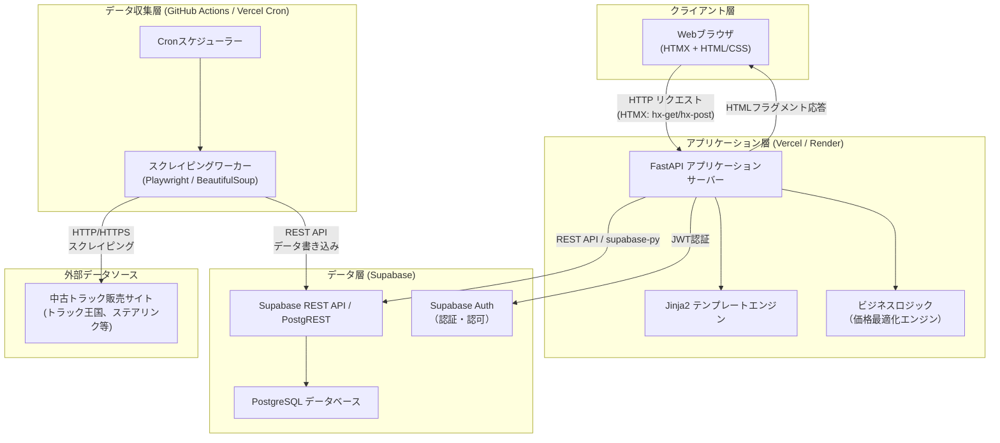

### 2.2 データフロー図

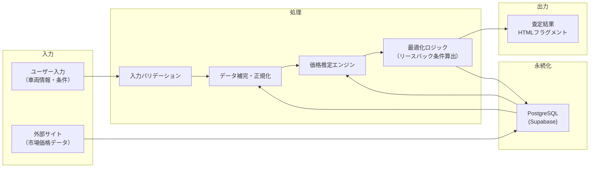

### 2.3 各コンポーネントの役割と通信方式

| コンポーネント | 役割 | 通信方式 | 技術要素 |
|---|---|---|---|
| **Webブラウザ (HTMX)** | ユーザーインタフェース。ページ遷移なしで部分更新を実現 | HTTP (hx-get, hx-post, hx-put, hx-delete) | HTMX 2.x, HTML5, CSS3 |
| **FastAPI サーバー** | APIエンドポイント提供、ルーティング、認証処理、テンプレートレンダリング | HTTPレスポンス（HTMLフラグメント / JSON） | Python 3.11+, FastAPI, Uvicorn |
| **Jinja2 テンプレート** | サーバーサイドでHTMLを生成。フルページおよび部分テンプレートを管理 | FastAPI内部呼び出し | Jinja2 (fastapi.templating) |
| **価格最適化エンジン** | 市場データと車両情報を基にリースバック価格を算出 | FastAPI内部のPythonモジュール呼び出し | NumPy, Pandas（必要に応じて） |
| **スクレイピングワーカー** | 外部サイトから中古車市場価格を定期収集 | HTTPS（対外部サイト）、Supabase REST API（対DB） | Playwright, BeautifulSoup4 |
| **Cronスケジューラー** | スクレイピングジョブの定時実行を管理 | GitHub Actions ワークフロー / Vercel Cron | YAML定義のスケジュール |
| **Supabase (PostgreSQL)** | 全データの永続化、RLSによるアクセス制御 | PostgREST (REST API) / supabase-py | PostgreSQL 15, PostgREST |
| **Supabase Auth** | ユーザー認証・セッション管理 | JWT トークン | Supabase Auth (GoTrue) |

### 2.4 HTMX と FastAPI の連携パターン（HTML over the Wire）

本システムでは SPA フレームワーク（React/Vue等）を採用せず、HTMX による「HTML over the Wire」パターンを全面的に採用する。

#### 基本的なリクエスト・レスポンスフロー

```
ブラウザ                          FastAPI サーバー
  |                                    |
  |  hx-get="/vehicles/123/estimate"   |
  | ---------------------------------> |
  |                                    | 1. リクエスト受信
  |                                    | 2. Supabaseからデータ取得
  |                                    | 3. 価格最適化ロジック実行
  |                                    | 4. Jinja2で部分テンプレート描画
  |  <div id="result">...</div>        |
  | <--------------------------------- |
  | 5. #result 要素を差し替え           |
```

#### 主要な連携パターン一覧

| パターン | HTMX属性 | FastAPI側の処理 | 用途 |
|---|---|---|---|
| **部分更新** | `hx-get` + `hx-target` + `hx-swap="innerHTML"` | `TemplateResponse` で部分テンプレートを返却 | 査定結果の表示、一覧の絞り込み |
| **フォーム送信** | `hx-post` + `hx-target` | バリデーション後、成功時は結果HTML、失敗時はエラー付きフォームHTMLを返却 | 車両情報登録、条件入力 |
| **インライン編集** | `hx-put` + `hx-swap="outerHTML"` | 更新後の行HTMLを返却 | リースバック条件の修正 |
| **リアルタイム検索** | `hx-get` + `hx-trigger="keyup changed delay:300ms"` | クエリパラメータで検索し結果リストHTMLを返却 | 車両型式の検索・絞り込み |

#### テンプレート構成方針

```
templates/
├── base.html                    # 共通レイアウト（ヘッダ・フッタ・HTMX読み込み）
├── pages/
│   ├── dashboard.html           # ダッシュボード（フルページ）
│   ├── simulation.html          # シミュレーション画面（フルページ）
│   └── market_data.html         # 相場データ一覧（フルページ）
└── fragments/
    ├── _vehicle_list.html       # 車両一覧テーブル（部分更新用）
    ├── _estimate_result.html    # 査定結果（部分更新用）
    ├── _vehicle_form.html       # 車両入力フォーム（部分更新用）
    └── _toast.html              # 通知トースト（部分更新用）
```

### 2.5 デプロイ構成図

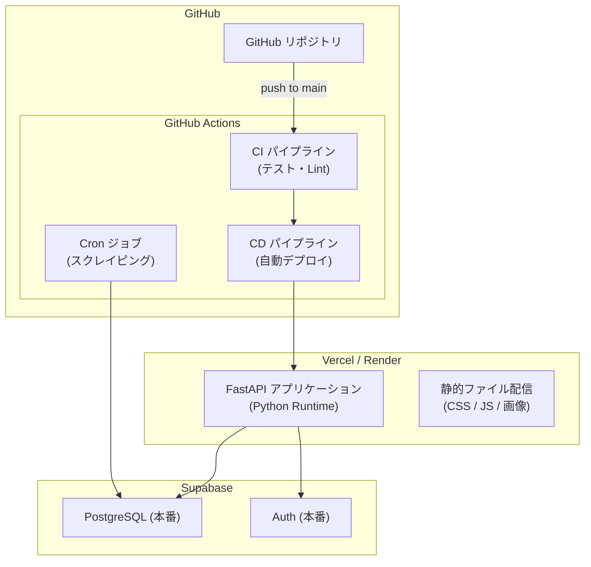

---

## 3. 機能要件一覧

### 3.1 機能要件サマリ

| ID | 機能名 | カテゴリ | 優先度 | 概要 |
|---|---|---|---|---|
| FR-001 | シミュレーション入力 | シミュレーション | 必須 | 車両情報・契約条件を入力し、リースバック価格を試算する |
| FR-002 | シミュレーション計算エンジン | シミュレーション | 必須 | 入力データと市場相場から上限買取価格・月額リース料等を算出する |
| FR-003 | シミュレーション結果表示 | シミュレーション | 必須 | 計算結果を一覧・グラフで表示する |
| FR-004 | シミュレーション履歴管理 | シミュレーション | 必須 | 過去のシミュレーション結果を保存・参照・比較する |
| FR-005 | 市場データスクレイピング実行 | スクレイピング | 必須 | 中古トラック販売サイトから価格・スペック情報を自動取得する |
| FR-006 | スクレイピングスケジュール管理 | スクレイピング | 必須 | 定期実行スケジュールの設定・変更・停止を行う |
| FR-007 | スクレイピングデータクレンジング | スクレイピング | 必須 | 取得した生データを正規化・重複排除し、マスタへ反映する |
| FR-008 | スクレイピング実行ログ管理 | スクレイピング | 高 | 実行結果・エラー・取得件数を記録し、閲覧する |
| FR-009 | 相場マスタ閲覧・検索 | マスタ管理 | 必須 | 蓄積された相場データをメーカー・車種・年式等で検索・閲覧する |
| FR-010 | 相場マスタ登録 | マスタ管理 | 必須 | 手動での相場データ新規登録を行う |
| FR-011 | 相場マスタ更新 | マスタ管理 | 必須 | 既存の相場データを編集・更新する |
| FR-012 | 相場マスタ削除 | マスタ管理 | 必須 | 不要な相場データを論理削除する |
| FR-013 | 相場マスタCSVインポート/エクスポート | マスタ管理 | 高 | 相場データのCSV一括取込・出力を行う |
| FR-014 | 車両マスタ管理 | マスタ管理 | 必須 | メーカー・車種・型式等の車両基本情報を管理する |
| FR-015 | 架装オプションマスタ管理 | マスタ管理 | 必須 | 架装種別とその価値係数を管理する |

### 3.2 シミュレーション入力項目一覧

| # | 項目名 | 論理名 | データ型 | 必須 | 制約・補足 |
|---|---|---|---|---|---|
| 1 | 車両メーカー | maker | string | ○ | マスタ選択（日野・いすゞ・三菱ふそう・UDトラックス等） |
| 2 | 車種 | model | string | ○ | メーカーに紐づくマスタ選択 |
| 3 | 型式 | model_code | string | − | 任意入力 |
| 4 | 年式（初度登録年月） | registration_year_month | string (YYYY-MM) | ○ | 西暦年月 |
| 5 | 走行距離 | mileage_km | integer | ○ | 単位：km |
| 6 | 取得価格（購入時価格） | acquisition_price | integer | ○ | 単位：円（税抜） |
| 7 | 帳簿価格（現在簿価） | book_value | integer | ○ | 単位：円 |
| 8 | 車両クラス | vehicle_class | string | ○ | 小型・中型・大型・特大型 |
| 9 | 積載量 | payload_ton | decimal | − | 単位：トン |
| 10 | 架装オプション種別 | body_type | string | ○ | マスタ選択（平ボディ・バン・ウイング・冷凍冷蔵・ダンプ等） |
| 11 | 架装オプション価値 | body_option_value | integer | − | 単位：円（架装部分の残存価値見込み） |
| 12 | 目標利回り（年率） | target_yield_rate | decimal | ○ | 単位：%（例：5.0） |
| 13 | リース期間 | lease_term_months | integer | ○ | 単位：月（12・24・36・48・60から選択） |
| 14 | 残価率 | residual_rate | decimal | − | 未入力時は市場相場から自動算出 |
| 15 | 保険料月額 | insurance_monthly | integer | − | 未入力時はデフォルト値を適用 |
| 16 | メンテナンス費月額 | maintenance_monthly | integer | − | 未入力時はデフォルト値を適用 |
| 17 | 備考 | remarks | string | − | 自由記述（最大500文字） |

### 3.3 シミュレーション出力項目一覧

| # | 項目名 | 論理名 | データ型 | 説明 |
|---|---|---|---|---|
| 1 | 上限買取価格 | max_purchase_price | integer | 目標利回りを満たす買取上限額（円） |
| 2 | 推奨買取価格 | recommended_purchase_price | integer | 市場相場を考慮した推奨買取額（円） |
| 3 | 想定残価（リース満了時） | estimated_residual_value | integer | リース期間終了時の推定車両価値（円） |
| 4 | 残価率 | residual_rate_result | decimal | 取得価格に対する残価の割合（%） |
| 5 | 月額リース料 | monthly_lease_fee | integer | 算出された月額リース料（円） |
| 6 | リース料総額 | total_lease_fee | integer | 全リース期間の合計支払額（円） |
| 7 | 損益分岐点 | breakeven_months | integer | 投資回収に必要な最低月数 |
| 8 | 実質利回り | effective_yield_rate | decimal | 実際の期待利回り（%） |
| 9 | 市場相場中央値 | market_median_price | integer | 同条件車両の市場中央値（円） |
| 10 | 市場相場件数 | market_sample_count | integer | 相場算出に使用したサンプル数 |
| 11 | 相場乖離率 | market_deviation_rate | decimal | 買取価格と市場相場の乖離（%） |
| 12 | 判定結果 | assessment | string | 推奨・要検討・非推奨の3段階判定 |

### 3.4 APIエンドポイント一覧

#### シミュレーション API

| HTTPメソッド | パス | 概要 |
|---|---|---|
| `POST` | `/api/v1/simulations` | シミュレーション実行 |
| `GET` | `/api/v1/simulations` | シミュレーション履歴一覧取得 |
| `GET` | `/api/v1/simulations/{simulation_id}` | シミュレーション結果詳細取得 |
| `DELETE` | `/api/v1/simulations/{simulation_id}` | シミュレーション履歴削除 |
| `GET` | `/api/v1/simulations/{simulation_id}/pdf` | シミュレーション結果PDF出力 |
| `POST` | `/api/v1/simulations/compare` | シミュレーション結果比較 |

#### スクレイピング API

| HTTPメソッド | パス | 概要 |
|---|---|---|
| `POST` | `/api/v1/scraping/execute` | スクレイピング即時実行 |
| `GET` | `/api/v1/scraping/jobs` | スクレイピングジョブ一覧取得 |
| `GET` | `/api/v1/scraping/jobs/{job_id}` | スクレイピングジョブ詳細取得 |
| `GET` | `/api/v1/scraping/logs` | 実行ログ一覧取得 |

#### 相場マスタ API

| HTTPメソッド | パス | 概要 |
|---|---|---|
| `GET` | `/api/v1/market-prices` | 相場データ検索・一覧取得 |
| `GET` | `/api/v1/market-prices/{id}` | 相場データ詳細取得 |
| `POST` | `/api/v1/market-prices` | 相場データ新規登録 |
| `PUT` | `/api/v1/market-prices/{id}` | 相場データ更新 |
| `DELETE` | `/api/v1/market-prices/{id}` | 相場データ削除（論理削除） |
| `POST` | `/api/v1/market-prices/import` | CSVインポート |
| `GET` | `/api/v1/market-prices/export` | CSVエクスポート |
| `GET` | `/api/v1/market-prices/statistics` | 相場統計情報取得 |

#### 車両・架装マスタ API

| HTTPメソッド | パス | 概要 |
|---|---|---|
| `GET` | `/api/v1/masters/makers` | メーカー一覧取得 |
| `POST` | `/api/v1/masters/makers` | メーカー登録 |
| `GET` | `/api/v1/masters/makers/{maker_id}/models` | 車種一覧取得 |
| `POST` | `/api/v1/masters/makers/{maker_id}/models` | 車種登録 |
| `GET` | `/api/v1/masters/body-types` | 架装種別一覧取得 |
| `POST` | `/api/v1/masters/body-types` | 架装種別登録 |
| `PUT` | `/api/v1/masters/body-types/{id}` | 架装種別更新 |

#### 共通レスポンス仕様

**正常時:**
```json
{
  "status": "success",
  "data": { ... },
  "meta": { "total_count": 150, "page": 1, "per_page": 20, "total_pages": 8 }
}
```

**エラー時:**
```json
{
  "status": "error",
  "error": {
    "code": "VALIDATION_ERROR",
    "message": "入力値が不正です",
    "details": [{ "field": "mileage_km", "message": "走行距離は0以上の整数で入力してください" }]
  }
}
```

---

## 4. 画面遷移とUI設計要件

### 4.1 画面一覧

| 画面ID | 画面名 | URL | 認証要否 |
|--------|--------|-----|----------|
| SCR-001 | ログイン画面 | `/login` | 不要 |
| SCR-002 | ダッシュボード | `/dashboard` | 必要 |
| SCR-003 | シミュレーション入力画面 | `/simulation/new` | 必要 |
| SCR-004 | シミュレーション結果画面 | `/simulation/{id}/result` | 必要 |
| SCR-005 | 相場データ一覧画面 | `/market-data` | 必要 |
| SCR-006 | 相場データ詳細画面 | `/market-data/{id}` | 必要 |

### 4.2 画面遷移図

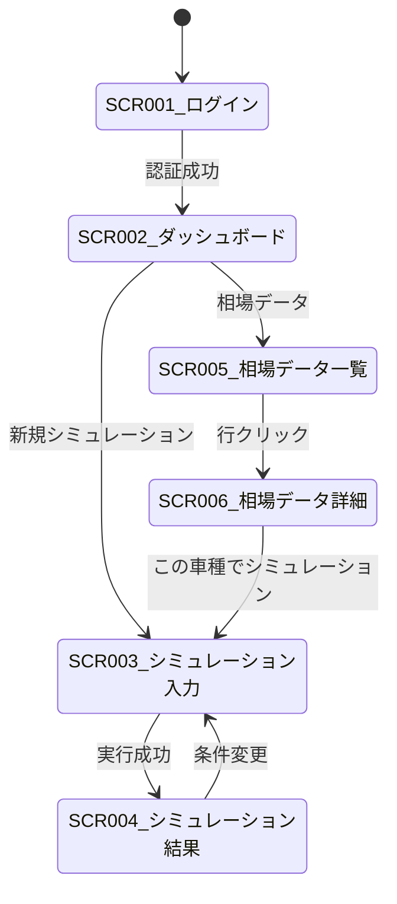

### 4.3 HTMXの活用パターン体系

| パターン名 | 使用属性 | 適用場面 |
|------------|----------|----------|
| 全画面遷移 | `HX-Redirect` ヘッダ（サーバー側） | ログイン成功、シミュレーション実行成功 |
| フォーム送信→部分更新 | `hx-post`, `hx-target`, `hx-swap="innerHTML"` | ログインエラー表示、保存結果表示 |
| 動的フィルタリング | `hx-get`, `hx-trigger="change"`, `hx-include` | 相場データ絞り込み、プルダウン連動 |
| インラインバリデーション | `hx-post`, `hx-trigger="blur changed"`, `hx-target` | 入力値の即時検証 |
| 遅延検索 | `hx-trigger="keyup changed delay:400ms"` | キーワードによるインクリメンタルサーチ |
| ページネーション | `hx-get`, `hx-target`, `hx-push-url` | テーブルのページ送り |
| タブ切替 | `hx-get`, `hx-target`, `hx-swap="innerHTML"` | シナリオ切替、グラフ期間切替 |
| 定期ポーリング | `hx-trigger="every 60s"` | ダッシュボードKPI自動更新 |
| 確認ダイアログ | `hx-confirm` | 保存前確認 |
| 操作中状態表示 | `hx-indicator`, `hx-disabled-elt` | 送信中スピナー、ボタン無効化 |

### 4.4 HTMX連動の具体例

#### メーカー→車種プルダウン連動

```html
<select name="maker"
        hx-get="/api/models"
        hx-target="#model-select"
        hx-swap="innerHTML"
        hx-trigger="change">
    <option value="">選択してください</option>
    <option value="hino">日野</option>
    <option value="isuzu">いすゞ</option>
</select>
<select name="model" id="model-select">
    <option value="">メーカーを先に選択</option>
</select>
```

#### 相場データフィルタリング

```html
<input type="text" name="keyword"
       hx-get="/market-data/table"
       hx-target="#data-table-wrapper"
       hx-swap="innerHTML"
       hx-trigger="keyup changed delay:400ms"
       hx-include="#filter-form"
       hx-indicator="#search-spinner"
       placeholder="キーワード検索">
```

### 4.5 グラフ表示 — Chart.js 4.x

| 画面 | グラフ種別 | X軸 | Y軸 | 用途 |
|------|----------|-----|-----|------|
| SCR-004 結果画面 | 折れ線（マルチライン） | リース期間（月） | 金額（円） | 資産価値 vs 累積リース料回収 |
| SCR-006 相場詳細 | 折れ線 + 範囲バンド | 月次 | 価格（万円） | 相場推移と信頼区間 |
| SCR-002 ダッシュボード | 棒グラフ | 月次 | 査定件数 | 月別処理件数推移 |

HTMX部分更新時は `htmx:afterSettle` イベントでChart.jsインスタンスを再生成する。サーバーはJinja2の `{{ data | tojson }}` フィルタでチャートデータをHTMLフラグメントに埋め込む。

### 4.6 レスポンシブ対応

| ブレークポイント | 幅 | レイアウト |
|------|----|---------|
| モバイル | 0 - 767px | 1カラム、ナビはハンバーガーメニュー |
| タブレット | 768px - 1023px | 1カラム、ナビは折りたたみサイドバー |
| デスクトップ | 1024px+ | 2カラム（ナビ + メイン） |

---

## 5. 計算ロジックの定義

### 5.1 買取上限価格の算出

#### 5.1.1 基本計算式

```
max_purchase_price = base_market_price × condition_factor × trend_factor × (1 - safety_margin_rate)
```

| 変数名 | 説明 | 型 | 単位 |
|---|---|---|---|
| `base_market_price` | 基準市場価格 | float | 円 |
| `condition_factor` | 車両状態係数 | float | 0.0 - 1.0 |
| `trend_factor` | 市場トレンド係数 | float | 0.5 - 1.5 |
| `safety_margin_rate` | 安全マージン率 | float | 0.0 - 1.0 |

#### 5.1.2 基準市場価格の決定

```
deviation_rate = abs(auction_price - retail_price) / retail_price

if deviation_rate <= acceptable_deviation_threshold:
    base_market_price = auction_price × auction_weight + retail_price × (1 - auction_weight)
else:
    base_market_price = auction_price × elevated_auction_weight + retail_price × (1 - elevated_auction_weight)
```

| 変数名 | デフォルト値 |
|---|---|
| `acceptable_deviation_threshold` | 0.15（15%） |
| `auction_weight` | 0.70 |
| `elevated_auction_weight` | 0.85 |

#### 5.1.3 車両状態係数

```
condition_factor = Σ(item_score_i × item_weight_i) / Σ(item_weight_i)
```

| 評価項目 | ウェイト |
|---|---|
| 外装状態 | 0.15 |
| 内装状態 | 0.10 |
| エンジン・駆動系 | 0.30 |
| フレーム・シャシー | 0.25 |
| 車検残期間 | 0.10 |
| 事故歴 | 0.10 |

#### 5.1.4 市場トレンド係数

```
recent_avg = mean(auction_prices[-30日:])
baseline_avg = mean(auction_prices[-180日:])
raw_trend = recent_avg / baseline_avg
trend_factor = max(0.80, min(raw_trend, 1.20))
```

#### 5.1.5 安全マージン

```
price_volatility = std(auction_prices[-90日:]) / mean(auction_prices[-90日:])
safety_margin_rate = base_safety_margin + volatility_premium × price_volatility
safety_margin_rate = max(0.03, min(safety_margin_rate, 0.20))
```

車種カテゴリ別 `base_safety_margin`:

| 車種 | base_safety_margin |
|---|---|
| 小型トラック | 0.05 |
| 中型トラック | 0.05 |
| 大型トラック | 0.07 |
| トレーラーヘッド | 0.08 |
| 特装車 | 0.10 |

### 5.2 残価（将来価値）予測

#### 5.2.1 法定耐用年数

| 車両区分 | 法定耐用年数 | 経済的耐用年数 |
|---|---|---|
| 大型トラック | 5年 | 10年 |
| 中型トラック | 4-5年 | 9年 |
| 小型トラック | 3年 | 7年 |
| ダンプ | 4年 | 8年 |
| トレーラーヘッド | 5年 | 10年 |
| 冷凍車 | 4年 | 8年 |

#### 5.2.2 定額法

```
annual_depreciation = (purchase_price - salvage_value) / useful_life_years
residual_value_sl = purchase_price - annual_depreciation × elapsed_years
```

#### 5.2.3 定率法（200%DB）

```
depreciation_rate = 1 / useful_life_years × 2.0
residual_value_db = purchase_price × (1 - depreciation_rate) ^ elapsed_years
```

#### 5.2.4 架装オプションの残価評価

架装の種類ごとの減価率テーブル（経過年数に対する残価率）:

| 架装種別 | 1年 | 3年 | 5年 | 7年 | 10年 |
|---|---|---|---|---|---|
| 平ボディ | 0.85 | 0.60 | 0.42 | 0.28 | 0.15 |
| バンボディ | 0.82 | 0.55 | 0.36 | 0.22 | 0.10 |
| ウイングボディ | 0.80 | 0.52 | 0.34 | 0.20 | 0.08 |
| 冷凍・冷蔵ユニット | 0.75 | 0.44 | 0.25 | 0.12 | 0.03 |
| ダンプ架装 | 0.88 | 0.67 | 0.50 | 0.36 | 0.20 |
| クレーン（ユニック） | 0.82 | 0.56 | 0.38 | 0.24 | 0.12 |
| テールゲートリフター | 0.78 | 0.46 | 0.26 | 0.14 | 0.05 |
| タンク（液体運搬） | 0.85 | 0.62 | 0.45 | 0.32 | 0.18 |

中間年数は線形補間で算出。

#### 5.2.5 走行距離による補正

```
expected_mileage = annual_standard_mileage × elapsed_years
mileage_deviation = (actual_mileage - expected_mileage) / expected_mileage
mileage_adjustment = 1 - penalty_rate × mileage_deviation
mileage_adjustment = max(0.70, min(mileage_adjustment, 1.10))
residual_value_adjusted = residual_value × mileage_adjustment
```

基準年間走行距離: 小型30,000km / 中型50,000km / 大型80,000km / トレーラーヘッド100,000km

### 5.3 月額リース料の算出

#### 5.3.1 構成要素

```
monthly_lease_payment = principal_recovery + interest_charge + management_fee + profit_margin
```

- **元本回収分**: `(purchase_price - residual_value) / lease_term_months`
- **金利分**: `(purchase_price + residual_value) / 2 × (annual_interest_rate / 12)`
- **管理費**: `purchase_price × 0.002 + 5,000`
- **利益マージン**: `subtotal × 0.08`

`annual_interest_rate = fund_cost_rate(2.0%) + credit_spread(1.5%) + liquidity_premium(0.5%)`

#### 5.3.2 目標利回りからの逆算

```
r = target_yield / 12  (月次利回り)

                  (PurchasePrice - ResidualValue / (1 + r)^LeaseTerm) × r
MonthlyPayment = ─────────────────────────────────────────────────────────
                              1 - (1 + r)^(-LeaseTerm)
```

### 5.4 損益シミュレーション

- **月次資産価値推移**: 減価償却モデルに基づく簿価の月次計算
- **累積リース料回収**: `cumulative_income[month] = monthly_payment × month`
- **損益分岐点**: `cumulative_income + current_residual >= purchase_price` となる最小月
- **中途解約損失**: `total_recovery(income + penalty + liquidation) - purchase_price`

### 5.5 パラメータ管理

全24パラメータを管理画面から調整可能とする。`operator`（営業担当者）権限と `admin`（管理者）権限に分類。変更履歴を全て保持し、案件の見積もり時点のスナップショットを保存する。

---

## 6. データベーススキーマ設計

### 6.1 テーブル一覧

| # | テーブル名 | 概要 |
|---|-----------|------|
| 1 | `users` | システム利用者（営業担当者） |
| 2 | `vehicle_categories` | 車種カテゴリマスタ |
| 3 | `manufacturers` | メーカーマスタ |
| 4 | `body_types` | 架装タイプマスタ |
| 5 | `vehicles` | スクレイピング取得車両相場データ |
| 6 | `depreciation_curves` | 車種別減価償却カーブ設定 |
| 7 | `simulations` | シミュレーション実行履歴 |
| 8 | `simulation_params` | シミュレーションパラメータ |
| 9 | `scraping_logs` | スクレイピング実行ログ |
| 10 | `funds` | ファンド（SPC）基本情報（10.9節参照） |
| 11 | `fund_investors` | ファンド×投資家の出資関連（10.9節参照） |
| 12 | `lease_contracts` | リース契約基本情報（10.9節参照） |
| 13 | `lease_payments` | リース支払いスケジュール＋実績（10.9節参照） |
| 14 | `secured_asset_blocks` | SAB — 車両資産ブロック（10.9節参照） |
| 15 | `fee_records` | 手数料・収益レコード（10.9節参照） |
| 16 | `fund_distributions` | 配当（分配）実績（10.9節参照） |

### 6.2 ER図

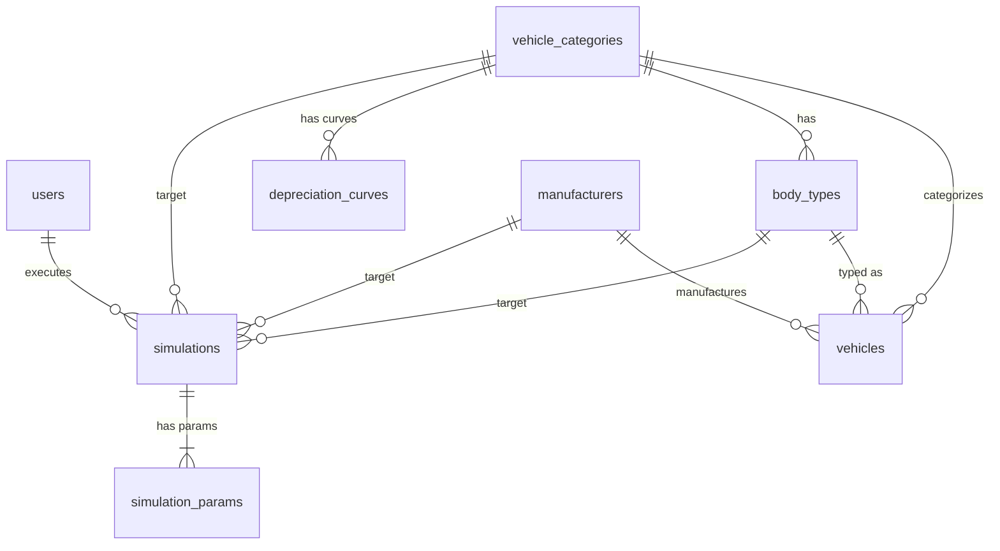

### 6.3 主要テーブル定義

#### `users`

| カラム名 | データ型 | NOT NULL | デフォルト | 説明 |
|----------|---------|----------|-----------|------|
| `id` | `uuid` | YES | `gen_random_uuid()` | PK。Supabase Auth の `auth.users.id` と同値 |
| `email` | `text` | YES | — | ログインメールアドレス（UNIQUE） |
| `full_name` | `text` | YES | — | 氏名 |
| `role` | `text` | YES | `'sales'` | `admin` / `sales` / `viewer` |
| `department` | `text` | NO | — | 所属部署 |
| `is_active` | `boolean` | YES | `true` | アカウント有効フラグ |
| `created_at` | `timestamptz` | YES | `now()` | 作成日時 |
| `updated_at` | `timestamptz` | YES | `now()` | 更新日時 |

#### `vehicles` — 車両相場データ

| カラム名 | データ型 | NOT NULL | 説明 |
|----------|---------|----------|------|
| `id` | `uuid` | YES | PK |
| `source_site` | `text` | YES | 取得元サイト識別子 |
| `source_url` | `text` | NO | 掲載ページURL |
| `source_id` | `text` | NO | サイト固有の物件ID |
| `category_id` | `uuid` | YES | FK → `vehicle_categories.id` |
| `manufacturer_id` | `uuid` | YES | FK → `manufacturers.id` |
| `body_type_id` | `uuid` | NO | FK → `body_types.id` |
| `model_name` | `text` | YES | 車種名・型式 |
| `model_year` | `integer` | NO | 年式（西暦） |
| `mileage_km` | `integer` | NO | 走行距離（km） |
| `price_yen` | `bigint` | NO | 掲載価格（円） |
| `tonnage` | `numeric(6,2)` | NO | 最大積載量（t） |
| `transmission` | `text` | NO | MT / AT / AMT |
| `scraped_at` | `timestamptz` | YES | スクレイピング取得日時 |
| `is_active` | `boolean` | YES | 有効フラグ |
| `created_at` | `timestamptz` | YES | 作成日時 |
| `updated_at` | `timestamptz` | YES | 更新日時 |

**UNIQUE制約**: `(source_site, source_id)`

**主要インデックス**: `(category_id, manufacturer_id, model_year, price_yen)` 複合インデックス

#### `simulations` — シミュレーション実行履歴

| カラム名 | データ型 | NOT NULL | 説明 |
|----------|---------|----------|------|
| `id` | `uuid` | YES | PK |
| `user_id` | `uuid` | YES | FK → `users.id` |
| `title` | `text` | NO | シミュレーション名称 |
| `category_id` | `uuid` | YES | FK → `vehicle_categories.id` |
| `manufacturer_id` | `uuid` | NO | FK → `manufacturers.id` |
| `body_type_id` | `uuid` | NO | FK → `body_types.id` |
| `target_model_name` | `text` | NO | 対象車種名 |
| `target_model_year` | `integer` | NO | 対象年式 |
| `purchase_price_yen` | `bigint` | NO | 買取提示価格（円） |
| `lease_monthly_yen` | `bigint` | NO | 月額リース料（円） |
| `lease_term_months` | `integer` | NO | リース期間（月） |
| `expected_yield_rate` | `numeric(6,4)` | NO | 想定利回り |
| `result_summary_json` | `jsonb` | NO | 計算結果の詳細 |
| `status` | `text` | YES | `draft` / `completed` / `approved` |
| `created_at` | `timestamptz` | YES | 作成日時 |
| `updated_at` | `timestamptz` | YES | 更新日時 |

### 6.4 Supabase RLS ポリシー設計

| テーブル | SELECT | INSERT | UPDATE | DELETE |
|---------|--------|--------|--------|--------|
| `users` | 自分自身。`admin`は全件 | `admin`のみ | 自分自身。`admin`は全件 | 不可 |
| `vehicle_categories` | 認証済み全員 | `admin`のみ | `admin`のみ | 不可 |
| `manufacturers` | 認証済み全員 | `admin`のみ | `admin`のみ | 不可 |
| `vehicles` | 認証済み全員 | `service_role`のみ | `service_role`のみ | 不可 |
| `simulations` | 自分の作成分。`admin`は全件 | 認証済み全員 | 自分の作成分のみ | 自分の`draft`のみ |
| `scraping_logs` | `admin`のみ | `service_role`のみ | `service_role`のみ | 不可 |

### 6.5 マイグレーション戦略

Supabase CLI（`supabase migration`）を使用し、SQL ベースのマイグレーションファイルで管理する。

```
supabase/migrations/
├── 20260401000000_create_users.sql
├── 20260401000001_create_master_tables.sql
├── 20260401000002_create_vehicles.sql
├── 20260401000003_create_depreciation_curves.sql
├── 20260401000004_create_simulations.sql
├── 20260401000005_create_scraping_logs.sql
├── 20260401000006_create_indexes.sql
├── 20260401000007_create_triggers.sql
├── 20260401000008_enable_rls.sql
├── 20260401000009_seed_master_data.sql
└── 20260406000000_create_fund_management.sql   ← ファンド(SPC)管理テーブル群
```

---

## 7. 外部データ収集（スクレイピング）仕様

### 7.1 対象サイトと取得項目

#### 対象サイト

| # | サイト名 | URL | 優先度 | レンダリング | 実装状況 |
|---|---|---|---|---|---|
| 1 | トラック王国 | https://www.truck-kingdom.com/ | 高 | SSR | **実装済** (`scraper/sites/truck_kingdom.py`) |
| 2 | ステアリンク | https://www.steerlink.co.jp/ | 高 | SSR | **実装済** (`scraper/sites/steerlink.py`) |
| 3 | グーネット商用車 | https://www.goo-net.com/truck/ | 中 | SSR + 部分CSR | 未実装 |
| 4 | トラックバンク | https://www.truckbank.net/ | 中 | SSR | 未実装 |
| 5 | IKR | https://www.ikr.co.jp/ | 低 | SSR | 未実装 |

#### 取得項目（全サイト共通スキーマ） -- 既存フィールド

| # | フィールド | 型 | 必須 | 説明 |
|---|---|---|---|---|
| 1 | `source_site` | VARCHAR(50) | Yes | 取得元サイト識別子 |
| 2 | `source_url` | TEXT | Yes | 車両詳細ページURL |
| 3 | `source_vehicle_id` | VARCHAR(100) | Yes | サイト固有ID |
| 4 | `maker` | VARCHAR(50) | Yes | メーカー名（正規化済み） |
| 5 | `model` | VARCHAR(100) | Yes | 車種名（正規化済み） |
| 6 | `body_type` | VARCHAR(50) | Yes | 架装種別（正規化済み） |
| 7 | `year` | INTEGER | Yes | 年式（西暦） |
| 8 | `mileage_km` | INTEGER | No | 走行距離（km） |
| 9 | `price_yen` | INTEGER | Yes | 車両本体価格（円） |
| 10 | `price_tax_included` | BOOLEAN | No | 税込表示か |
| 11 | `tonnage` | DECIMAL(4,1) | No | 最大積載量（t） |
| 12 | `location_prefecture` | VARCHAR(10) | No | 所在地 |
| 13 | `listing_status` | VARCHAR(20) | Yes | `active` / `sold` / `expired` |
| 14 | `scraped_at` | TIMESTAMPTZ | Yes | 取得日時 |

#### 新規取得項目（強化仕様）

| # | フィールド | 型 | 必須 | 説明 |
|---|---|---|---|---|
| 15 | `accident_history` | BOOLEAN | Yes | 事故歴の有無（`true` = 事故車 → rejection_path で除外） |
| 16 | `repair_history` | TEXT | No | 修復歴の詳細テキスト（「フレーム修正」「板金修復」等） |
| 17 | `option_power_gate` | JSONB | No | パワーゲート情報 `{"equipped": true, "estimated_value": 250000}` |
| 18 | `option_refrigerator` | JSONB | No | 冷凍冷蔵ユニット情報 `{"equipped": true, "type": "低温", "estimated_value": 800000}` |
| 19 | `option_crane` | JSONB | No | クレーン情報 `{"equipped": true, "capacity_ton": 2.9, "estimated_value": 1200000}` |
| 20 | `b2b_estimated_price` | INTEGER | No | B2B推定卸売価格（円） |
| 21 | `data_quality_score` | FLOAT | No | データ品質スコア（0.0〜1.0） |
| 22 | `data_freshness_hours` | FLOAT | No | データ鮮度（最終スクレイピングからの経過時間） |
| 23 | `price_confidence` | VARCHAR(10) | No | 価格信頼度 `high` / `medium` / `low` |

### 7.2 データクレンジング仕様

#### 価格変換

| 入力パターン | 出力 |
|---|---|
| `450万円` | 4,500,000円 |
| `1,234万円` | 12,340,000円 |
| `4,500,000円` | 4,500,000円 |
| `ASK` / `応談` | NULL（`listing_status = 'ask'`） |

#### 走行距離変換

| 入力パターン | 出力 |
|---|---|
| `18.5万km` | 185,000km |
| `185,000km` | 185,000km |
| `不明` / `-` | NULL |

#### 年式変換（和暦→西暦）

| 元号 | 加算値 |
|---|---|
| 令和 (R) | +2018 |
| 平成 (H) | +1988 |
| 昭和 (S) | +1925 |

#### 表記ゆれ正規化マッピング例

- **メーカー**: `いすず`/`ISUZU` → `いすゞ`、`日産ディーゼル`/`UD` → `UDトラックス`（`scraper/utils.py` `MAKER_MAP` で実装済み）
- **架装**: `ウィング`/`アルミウイング` → `ウイング`、`冷凍車`/`冷蔵車` → `冷凍冷蔵`（`BODY_TYPE_MAP` で実装済み）
- **全角→半角変換**、前後空白除去を全フィールドに適用（`zenkaku_to_hankaku()` / `clean_text()` で実装済み）

#### 異常値検出ルール

| 条件 | 処理 |
|---|---|
| `price_yen <= 0` | レコード除外 |
| `price_yen > 100,000,000` | 除外 + アラート |
| `mileage_km < 0` or `> 2,000,000` | レコード除外 |
| `year < 1980` or `> current_year + 1` | レコード除外 |
| 同一車両で前回比 ±70% 以上の価格変動 | `price_anomaly_flag = true` 付与 |

### 7.3 スクレイピングエンジン強化仕様

> **ピッチデック準拠**: "Autonomous Scraping Engines Power Real-Time Market Intelligence"
> パイプライン: Raw Ingestion → Filter Engine → Structured Database
> 目標精度: 0.1%精度の精密査定を支える「Pristine, structured training data」の供給

#### 7.3.1 事故車フィルタリング（Rejection Path）

ピッチデック Page 6 の「REJECTION PATH: Accident vehicles DISCARDED」に基づき、事故車・修復歴車をパイプラインの早期段階で完全除外する。

##### 検出パターン辞書

`scraper/filters.py` に `ACCIDENT_KEYWORDS` として以下を定義する:

```python
ACCIDENT_KEYWORDS: list[str] = [
    # 直接的な事故歴表記
    "事故車", "事故歴あり", "事故あり",
    # 修復歴表記
    "修復歴あり", "修復歴有", "修復歴有り",
    # フレーム損傷関連
    "フレーム修正", "フレーム歪み", "フレーム交換",
    "フレーム修復", "フレーム損傷",
    # 構造的修復
    "骨格修正", "骨格部位修正", "ピラー修正",
    "ルーフ修正", "フロア修正", "ダッシュパネル修正",
    "クロスメンバー修正", "サイドメンバー修正",
    # 冠水・水没
    "冠水", "水没", "水害車",
    # 全損関連
    "全損", "修復車",
]

# 修復歴「なし」を明示する表記（フィルタ除外の判定に使用）
ACCIDENT_CLEAR_KEYWORDS: list[str] = [
    "修復歴なし", "修復歴無し", "修復歴無",
    "事故歴なし", "事故歴無し", "事故歴無",
    "無事故",
]
```

##### 検出ロジック

```
入力: 車両詳細ページの全テキスト + スペック表の「修復歴」フィールド

1. スペック表に「修復歴」項目がある場合:
   - 値が ACCIDENT_CLEAR_KEYWORDS に該当 → accident_history = false
   - 値が ACCIDENT_KEYWORDS に該当 → accident_history = true → REJECT
   - 値が「あり」のみ → accident_history = true → REJECT

2. スペック表に項目がない場合:
   - タイトル・説明文を ACCIDENT_KEYWORDS で全文検索
   - マッチあり → accident_history = true → REJECT

3. 判定不能の場合:
   - accident_history = null（除外はしない。data_quality_score を減点）
```

##### フィルタリングログ

`VehicleParser.parse()` メソッド内で事故車除外を実行し、以下をログに記録する:

| ログフィールド | 型 | 内容 |
|---|---|---|
| `filter_action` | VARCHAR(20) | `rejected` / `passed` / `unknown` |
| `filter_reason` | TEXT | マッチしたキーワード（例: `"修復歴あり"` ） |
| `filter_source_field` | VARCHAR(50) | 検出元フィールド（例: `"spec_table.修復歴"` / `"description"` ） |
| `filtered_at` | TIMESTAMPTZ | フィルタリング実行日時 |

##### 実装箇所

| ファイル | 変更内容 |
|---|---|
| `scraper/filters.py` | **新規作成**: `ACCIDENT_KEYWORDS`, `ACCIDENT_CLEAR_KEYWORDS` 定数、`detect_accident_history(specs, description)` 関数 |
| `scraper/parsers/vehicle_parser.py` | `_build_record()` 内で `detect_accident_history()` を呼び出し、`accident_history=true` の場合は `_validate()` で除外 |
| `scraper/sites/truck_kingdom.py` | 詳細ページの `field_map` に `"修復歴": "repair_history"`, `"事故歴": "accident_history_text"` を追加 |
| `scraper/sites/steerlink.py` | 同上 |
| `scraper/scheduler.py` | `stats` に `rejected_accident_vehicles` カウンタを追加 |

##### データベース変更

```sql
-- Migration: add_accident_filtering_columns
ALTER TABLE public.vehicles
  ADD COLUMN accident_history  boolean,
  ADD COLUMN repair_history    text;

-- フィルタリングログテーブル
CREATE TABLE public.vehicle_filter_logs (
  id                uuid        PRIMARY KEY DEFAULT gen_random_uuid(),
  source_site       text        NOT NULL,
  source_id         text        NOT NULL,
  filter_action     text        NOT NULL,  -- 'rejected' / 'passed' / 'unknown'
  filter_reason     text,
  filter_source_field text,
  raw_data_snapshot jsonb,
  filtered_at       timestamptz NOT NULL DEFAULT now()
);

CREATE INDEX idx_filter_logs_action ON public.vehicle_filter_logs (filter_action);
CREATE INDEX idx_filter_logs_site   ON public.vehicle_filter_logs (source_site, filtered_at DESC);
```

#### 7.3.2 B2Bオークション価格の取得と推定

##### B2B卸売相場の定義

| 用語 | 定義 | 本システムでの扱い |
|---|---|---|
| **小売価格（店頭価格）** | エンドユーザー向けの販売価格。現在スクレイピングで取得している `price_yen` | `vehicles.price_yen` |
| **B2B卸売価格（業者間相場 / ボカ）** | 業者間オークション・卸売市場での取引価格。小売価格より構造的に低い | `vehicles.b2b_estimated_price` |
| **乖離率** | `(小売価格 - B2B価格) / 小売価格` | 車種・年式・架装別にテーブル管理 |

##### オークション結果データの取得戦略

```
Phase 1（即時対応 -- 小売価格からの推定）:
  → 小売価格 x (1 - 乖離率) = B2B推定価格
  → 乖離率テーブルは業界ヒアリング + 過去取引実績から初期設定

Phase 2（中期 -- オークションデータの直接取得）:
  → トラック業者間オークションサイトの結果データAPI連携
  → USS、HAA、TAA等の落札結果データの定期インポート
  → CSV/API経由での業者間卸売データの取り込みパイプライン構築

Phase 3（長期 -- 機械学習による推定精度向上）:
  → Phase 2で蓄積した実績データを教師データとして
  → 小売価格 → B2B価格の回帰モデルを構築
  → 車種・年式・走行距離・架装・地域を特徴量に使用
```

##### 小売価格→B2B価格 乖離率テーブル（Phase 1 初期値）

`b2b_discount_rates` マスタテーブルとして管理:

| 架装種別 | 車齢 0-3年 | 車齢 4-7年 | 車齢 8-12年 | 車齢 13年以上 |
|---|---|---|---|---|
| 平ボディ | 15% | 18% | 22% | 28% |
| ウイング | 16% | 20% | 25% | 30% |
| 冷凍車 | 18% | 22% | 28% | 35% |
| ダンプ | 12% | 15% | 20% | 25% |
| クレーン | 17% | 21% | 27% | 33% |
| トラクタ | 14% | 18% | 23% | 29% |
| バン | 15% | 19% | 24% | 30% |

**計算式**: `b2b_estimated_price = price_yen * (1 - discount_rate)`

**走行距離補正**: 年間標準走行距離（`ResidualValueCalculator._ANNUAL_MILEAGE_NORM`）からの乖離に応じて乖離率を補正:
- 標準の1.5倍以上の走行距離 → 乖離率 +3%
- 標準の0.5倍以下の走行距離 → 乖離率 -2%

##### 実装箇所

| ファイル | 変更内容 |
|---|---|
| `scraper/b2b_pricing.py` | **新規作成**: `estimate_b2b_price(price_yen, body_type, vehicle_age, mileage_km)` 関数 |
| `scraper/parsers/vehicle_parser.py` | `_build_record()` 内でB2B推定価格を自動計算 |
| `app/core/pricing.py` | `PricingEngine` の `auction_weight` パラメータで `b2b_estimated_price` を参照 |

##### データベース変更

```sql
-- B2B推定価格カラム追加
ALTER TABLE public.vehicles
  ADD COLUMN b2b_estimated_price bigint;

-- B2B乖離率マスタ
CREATE TABLE public.b2b_discount_rates (
  id             uuid        PRIMARY KEY DEFAULT gen_random_uuid(),
  body_type      text        NOT NULL,
  age_from_years int         NOT NULL,
  age_to_years   int         NOT NULL,
  discount_rate  numeric(5,4) NOT NULL,  -- 例: 0.1800
  mileage_adjustment_high numeric(5,4) DEFAULT 0.0300,
  mileage_adjustment_low  numeric(5,4) DEFAULT -0.0200,
  effective_from timestamptz NOT NULL DEFAULT now(),
  effective_to   timestamptz,
  created_at     timestamptz NOT NULL DEFAULT now(),
  CONSTRAINT chk_discount_rate CHECK (discount_rate BETWEEN 0 AND 1)
);

CREATE INDEX idx_b2b_discount_body_age
  ON public.b2b_discount_rates (body_type, age_from_years, age_to_years)
  WHERE effective_to IS NULL;
```

#### 7.3.3 リアルタイム性の向上（24/7監視体制）

ピッチデック Page 6 の「Automated Playwright scrapers monitor major portals 24/7 to capture live market pricing」に準拠し、現行の日次バッチから準リアルタイム監視体制へ移行する。

##### アーキテクチャ移行ロードマップ

```
【現状】日次バッチ（1日1回、03:00 JST）
  +-- BaseScraper.run() → ScraperScheduler.run_site() → DB Upsert
  +-- GitHub Actions Cron トリガー

【Phase 1】高頻度バッチ（4時間間隔）
  +-- scrape_full:     03:00 / 09:00 / 15:00 / 21:00
  +-- scrape_price_check: 06:00 / 12:00 / 18:00 / 00:00
  +-- 既存アーキテクチャの延長で実装可能

【Phase 2】イベント駆動型（準リアルタイム）
  +-- 常駐ワーカープロセス（1サイトあたり1ワーカー）
  +-- Playwright Persistent Context によるセッション維持
  +-- 新着検出 → 即時詳細スクレイピング → DB Upsert → WebSocket通知
  +-- インフラ: Railway / Fly.io 等の常時起動ワーカー

【Phase 3】完全リアルタイム
  +-- WebSocket / SSE によるフロントエンドへのプッシュ配信
  +-- 価格変動イベントストリーミング
```

##### Phase 1 実装詳細（即時対応）

`scheduler.py` のバッチスケジュールを拡張:

| ジョブ名 | 頻度 | 時刻 (JST) | 内容 | 推定時間 |
|---|---|---|---|---|
| `scrape_full` | 4回/日 | 03:00, 09:00, 15:00, 21:00 | 全サイト一覧取得 | 60-90分 |
| `scrape_price_check` | 4回/日 | 06:00, 12:00, 18:00, 00:00 | 既存Active車両の価格変動チェック | 30-60分 |
| `scrape_weekly_deep` | 毎週日曜 | 02:00 | 全サイト詳細ページ含む完全取得 | 3-5時間 |
| `scrape_new_listings` | **毎時** | 毎正時 | 新着車両のみ差分取得（1ページ目のみ） | 5-10分 |

##### 価格変動検知と即時アラート

```python
# scraper/alerts.py（新規ファイル）

@dataclass
class PriceChangeAlert:
    source_site: str
    source_id: str
    maker: str
    model_name: str
    old_price: int
    new_price: int
    change_pct: float          # (new - old) / old
    alert_level: str           # "info" / "warning" / "critical"
    detected_at: datetime

ALERT_THRESHOLDS = {
    "info":     0.05,   # 5%以上の変動
    "warning":  0.15,   # 15%以上の変動
    "critical": 0.30,   # 30%以上の変動（異常値の可能性）
}
```

アラート配信先:

| 配信先 | トリガー | 実装方法 |
|---|---|---|
| `vehicle_price_history` テーブル | 全価格変動 | 既存の `_upsert_vehicle()` で実装済み |
| Slack Webhook | `warning` 以上 | `scraper/alerts.py` → `httpx.post()` |
| ダッシュボード通知 | `info` 以上 | Supabase Realtime → フロントエンド |

##### データ鮮度インジケーター

各車両レコードに対してデータ鮮度を計算し、フロントエンドで視覚的に表示する:

| 鮮度ランク | 条件 | 表示色 | LTV計算への影響 |
|---|---|---|---|
| **Fresh** | 最終スクレイピングから 6時間以内 | 緑 | 信頼度 1.0 |
| **Recent** | 6〜24時間以内 | 黄緑 | 信頼度 0.95 |
| **Aging** | 24〜72時間以内 | 黄 | 信頼度 0.85 |
| **Stale** | 72時間〜7日 | 橙 | 信頼度 0.70 |
| **Expired** | 7日以上 | 赤 | 信頼度 0.50（要再取得） |

```sql
-- 鮮度計算用のgenerated column（PostgreSQL 12+）
ALTER TABLE public.vehicles
  ADD COLUMN data_freshness_hours numeric
    GENERATED ALWAYS AS (
      EXTRACT(EPOCH FROM (now() - scraped_at)) / 3600.0
    ) STORED;
```

#### 7.3.4 LTV計算用データ品質保証

ピッチデック Page 9 の「0.1% accuracy」を達成するため、スクレイピングデータがLTV（Loan-to-Value）計算エンジン（`app/core/pricing.py` `PricingEngine`）に供給される前に、統計的品質基準を満たすことを保証する。

##### データ品質スコアリング

各車両レコードに対して 0.0〜1.0 のデータ品質スコアを算出する:

```python
# scraper/quality.py（新規ファイル）

def calculate_data_quality_score(record: dict) -> float:
    """
    品質スコア = 完全性スコア x 正確性スコア x 鮮度スコア

    各スコアは 0.0〜1.0 の範囲
    """
    completeness = _score_completeness(record)
    accuracy     = _score_accuracy(record)
    freshness    = _score_freshness(record)

    return round(completeness * accuracy * freshness, 4)
```

| 品質軸 | 評価項目 | 計算方法 |
|---|---|---|
| **完全性** (Completeness) | 必須フィールドの充足率 | 充足フィールド数 / 全必須フィールド数。`accident_history` が `null` なら -0.1 |
| **正確性** (Accuracy) | フィールド値の妥当性 | 年式・価格・走行距離が合理的範囲内か。正規化マッピングにヒットしたか |
| **鮮度** (Freshness) | データの新しさ | 鮮度ランク表に基づく信頼度係数 |

##### 統計的有意性の検証

LTV計算時に参照する市場価格データが統計的に信頼できることを保証する:

| パラメータ | 条件 | 不足時の処理 |
|---|---|---|
| **最低サンプル数** | 同一車種（メーカー + モデル + 架装 + 車齢帯）の Active レコード **最低 5件** | `price_confidence = 'low'`。LTV計算時に安全マージン +5% |
| **推奨サンプル数** | 同一車種 **10件以上** | `price_confidence = 'high'` |
| **地域分散** | 2都道府県以上からのデータ | 1都道府県のみの場合 `price_confidence` を1段階低下 |
| **ソース分散** | 2サイト以上からのデータ | 1サイトのみの場合 `price_confidence` を1段階低下 |

```sql
-- price_confidence の集計ビュー
CREATE VIEW public.v_price_confidence AS
SELECT
  v.manufacturer_id,
  v.model_name,
  v.body_type_id,
  CASE
    WHEN v.model_year >= EXTRACT(YEAR FROM now()) - 3 THEN '0-3'
    WHEN v.model_year >= EXTRACT(YEAR FROM now()) - 7 THEN '4-7'
    WHEN v.model_year >= EXTRACT(YEAR FROM now()) - 12 THEN '8-12'
    ELSE '13+'
  END AS age_band,
  COUNT(*)                                    AS sample_count,
  COUNT(DISTINCT v.location_prefecture)       AS prefecture_count,
  COUNT(DISTINCT v.source_site)               AS source_count,
  AVG(v.price_yen)                            AS avg_price,
  PERCENTILE_CONT(0.5) WITHIN GROUP (ORDER BY v.price_yen) AS median_price,
  STDDEV(v.price_yen)                         AS stddev_price,
  CASE
    WHEN COUNT(*) >= 10 AND COUNT(DISTINCT v.source_site) >= 2 THEN 'high'
    WHEN COUNT(*) >= 5  THEN 'medium'
    ELSE 'low'
  END AS confidence_level
FROM public.vehicles v
WHERE v.is_active = true
  AND v.price_yen IS NOT NULL
  AND COALESCE(v.accident_history, false) = false
GROUP BY v.manufacturer_id, v.model_name, v.body_type_id, age_band;
```

##### 外れ値の検出と除外（IQR法）

`app/core/market_analysis.py` の市場価格集計時に IQR（四分位範囲）法で外れ値を除外する:

```
1. 同一車種グループ（メーカー + モデル + 架装 + 車齢帯）の価格データを収集
2. Q1（第1四分位数）、Q3（第3四分位数）を算出
3. IQR = Q3 - Q1
4. 下限 = Q1 - 1.5 x IQR
5. 上限 = Q3 + 1.5 x IQR
6. 範囲外のレコードに is_price_outlier = true フラグを付与
7. LTV計算時のサンプルから除外（ただしデータは保持）
```

```sql
ALTER TABLE public.vehicles
  ADD COLUMN data_quality_score  numeric(5,4),
  ADD COLUMN price_confidence    text CHECK (price_confidence IN ('high', 'medium', 'low')),
  ADD COLUMN is_price_outlier    boolean NOT NULL DEFAULT false;
```

#### 7.3.5 オプション部品の個別価格推定

架装オプション（パワーゲート、冷凍冷蔵ユニット、クレーン）の独立価値を推定し、LTV計算エンジン（`ResidualValueCalculator`）の精度を向上させる。

##### オプション検出パターン

`scraper/options.py` に以下のオプション検出辞書を定義する:

```python
OPTION_PATTERNS: dict[str, dict] = {
    "power_gate": {
        "keywords": ["パワーゲート", "PG付", "PG付き", "パワゲ",
                     "テールゲートリフター", "ゲート付"],
        "capacity_pattern": r"(\d+(?:\.\d+)?)\s*(?:kg|KG|キロ)",
    },
    "refrigerator": {
        "keywords": ["冷凍機", "冷凍冷蔵", "冷蔵冷凍", "低温",
                     "中温", "2温度", "菱重", "東プレ", "デンソー",
                     "サーモキング", "THERMO KING", "キャリア冷凍"],
        "temp_pattern": r"(-?\d+)℃|(-?\d+)度",
    },
    "crane": {
        "keywords": ["クレーン", "ユニック", "UNIC", "タダノ", "TADANO",
                     "古河", "FURUKAWA", "加藤", "KATO"],
        "capacity_pattern": r"(\d+(?:\.\d+)?)\s*(?:t|トン|ton)",
        "boom_pattern": r"(\d+)\s*段",
    },
}
```

##### オプション市場価格分布

新品価格と経過年数に基づく残存価値テーブル:

| オプション種別 | 新品参考価格 | 1-3年 | 4-6年 | 7-10年 | 11年以上 |
|---|---|---|---|---|---|
| パワーゲート（600kg） | 40-60万円 | 70% | 50% | 30% | 15% |
| パワーゲート（1000kg） | 60-90万円 | 70% | 50% | 30% | 15% |
| 冷凍ユニット（低温 -30℃） | 120-180万円 | 60% | 40% | 20% | 5% |
| 冷凍ユニット（中温 -5℃） | 80-120万円 | 65% | 45% | 25% | 8% |
| クレーン（2.9t） | 150-250万円 | 65% | 45% | 25% | 10% |
| クレーン（4.9t以上） | 250-400万円 | 65% | 45% | 25% | 10% |

##### 実装

```python
# scraper/options.py に定義

def detect_options(specs: dict[str, str], description: str, vehicle_age: int) -> dict[str, Any]:
    """
    スペック表と説明文からオプション装備を検出し、推定価値を算出する。

    Args:
        specs: 詳細ページのスペック表（key-value辞書）
        description: 車両説明文
        vehicle_age: 車齢（年）

    Returns:
        {
            "power_gate":    {"equipped": bool, "capacity_kg": int|None, "estimated_value": int|None},
            "refrigerator":  {"equipped": bool, "type": str|None, "temp_min": int|None, "estimated_value": int|None},
            "crane":         {"equipped": bool, "capacity_ton": float|None, "boom_stages": int|None, "estimated_value": int|None},
        }
    """
```

##### データベース変更

```sql
ALTER TABLE public.vehicles
  ADD COLUMN option_power_gate    jsonb,
  ADD COLUMN option_refrigerator  jsonb,
  ADD COLUMN option_crane         jsonb;

-- オプション価格マスタ
CREATE TABLE public.option_value_master (
  id              uuid        PRIMARY KEY DEFAULT gen_random_uuid(),
  option_type     text        NOT NULL,   -- 'power_gate' / 'refrigerator' / 'crane'
  variant         text,                   -- '600kg' / '低温' / '2.9t' 等
  new_price_low   int         NOT NULL,
  new_price_high  int         NOT NULL,
  age_from_years  int         NOT NULL,
  age_to_years    int         NOT NULL,
  retention_rate  numeric(5,4) NOT NULL,  -- 残存率（例: 0.7000）
  effective_from  timestamptz NOT NULL DEFAULT now(),
  effective_to    timestamptz,
  created_at      timestamptz NOT NULL DEFAULT now()
);

CREATE INDEX idx_option_value_type_age
  ON public.option_value_master (option_type, variant, age_from_years)
  WHERE effective_to IS NULL;
```

### 7.4 バッチ実行仕様（改訂版）

| ジョブ名 | 頻度 | 時刻 (JST) | 内容 | 推定時間 |
|---|---|---|---|---|
| `scrape_new_listings` | 毎時 | 毎正時 | 新着車両差分取得（1ページ目のみ） | 5-10分 |
| `scrape_full` | 4回/日 | 03:00, 09:00, 15:00, 21:00 | 全サイト一覧取得 + 事故車フィルタ + B2B価格推定 | 60-90分 |
| `scrape_price_check` | 4回/日 | 06:00, 12:00, 18:00, 00:00 | 既存Active車両の価格変動チェック + アラート発火 | 30-60分 |
| `scrape_weekly_deep` | 毎週日曜 | 02:00 | 全サイト詳細取得 + オプション検出 + 品質スコア再計算 | 3-5時間 |
| `quality_audit` | 毎日 | 05:00 | データ品質スコア一括再計算 + 外れ値フラグ更新 | 10-20分 |

**GitHub Actions**: `matrix` 戦略でサイトごとに並列実行。`timeout-minutes: 120`、失敗時Slack通知。

**リトライ**: 最大3回、指数バックオフ（`BaseScraper._retry()` で実装済み: `2^attempt + random(0,1)` 秒）。5xx/タイムアウトのみリトライ。404/403は即失敗。

**サーキットブレーカー**: 3日連続エラーのサイトは自動停止、管理者通知。

### 7.5 Upsert戦略

- **重複判定キー**: `(source_site, source_vehicle_id)`（`uq_vehicles_source` UNIQUE制約で実装済み）
- **価格変動履歴**: `vehicle_price_history` テーブルで価格変動を時系列記録（`ScraperScheduler._upsert_vehicle()` で実装済み）
- **掲載終了判定**: 一覧から2回連続消失で `expired`、1回目は `missing_count` インクリメントのみ
- **事故車フィルタ**: Upsert前に `accident_history = true` のレコードを `vehicle_filter_logs` に記録して除外

### 7.6 法的・倫理的配慮

- **robots.txt**: バッチ実行前に毎回チェック、`Disallow`パスはスキップ
- **リクエスト間隔**: 3〜7秒ランダムウェイト（`BaseScraper._rate_limit()` で実装済み）、同一ドメインへの同時接続数1
- **User-Agent**: `CommercialVehicleResearchBot/1.0 (+連絡先URL)` でBot明示
- **個人情報**: 出品者名・電話番号は取得しない。車両情報のみ
- **画像**: URLのみ保持、画像ファイル自体はダウンロードしない

### 7.7 強化仕様の全体マイグレーション（まとめ）

以下の単一マイグレーションファイル `supabase/migrations/20260407000000_enhance_scraping_engine.sql` で全変更を実施:

```sql
-- Migration: 20260407000000_enhance_scraping_engine
-- Description: スクレイピングエンジン強化 -- 事故車フィルタ、B2B価格、品質管理、オプション検出

-- 1. vehicles テーブル拡張
ALTER TABLE public.vehicles
  ADD COLUMN IF NOT EXISTS accident_history    boolean,
  ADD COLUMN IF NOT EXISTS repair_history      text,
  ADD COLUMN IF NOT EXISTS b2b_estimated_price bigint,
  ADD COLUMN IF NOT EXISTS data_quality_score  numeric(5,4),
  ADD COLUMN IF NOT EXISTS price_confidence    text
    CHECK (price_confidence IN ('high', 'medium', 'low')),
  ADD COLUMN IF NOT EXISTS is_price_outlier    boolean NOT NULL DEFAULT false,
  ADD COLUMN IF NOT EXISTS option_power_gate   jsonb,
  ADD COLUMN IF NOT EXISTS option_refrigerator jsonb,
  ADD COLUMN IF NOT EXISTS option_crane        jsonb;

-- 2. フィルタリングログテーブル
CREATE TABLE IF NOT EXISTS public.vehicle_filter_logs (
  id                  uuid        PRIMARY KEY DEFAULT gen_random_uuid(),
  source_site         text        NOT NULL,
  source_id           text        NOT NULL,
  filter_action       text        NOT NULL,
  filter_reason       text,
  filter_source_field text,
  raw_data_snapshot   jsonb,
  filtered_at         timestamptz NOT NULL DEFAULT now()
);

-- 3. B2B乖離率マスタ
CREATE TABLE IF NOT EXISTS public.b2b_discount_rates (
  id                      uuid        PRIMARY KEY DEFAULT gen_random_uuid(),
  body_type               text        NOT NULL,
  age_from_years          int         NOT NULL,
  age_to_years            int         NOT NULL,
  discount_rate           numeric(5,4) NOT NULL,
  mileage_adjustment_high numeric(5,4) DEFAULT 0.0300,
  mileage_adjustment_low  numeric(5,4) DEFAULT -0.0200,
  effective_from          timestamptz NOT NULL DEFAULT now(),
  effective_to            timestamptz,
  created_at              timestamptz NOT NULL DEFAULT now(),
  CONSTRAINT chk_discount_rate CHECK (discount_rate BETWEEN 0 AND 1)
);

-- 4. オプション価格マスタ
CREATE TABLE IF NOT EXISTS public.option_value_master (
  id              uuid        PRIMARY KEY DEFAULT gen_random_uuid(),
  option_type     text        NOT NULL,
  variant         text,
  new_price_low   int         NOT NULL,
  new_price_high  int         NOT NULL,
  age_from_years  int         NOT NULL,
  age_to_years    int         NOT NULL,
  retention_rate  numeric(5,4) NOT NULL,
  effective_from  timestamptz NOT NULL DEFAULT now(),
  effective_to    timestamptz,
  created_at      timestamptz NOT NULL DEFAULT now()
);

-- 5. インデックス
CREATE INDEX IF NOT EXISTS idx_vehicles_accident
  ON public.vehicles (accident_history) WHERE accident_history = true;
CREATE INDEX IF NOT EXISTS idx_vehicles_quality_score
  ON public.vehicles (data_quality_score DESC) WHERE is_active = true;
CREATE INDEX IF NOT EXISTS idx_vehicles_b2b_price
  ON public.vehicles (b2b_estimated_price) WHERE b2b_estimated_price IS NOT NULL;
CREATE INDEX IF NOT EXISTS idx_filter_logs_action
  ON public.vehicle_filter_logs (filter_action);
CREATE INDEX IF NOT EXISTS idx_filter_logs_site
  ON public.vehicle_filter_logs (source_site, filtered_at DESC);
CREATE INDEX IF NOT EXISTS idx_b2b_discount_body_age
  ON public.b2b_discount_rates (body_type, age_from_years, age_to_years)
  WHERE effective_to IS NULL;
CREATE INDEX IF NOT EXISTS idx_option_value_type_age
  ON public.option_value_master (option_type, variant, age_from_years)
  WHERE effective_to IS NULL;

-- 6. 価格信頼度集計ビュー
CREATE OR REPLACE VIEW public.v_price_confidence AS
SELECT
  v.manufacturer_id,
  v.model_name,
  v.body_type_id,
  CASE
    WHEN v.model_year >= EXTRACT(YEAR FROM now()) - 3 THEN '0-3'
    WHEN v.model_year >= EXTRACT(YEAR FROM now()) - 7 THEN '4-7'
    WHEN v.model_year >= EXTRACT(YEAR FROM now()) - 12 THEN '8-12'
    ELSE '13+'
  END AS age_band,
  COUNT(*)                                    AS sample_count,
  COUNT(DISTINCT v.location_prefecture)       AS prefecture_count,
  COUNT(DISTINCT v.source_site)               AS source_count,
  AVG(v.price_yen)                            AS avg_price,
  PERCENTILE_CONT(0.5) WITHIN GROUP (ORDER BY v.price_yen) AS median_price,
  STDDEV(v.price_yen)                         AS stddev_price,
  CASE
    WHEN COUNT(*) >= 10 AND COUNT(DISTINCT v.source_site) >= 2 THEN 'high'
    WHEN COUNT(*) >= 5  THEN 'medium'
    ELSE 'low'
  END AS confidence_level
FROM public.vehicles v
WHERE v.is_active = true
  AND v.price_yen IS NOT NULL
  AND COALESCE(v.accident_history, false) = false
GROUP BY v.manufacturer_id, v.model_name, v.body_type_id, age_band;
```

### 7.8 新規ファイル一覧

| ファイル | 役割 |
|---|---|
| `scraper/filters.py` | 事故車フィルタリングエンジン（`detect_accident_history()`, `ACCIDENT_KEYWORDS`） |
| `scraper/quality.py` | データ品質スコアリング（`calculate_data_quality_score()`） |
| `scraper/alerts.py` | 価格変動アラート（`PriceChangeAlert`, Slack Webhook連携） |
| `scraper/options.py` | オプション部品検出・価値推定（`detect_options()`） |
| `scraper/b2b_pricing.py` | B2B卸売価格推定（`estimate_b2b_price()`） |
| `supabase/migrations/20260407000000_enhance_scraping_engine.sql` | 全DB変更の統合マイグレーション |

### 7.9 既存ファイル変更一覧

| ファイル | 変更内容 |
|---|---|
| `scraper/parsers/vehicle_parser.py` | `_build_record()` に事故車判定・B2B推定・オプション検出・品質スコア計算を追加。`_validate()` で `accident_history=true` 時に除外 |
| `scraper/sites/truck_kingdom.py` | `field_map` に `"修復歴"`, `"事故歴"`, `"パワーゲート"`, `"冷凍機"`, `"クレーン"` のマッピング追加 |
| `scraper/sites/steerlink.py` | 同上 |
| `scraper/scheduler.py` | `stats` に `rejected_accident_vehicles`, `data_quality_avg` カウンタ追加。フィルタリングログの書き込み処理追加 |
| `app/models/vehicle.py` | `VehicleBase` / `VehicleResponse` に新規フィールド追加 |
| `app/core/pricing.py` | `PricingEngine` が `b2b_estimated_price` と `data_quality_score` を参照するように拡張 |

---

## 8. 非機能要件

### 8.1 セキュリティ要件

| 項目 | 仕様 |
|---|---|
| 認証基盤 | Supabase Auth（メール+パスワード） |
| トークン | JWT。`access_token`有効期限1時間、`refresh_token`7日間 |
| トークン保存 | `HttpOnly` / `Secure` / `SameSite=Strict` Cookie |
| ロール | `admin`（全機能）/ `sales`（シミュレーション実行・結果閲覧） |
| HTTPS | 必須。HTTP→HTTPS 301リダイレクト |
| CORS | 本番ドメインのみ許可。ワイルドカード禁止 |
| SQLインジェクション | パラメータバインディング必須。生SQL禁止 |
| XSS | Jinja2自動エスケープ有効化 |
| CSRF | CSRFトークン検証 + SameSite Cookie |
| シークレット管理 | `.env`はローカル専用（`.gitignore`）。本番はプラットフォーム環境変数 |

### 8.2 パフォーマンス要件

| 処理 | 目標値（95パーセンタイル） |
|---|---|
| 画面遷移・静的コンテンツ | 200ms以下 |
| シミュレーション計算（単一） | 500ms以下 |
| データ一覧取得 | 300ms以下 |
| ログイン処理 | 1,000ms以下 |

想定同時接続: 通常5〜10名、ピーク最大20名。

### 8.3 可用性・信頼性

| 項目 | 目標値 |
|---|---|
| 月間稼働率 | 99.5% |
| RPO（目標復旧時点） | 24時間 |
| RTO（目標復旧時間） | 4時間 |
| バックアップ | Supabase日次自動バックアップ（Pro プラン） |

### 8.4 保守性

| 項目 | 規約 |
|---|---|
| Pythonスタイル | PEP 8 + Ruff |
| 型ヒント | 全関数に必須。mypy/pyrightでCI検証 |
| コミット | Conventional Commits |
| ブランチ | GitHub Flow（`main`直接push禁止） |

**テスト戦略:**

| 種別 | ツール | カバレッジ目標 |
|---|---|---|
| 単体テスト | pytest | 80%以上 |
| 結合テスト | pytest + httpx.AsyncClient | 主要エンドポイント100% |
| E2Eテスト | Playwright | クリティカルパス100% |

**CI/CD**: GitHub Actions → Ruff lint → mypy → pytest → デプロイ（staging→本番）

**ログ**: structlogによるJSON構造化ログ。全エントリに `timestamp`, `level`, `request_id`, `user_id`, `endpoint`, `duration_ms`。

### 8.5 スケーラビリティ

- DB: Supabase Pro プラン（8GB）。データ量増加時はパーティショニング検討
- API: Renderプラン変更によるスケールアップ
- スクレイパー: 共通インターフェースによる抽象化で新規サイト追加を容易に

---

## 9. 開発フェーズとPoC（概念実証）の進め方

### 9.1 開発フェーズ定義

| フェーズ | 名称 | 期間 | 目的 |
|---------|------|------|------|
| Phase 0 | PoC | 2週間 | 技術的実現可能性の検証 |
| Phase 1 | MVP | 4週間 | コア機能の実装・社内利用開始 |
| Phase 2 | 本番リリース | 3週間 | セキュリティ強化・運用準備 |
| Phase 3 | 拡張 | 継続的 | 機能追加・データソース拡充 |

### 9.2 Phase 0: PoC（2週間）

| 週 | 作業内容 |
|----|---------|
| Week 1 | スクレイピング基盤構築（2〜3サイト）、Supabaseテーブル設計・接続検証 |
| Week 2 | FastAPI + HTMXによる簡易シミュレーション画面、Vercel/Renderデプロイ検証 |

**PoC成功基準:**
- 2件以上のサイトからデータ取得が安定動作
- シミュレーション画面で参考価格が表示される
- Vercel/Render上で動作確認完了

### 9.3 Phase 1: MVP（4週間）

| 週 | 作業内容 |
|----|---------|
| Week 3-4 | スクレイピング対象拡充（5〜10サイト）、定期バッチ構築、クレンジングパイプライン |
| Week 5 | 価格最適化アルゴリズム本実装、シミュレーション画面本実装 |
| Week 6 | 認証機能（Supabase Auth）、検索・フィルタリング、CSVエクスポート、結合テスト |

### 9.4 Phase 2: 本番リリース（3週間）

| 週 | 作業内容 |
|----|---------|
| Week 7 | セキュリティ監査、RLSポリシー見直し、レート制限 |
| Week 8 | UI/UX改善（レスポンシブ対応）、パフォーマンスチューニング |
| Week 9 | 運用ドキュメント整備、監視・アラート設定、本番デプロイ、受入テスト |

### 9.5 ディレクトリ構成案

```
auction/
├── app/                          # FastAPI アプリケーション本体
│   ├── main.py                   # エントリポイント
│   ├── config.py                 # 環境変数・設定値管理
│   ├── dependencies.py           # 依存性注入
│   ├── api/                      # APIエンドポイント
│   │   ├── simulation.py
│   │   ├── vehicles.py
│   │   ├── market_prices.py
│   │   └── auth.py
│   ├── core/                     # ビジネスロジック
│   │   ├── pricing.py            # 価格最適化アルゴリズム
│   │   ├── residual_value.py     # 残価率計算
│   │   └── market_analysis.py    # 市場分析
│   ├── models/                   # Pydanticスキーマ
│   │   ├── vehicle.py
│   │   ├── price.py
│   │   └── simulation.py
│   ├── db/                       # データベース関連
│   │   ├── supabase_client.py
│   │   └── repositories/
│   └── templates/                # Jinja2テンプレート
│       ├── base.html
│       ├── components/
│       ├── pages/
│       └── partials/
├── scraper/                      # スクレイピングモジュール
│   ├── base.py                   # 基底クラス
│   ├── sites/                    # サイト別実装
│   ├── parsers/                  # HTMLパーサー
│   └── utils.py                  # リトライ、レート制限
├── static/                       # CSS, JS, 画像
├── tests/                        # テスト
│   ├── unit/
│   ├── integration/
│   └── fixtures/
├── scripts/                      # 運用スクリプト
├── supabase/migrations/          # DBマイグレーション
├── .env.example
├── pyproject.toml
├── requirements.txt
├── render.yaml
└── vercel.json
```

### 9.6 開発環境セットアップ手順

```bash
# 1. クローンと仮想環境
git clone <repository-url>
cd auction
python -m venv .venv
source .venv/bin/activate
pip install -r requirements.txt
playwright install chromium

# 2. 環境変数設定
cp .env.example .env
# .env を編集（Supabase接続情報等）

# 3. ローカルSupabase起動（任意）
supabase init && supabase start

# 4. 開発サーバー起動
uvicorn app.main:app --reload --host 0.0.0.0 --port 8000

# 5. 動作確認
# アプリ: http://localhost:8000
# API Doc: http://localhost:8000/docs

# 6. テスト実行
pytest --cov=app --cov=scraper --cov-report=html
```

### 9.7 必要な環境変数

```env
# アプリケーション
APP_ENV=development
APP_DEBUG=true
APP_PORT=8000

# Supabase
SUPABASE_URL=https://xxxxx.supabase.co
SUPABASE_ANON_KEY=eyJ...
SUPABASE_SERVICE_ROLE_KEY=eyJ...
DATABASE_URL=postgresql+asyncpg://...

# 認証
SUPABASE_JWT_SECRET=<jwt-secret>

# スクレイピング
SCRAPER_REQUEST_INTERVAL_SEC=3
SCRAPER_MAX_RETRIES=3
SCRAPER_USER_AGENT=CommercialVehicleResearchBot/1.0
```

---

## 付録A: 日本の商用トラック市場マスタデータ

### メーカーマスタ

| コード | メーカー名 | 英語名 |
|--------|----------|--------|
| ISZ | いすゞ自動車 | Isuzu |
| HNO | 日野自動車 | Hino |
| MFU | 三菱ふそう | Mitsubishi Fuso |
| UDT | UDトラックス | UD Trucks |

### 主要モデル

| メーカー | カテゴリ | モデル名 |
|----------|---------|---------|
| いすゞ | 大型 | ギガ (GIGA) |
| いすゞ | 中型 | フォワード (FORWARD) |
| いすゞ | 小型 | エルフ (ELF) |
| 日野 | 大型 | プロフィア (PROFIA) |
| 日野 | 中型 | レンジャー (RANGER) |
| 日野 | 小型 | デュトロ (DUTRO) |
| 三菱ふそう | 大型 | スーパーグレート (SUPER GREAT) |
| 三菱ふそう | 中型 | ファイター (FIGHTER) |
| 三菱ふそう | 小型 | キャンター (CANTER) |
| UDトラックス | 大型 | クオン (QUON) |

### 架装タイプマスタ

| コード | 架装タイプ | 説明 |
|--------|----------|------|
| WING | ウイング | 側面開放型。パレット積みに最適 |
| VAN | バン | 密閉型荷室 |
| FLAT | 平ボディ | フラット荷台 |
| REFR | 冷凍冷蔵車 | 冷凍・冷蔵機能付き |
| DUMP | ダンプ | 荷台傾斜排出 |
| CRAN | クレーン付き | ユニック搭載 |
| TANK | タンクローリー | 液体輸送用 |

### 車両カテゴリと新車価格帯

| コード | カテゴリ名 | 積載量目安 | 新車価格帯（税込） |
|--------|----------|---------|-----------------|
| LARGE | 大型トラック | 10t〜15t | 1,500万〜2,500万円 |
| MEDIUM | 中型トラック | 3.5t〜8t | 800万〜1,500万円 |
| SMALL | 小型トラック | 1.5t〜3t | 400万〜800万円 |
| TRAILER | トレーラー（ヘッド） | - | 2,000万〜3,500万円 |

### 市場実勢残価率（新車価格=100%）

| 経過年数 | 大型 | 中型 | 小型 |
|---------|------|------|------|
| 1年 | 80-85% | 78-83% | 75-80% |
| 3年 | 55-65% | 50-60% | 45-55% |
| 5年 | 35-45% | 32-42% | 25-35% |
| 7年 | 22-30% | 18-26% | 12-20% |
| 10年 | 10-16% | 6-12% | 3-8% |

---

## 10. ビジネスモデル仕様（Asset-Backed Leaseback Scheme）

本章は、Carchsが運営する商用車リースバック事業のビジネスモデル全体像を定義する。ピッチデック「Asset-Backed Alchemy for Commercial Vehicle Lease-Backs」に基づき、エンジニアがシステム実装に必要な業務ロジック・計算モデル・ステートマシンを網羅的に記述する。

---

### 10.1 ビジネスモデル概要（3者間スキーム）

#### 10.1.1 スキーム構造

本事業は以下の3者間で価値が循環する **Frictionless Value Loop** 構造を採る。

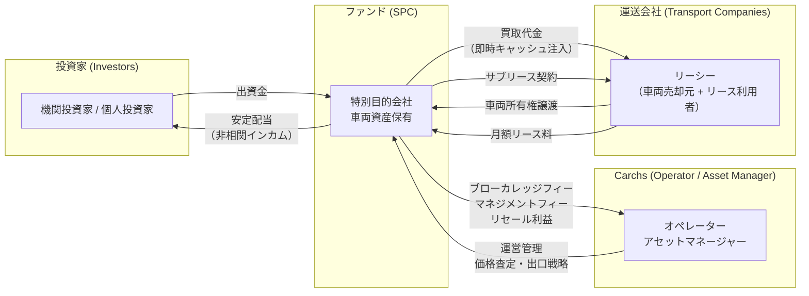

#### 10.1.2 各ステークホルダーの役割と提供価値

| ステークホルダー | 役割 | 受け取る価値 | システム上のエンティティ |
|----------------|------|------------|---------------------|
| **投資家** | ファンドへの出資者 | ハードアセット担保付きの安定・非相関インカム | `investor` テーブル |
| **Carchs** | オペレーター / アセットマネージャー | ブローカレッジフィー、マネジメントフィー、グローバルリセールのアップサイド | `operator_fee` テーブル |
| **運送会社** | 車両売却元 + リースバック利用者（リーシー） | 即時オフバランスシートのキャッシュ注入、ROA改善、車両ダウンタイムゼロ | `transport_company` テーブル |
| **ファンド（SPC）** | 車両資産の法的保有者、リース契約の貸主 | 車両資産プール、リース料キャッシュフロー | `fund` テーブル |

#### 10.1.3 トランザクションフロー

以下の順序でトランザクションが実行される。システムは各ステップのステータスを管理する。

```python
class DealStatus(str, Enum):
    """リースバック案件のステータス遷移"""
    INQUIRY = "inquiry"                  # 1. 運送会社からの問い合わせ
    VALUATION = "valuation"              # 2. 車両査定（スクレイピングデータ参照）
    PRICING = "pricing"                  # 3. 安全買取価格・リース料算出
    APPROVAL = "approval"               # 4. 営業マネージャー / ファンドマネージャー承認
    CONTRACT = "contract"                # 5. 売買契約 + サブリース契約締結
    OWNERSHIP_TRANSFER = "transfer"      # 6. 車両所有権のSPCへの移転（名義変更）
    CASH_DISBURSEMENT = "disbursed"      # 7. 買取代金の即時支払い
    ACTIVE_LEASE = "active"              # 8. リース期間中（月額リース料回収）
    LEASE_END = "lease_end"              # 9. リース満了
    REMARKETING = "remarketing"          # 10. 車両再販（グローバルリセール）
    SETTLED = "settled"                  # 11. 清算完了
    DEFAULT = "default"                  # 例外: デフォルト発生（10.7参照）
```

---

### 10.2 ファンド（SPC）の構造と役割

#### 10.2.1 法的構造

| 項目 | 定義 |
|------|------|
| 法人形態 | 特別目的会社（SPC: Special Purpose Company） |
| 設立目的 | 商用車両の取得・保有・リースバック・処分に限定された倒産隔離体 |
| 車両所有権 | SPCが法的所有者。リーシー（運送会社）の倒産時にも債権者から遮断される |
| 資産単位 | Secured Asset Block (SAB) として個別車両をブロック管理 |

#### 10.2.2 Secured Asset Block (SAB) データモデル

各車両は `SAB` (Secured Asset Block) として一意に管理される。これはピッチデックの「SAB-01」概念に対応する。

```python
from pydantic import BaseModel
from decimal import Decimal
from datetime import date
from enum import Enum

class SABStatus(str, Enum):
    ACTIVE = "active"           # リース稼働中
    DEFAULT = "default"         # デフォルト発生
    RECOVERING = "recovering"   # 資産回収中
    LIQUIDATING = "liquidating" # 売却処分中
    SETTLED = "settled"         # 清算完了

class SecuredAssetBlock(BaseModel):
    """Secured Asset Block: ファンド内の個別車両資産単位"""
    sab_id: str                          # 例: "SAB-2026-0001"
    fund_id: str                         # 所属ファンドID
    vehicle_id: str                      # 車両マスタへの参照
    acquisition_price: Decimal           # 買取価格（ファンド取得原価）
    ltv_ratio: Decimal                   # LTV比率（0.60 = 60%）
    b2b_wholesale_value: Decimal         # B2B卸売相場（査定基準額）
    lease_monthly_payment: Decimal       # 月額リース料
    lease_start_date: date               # リース開始日
    lease_term_months: int               # リース期間（月数、標準36ヶ月）
    residual_value_estimate: Decimal     # 残価予測額
    option_adjusted_premium: Decimal     # オプション調整プレミアム
    status: SABStatus                    # 現在ステータス
    accumulated_cash_recovery: Decimal   # 累積キャッシュ回収額
    current_physical_value: Decimal      # 現時点の物理的車両価値（推定）
    net_fund_asset_value: Decimal        # 純ファンド資産価値（計算値）
```

#### 10.2.3 SPCの倒産隔離機能

```
運送会社の倒産 → SPCの車両所有権は影響を受けない
                → SPCは他の債権者に優先して車両を回収可能
                → 出口戦略（10.7）のタイムラインに移行
```

システム上、`transport_company.credit_status` が `"default"` に遷移した場合、当該会社に紐づく全SABの `status` を `DEFAULT` に更新し、出口戦略ワークフローを自動起動する。

---

### 10.3 収益モデル

Carchsの収益は以下3つのフィーストリームで構成される。

#### 10.3.1 フィー体系

| フィー種別 | 英語名 | 発生タイミング | 計算ロジック | 備考 |
|-----------|--------|-------------|------------|------|
| **ブローカレッジフィー** | Brokerage Fee | 案件成約時（一括） | `acquisition_price * brokerage_rate` | 車両の売買仲介手数料 |
| **マネジメントフィー** | Management Fee | 毎月（リース期間中） | `fund_aum * annual_mgmt_rate / 12` | 資産管理・運営報酬 |
| **グローバルリセール利益** | Global Resale Profit | リース満了時 or デフォルト処理時 | `resale_price - residual_book_value` | 海外ネットワーク経由の売却差益 |

#### 10.3.2 収益計算エンジン

```python
from dataclasses import dataclass
from decimal import Decimal, ROUND_HALF_UP

@dataclass
class FeeParameters:
    """フィーパラメータ（管理画面から設定可能）"""
    brokerage_rate: Decimal = Decimal("0.03")         # 3%（買取価格に対して）
    annual_management_rate: Decimal = Decimal("0.02") # 年率2%（AUMに対して）
    resale_margin_target: Decimal = Decimal("0.15")   # 目標リセールマージン15%

def calculate_brokerage_fee(
    acquisition_price: Decimal,
    rate: Decimal
) -> Decimal:
    """ブローカレッジフィー算出"""
    return (acquisition_price * rate).quantize(Decimal("1"), rounding=ROUND_HALF_UP)

def calculate_monthly_management_fee(
    fund_total_aum: Decimal,
    annual_rate: Decimal
) -> Decimal:
    """月次マネジメントフィー算出"""
    return (fund_total_aum * annual_rate / Decimal("12")).quantize(
        Decimal("1"), rounding=ROUND_HALF_UP
    )

def calculate_resale_profit(
    resale_price: Decimal,
    residual_book_value: Decimal
) -> Decimal:
    """グローバルリセール利益算出（マイナスの場合は損失）"""
    return resale_price - residual_book_value
```

#### 10.3.3 ファンド全体のキャッシュフロー構造

```
[投資家出資] → [車両買取] → [月額リース料回収] → [フィー控除後、投資家へ配当]
                                                    ↓
                                            [リース満了]
                                                    ↓
                                     [グローバルリセール → 残余利益分配]
```

月次キャッシュフロー計算:

```python
def calculate_monthly_fund_cashflow(
    total_lease_income: Decimal,       # 全SABからの月額リース料合計
    management_fee: Decimal,           # Carchsマネジメントフィー
    fund_operating_expenses: Decimal,  # ファンド運営経費
) -> Decimal:
    """月次ファンドキャッシュフロー（投資家分配原資）"""
    return total_lease_income - management_fee - fund_operating_expenses
```

---

### 10.4 LTV（Loan-to-Value）60%ルールの詳細定義

#### 10.4.1 概要

LTV 60% ルールは、ファンドが車両を取得する際の**最大投資額を市場価値の60%に制限する**ダウンサイドプロテクション機構である。

#### 10.4.2 バリュエーションスタック（Valuation Stack）

ピッチデックで定義されるバリュエーションスタックは3層構造を持つ。

```
┌─────────────────────────────────────────────┐
│  Retail Value（小売価格）                      │  ← 利用しない（膨張リスク）
│  ※ 参考値としてのみ保持                        │
├─────────────────────────────────────────────┤
│  B2B Wholesale Floor（業者間卸売相場）          │  ← ベースライン（ボカデータ）
│  ※ スクレイピングエンジンから取得               │
├─────────────────────────────────────────────┤
│  Fund Capital Deployed @ LTV 60%             │  ← 実際の投資上限額
│  = B2B Wholesale Floor × 0.60               │
│  ※ 深いセーフティマージンを確保                 │
└─────────────────────────────────────────────┘
```

#### 10.4.3 LTV計算ロジック

```python
from decimal import Decimal, ROUND_DOWN

# LTV上限定数
MAX_LTV_RATIO = Decimal("0.60")

def calculate_max_acquisition_price(
    b2b_wholesale_value: Decimal,
    option_adjusted_premium: Decimal = Decimal("0"),
) -> Decimal:
    """
    LTV 60%ルールに基づく最大買取価格の算出

    Args:
        b2b_wholesale_value: B2B卸売相場（ボカベースライン）
        option_adjusted_premium: オプション調整プレミアム（10.4.4参照）

    Returns:
        ファンドが投資可能な最大額
    """
    adjusted_base = b2b_wholesale_value + option_adjusted_premium
    max_price = (adjusted_base * MAX_LTV_RATIO).quantize(
        Decimal("10000"), rounding=ROUND_DOWN  # 万円単位で切り捨て
    )
    return max_price

def validate_ltv_compliance(
    acquisition_price: Decimal,
    b2b_wholesale_value: Decimal,
    option_adjusted_premium: Decimal = Decimal("0"),
) -> dict:
    """
    LTVコンプライアンスチェック

    Returns:
        {
            "compliant": bool,
            "actual_ltv": Decimal,
            "max_allowed": Decimal,
            "headroom": Decimal  # 余裕額（正=余裕あり、負=超過）
        }
    """
    adjusted_base = b2b_wholesale_value + option_adjusted_premium
    if adjusted_base == 0:
        raise ValueError("ベースバリューが0です")

    actual_ltv = (acquisition_price / adjusted_base).quantize(Decimal("0.0001"))
    max_price = calculate_max_acquisition_price(b2b_wholesale_value, option_adjusted_premium)

    return {
        "compliant": actual_ltv <= MAX_LTV_RATIO,
        "actual_ltv": actual_ltv,
        "max_ltv": MAX_LTV_RATIO,
        "max_allowed_price": max_price,
        "headroom": max_price - acquisition_price,
    }
```

#### 10.4.4 オプション調整バリュエーション（Option-Adjusted Valuations）

リセールバリューが統計的に実証されている特定の架装オプションに対してのみ、ベースバリューにプレミアムを加算する。

| オプション種別 | 英語名 | プレミアム加算の可否 | 根拠 |
|-------------|--------|-------------------|------|
| **パワーゲート** | Power Gate | 可 | 中古市場での需要が高く、リセール実績が豊富 |
| **冷凍冷蔵機** | Cold Storage / Refrigerator | 可 | 食品物流需要の構造的拡大により安定的な残価維持 |
| **クレーン（ユニック）** | Integrated Crane | 可 | 建設・インフラ需要に連動し、グローバル需要あり |
| アルミウイング | Aluminum Wing | 不可 | 標準装備に近く、差別化プレミアムが限定的 |
| 平ボディ | Flatbed | 不可 | 汎用性が高いが、プレミアム対象外 |

```python
# オプション調整プレミアム率テーブル（管理画面から更新可能）
OPTION_PREMIUM_RATES: dict[str, Decimal] = {
    "POWER_GATE": Decimal("0.05"),      # ベースの5%を加算
    "REFRIGERATOR": Decimal("0.08"),    # ベースの8%を加算
    "CRANE": Decimal("0.07"),           # ベースの7%を加算
}

def calculate_option_adjusted_premium(
    b2b_wholesale_value: Decimal,
    equipped_options: list[str],
) -> Decimal:
    """
    装備オプションに基づくプレミアム算出。
    該当しないオプションは無視される（保守的アプローチ）。
    """
    total_premium = Decimal("0")
    for option in equipped_options:
        rate = OPTION_PREMIUM_RATES.get(option, Decimal("0"))
        total_premium += b2b_wholesale_value * rate
    return total_premium.quantize(Decimal("1"), rounding=ROUND_HALF_UP)
```

#### 10.4.5 LTV遵守のシステム制約

- 買取価格入力時にリアルタイムでLTVを算出し、60%超過の場合はUIに警告表示
- 60%超過の案件は `approval` ステータスに進めない（ハードブロック）
- ファンドマネージャーが特別承認した場合のみ、最大65%までの例外を許容（要 `override_reason` 記録）

---

### 10.5 バリュートランスファーエンジニアリングの計算モデル

#### 10.5.1 概念

バリュートランスファーエンジニアリング（Value Transfer Engineering）は、物理的な車両の減価を、累積キャッシュ回収によって相殺し、ファンドの純資産価値を維持・向上させるメカニズムである。

**核心原理**: 車両の物理的価値は減少するが、リース料として回収されるキャッシュが減少分を上回ることで、Net Fund Asset Valueは常に投資元本の60%以上を維持する。

#### 10.5.2 Value Inversion Matrix（価値反転マトリクス）

36ヶ月リースにおける標準的な価値遷移:

| 月 | 物理的車両価値（%） | 累積キャッシュ回収（%） | 純ファンド資産価値（%） |
|----|-------------------|---------------------|---------------------|
| 0 | 100 | 0 | 100 |
| 6 | 85 | 13 | 98 |
| 12 | 70 | 27 | 97 |
| 18 | 58 | 40 | 98 |
| 24 | 47 | 53 | 100 |
| 30 | 38 | 67 | 105 |
| 36 | 30 | 80 | 110 |

**Value Inversion Point（価値反転点）**: 約18ヶ月目で累積キャッシュ回収が物理的価値減少を上回り始める。

#### 10.5.3 計算モデル

```python
from decimal import Decimal
from dataclasses import dataclass

@dataclass
class ValueTransferSnapshot:
    """特定月におけるバリュートランスファーの状態"""
    month: int
    physical_value_pct: Decimal       # 物理的車両価値（初期=100%）
    accumulated_cash_pct: Decimal     # 累積キャッシュ回収率（初期=0%）
    net_asset_value_pct: Decimal      # 純資産価値率

class ValueTransferEngine:
    """
    バリュートランスファーエンジニアリング計算エンジン

    物理減価モデルとキャッシュ回収モデルを統合し、
    任意の月のNet Fund Asset Valueを算出する。
    """

    def __init__(
        self,
        acquisition_price: Decimal,
        monthly_lease_payment: Decimal,
        lease_term_months: int = 36,
        annual_depreciation_rate: Decimal = Decimal("0.20"),  # 年率20%減価
        residual_floor_pct: Decimal = Decimal("0.25"),        # 残価下限25%
    ):
        self.acquisition_price = acquisition_price
        self.monthly_lease_payment = monthly_lease_payment
        self.lease_term_months = lease_term_months
        self.annual_depreciation_rate = annual_depreciation_rate
        self.residual_floor_pct = residual_floor_pct

    def physical_value_at_month(self, month: int) -> Decimal:
        """
        月次物理的車両価値の算出（定率減価モデル）

        V(t) = max(V0 * (1 - r)^(t/12), V0 * floor_pct)

        V0: 取得時の車両市場価値（≒ b2b_wholesale_value）
        r: 年間減価率
        t: 経過月数
        floor_pct: 残価下限率（スクラップ価値等）
        """
        years_elapsed = Decimal(str(month)) / Decimal("12")
        depreciated = (1 - self.annual_depreciation_rate) ** years_elapsed
        floor = self.residual_floor_pct
        return max(depreciated, floor)

    def accumulated_cash_at_month(self, month: int) -> Decimal:
        """
        累積キャッシュ回収率の算出

        C(t) = (monthly_payment * t) / acquisition_price
        """
        total_cash = self.monthly_lease_payment * month
        return (total_cash / self.acquisition_price).quantize(Decimal("0.0001"))

    def net_asset_value_at_month(self, month: int) -> Decimal:
        """
        純ファンド資産価値率の算出

        NAV(t) = Physical_Value(t) + Accumulated_Cash(t)

        この値が常に投資元本（= LTV 60%で取得した額）を上回ることが
        バリュートランスファーエンジニアリングの目的である。
        """
        physical = self.physical_value_at_month(month)
        cash = self.accumulated_cash_at_month(month)
        return physical + cash

    def generate_schedule(self) -> list[ValueTransferSnapshot]:
        """全期間のバリュートランスファースケジュール生成"""
        schedule = []
        for m in range(0, self.lease_term_months + 1):
            snapshot = ValueTransferSnapshot(
                month=m,
                physical_value_pct=self.physical_value_at_month(m),
                accumulated_cash_pct=self.accumulated_cash_at_month(m),
                net_asset_value_pct=self.net_asset_value_at_month(m),
            )
            schedule.append(snapshot)
        return schedule

    def find_inversion_point(self) -> int | None:
        """
        価値反転点の特定:
        累積キャッシュ回収 > 物理的価値減少分（= 1.0 - physical_value）
        となる最初の月を返す。
        """
        for m in range(1, self.lease_term_months + 1):
            depreciation_loss = Decimal("1.0") - self.physical_value_at_month(m)
            cash_recovery = self.accumulated_cash_at_month(m)
            if cash_recovery >= depreciation_loss:
                return m
        return None
```

#### 10.5.4 NAV維持の閾値アラート

システムは以下の閾値を監視し、NAVが想定を下回る場合にアラートを発行する。

| レベル | 条件 | アクション |
|--------|------|----------|
| INFO | `NAV(t) < 100%` | ログ記録のみ |
| WARNING | `NAV(t) < 80%` | ファンドマネージャーに通知 |
| CRITICAL | `NAV(t) < 60%` | 即座にリバリュエーション実施、出口戦略検討開始 |

---

### 10.6 2024年問題を背景としたマーケットニーズ

#### 10.6.1 マクロカタリスト: 2024年問題

2024年4月施行の改正労働基準法（自動車運転業務の時間外労働上限規制）により、運送業界に構造的な資金需要が発生している。

| 項目 | 内容 |
|------|------|
| 法改正の要旨 | トラックドライバーの時間外労働上限を年960時間に制限 |
| 業界への影響 | 輸送能力の最大14%減少（国土交通省試算） |
| 企業への要求 | (1) ドライバーの待遇改善・確保のための資金、(2) DX投資（配車最適化、倉庫自動化等） |
| 財務的ジレンマ | 資産（トラック）は豊富だが現金が不足。追加借入は負債比率を悪化させる |

#### 10.6.2 リースバックによる解決

```
[運送会社の課題]
  資産リッチ（トラック保有）+ キャッシュプア（現金不足）
  + 負債増加不可（銀行借入限度）

        ↓ リースバックスキームの適用

[解決後の状態]
  即時キャッシュ注入（車両売却代金）
  + オフバランスシート化（負債計上されない）
  + ROA改善（総資産圧縮による）
  + 車両ダウンタイムゼロ（サブリースにより継続使用）
```

#### 10.6.3 ターゲットセグメント

| セグメント | 保有台数 | 特徴 | 想定ニーズ |
|-----------|---------|------|----------|
| 中規模運送会社 | 30-100台 | 2024年問題への対応資金が急務 | 一部車両のリースバック |
| 大規模運送会社 | 100台以上 | DX投資・ESG対応の資金需要 | フリート一括リースバック |
| 地方運送会社 | 10-30台 | 銀行借入が限界に近い | 資金調達の多様化 |

#### 10.6.4 システムへの実装要件

- 運送会社の登録情報に `problem_2024_readiness` フラグを追加（対応度の評価指標）
- 保有台数・売上高から推定される資金ニーズ額を自動算出する参考機能
- マーケティング用ダッシュボードで2024年問題関連KPIをトラッキング

---

### 10.7 出口戦略（デフォルト時のタイムライン）

#### 10.7.1 概要

リーシー（運送会社）がリース料の支払不能に陥った場合（デフォルト）、SPCの法的保護を活用して車両を回収し、Carchsのグローバル流通ネットワークを通じて価値を最大化する。

#### 10.7.2 デフォルト定義

```python
class DefaultTrigger(str, Enum):
    """デフォルト判定条件"""
    PAYMENT_OVERDUE_90 = "payment_overdue_90"   # リース料90日以上延滞
    BANKRUPTCY_FILING = "bankruptcy_filing"       # 破産申立て
    CIVIL_REHAB = "civil_rehabilitation"          # 民事再生手続開始
    VOLUNTARY_SURRENDER = "voluntary_surrender"   # 任意返却の申出
```

#### 10.7.3 出口戦略タイムライン

```mermaid
gantt
    title デフォルト時の出口戦略タイムライン
    dateFormat  X
    axisFormat %d日目

    section T+0: デフォルト発生
    デフォルト判定・ステータス変更           :t0, 0, 1

    section T+1: 法的シールド発動
    SPC所有権の確認・法的通知              :t1, 1, 2
    他の債権者からの遮断措置               :t1b, 1, 2

    section T+3: 資産回収
    車両の物理的回収（引き上げ）             :t3, 3, 5
    車両状態の査定・記録                   :t3b, 5, 7

    section T+10: グローバル清算
    Carchs国際ルーティングで最適市場選定     :t10, 7, 10
    プレミアムマージンでの売却完了           :t10b, 10, 14
```

#### 10.7.4 各フェーズの詳細

**T+0: デフォルト発生**

```python
@dataclass
class DefaultEvent:
    """デフォルトイベント"""
    sab_id: str
    trigger: DefaultTrigger
    detected_at: datetime
    overdue_amount: Decimal          # 延滞額
    overdue_days: int                # 延滞日数
    transport_company_id: str

def handle_default(event: DefaultEvent) -> None:
    """
    デフォルト発生時の自動処理

    1. SABステータスをDEFAULTに更新
    2. 案件ステータスをDEFAULTに更新
    3. ファンドマネージャーへ即時通知
    4. 法務チームへのエスカレーション起票
    5. 当該車両の最新市場価値をスクレイピングエンジンで再取得
    """
    update_sab_status(event.sab_id, SABStatus.DEFAULT)
    notify_fund_manager(event)
    escalate_to_legal(event)
    trigger_emergency_valuation(event.sab_id)
```

**T+1（1営業日後）: 法的シールド発動**

| アクション | 詳細 | システム処理 |
|-----------|------|------------|
| SPC所有権確認 | 車検証上のSPC名義を確認、法的所有権を主張 | 車両登録情報の自動照合 |
| 債権者遮断通知 | SPCが車両の法的所有者であることを他の債権者に通知 | 通知書テンプレート自動生成 |
| 動産占有権の行使 | リース契約に基づく車両返還請求権の行使 | 法的文書の自動ドラフト |

**T+3（3営業日後）: 資産回収**

```python
@dataclass
class AssetRecovery:
    """資産回収記録"""
    sab_id: str
    recovery_date: date
    recovery_location: str              # 回収場所
    vehicle_condition: str              # 車両状態（A/B/C/D）
    odometer_reading: int               # 回収時走行距離
    physical_inspection_notes: str      # 現物確認メモ
    estimated_liquidation_value: Decimal # 処分見込額
    recovery_cost: Decimal              # 回収費用

def initiate_recovery(sab_id: str) -> None:
    """
    資産回収の開始

    1. SABステータスをRECOVERINGに更新
    2. 回収業者への発注（外部API連携 or 手動）
    3. 車両状態の即時査定スケジュール
    """
    update_sab_status(sab_id, SABStatus.RECOVERING)
```

**T+10（10営業日後）: グローバル清算**

Carchsの国際流通ネットワークを活用し、最も高値が期待できる市場で売却する。

```python
@dataclass
class GlobalLiquidation:
    """グローバル清算"""
    sab_id: str
    target_markets: list[str]           # 対象市場リスト（例: ["JP_DOMESTIC", "SE_ASIA", "AFRICA", "MIDDLE_EAST"]）
    recommended_market: str             # 最適市場（価格エンジンが判定）
    domestic_estimated_price: Decimal   # 国内売却見込額
    export_estimated_price: Decimal     # 海外売却見込額
    routing_decision: str               # ルーティング判定結果
    actual_sale_price: Decimal | None   # 実際の売却額（売却完了後）
    sale_date: date | None

class LiquidationRouter:
    """
    グローバル清算ルーティングエンジン

    車両の属性（車種・年式・走行距離・架装）と
    各市場の需要データを照合し、最適な売却先を決定する。
    """

    # 市場別の需要プロファイル
    MARKET_PROFILES: dict[str, dict] = {
        "JP_DOMESTIC": {
            "preferred_age_max": 10,
            "preferred_km_max": 300_000,
            "premium_options": ["REFRIGERATOR", "CRANE"],
            "margin_potential": "standard",
        },
        "SE_ASIA": {
            "preferred_age_max": 20,
            "preferred_km_max": 800_000,
            "premium_options": ["POWER_GATE", "CRANE"],
            "margin_potential": "high",
        },
        "AFRICA": {
            "preferred_age_max": 25,
            "preferred_km_max": 1_000_000,
            "premium_options": [],
            "margin_potential": "high",
        },
        "MIDDLE_EAST": {
            "preferred_age_max": 15,
            "preferred_km_max": 500_000,
            "premium_options": ["REFRIGERATOR"],
            "margin_potential": "premium",
        },
    }

    def recommend_market(
        self,
        vehicle_age_years: int,
        odometer_km: int,
        equipped_options: list[str],
    ) -> str:
        """
        最適売却市場の推薦

        ロジック:
        1. 車齢・走行距離で各市場の適格性をフィルタ
        2. 適格市場のうち、margin_potentialが最も高い市場を選択
        3. 装備オプションが市場のpremium_optionsに合致する場合、優先度を上げる
        """
        margin_priority = {"premium": 3, "high": 2, "standard": 1}
        best_market = "JP_DOMESTIC"  # デフォルト
        best_score = 0

        for market, profile in self.MARKET_PROFILES.items():
            if (vehicle_age_years <= profile["preferred_age_max"]
                    and odometer_km <= profile["preferred_km_max"]):
                score = margin_priority.get(profile["margin_potential"], 0)
                # オプションマッチボーナス
                option_match = len(
                    set(equipped_options) & set(profile["premium_options"])
                )
                score += option_match
                if score > best_score:
                    best_score = score
                    best_market = market

        return best_market
```

#### 10.7.5 出口戦略のステートマシン

```python
# SABの出口戦略ステート遷移（許可される遷移のみ定義）
EXIT_STRATEGY_TRANSITIONS: dict[SABStatus, list[SABStatus]] = {
    SABStatus.ACTIVE: [SABStatus.DEFAULT],
    SABStatus.DEFAULT: [SABStatus.RECOVERING],
    SABStatus.RECOVERING: [SABStatus.LIQUIDATING, SABStatus.ACTIVE],  # ACTIVEへ戻る=リース再開
    SABStatus.LIQUIDATING: [SABStatus.SETTLED],
    SABStatus.SETTLED: [],  # 終端状態
}

def validate_status_transition(current: SABStatus, target: SABStatus) -> bool:
    """ステータス遷移の妥当性を検証"""
    allowed = EXIT_STRATEGY_TRANSITIONS.get(current, [])
    return target in allowed
```

#### 10.7.6 回収率の目標値

| シナリオ | 回収率目標 | 根拠 |
|---------|----------|------|
| 国内即時売却 | 投資額の70-85% | ボカベースの即時流動化 |
| 海外ルーティング（T+10標準） | 投資額の85-110% | Carchsネットワークによるプレミアム |
| 最悪ケース（事故車等） | 投資額の40-60% | LTV 60%ルールによりカバー |

LTV 60%で取得しているため、最悪ケースでも物理的車両価値が取得時の40%まで毀損しなければ元本が保全される。

---

### 10.8 従来型金融機関との競争優位性

#### 10.8.1 構造的障壁の比較

| 評価軸 | 従来型銀行 | Carchsエコシステム |
|--------|----------|------------------|
| **与信アプローチ** | 信用（クレジット）引受 — 過去の財務データに依存 | 資産（アセット）引受 — ライブ市場データに基づく |
| **バリュエーション精度** | 簿価 or 標準減価償却 — 市場実勢との乖離大 | スクレイピングエンジンによる精密査定（0.1%精度） |
| **出口（清算）能力** | 国内業者への売却のみ — 回収率低 | グローバル清算ネットワーク — 最適市場への国際ルーティング |
| **データ基盤** | ヒストリカルデータ（静的） | 24/7リアルタイム市場スクレイピング（動的） |

#### 10.8.2 システム実装への反映

上記の競争優位性は、以下のシステム機能によって実現される:

1. **リアルタイム市場データ**: セクション7（外部データ収集仕様）で定義されたスクレイピングエンジン
2. **精密バリュエーション**: セクション5（計算ロジック）で定義された価格最適化エンジン
3. **LTVコンプライアンス**: 本セクション10.4で定義されたLTV 60%ルール
4. **グローバル清算**: 本セクション10.7で定義された出口戦略ルーティング

---

### 10.9 ファンド（SPC）管理 — データベース・API仕様

本セクションでは、10.1〜10.8で定義したビジネスモデルを実装するためのデータベーススキーマ、SQL DDL、およびAPIエンドポイントを定義する。

---

#### 10.9.1 追加テーブル一覧

| # | テーブル名 | 概要 |
|---|-----------|------|
| 10 | `funds` | ファンド（SPC）基本情報 |
| 11 | `fund_investors` | ファンド×投資家の出資関連 |
| 12 | `lease_contracts` | リース契約基本情報 |
| 13 | `lease_payments` | リース支払いスケジュール＋実績 |
| 14 | `secured_asset_blocks` | SAB（車両資産ブロック） |
| 15 | `fee_records` | 手数料・収益レコード |
| 16 | `fund_distributions` | 配当（分配）実績 |

#### 10.9.2 ER図（ファンド管理）

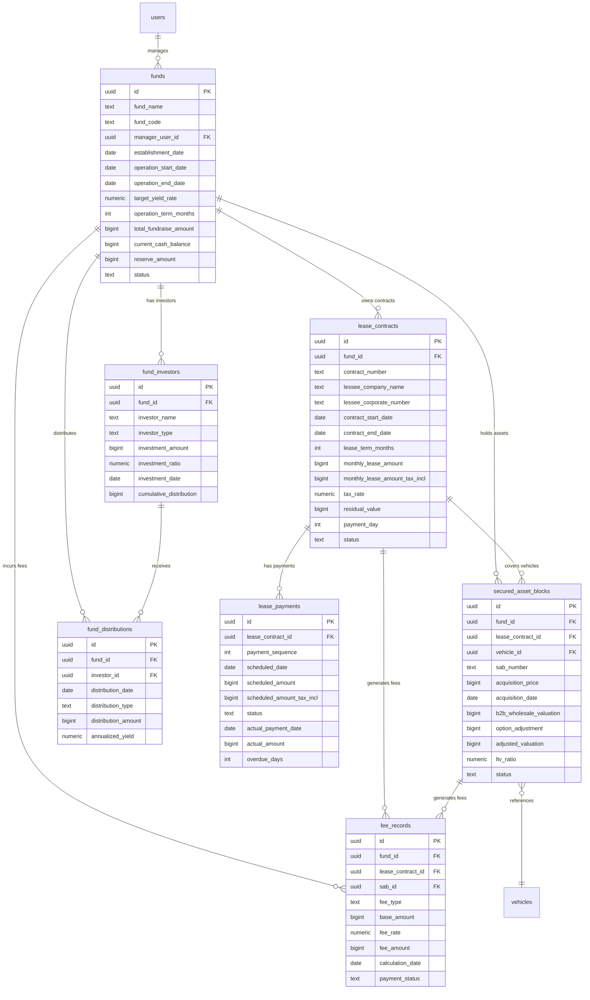

#### 10.9.3 テーブル定義

##### `funds` — ファンド（SPC）基本情報

| カラム名 | データ型 | NOT NULL | デフォルト | 制約 | 説明 |
|----------|---------|----------|-----------|------|------|
| `id` | `uuid` | YES | `gen_random_uuid()` | PK | ファンド一意識別子 |
| `fund_name` | `text` | YES | — | — | ファンド名称。例：「Carchs Truck Fund 2026-01」 |
| `fund_code` | `text` | YES | — | UNIQUE | ファンドコード（例：`CTF-2026-01`） |
| `manager_user_id` | `uuid` | NO | — | FK → `users.id` | 担当ファンドマネージャー |
| `establishment_date` | `date` | YES | — | — | SPC設立日 |
| `operation_start_date` | `date` | NO | — | — | 運用開始日 |
| `operation_end_date` | `date` | NO | — | — | 運用終了予定日 |
| `target_yield_rate` | `numeric(6,4)` | NO | — | CHECK >= 0 | 目標年間利回り（例：0.0850 = 8.5%） |
| `operation_term_months` | `integer` | NO | — | CHECK > 0 | 運用期間（月数） |
| `total_fundraise_amount` | `bigint` | NO | — | CHECK >= 0 | 募集総額（円） |
| `current_cash_balance` | `bigint` | YES | `0` | — | 現預金残高（円） |
| `reserve_amount` | `bigint` | YES | `0` | CHECK >= 0 | 引当金合計（円） |
| `status` | `text` | YES | `'preparing'` | CHECK IN (...) | `preparing` / `fundraising` / `active` / `liquidating` / `closed` |
| `description` | `text` | NO | — | — | ファンド概要・備考 |
| `created_at` | `timestamptz` | YES | `now()` | — | 作成日時 |
| `updated_at` | `timestamptz` | YES | `now()` | — | 更新日時 |

**ステータス遷移（10.2.2参照）**: `preparing` → `fundraising` → `active` → `liquidating` → `closed`

##### `fund_investors` — 投資家割当

| カラム名 | データ型 | NOT NULL | デフォルト | 制約 | 説明 |
|----------|---------|----------|-----------|------|------|
| `id` | `uuid` | YES | `gen_random_uuid()` | PK | 一意識別子 |
| `fund_id` | `uuid` | YES | — | FK → `funds.id` | 所属ファンド |
| `investor_name` | `text` | YES | — | — | 投資家名（法人名 or 個人名） |
| `investor_type` | `text` | YES | — | CHECK IN (...) | `institutional`（機関投資家） / `individual`（個人投資家） |
| `investor_contact_email` | `text` | NO | — | — | 連絡先メールアドレス |
| `investment_amount` | `bigint` | YES | — | CHECK > 0 | 出資額（円） |
| `investment_ratio` | `numeric(8,6)` | NO | — | CHECK BETWEEN 0 AND 1 | 出資比率（自動計算。例：0.250000 = 25%） |
| `investment_date` | `date` | NO | — | — | 出資日（入金確認日） |
| `cumulative_distribution` | `bigint` | YES | `0` | CHECK >= 0 | 累計分配額（円） |
| `is_active` | `boolean` | YES | `true` | — | 有効フラグ |
| `created_at` | `timestamptz` | YES | `now()` | — | 作成日時 |
| `updated_at` | `timestamptz` | YES | `now()` | — | 更新日時 |

**UNIQUE制約**: `(fund_id, investor_name)` — 同一ファンドに同一投資家の重複登録を防止

##### `lease_contracts` — リース契約

| カラム名 | データ型 | NOT NULL | デフォルト | 制約 | 説明 |
|----------|---------|----------|-----------|------|------|
| `id` | `uuid` | YES | `gen_random_uuid()` | PK | 一意識別子 |
| `fund_id` | `uuid` | YES | — | FK → `funds.id` | 所属ファンド |
| `contract_number` | `text` | YES | — | UNIQUE | 契約番号（例：`LC-2026-0001`） |
| `lessee_company_name` | `text` | YES | — | — | リーシー（運送会社）名 |
| `lessee_corporate_number` | `text` | NO | — | — | 法人番号（13桁） |
| `lessee_contact_person` | `text` | NO | — | — | 担当者名 |
| `lessee_contact_email` | `text` | NO | — | — | 連絡先メールアドレス |
| `lessee_contact_phone` | `text` | NO | — | — | 連絡先電話番号 |
| `contract_start_date` | `date` | YES | — | — | リース開始日 |
| `contract_end_date` | `date` | YES | — | — | リース終了日 |
| `lease_term_months` | `integer` | YES | — | CHECK > 0 | リース期間（月数） |
| `monthly_lease_amount` | `bigint` | YES | — | CHECK > 0 | 月額リース料・税抜（円） |
| `monthly_lease_amount_tax_incl` | `bigint` | YES | — | CHECK > 0 | 月額リース料・税込（円） |
| `tax_rate` | `numeric(5,4)` | YES | `0.1000` | CHECK >= 0 | 適用消費税率（例：0.1000 = 10%） |
| `residual_value` | `bigint` | NO | `0` | CHECK >= 0 | 残価設定額（円） |
| `payment_day` | `integer` | YES | `25` | CHECK BETWEEN 1 AND 31 | 毎月の支払期日（日） |
| `status` | `text` | YES | `'draft'` | CHECK IN (...) | `draft` / `active` / `overdue` / `terminated` / `completed` |
| `termination_date` | `date` | NO | — | — | 中途解約日（該当する場合） |
| `termination_reason` | `text` | NO | — | — | 解約理由 |
| `created_at` | `timestamptz` | YES | `now()` | — | 作成日時 |
| `updated_at` | `timestamptz` | YES | `now()` | — | 更新日時 |

**CHECK制約**: `contract_end_date > contract_start_date`

##### `lease_payments` — 支払いスケジュール＋実績

| カラム名 | データ型 | NOT NULL | デフォルト | 制約 | 説明 |
|----------|---------|----------|-----------|------|------|
| `id` | `uuid` | YES | `gen_random_uuid()` | PK | 一意識別子 |
| `lease_contract_id` | `uuid` | YES | — | FK → `lease_contracts.id` ON DELETE CASCADE | 所属リース契約 |
| `payment_sequence` | `integer` | YES | — | CHECK > 0 | 支払い回次（1, 2, 3, ...） |
| `scheduled_date` | `date` | YES | — | — | 支払い予定日 |
| `scheduled_amount` | `bigint` | YES | — | CHECK > 0 | 予定額・税抜（円） |
| `scheduled_amount_tax_incl` | `bigint` | YES | — | CHECK > 0 | 予定額・税込（円） |
| `status` | `text` | YES | `'scheduled'` | CHECK IN (...) | `scheduled` / `paid` / `partial` / `overdue` / `waived` |
| `actual_payment_date` | `date` | NO | — | — | 実入金日 |
| `actual_amount` | `bigint` | NO | — | CHECK >= 0 | 実入金額（円） |
| `overdue_days` | `integer` | YES | `0` | CHECK >= 0 | 遅延日数 |
| `notes` | `text` | NO | — | — | 備考 |
| `created_at` | `timestamptz` | YES | `now()` | — | 作成日時 |
| `updated_at` | `timestamptz` | YES | `now()` | — | 更新日時 |

**UNIQUE制約**: `(lease_contract_id, payment_sequence)` — 同一契約内で支払い回次の重複を防止

##### `secured_asset_blocks` — SAB（車両資産ブロック）

| カラム名 | データ型 | NOT NULL | デフォルト | 制約 | 説明 |
|----------|---------|----------|-----------|------|------|
| `id` | `uuid` | YES | `gen_random_uuid()` | PK | 一意識別子 |
| `fund_id` | `uuid` | YES | — | FK → `funds.id` | 所属ファンド |
| `lease_contract_id` | `uuid` | NO | — | FK → `lease_contracts.id` | 紐付くリース契約（NULLは未リース車両） |
| `vehicle_id` | `uuid` | NO | — | FK → `vehicles.id` | 車両相場データへの参照 |
| `sab_number` | `text` | YES | — | UNIQUE | SAB番号（例：`SAB-2026-00001`） |
| `vehicle_description` | `text` | NO | — | — | 車両概要（メーカー・車種・年式等の自由記述） |
| `acquisition_price` | `bigint` | YES | — | CHECK > 0 | 取得価格（買取価格）（円） |
| `acquisition_date` | `date` | YES | — | — | 取得日（所有権移転日） |
| `b2b_wholesale_valuation` | `bigint` | NO | — | CHECK >= 0 | B2B卸売評価額（ボカベース）（円） |
| `option_adjustment` | `bigint` | YES | `0` | — | オプション調整額（円、正負あり） |
| `adjusted_valuation` | `bigint` | NO | — | CHECK >= 0 | 調整済み評価額 = `b2b_wholesale_valuation + option_adjustment` |
| `ltv_ratio` | `numeric(6,4)` | NO | — | CHECK >= 0 | LTV = `acquisition_price / adjusted_valuation` |
| `valuation_date` | `date` | NO | — | — | 最終評価日 |
| `status` | `text` | YES | `'held'` | CHECK IN (...) | `held` / `leased` / `disposing` / `disposed` |
| `disposal_price` | `bigint` | NO | — | CHECK >= 0 | 売却価格（円） |
| `disposal_date` | `date` | NO | — | — | 売却完了日 |
| `created_at` | `timestamptz` | YES | `now()` | — | 作成日時 |
| `updated_at` | `timestamptz` | YES | `now()` | — | 更新日時 |

##### `fee_records` — 手数料レコード

| カラム名 | データ型 | NOT NULL | デフォルト | 制約 | 説明 |
|----------|---------|----------|-----------|------|------|
| `id` | `uuid` | YES | `gen_random_uuid()` | PK | 一意識別子 |
| `fund_id` | `uuid` | YES | — | FK → `funds.id` | 対象ファンド |
| `lease_contract_id` | `uuid` | NO | — | FK → `lease_contracts.id` | 対象リース契約（該当する場合） |
| `sab_id` | `uuid` | NO | — | FK → `secured_asset_blocks.id` | 対象SAB（該当する場合） |
| `fee_type` | `text` | YES | — | CHECK IN (...) | `brokerage_fee` / `management_fee` / `early_termination_fee` / `disposal_fee` |
| `base_amount` | `bigint` | YES | — | CHECK > 0 | 計算基準額（円） |
| `fee_rate` | `numeric(8,6)` | YES | — | CHECK >= 0 | 適用料率 |
| `fee_amount` | `bigint` | YES | — | CHECK > 0 | 手数料額（円） |
| `calculation_date` | `date` | YES | — | — | 計算実行日 |
| `target_period_start` | `date` | NO | — | — | 対象期間開始日（マネジメントフィー等） |
| `target_period_end` | `date` | NO | — | — | 対象期間終了日 |
| `payment_status` | `text` | YES | `'calculated'` | CHECK IN (...) | `calculated` / `invoiced` / `paid` |
| `notes` | `text` | NO | — | — | 備考 |
| `created_at` | `timestamptz` | YES | `now()` | — | 作成日時 |
| `updated_at` | `timestamptz` | YES | `now()` | — | 更新日時 |

##### `fund_distributions` — 配当（分配）実績

| カラム名 | データ型 | NOT NULL | デフォルト | 制約 | 説明 |
|----------|---------|----------|-----------|------|------|
| `id` | `uuid` | YES | `gen_random_uuid()` | PK | 一意識別子 |
| `fund_id` | `uuid` | YES | — | FK → `funds.id` | 対象ファンド |
| `investor_id` | `uuid` | YES | — | FK → `fund_investors.id` | 分配先投資家 |
| `distribution_date` | `date` | YES | — | — | 分配実行日 |
| `distribution_type` | `text` | YES | `'monthly'` | CHECK IN (...) | `monthly`（月次配当） / `interim`（中間配当） / `final`（最終分配） |
| `target_period_start` | `date` | NO | — | — | 対象期間開始日 |
| `target_period_end` | `date` | NO | — | — | 対象期間終了日 |
| `distribution_amount` | `bigint` | YES | — | CHECK > 0 | 分配額（円） |
| `annualized_yield` | `numeric(6,4)` | NO | — | — | 年換算利回り |
| `notes` | `text` | NO | — | — | 備考 |
| `created_at` | `timestamptz` | YES | `now()` | — | 作成日時 |

#### 10.9.4 RLSポリシー設計（ファンド管理テーブル）

| テーブル | SELECT | INSERT | UPDATE | DELETE |
|---------|--------|--------|--------|--------|
| `funds` | `admin` + 担当FM | `admin`のみ | `admin` + 担当FM | 不可 |
| `fund_investors` | `admin` + 担当FM | `admin`のみ | `admin` + 担当FM | `admin`のみ（`preparing`ステータス時） |
| `lease_contracts` | `admin` + `sales` + 担当FM | `admin` + `sales` | `admin` + `sales`（自分の作成分） | 不可 |
| `lease_payments` | `admin` + `sales` + 担当FM | `service_role`のみ | `admin` + 担当FM | 不可 |
| `secured_asset_blocks` | `admin` + 担当FM | `admin`のみ | `admin` + 担当FM | 不可 |
| `fee_records` | `admin` + 担当FM | `service_role`のみ | `admin`のみ | 不可 |
| `fund_distributions` | `admin` + 担当FM + 対象投資家 | `service_role`のみ | 不可 | 不可 |

#### 10.9.5 NAV（純資産価値）計算ロジック

```
ファンドNAV =
    Σ（全SABの adjusted_valuation、status IN ('held', 'leased', 'disposing')）
  + funds.current_cash_balance
  + Σ（lease_payments WHERE status = 'overdue'）  ← 未収リース料（回収見込分）
  - funds.reserve_amount                           ← 引当金
  - Σ（fee_records WHERE payment_status = 'calculated'）  ← 未払費用

投資家別NAV = ファンドNAV × fund_investors.investment_ratio
```

#### 10.9.6 配当計算ロジック

```
月次配当可能額 =
    Σ（当月 lease_payments WHERE status = 'paid' の actual_amount（税抜相当額））
  - 当月マネジメントフィー
  - 引当金繰入額
  - その他運営費用

投資家別配当額 = 月次配当可能額 × fund_investors.investment_ratio

年換算利回り = (投資家別配当額 × 12) ÷ fund_investors.investment_amount
```

---

#### 10.9.7 SQL DDL（完全定義）

以下のDDLは `supabase/migrations/20260406000000_create_fund_management.sql` として管理する。

```sql
-- ============================================================================
-- Migration: 20260406000000_create_fund_management
-- Description: Create fund (SPC) management, lease contracts, SAB,
--              fee records, and distribution tables
-- ============================================================================

-- ---------------------------------------------------------------------------
-- Table: funds
-- ---------------------------------------------------------------------------
CREATE TABLE public.funds (
  id                      uuid        PRIMARY KEY DEFAULT gen_random_uuid(),
  fund_name               text        NOT NULL,
  fund_code               text        NOT NULL UNIQUE,
  manager_user_id         uuid        REFERENCES public.users(id),
  establishment_date      date        NOT NULL,
  operation_start_date    date,
  operation_end_date      date,
  target_yield_rate       numeric(6,4)  CHECK (target_yield_rate >= 0),
  operation_term_months   integer       CHECK (operation_term_months > 0),
  total_fundraise_amount  bigint        CHECK (total_fundraise_amount >= 0),
  current_cash_balance    bigint      NOT NULL DEFAULT 0,
  reserve_amount          bigint      NOT NULL DEFAULT 0 CHECK (reserve_amount >= 0),
  status                  text        NOT NULL DEFAULT 'preparing'
                                      CHECK (status IN (
                                        'preparing', 'fundraising', 'active',
                                        'liquidating', 'closed'
                                      )),
  description             text,
  created_at              timestamptz NOT NULL DEFAULT now(),
  updated_at              timestamptz NOT NULL DEFAULT now()
);

COMMENT ON TABLE public.funds IS 'Fund (SPC) master — holds truck assets and manages leaseback operations';
COMMENT ON COLUMN public.funds.target_yield_rate IS 'Target annual yield as decimal (e.g. 0.0850 = 8.5%)';
COMMENT ON COLUMN public.funds.current_cash_balance IS 'Current cash position in JPY';

CREATE INDEX idx_funds_status ON public.funds (status);
CREATE INDEX idx_funds_manager ON public.funds (manager_user_id);

CREATE TRIGGER trg_funds_updated_at
  BEFORE UPDATE ON public.funds
  FOR EACH ROW
  EXECUTE FUNCTION public.set_updated_at();

-- ---------------------------------------------------------------------------
-- Table: fund_investors
-- ---------------------------------------------------------------------------
CREATE TABLE public.fund_investors (
  id                      uuid        PRIMARY KEY DEFAULT gen_random_uuid(),
  fund_id                 uuid        NOT NULL REFERENCES public.funds(id),
  investor_name           text        NOT NULL,
  investor_type           text        NOT NULL
                                      CHECK (investor_type IN ('institutional', 'individual')),
  investor_contact_email  text,
  investment_amount       bigint      NOT NULL CHECK (investment_amount > 0),
  investment_ratio        numeric(8,6)  CHECK (investment_ratio BETWEEN 0 AND 1),
  investment_date         date,
  cumulative_distribution bigint      NOT NULL DEFAULT 0 CHECK (cumulative_distribution >= 0),
  is_active               boolean     NOT NULL DEFAULT true,
  created_at              timestamptz NOT NULL DEFAULT now(),
  updated_at              timestamptz NOT NULL DEFAULT now(),

  CONSTRAINT uq_fund_investors UNIQUE (fund_id, investor_name)
);

COMMENT ON TABLE public.fund_investors IS 'Investor allocations per fund — tracks capital commitment and distributions';
COMMENT ON COLUMN public.fund_investors.investment_ratio IS 'Ownership ratio as decimal (e.g. 0.250000 = 25%)';

CREATE INDEX idx_fund_investors_fund_id ON public.fund_investors (fund_id);

CREATE TRIGGER trg_fund_investors_updated_at
  BEFORE UPDATE ON public.fund_investors
  FOR EACH ROW
  EXECUTE FUNCTION public.set_updated_at();

-- ---------------------------------------------------------------------------
-- Table: lease_contracts
-- ---------------------------------------------------------------------------
CREATE TABLE public.lease_contracts (
  id                          uuid        PRIMARY KEY DEFAULT gen_random_uuid(),
  fund_id                     uuid        NOT NULL REFERENCES public.funds(id),
  contract_number             text        NOT NULL UNIQUE,
  lessee_company_name         text        NOT NULL,
  lessee_corporate_number     text,
  lessee_contact_person       text,
  lessee_contact_email        text,
  lessee_contact_phone        text,
  contract_start_date         date        NOT NULL,
  contract_end_date           date        NOT NULL,
  lease_term_months           integer     NOT NULL CHECK (lease_term_months > 0),
  monthly_lease_amount        bigint      NOT NULL CHECK (monthly_lease_amount > 0),
  monthly_lease_amount_tax_incl bigint    NOT NULL CHECK (monthly_lease_amount_tax_incl > 0),
  tax_rate                    numeric(5,4) NOT NULL DEFAULT 0.1000
                                          CHECK (tax_rate >= 0),
  residual_value              bigint      DEFAULT 0 CHECK (residual_value >= 0),
  payment_day                 integer     NOT NULL DEFAULT 25
                                          CHECK (payment_day BETWEEN 1 AND 31),
  status                      text        NOT NULL DEFAULT 'draft'
                                          CHECK (status IN (
                                            'draft', 'active', 'overdue',
                                            'terminated', 'completed'
                                          )),
  termination_date            date,
  termination_reason          text,
  created_at                  timestamptz NOT NULL DEFAULT now(),
  updated_at                  timestamptz NOT NULL DEFAULT now(),

  CONSTRAINT chk_contract_dates CHECK (contract_end_date > contract_start_date)
);

COMMENT ON TABLE public.lease_contracts IS 'Leaseback contracts — transport companies sub-lease trucks from the fund';
COMMENT ON COLUMN public.lease_contracts.monthly_lease_amount IS 'Monthly lease payment excluding tax (JPY)';
COMMENT ON COLUMN public.lease_contracts.tax_rate IS 'Consumption tax rate as decimal (e.g. 0.1000 = 10%)';

CREATE INDEX idx_lease_contracts_fund_id ON public.lease_contracts (fund_id);
CREATE INDEX idx_lease_contracts_status ON public.lease_contracts (status);
CREATE INDEX idx_lease_contracts_lessee ON public.lease_contracts (lessee_company_name);
CREATE INDEX idx_lease_contracts_end_date ON public.lease_contracts (contract_end_date);

CREATE TRIGGER trg_lease_contracts_updated_at
  BEFORE UPDATE ON public.lease_contracts
  FOR EACH ROW
  EXECUTE FUNCTION public.set_updated_at();

-- ---------------------------------------------------------------------------
-- Table: lease_payments
-- ---------------------------------------------------------------------------
CREATE TABLE public.lease_payments (
  id                        uuid        PRIMARY KEY DEFAULT gen_random_uuid(),
  lease_contract_id         uuid        NOT NULL REFERENCES public.lease_contracts(id) ON DELETE CASCADE,
  payment_sequence          integer     NOT NULL CHECK (payment_sequence > 0),
  scheduled_date            date        NOT NULL,
  scheduled_amount          bigint      NOT NULL CHECK (scheduled_amount > 0),
  scheduled_amount_tax_incl bigint      NOT NULL CHECK (scheduled_amount_tax_incl > 0),
  status                    text        NOT NULL DEFAULT 'scheduled'
                                        CHECK (status IN (
                                          'scheduled', 'paid', 'partial',
                                          'overdue', 'waived'
                                        )),
  actual_payment_date       date,
  actual_amount             bigint      CHECK (actual_amount >= 0),
  overdue_days              integer     NOT NULL DEFAULT 0 CHECK (overdue_days >= 0),
  notes                     text,
  created_at                timestamptz NOT NULL DEFAULT now(),
  updated_at                timestamptz NOT NULL DEFAULT now(),

  CONSTRAINT uq_lease_payment_seq UNIQUE (lease_contract_id, payment_sequence)
);

COMMENT ON TABLE public.lease_payments IS 'Payment schedule and actuals for each lease contract';

CREATE INDEX idx_lease_payments_contract ON public.lease_payments (lease_contract_id);
CREATE INDEX idx_lease_payments_scheduled_date ON public.lease_payments (scheduled_date);
CREATE INDEX idx_lease_payments_status ON public.lease_payments (status);

-- Composite index for overdue detection queries
CREATE INDEX idx_lease_payments_overdue_detection
  ON public.lease_payments (scheduled_date, status)
  WHERE status IN ('scheduled', 'overdue');

CREATE TRIGGER trg_lease_payments_updated_at
  BEFORE UPDATE ON public.lease_payments
  FOR EACH ROW
  EXECUTE FUNCTION public.set_updated_at();

-- ---------------------------------------------------------------------------
-- Table: secured_asset_blocks
-- ---------------------------------------------------------------------------
CREATE TABLE public.secured_asset_blocks (
  id                      uuid        PRIMARY KEY DEFAULT gen_random_uuid(),
  fund_id                 uuid        NOT NULL REFERENCES public.funds(id),
  lease_contract_id       uuid        REFERENCES public.lease_contracts(id),
  vehicle_id              uuid        REFERENCES public.vehicles(id),
  sab_number              text        NOT NULL UNIQUE,
  vehicle_description     text,
  acquisition_price       bigint      NOT NULL CHECK (acquisition_price > 0),
  acquisition_date        date        NOT NULL,
  b2b_wholesale_valuation bigint      CHECK (b2b_wholesale_valuation >= 0),
  option_adjustment       bigint      NOT NULL DEFAULT 0,
  adjusted_valuation      bigint      CHECK (adjusted_valuation >= 0),
  ltv_ratio               numeric(6,4)  CHECK (ltv_ratio >= 0),
  valuation_date          date,
  status                  text        NOT NULL DEFAULT 'held'
                                      CHECK (status IN (
                                        'held', 'leased', 'disposing', 'disposed'
                                      )),
  disposal_price          bigint      CHECK (disposal_price >= 0),
  disposal_date           date,
  created_at              timestamptz NOT NULL DEFAULT now(),
  updated_at              timestamptz NOT NULL DEFAULT now()
);

COMMENT ON TABLE public.secured_asset_blocks IS 'SAB — individual vehicle assets held by a fund with real-time valuation';
COMMENT ON COLUMN public.secured_asset_blocks.b2b_wholesale_valuation IS 'Current B2B wholesale (auction/boka) valuation in JPY';
COMMENT ON COLUMN public.secured_asset_blocks.option_adjustment IS 'Option-adjusted valuation delta (can be positive or negative)';
COMMENT ON COLUMN public.secured_asset_blocks.ltv_ratio IS 'Loan-to-Value = acquisition_price / adjusted_valuation';

CREATE INDEX idx_sab_fund_id ON public.secured_asset_blocks (fund_id);
CREATE INDEX idx_sab_lease_contract ON public.secured_asset_blocks (lease_contract_id);
CREATE INDEX idx_sab_vehicle ON public.secured_asset_blocks (vehicle_id);
CREATE INDEX idx_sab_status ON public.secured_asset_blocks (status);

CREATE TRIGGER trg_sab_updated_at
  BEFORE UPDATE ON public.secured_asset_blocks
  FOR EACH ROW
  EXECUTE FUNCTION public.set_updated_at();

-- ---------------------------------------------------------------------------
-- Table: fee_records
-- ---------------------------------------------------------------------------
CREATE TABLE public.fee_records (
  id                    uuid        PRIMARY KEY DEFAULT gen_random_uuid(),
  fund_id               uuid        NOT NULL REFERENCES public.funds(id),
  lease_contract_id     uuid        REFERENCES public.lease_contracts(id),
  sab_id                uuid        REFERENCES public.secured_asset_blocks(id),
  fee_type              text        NOT NULL
                                    CHECK (fee_type IN (
                                      'brokerage_fee', 'management_fee',
                                      'early_termination_fee', 'disposal_fee'
                                    )),
  base_amount           bigint      NOT NULL CHECK (base_amount > 0),
  fee_rate              numeric(8,6) NOT NULL CHECK (fee_rate >= 0),
  fee_amount            bigint      NOT NULL CHECK (fee_amount > 0),
  calculation_date      date        NOT NULL,
  target_period_start   date,
  target_period_end     date,
  payment_status        text        NOT NULL DEFAULT 'calculated'
                                    CHECK (payment_status IN (
                                      'calculated', 'invoiced', 'paid'
                                    )),
  notes                 text,
  created_at            timestamptz NOT NULL DEFAULT now(),
  updated_at            timestamptz NOT NULL DEFAULT now()
);

COMMENT ON TABLE public.fee_records IS 'Fee calculations — brokerage, management, termination, and disposal fees';

CREATE INDEX idx_fee_records_fund_id ON public.fee_records (fund_id);
CREATE INDEX idx_fee_records_type ON public.fee_records (fee_type);
CREATE INDEX idx_fee_records_calc_date ON public.fee_records (calculation_date);
CREATE INDEX idx_fee_records_payment_status ON public.fee_records (payment_status);

CREATE TRIGGER trg_fee_records_updated_at
  BEFORE UPDATE ON public.fee_records
  FOR EACH ROW
  EXECUTE FUNCTION public.set_updated_at();

-- ---------------------------------------------------------------------------
-- Table: fund_distributions
-- ---------------------------------------------------------------------------
CREATE TABLE public.fund_distributions (
  id                    uuid        PRIMARY KEY DEFAULT gen_random_uuid(),
  fund_id               uuid        NOT NULL REFERENCES public.funds(id),
  investor_id           uuid        NOT NULL REFERENCES public.fund_investors(id),
  distribution_date     date        NOT NULL,
  distribution_type     text        NOT NULL DEFAULT 'monthly'
                                    CHECK (distribution_type IN (
                                      'monthly', 'interim', 'final'
                                    )),
  target_period_start   date,
  target_period_end     date,
  distribution_amount   bigint      NOT NULL CHECK (distribution_amount > 0),
  annualized_yield      numeric(6,4),
  notes                 text,
  created_at            timestamptz NOT NULL DEFAULT now()
);

COMMENT ON TABLE public.fund_distributions IS 'Distribution (dividend) records to each investor';

CREATE INDEX idx_distributions_fund_id ON public.fund_distributions (fund_id);
CREATE INDEX idx_distributions_investor ON public.fund_distributions (investor_id);
CREATE INDEX idx_distributions_date ON public.fund_distributions (distribution_date);
CREATE INDEX idx_distributions_type ON public.fund_distributions (distribution_type);
```

---

#### 10.9.8 APIエンドポイント設計

##### ファンド管理API

| メソッド | パス | 説明 | リクエスト | レスポンス |
|---------|------|------|-----------|-----------|
| `GET` | `/api/v1/funds` | ファンド一覧取得 | クエリ: `status`, `page`, `per_page` | `Fund[]` |
| `POST` | `/api/v1/funds` | ファンド新規登録 | `CreateFundRequest` | `Fund` (201) |
| `GET` | `/api/v1/funds/{id}` | ファンド詳細取得 | — | `FundDetail`（投資家・SAB・契約サマリ含む） |
| `PUT` | `/api/v1/funds/{id}` | ファンド情報更新 | `UpdateFundRequest` | `Fund` |
| `PATCH` | `/api/v1/funds/{id}/status` | ステータス変更 | `{ "status": "active" }` | `Fund` |
| `GET` | `/api/v1/funds/{id}/nav` | NAV（純資産価値）取得 | — | `FundNAV`（10.9.9参照） |
| `POST` | `/api/v1/funds/{id}/distribute` | 配当実行 | `DistributeRequest` | `Distribution[]` (201) |

##### 投資家管理API

| メソッド | パス | 説明 |
|---------|------|------|
| `GET` | `/api/v1/funds/{fund_id}/investors` | 投資家一覧取得 |
| `POST` | `/api/v1/funds/{fund_id}/investors` | 投資家追加（全投資家の出資比率を自動再計算） |
| `PUT` | `/api/v1/funds/{fund_id}/investors/{id}` | 投資家情報更新 |
| `DELETE` | `/api/v1/funds/{fund_id}/investors/{id}` | 投資家削除（ファンドが`preparing`ステータス時のみ） |

##### リース契約API

| メソッド | パス | 説明 |
|---------|------|------|
| `GET` | `/api/v1/funds/{fund_id}/contracts` | 契約一覧取得（クエリ: `status`, `lessee_company_name`） |
| `POST` | `/api/v1/funds/{fund_id}/contracts` | 契約新規作成（`lease_payments`の支払いスケジュールを自動生成） |
| `GET` | `/api/v1/contracts/{id}` | 契約詳細取得（支払いスケジュール・紐付きSAB含む） |
| `PUT` | `/api/v1/contracts/{id}` | 契約情報更新（`draft`ステータス時のみ） |
| `PATCH` | `/api/v1/contracts/{id}/status` | 契約ステータス変更 |

##### 支払い管理API

| メソッド | パス | 説明 |
|---------|------|------|
| `GET` | `/api/v1/contracts/{contract_id}/payments` | 支払いスケジュール一覧 |
| `PATCH` | `/api/v1/payments/{id}/confirm` | 入金確認（`actual_payment_date`, `actual_amount`を記録、ステータスを`paid`に更新） |
| `GET` | `/api/v1/payments/overdue` | 全ファンド横断の遅延支払い一覧（遅延検知ダッシュボード用） |

##### SAB（車両資産）API

| メソッド | パス | 説明 |
|---------|------|------|
| `GET` | `/api/v1/funds/{fund_id}/sabs` | SAB一覧取得 |
| `POST` | `/api/v1/funds/{fund_id}/sabs` | SAB新規登録（車両取得。LTVコンプライアンスチェックを実行） |
| `PUT` | `/api/v1/sabs/{id}` | SAB情報更新 |
| `POST` | `/api/v1/sabs/{id}/revalue` | 評価額再計算（スクレイピングデータ連携、`adjusted_valuation`と`ltv_ratio`を更新） |
| `PATCH` | `/api/v1/sabs/{id}/dispose` | 売却処分の記録（`disposal_price`, `disposal_date`を記録、ステータスを`disposed`に更新） |

##### 手数料API

| メソッド | パス | 説明 |
|---------|------|------|
| `GET` | `/api/v1/funds/{fund_id}/fees` | 手数料レコード一覧（クエリ: `fee_type`, `payment_status`） |
| `POST` | `/api/v1/funds/{fund_id}/fees/calculate-management` | 月次マネジメントフィー計算実行 |
| `POST` | `/api/v1/funds/{fund_id}/fees/calculate-brokerage` | ブローカレッジフィー計算（車両取得時） |

---

#### 10.9.9 主要レスポンスモデル

##### `FundNAV`（NAVレスポンス）

```json
{
  "fund_id": "550e8400-e29b-41d4-a716-446655440000",
  "fund_name": "Carchs Truck Fund 2026-01",
  "fund_code": "CTF-2026-01",
  "calculation_date": "2026-04-06",
  "total_sab_valuation": 150000000,
  "cash_balance": 12000000,
  "accrued_lease_receivable": 3500000,
  "unpaid_expenses": 800000,
  "reserve_amount": 2000000,
  "nav": 162700000,
  "total_fundraise_amount": 200000000,
  "nav_per_investor": [
    {
      "investor_id": "660e8400-e29b-41d4-a716-446655440001",
      "investor_name": "投資家A株式会社",
      "investment_amount": 50000000,
      "investment_ratio": 0.250000,
      "nav_share": 40675000,
      "cumulative_distribution": 2500000,
      "unrealized_gain_loss": -9325000
    }
  ],
  "sab_summary": {
    "total_count": 15,
    "held_count": 2,
    "leased_count": 12,
    "disposing_count": 1,
    "average_ltv": 0.5820,
    "total_acquisition_cost": 180000000
  }
}
```

##### `DistributeRequest`（配当実行リクエスト）

```json
{
  "distribution_date": "2026-04-30",
  "distribution_type": "monthly",
  "target_period_start": "2026-04-01",
  "target_period_end": "2026-04-30",
  "total_distributable_amount": 1250000,
  "notes": "2026年4月度月次配当"
}
```

##### 配当実行API（`POST /api/v1/funds/{id}/distribute`）の処理フロー

```
1. 対象ファンドのステータスが 'active' であることを検証
2. total_distributable_amount ≤ funds.current_cash_balance であることを検証
3. 対象ファンドの全アクティブ投資家（is_active = true）を取得
4. 各投資家について:
   a. 配当額 = total_distributable_amount × investment_ratio（端数は最大出資者に帰属）
   b. fund_distributions に INSERT
   c. fund_investors.cumulative_distribution を加算更新
5. funds.current_cash_balance を total_distributable_amount 分だけ減算
6. 全操作を単一トランザクションで実行
7. レスポンス: 作成された Distribution[] を返却
```

---

## 11. デフォルト管理・出口戦略システム (Exit Strategy & Default Management)

### 11.1 システム概要

本セクションでは、リースバック契約におけるデフォルト（債務不履行）発生時の検知・法的保全・資産回収・グローバル清算までの一連のワークフローを定義する。

SPC（特別目的会社）が年間法的所有権を保持するスキーム構造により、一般債権者の破産手続きから車両資産を完全に遮断（Legal Shield）し、デフォルト発生から最短10日以内で国際市場を通じた現金化を実現する。

#### Exit Strategy タイムライン

| ステージ | タイミング | アクション | 自動化レベル |
|---------|----------|----------|------------|
| **T+0** | デフォルト認定日 | デフォルト発生。運送会社がリース料支払いを停止 | 自動検知 |
| **T+1** | デフォルト+1日 | 法的シールド発動。SPC年間法的所有権による資産保全。他の債権者からの一般破産手続きを遮断 | 自動トリガー |
| **T+3** | デフォルト+3日 | 資産回収。法的障壁ゼロで即時物理的占有回復 | 半自動（承認要） |
| **T+10** | デフォルト+10日 | グローバル清算。Carchs独自の国際ルーティングによりプレミアムマージンで即時現金化 | 半自動（承認要） |

#### 構造的優位性（従来型銀行融資との比較）

| 項目 | 従来型銀行融資 | 本スキーム（SPC所有権方式） |
|------|-------------|------------------------|
| **引受基準** | 信用引受（Credit Underwriting） | 資産引受（Asset Underwriting）：リアルタイムのグローバル資産価値に基づく |
| **評価精度** | 簿価・概算評価 | 精密評価（Precision Appraisal）：スクレイピングエンジンによるコンポーネント単位の評価（精度0.1%） |
| **清算手段** | 国内市場での個別売却（数ヶ月） | グローバル清算（Global Liquidation）：Carchsネットワークで高需要国際市場にルーティング、完全な再販マージンを確保 |
| **法的手続き** | 破産手続き参加（数ヶ月〜年単位） | SPC所有権により即時占有回復（T+3日） |

---

### 11.2 デフォルト検知ロジック

#### 11.2.1 段階的エスカレーションフロー

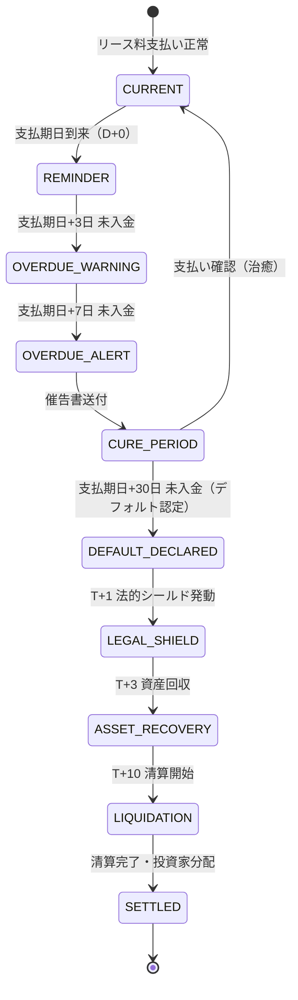

#### 11.2.2 検知パラメータ定義

| パラメータ | デフォルト値 | 説明 | 設定可能範囲 |
|----------|-----------|------|------------|
| `REMINDER_DAYS` | 0日 | 支払期日当日のリマインダー送信 | 0〜3日 |
| `WARNING_DAYS` | 3日 | 支払遅延の初回警告 | 1〜7日 |
| `ALERT_DAYS` | 7日 | エスカレーション警告（催告書送付トリガー） | 5〜14日 |
| `CURE_PERIOD_DAYS` | 30日 | デフォルト認定までの猶予期間（催告書送付からの日数） | 14〜60日 |
| `CONSECUTIVE_MISSES` | 2回 | 連続未払い回数によるデフォルト即時認定 | 1〜3回 |

#### 11.2.3 検知ロジック疑似コード

```python
from datetime import date, timedelta
from enum import Enum

class EscalationStage(str, Enum):
    CURRENT = "current"            # 正常
    REMINDER = "reminder"          # リマインダー送信済
    OVERDUE_WARNING = "overdue_warning"  # 延滞警告
    OVERDUE_ALERT = "overdue_alert"      # 催告レベル
    CURE_PERIOD = "cure_period"          # 治癒猶予期間
    DEFAULT_DECLARED = "default_declared"  # デフォルト認定

def evaluate_lease_payment_status(
    due_date: date,
    payment_received: bool,
    consecutive_misses: int,
    today: date | None = None,
) -> EscalationStage:
    """リース料支払いステータスの評価ロジック。

    Args:
        due_date: 支払期日
        payment_received: 入金確認フラグ
        consecutive_misses: 連続未払い回数
        today: 評価基準日（テスト用にオーバーライド可能）

    Returns:
        現在のエスカレーションステージ
    """
    today = today or date.today()

    if payment_received:
        return EscalationStage.CURRENT

    # 連続未払いによる即時デフォルト認定
    if consecutive_misses >= CONSECUTIVE_MISSES_THRESHOLD:
        return EscalationStage.DEFAULT_DECLARED

    overdue_days = (today - due_date).days

    if overdue_days < 0:
        return EscalationStage.CURRENT
    elif overdue_days == 0:
        return EscalationStage.REMINDER
    elif overdue_days <= WARNING_DAYS:
        return EscalationStage.OVERDUE_WARNING
    elif overdue_days <= ALERT_DAYS:
        return EscalationStage.OVERDUE_ALERT
    elif overdue_days <= CURE_PERIOD_DAYS:
        return EscalationStage.CURE_PERIOD
    else:
        return EscalationStage.DEFAULT_DECLARED
```

#### 11.2.4 通知マトリクス

| ステージ | 通知先 | 通知手段 | 通知内容 |
|---------|-------|---------|---------|
| REMINDER | リーシー（運送会社） | メール / SMS | 支払期日到来の通知 |
| OVERDUE_WARNING | リーシー、営業担当 | メール / SMS | 延滞警告（3日超過） |
| OVERDUE_ALERT | リーシー、営業担当、営業マネージャー | メール / 電話 | 催告書送付通知 |
| CURE_PERIOD | リーシー、ファンドマネージャー | 内容証明郵便 / メール | 治癒猶予期間の開始通知 |
| DEFAULT_DECLARED | 全ステークホルダー | システム通知 / メール | デフォルト認定通知、T+0ワークフロー開始 |

---

### 11.3 T+0〜T+10 ワークフロー自動化

#### 11.3.1 ステージ管理ステートマシン

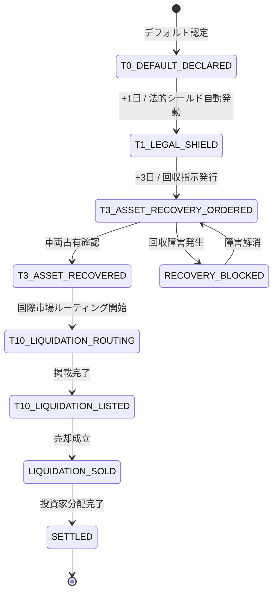

#### 11.3.2 各ステージの定義

| ステージ | コード | トリガー条件 | 自動/手動 | 必要な記録 |
|---------|------|------------|---------|----------|
| デフォルト認定 | `T0_DEFAULT_DECLARED` | `CURE_PERIOD_DAYS` 超過 or 連続未払い閾値到達 | 自動 | デフォルト認定日時、対象リース契約ID、未払い額 |
| 法的シールド発動 | `T1_LEGAL_SHIELD` | T+0から1営業日経過 | 自動 | SPC所有権証明書番号、法的通知発送記録、破産手続き遮断確認 |
| 資産回収指示 | `T3_ASSET_RECOVERY_ORDERED` | T+0から3営業日経過 + 法的シールド完了 | 承認後自動 | 回収指示書番号、回収担当者、車両所在地 |
| 資産回収完了 | `T3_ASSET_RECOVERED` | 車両の物理的占有確認 | 手動確認 | 回収日時、車両状態記録、回収コスト |
| 清算ルーティング | `T10_LIQUIDATION_ROUTING` | 資産回収完了 | 半自動 | ルーティング先市場、想定清算価格 |
| 清算掲載 | `T10_LIQUIDATION_LISTED` | 国際市場への掲載完了 | 半自動 | 掲載市場名、掲載価格、掲載日 |
| 売却成立 | `LIQUIDATION_SOLD` | 買い手確定・代金受領 | 手動確認 | 売却価格、買い手情報、代金受領日 |
| 精算完了 | `SETTLED` | 投資家分配計算完了・送金完了 | 承認後自動 | 分配額明細、送金記録 |

#### 11.3.3 トリガー条件と自動化ルール

```python
from datetime import datetime, timedelta
from typing import Optional

class DefaultWorkflowEngine:
    """デフォルト発生後のT+0〜T+10ワークフローを自動制御するエンジン。"""

    # 各ステージの最小経過日数（T+0起算、営業日）
    STAGE_MINIMUM_DAYS: dict[str, int] = {
        "T1_LEGAL_SHIELD": 1,
        "T3_ASSET_RECOVERY_ORDERED": 3,
        "T10_LIQUIDATION_ROUTING": 10,
    }

    # 自動遷移が許可されるステージ
    AUTO_ADVANCE_STAGES: set[str] = {
        "T1_LEGAL_SHIELD",  # 法的シールドは自動発動
    }

    # 承認が必要なステージ
    APPROVAL_REQUIRED_STAGES: set[str] = {
        "T3_ASSET_RECOVERY_ORDERED",
        "T10_LIQUIDATION_ROUTING",
        "SETTLED",
    }

    # 許可されるステージ遷移マップ
    ALLOWED_TRANSITIONS: dict[str, list[str]] = {
        "T0_DEFAULT_DECLARED": ["T1_LEGAL_SHIELD", "CANCELLED"],
        "T1_LEGAL_SHIELD": ["T3_ASSET_RECOVERY_ORDERED", "CANCELLED"],
        "T3_ASSET_RECOVERY_ORDERED": ["T3_ASSET_RECOVERED", "CANCELLED"],
        "T3_ASSET_RECOVERED": ["T10_LIQUIDATION_ROUTING"],
        "T10_LIQUIDATION_ROUTING": ["T10_LIQUIDATION_LISTED"],
        "T10_LIQUIDATION_LISTED": ["LIQUIDATION_SOLD"],
        "LIQUIDATION_SOLD": ["SETTLED"],
    }

    def can_advance(
        self,
        current_stage: str,
        next_stage: str,
        default_declared_at: datetime,
        approved_by: Optional[str] = None,
    ) -> tuple[bool, str]:
        """ステージ遷移の可否を判定する。

        Args:
            current_stage: 現在のステージコード
            next_stage: 遷移先ステージコード
            default_declared_at: デフォルト認定日時
            approved_by: 承認者ID（承認が必要なステージの場合）

        Returns:
            (遷移可否, 理由メッセージ) のタプル
        """
        # 遷移パス妥当性チェック
        allowed = self.ALLOWED_TRANSITIONS.get(current_stage, [])
        if next_stage not in allowed:
            return (
                False,
                f"ステージ {current_stage} から {next_stage} への遷移は許可されていません。"
                f"許可される遷移先: {allowed}",
            )

        # 最小経過日数チェック
        min_days = self.STAGE_MINIMUM_DAYS.get(next_stage, 0)
        elapsed = (datetime.utcnow() - default_declared_at).days
        if elapsed < min_days:
            return (
                False,
                f"最小経過日数未到達: {elapsed}日経過/{min_days}日必要",
            )

        # 承認チェック
        if next_stage in self.APPROVAL_REQUIRED_STAGES and not approved_by:
            return (False, f"ステージ {next_stage} には承認者が必要です")

        return (True, "遷移可能")
```

---

### 11.4 資産回収管理

#### 11.4.1 回収プロセスフロー

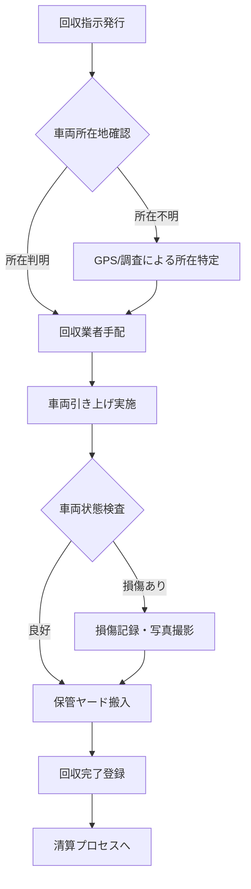

#### 11.4.2 回収コスト項目

| コスト項目 | コード | 説明 |
|----------|------|------|
| 回収業者費用 | `TOWING_FEE` | レッカー・積載車による搬送費 |
| 保管費用 | `STORAGE_FEE` | 保管ヤード使用料（日額） |
| 調査費用 | `INVESTIGATION_FEE` | 車両所在調査費 |
| 法的手続費用 | `LEGAL_FEE` | 内容証明・弁護士費用等 |
| 車両整備費用 | `RECONDITIONING_FEE` | 清算前の最低限整備費用 |
| その他費用 | `OTHER_FEE` | 上記に該当しない費用 |

---

### 11.5 グローバル清算（リクイデーション）

#### 11.5.1 国際市場ルーティングロジック

```python
from dataclasses import dataclass
from decimal import Decimal

@dataclass
class MarketRoute:
    """国際市場ルーティング先の情報。"""
    market_code: str          # 市場コード（例: "SEA_TH", "AF_KE"）
    market_name: str          # 市場名（例: "タイ・バンコク"）
    region: str               # リージョン（ASIA, AFRICA, MIDDLE_EAST, CIS, OCEANIA）
    estimated_price_usd: Decimal  # 想定売却価格（USD）
    demand_score: float       # 需要スコア（0.0〜1.0）
    avg_days_to_sell: int     # 平均売却日数
    logistics_cost_usd: Decimal   # 物流コスト（USD）
    net_margin_rate: float    # ネットマージン率

def route_to_optimal_market(
    vehicle_category: str,
    vehicle_age_years: int,
    vehicle_mileage_km: int,
    domestic_liquidation_price_yen: int,
    available_markets: list[MarketRoute],
) -> list[MarketRoute]:
    """車両の属性に基づき、最適な国際市場をランキングする。

    ルーティングスコア = 需要スコア x ネットマージン率 / 平均売却日数

    Args:
        vehicle_category: 車両カテゴリ（LARGE/MEDIUM/SMALL）
        vehicle_age_years: 車齢（年）
        vehicle_mileage_km: 走行距離（km）
        domestic_liquidation_price_yen: 国内清算価格（円）
        available_markets: 利用可能な国際市場リスト

    Returns:
        ルーティングスコア降順でソートされた市場リスト
    """
    for market in available_markets:
        market._routing_score = (
            market.demand_score
            * market.net_margin_rate
            / max(market.avg_days_to_sell, 1)
        )

    return sorted(
        available_markets,
        key=lambda m: m._routing_score,
        reverse=True,
    )
```

#### 11.5.2 清算価格記録と投資家分配計算

```python
from decimal import Decimal
from pydantic import BaseModel, Field

class LiquidationDistribution(BaseModel):
    """清算金の投資家分配計算モデル。"""

    gross_liquidation_amount_yen: int = Field(
        ..., description="清算総額（円）"
    )
    recovery_costs_yen: int = Field(
        ..., description="回収コスト合計（円）"
    )
    liquidation_costs_yen: int = Field(
        ..., description="清算コスト合計（円）（物流費・手数料等）"
    )
    net_liquidation_amount_yen: int = Field(
        ..., description="清算純額（円）= 清算総額 - 回収コスト - 清算コスト"
    )
    outstanding_lease_balance_yen: int = Field(
        ..., description="未回収リース料残高（円）"
    )
    loss_given_default_yen: int = Field(
        ..., description="デフォルト損失額（円）= 未回収残高 - 清算純額（正の場合損失）"
    )
    loss_given_default_rate: Decimal = Field(
        ..., description="LGD率（Loss Given Default Rate）"
    )
    investor_distributions: list[dict] = Field(
        ..., description="投資家別分配明細"
    )


def calculate_distribution(
    final_sale_price_yen: int,
    total_recovery_cost_yen: int,
    total_liquidation_cost_yen: int,
    outstanding_lease_balance_yen: int,
    investor_shares: list[dict[str, float]],
) -> LiquidationDistribution:
    """清算金の投資家分配を計算する。

    Args:
        final_sale_price_yen: 最終売却額（円）
        total_recovery_cost_yen: 回収コスト合計（円）
        total_liquidation_cost_yen: 清算コスト合計（円）
        outstanding_lease_balance_yen: 未回収リース料残高（円）
        investor_shares: 投資家出資比率リスト [{"investor_id": ..., "share_rate": 0.6}, ...]

    Returns:
        LiquidationDistribution
    """
    net = final_sale_price_yen - total_recovery_cost_yen - total_liquidation_cost_yen
    lgd = outstanding_lease_balance_yen - net
    lgd_rate = (
        Decimal(str(lgd)) / Decimal(str(outstanding_lease_balance_yen))
        if outstanding_lease_balance_yen > 0
        else Decimal("0")
    )

    distributions = []
    for inv in investor_shares:
        distributions.append({
            "investor_id": inv["investor_id"],
            "share_rate": inv["share_rate"],
            "distribution_amount_yen": int(net * inv["share_rate"]),
        })

    return LiquidationDistribution(
        gross_liquidation_amount_yen=final_sale_price_yen,
        recovery_costs_yen=total_recovery_cost_yen,
        liquidation_costs_yen=total_liquidation_cost_yen,
        net_liquidation_amount_yen=net,
        outstanding_lease_balance_yen=outstanding_lease_balance_yen,
        loss_given_default_yen=lgd,
        loss_given_default_rate=lgd_rate,
        investor_distributions=distributions,
    )
```

---

### 11.6 データベーススキーマ設計

#### 11.6.1 ER図（デフォルト管理関連）

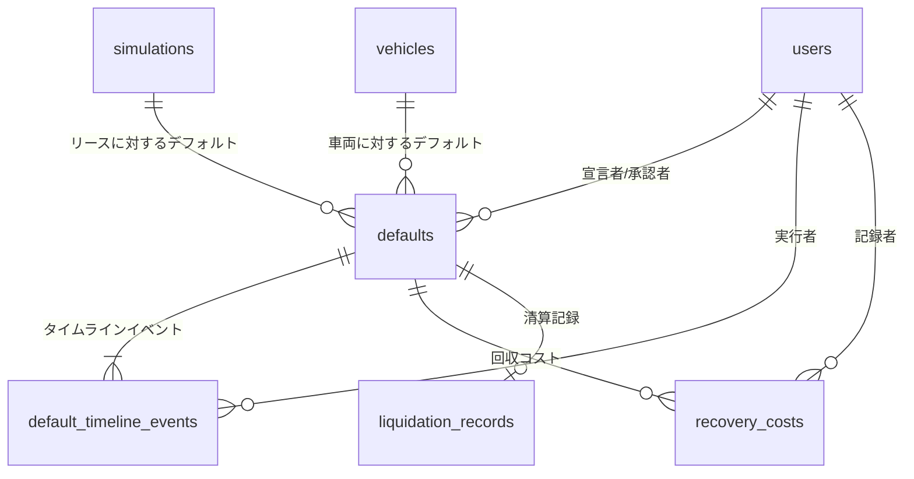

#### 11.6.2 `defaults` テーブル

```sql
-- ============================================================================
-- Migration: 20260406000001_create_defaults
-- Description: Create defaults table for lease default management
-- ============================================================================

CREATE TYPE public.default_stage AS ENUM (
    'T0_DEFAULT_DECLARED',
    'T1_LEGAL_SHIELD',
    'T3_ASSET_RECOVERY_ORDERED',
    'T3_ASSET_RECOVERED',
    'T10_LIQUIDATION_ROUTING',
    'T10_LIQUIDATION_LISTED',
    'LIQUIDATION_SOLD',
    'SETTLED',
    'CANCELLED'
);

CREATE TYPE public.escalation_stage AS ENUM (
    'current',
    'reminder',
    'overdue_warning',
    'overdue_alert',
    'cure_period',
    'default_declared'
);

CREATE TABLE public.defaults (
    id                          uuid            PRIMARY KEY DEFAULT gen_random_uuid(),
    lease_id                    uuid            NOT NULL,
    -- lease_id は将来の leases テーブルへの外部キー。
    -- 現時点では simulations テーブルの id を参照する運用とする。
    simulation_id               uuid            REFERENCES public.simulations(id),
    vehicle_id                  uuid            REFERENCES public.vehicles(id),

    -- デフォルト認定情報
    default_declared_at         timestamptz     NOT NULL DEFAULT now(),
    escalation_stage            public.escalation_stage NOT NULL DEFAULT 'default_declared',
    current_stage               public.default_stage    NOT NULL DEFAULT 'T0_DEFAULT_DECLARED',
    stage_changed_at            timestamptz     NOT NULL DEFAULT now(),

    -- 未払い情報
    overdue_amount_yen          bigint          NOT NULL DEFAULT 0,
    consecutive_missed_payments int             NOT NULL DEFAULT 0,
    last_payment_date           date,
    first_missed_due_date       date            NOT NULL,

    -- SPC所有権情報
    spc_entity_name             text            NOT NULL,
    spc_ownership_cert_number   text,
    legal_shield_invoked_at     timestamptz,

    -- 資産回収情報
    vehicle_location_address    text,
    vehicle_location_lat        numeric(10,7),
    vehicle_location_lng        numeric(10,7),
    recovery_ordered_at         timestamptz,
    recovery_completed_at       timestamptz,
    vehicle_condition_on_recovery text          CHECK (vehicle_condition_on_recovery IN (
                                                    'excellent', 'good', 'fair', 'poor', 'damaged'
                                                )),
    vehicle_condition_notes     text,

    -- 承認・担当者
    declared_by                 uuid            REFERENCES public.users(id),
    approved_by                 uuid            REFERENCES public.users(id),

    -- メタデータ
    notes                       text,
    metadata_json               jsonb           DEFAULT '{}',
    created_at                  timestamptz     NOT NULL DEFAULT now(),
    updated_at                  timestamptz     NOT NULL DEFAULT now()
);

COMMENT ON TABLE public.defaults IS 'Lease default records with exit strategy workflow state';
COMMENT ON COLUMN public.defaults.current_stage IS 'Current stage in the T+0 to T+10 exit strategy timeline';
COMMENT ON COLUMN public.defaults.spc_entity_name IS 'Name of the SPC entity that holds legal ownership';
COMMENT ON COLUMN public.defaults.legal_shield_invoked_at IS 'Timestamp when legal shield was invoked (T+1)';
COMMENT ON COLUMN public.defaults.overdue_amount_yen IS 'Total overdue lease payment amount in yen';

-- Indexes
CREATE UNIQUE INDEX idx_defaults_lease_id       ON public.defaults (lease_id);
CREATE INDEX idx_defaults_current_stage         ON public.defaults (current_stage);
CREATE INDEX idx_defaults_declared_at           ON public.defaults (default_declared_at DESC);
CREATE INDEX idx_defaults_vehicle_id            ON public.defaults (vehicle_id);
CREATE INDEX idx_defaults_simulation_id         ON public.defaults (simulation_id);

-- Trigger
CREATE TRIGGER trg_defaults_updated_at
    BEFORE UPDATE ON public.defaults
    FOR EACH ROW
    EXECUTE FUNCTION public.set_updated_at();
```

#### 11.6.3 `default_timeline_events` テーブル

```sql
-- ============================================================================
-- Migration: 20260406000002_create_default_timeline_events
-- Description: Create timeline event log for each default case
-- ============================================================================

CREATE TYPE public.timeline_event_type AS ENUM (
    'stage_change',
    'notification_sent',
    'document_issued',
    'approval_granted',
    'approval_rejected',
    'payment_received',
    'recovery_update',
    'liquidation_update',
    'note_added',
    'system_auto'
);

CREATE TABLE public.default_timeline_events (
    id                  uuid                    PRIMARY KEY DEFAULT gen_random_uuid(),
    default_id          uuid                    NOT NULL REFERENCES public.defaults(id) ON DELETE CASCADE,
    event_type          public.timeline_event_type NOT NULL,
    event_stage         public.default_stage,
    event_description   text                    NOT NULL,

    -- ステージ遷移の場合
    from_stage          public.default_stage,
    to_stage            public.default_stage,

    -- 通知の場合
    notification_channel text,
    notification_recipient text,

    -- ドキュメントの場合
    document_type       text,
    document_reference  text,

    -- 実行者
    performed_by        uuid                    REFERENCES public.users(id),
    is_automated        boolean                 NOT NULL DEFAULT false,

    -- メタデータ
    metadata_json       jsonb                   DEFAULT '{}',
    created_at          timestamptz             NOT NULL DEFAULT now()
);

COMMENT ON TABLE public.default_timeline_events IS 'Chronological event log for each default case';
COMMENT ON COLUMN public.default_timeline_events.event_type IS 'Type of timeline event';
COMMENT ON COLUMN public.default_timeline_events.is_automated IS 'Whether this event was triggered automatically by the system';

-- Indexes
CREATE INDEX idx_dte_default_id     ON public.default_timeline_events (default_id);
CREATE INDEX idx_dte_event_type     ON public.default_timeline_events (event_type);
CREATE INDEX idx_dte_created_at     ON public.default_timeline_events (created_at DESC);
CREATE INDEX idx_dte_event_stage    ON public.default_timeline_events (event_stage);
```

#### 11.6.4 `recovery_costs` テーブル

```sql
-- ============================================================================
-- Migration: 20260406000003_create_recovery_costs
-- Description: Create recovery cost tracking table
-- ============================================================================

CREATE TABLE public.recovery_costs (
    id              uuid        PRIMARY KEY DEFAULT gen_random_uuid(),
    default_id      uuid        NOT NULL REFERENCES public.defaults(id) ON DELETE CASCADE,
    cost_type       text        NOT NULL CHECK (cost_type IN (
                                    'TOWING_FEE', 'STORAGE_FEE', 'INVESTIGATION_FEE',
                                    'LEGAL_FEE', 'RECONDITIONING_FEE', 'OTHER_FEE'
                                )),
    amount_yen      bigint      NOT NULL CHECK (amount_yen >= 0),
    description     text,
    incurred_date   date        NOT NULL,
    vendor_name     text,
    invoice_number  text,
    recorded_by     uuid        REFERENCES public.users(id),
    metadata_json   jsonb       DEFAULT '{}',
    created_at      timestamptz NOT NULL DEFAULT now(),
    updated_at      timestamptz NOT NULL DEFAULT now()
);

COMMENT ON TABLE public.recovery_costs IS 'Itemized cost records for vehicle recovery process';

-- Indexes
CREATE INDEX idx_recovery_costs_default_id ON public.recovery_costs (default_id);
CREATE INDEX idx_recovery_costs_cost_type  ON public.recovery_costs (cost_type);

-- Trigger
CREATE TRIGGER trg_recovery_costs_updated_at
    BEFORE UPDATE ON public.recovery_costs
    FOR EACH ROW
    EXECUTE FUNCTION public.set_updated_at();
```

#### 11.6.5 `liquidation_records` テーブル

```sql
-- ============================================================================
-- Migration: 20260406000004_create_liquidation_records
-- Description: Create liquidation (global disposal) records table
-- ============================================================================

CREATE TYPE public.liquidation_status AS ENUM (
    'routing',
    'listed',
    'offer_received',
    'sold',
    'settled',
    'cancelled'
);

CREATE TABLE public.liquidation_records (
    id                          uuid                    PRIMARY KEY DEFAULT gen_random_uuid(),
    default_id                  uuid                    NOT NULL REFERENCES public.defaults(id) ON DELETE CASCADE,
    vehicle_id                  uuid                    REFERENCES public.vehicles(id),

    -- ルーティング情報
    target_market_code          text                    NOT NULL,
    target_market_name          text                    NOT NULL,
    target_market_region        text                    NOT NULL CHECK (target_market_region IN (
                                                            'DOMESTIC', 'ASIA', 'AFRICA',
                                                            'MIDDLE_EAST', 'CIS', 'OCEANIA',
                                                            'SOUTH_AMERICA', 'OTHER'
                                                        )),

    -- 価格情報
    domestic_appraisal_yen      bigint,
    estimated_price_usd         bigint,
    listing_price_usd           bigint,
    final_sale_price_usd        bigint,
    final_sale_price_yen        bigint,
    exchange_rate_used          numeric(10,4),

    -- コスト
    logistics_cost_usd          bigint                  DEFAULT 0,
    export_duties_usd           bigint                  DEFAULT 0,
    broker_commission_usd       bigint                  DEFAULT 0,
    total_liquidation_cost_yen  bigint                  DEFAULT 0,
    net_proceeds_yen            bigint,

    -- ステータスと日程
    status                      public.liquidation_status NOT NULL DEFAULT 'routing',
    routed_at                   timestamptz,
    listed_at                   timestamptz,
    sold_at                     timestamptz,
    settled_at                  timestamptz,

    -- 買い手情報
    buyer_name                  text,
    buyer_country               text,
    buyer_reference             text,

    -- 投資家分配
    outstanding_lease_balance_yen bigint,
    loss_given_default_yen      bigint,
    loss_given_default_rate     numeric(6,4),
    distribution_json           jsonb                   DEFAULT '[]',

    -- メタデータ
    notes                       text,
    metadata_json               jsonb                   DEFAULT '{}',
    created_at                  timestamptz             NOT NULL DEFAULT now(),
    updated_at                  timestamptz             NOT NULL DEFAULT now()
);

COMMENT ON TABLE public.liquidation_records IS 'Global liquidation records with international market routing and investor distribution';
COMMENT ON COLUMN public.liquidation_records.target_market_code IS 'Market code (e.g. SEA_TH for Thailand, AF_KE for Kenya)';
COMMENT ON COLUMN public.liquidation_records.loss_given_default_rate IS 'LGD rate as decimal (e.g. 0.1500 = 15.0%)';
COMMENT ON COLUMN public.liquidation_records.distribution_json IS 'JSON array of investor distribution details';

-- Indexes
CREATE UNIQUE INDEX idx_liquidation_default_id      ON public.liquidation_records (default_id);
CREATE INDEX idx_liquidation_status                 ON public.liquidation_records (status);
CREATE INDEX idx_liquidation_target_market           ON public.liquidation_records (target_market_region, target_market_code);
CREATE INDEX idx_liquidation_sold_at                ON public.liquidation_records (sold_at DESC);
CREATE INDEX idx_liquidation_vehicle_id             ON public.liquidation_records (vehicle_id);

-- Trigger
CREATE TRIGGER trg_liquidation_records_updated_at
    BEFORE UPDATE ON public.liquidation_records
    FOR EACH ROW
    EXECUTE FUNCTION public.set_updated_at();
```

---

### 11.7 Pydantic モデル定義

```python
"""Default management and exit strategy Pydantic models.

File: app/models/default.py
"""

from datetime import date, datetime
from decimal import Decimal
from enum import Enum
from typing import Literal, Optional
from uuid import UUID

from pydantic import BaseModel, Field


# ---------------------------------------------------------------------------
# Enums
# ---------------------------------------------------------------------------

class DefaultStage(str, Enum):
    """デフォルト管理ワークフローのステージ。"""
    T0_DEFAULT_DECLARED = "T0_DEFAULT_DECLARED"
    T1_LEGAL_SHIELD = "T1_LEGAL_SHIELD"
    T3_ASSET_RECOVERY_ORDERED = "T3_ASSET_RECOVERY_ORDERED"
    T3_ASSET_RECOVERED = "T3_ASSET_RECOVERED"
    T10_LIQUIDATION_ROUTING = "T10_LIQUIDATION_ROUTING"
    T10_LIQUIDATION_LISTED = "T10_LIQUIDATION_LISTED"
    LIQUIDATION_SOLD = "LIQUIDATION_SOLD"
    SETTLED = "SETTLED"
    CANCELLED = "CANCELLED"


class EscalationStage(str, Enum):
    """支払い遅延エスカレーションステージ。"""
    CURRENT = "current"
    REMINDER = "reminder"
    OVERDUE_WARNING = "overdue_warning"
    OVERDUE_ALERT = "overdue_alert"
    CURE_PERIOD = "cure_period"
    DEFAULT_DECLARED = "default_declared"


class TimelineEventType(str, Enum):
    """タイムラインイベント種別。"""
    STAGE_CHANGE = "stage_change"
    NOTIFICATION_SENT = "notification_sent"
    DOCUMENT_ISSUED = "document_issued"
    APPROVAL_GRANTED = "approval_granted"
    APPROVAL_REJECTED = "approval_rejected"
    PAYMENT_RECEIVED = "payment_received"
    RECOVERY_UPDATE = "recovery_update"
    LIQUIDATION_UPDATE = "liquidation_update"
    NOTE_ADDED = "note_added"
    SYSTEM_AUTO = "system_auto"


class RecoveryCostType(str, Enum):
    """回収コスト種別。"""
    TOWING_FEE = "TOWING_FEE"
    STORAGE_FEE = "STORAGE_FEE"
    INVESTIGATION_FEE = "INVESTIGATION_FEE"
    LEGAL_FEE = "LEGAL_FEE"
    RECONDITIONING_FEE = "RECONDITIONING_FEE"
    OTHER_FEE = "OTHER_FEE"


class LiquidationStatus(str, Enum):
    """清算ステータス。"""
    ROUTING = "routing"
    LISTED = "listed"
    OFFER_RECEIVED = "offer_received"
    SOLD = "sold"
    SETTLED = "settled"
    CANCELLED = "cancelled"


class VehicleCondition(str, Enum):
    """回収時車両状態。"""
    EXCELLENT = "excellent"
    GOOD = "good"
    FAIR = "fair"
    POOR = "poor"
    DAMAGED = "damaged"


class MarketRegion(str, Enum):
    """清算対象市場リージョン。"""
    DOMESTIC = "DOMESTIC"
    ASIA = "ASIA"
    AFRICA = "AFRICA"
    MIDDLE_EAST = "MIDDLE_EAST"
    CIS = "CIS"
    OCEANIA = "OCEANIA"
    SOUTH_AMERICA = "SOUTH_AMERICA"
    OTHER = "OTHER"


# ---------------------------------------------------------------------------
# Request Models
# ---------------------------------------------------------------------------

class DeclareDefaultRequest(BaseModel):
    """POST /api/v1/defaults/{lease_id}/declare のリクエストボディ。"""

    overdue_amount_yen: int = Field(
        ..., description="未払い額合計（円）", ge=0, examples=[360000]
    )
    consecutive_missed_payments: int = Field(
        ..., description="連続未払い回数", ge=1, examples=[2]
    )
    first_missed_due_date: date = Field(
        ..., description="最初の未払い支払期日", examples=["2026-03-01"]
    )
    last_payment_date: Optional[date] = Field(
        default=None, description="最後に入金が確認された日", examples=["2026-02-01"]
    )
    spc_entity_name: str = Field(
        ..., description="SPC法人名", examples=["CVL第一号合同会社"]
    )
    spc_ownership_cert_number: Optional[str] = Field(
        default=None, description="SPC所有権証明書番号", examples=["SPC-2026-00123"]
    )
    vehicle_id: Optional[UUID] = Field(
        default=None, description="対象車両ID（vehiclesテーブル）"
    )
    simulation_id: Optional[UUID] = Field(
        default=None, description="関連シミュレーションID"
    )
    vehicle_location_address: Optional[str] = Field(
        default=None, description="車両所在地住所", examples=["東京都江東区有明3-1-1"]
    )
    notes: Optional[str] = Field(
        default=None, description="備考"
    )


class AdvanceStageRequest(BaseModel):
    """PUT /api/v1/defaults/{id}/advance-stage のリクエストボディ。"""

    target_stage: DefaultStage = Field(
        ..., description="遷移先ステージ"
    )
    approved_by: Optional[UUID] = Field(
        default=None, description="承認者ユーザーID（承認が必要なステージの場合）"
    )
    notes: Optional[str] = Field(
        default=None, description="ステージ遷移に関する備考"
    )
    vehicle_condition: Optional[VehicleCondition] = Field(
        default=None, description="回収時車両状態（T3_ASSET_RECOVERED遷移時に必要）"
    )
    vehicle_condition_notes: Optional[str] = Field(
        default=None, description="車両状態の詳細メモ"
    )
    recovery_completed_at: Optional[datetime] = Field(
        default=None, description="回収完了日時"
    )


class CreateLiquidationRequest(BaseModel):
    """POST /api/v1/defaults/{id}/liquidation のリクエストボディ。"""

    target_market_code: str = Field(
        ..., description="ターゲット市場コード", examples=["SEA_TH"]
    )
    target_market_name: str = Field(
        ..., description="ターゲット市場名", examples=["タイ・バンコク"]
    )
    target_market_region: MarketRegion = Field(
        ..., description="ターゲット市場リージョン"
    )
    domestic_appraisal_yen: Optional[int] = Field(
        default=None, description="国内査定額（円）", ge=0, examples=[2500000]
    )
    estimated_price_usd: Optional[int] = Field(
        default=None, description="想定売却価格（USD）", ge=0, examples=[18000]
    )
    listing_price_usd: Optional[int] = Field(
        default=None, description="掲載価格（USD）", ge=0, examples=[20000]
    )
    logistics_cost_usd: Optional[int] = Field(
        default=0, description="物流コスト（USD）", ge=0, examples=[2000]
    )
    outstanding_lease_balance_yen: Optional[int] = Field(
        default=None, description="未回収リース料残高（円）", ge=0, examples=[1800000]
    )
    notes: Optional[str] = Field(
        default=None, description="備考"
    )


# ---------------------------------------------------------------------------
# Response Models
# ---------------------------------------------------------------------------

class TimelineEventResponse(BaseModel):
    """タイムラインイベントのレスポンス。"""
    id: UUID
    default_id: UUID
    event_type: TimelineEventType
    event_stage: Optional[DefaultStage] = None
    event_description: str
    from_stage: Optional[DefaultStage] = None
    to_stage: Optional[DefaultStage] = None
    performed_by: Optional[UUID] = None
    is_automated: bool
    created_at: datetime
    model_config = {"from_attributes": True}


class RecoveryCostResponse(BaseModel):
    """回収コストのレスポンス。"""
    id: UUID
    default_id: UUID
    cost_type: RecoveryCostType
    amount_yen: int
    description: Optional[str] = None
    incurred_date: date
    vendor_name: Optional[str] = None
    model_config = {"from_attributes": True}


class LiquidationResponse(BaseModel):
    """清算記録のレスポンス。"""
    id: UUID
    default_id: UUID
    target_market_code: str
    target_market_name: str
    target_market_region: MarketRegion
    status: LiquidationStatus
    domestic_appraisal_yen: Optional[int] = None
    estimated_price_usd: Optional[int] = None
    listing_price_usd: Optional[int] = None
    final_sale_price_usd: Optional[int] = None
    final_sale_price_yen: Optional[int] = None
    net_proceeds_yen: Optional[int] = None
    loss_given_default_yen: Optional[int] = None
    loss_given_default_rate: Optional[Decimal] = None
    routed_at: Optional[datetime] = None
    listed_at: Optional[datetime] = None
    sold_at: Optional[datetime] = None
    settled_at: Optional[datetime] = None
    created_at: datetime
    updated_at: datetime
    model_config = {"from_attributes": True}


class DefaultResponse(BaseModel):
    """デフォルト記録のフルレスポンス。"""
    id: UUID
    lease_id: UUID
    simulation_id: Optional[UUID] = None
    vehicle_id: Optional[UUID] = None
    default_declared_at: datetime
    escalation_stage: EscalationStage
    current_stage: DefaultStage
    stage_changed_at: datetime
    overdue_amount_yen: int
    consecutive_missed_payments: int
    last_payment_date: Optional[date] = None
    first_missed_due_date: date
    spc_entity_name: str
    spc_ownership_cert_number: Optional[str] = None
    legal_shield_invoked_at: Optional[datetime] = None
    vehicle_location_address: Optional[str] = None
    vehicle_condition_on_recovery: Optional[VehicleCondition] = None
    recovery_ordered_at: Optional[datetime] = None
    recovery_completed_at: Optional[datetime] = None
    declared_by: Optional[UUID] = None
    approved_by: Optional[UUID] = None
    notes: Optional[str] = None
    timeline_events: list[TimelineEventResponse] = Field(default_factory=list)
    recovery_costs: list[RecoveryCostResponse] = Field(default_factory=list)
    liquidation: Optional[LiquidationResponse] = None
    total_recovery_cost_yen: int = Field(default=0, description="回収コスト合計（円）")
    days_since_default: int = Field(default=0, description="デフォルト認定からの経過日数")
    created_at: datetime
    updated_at: datetime
    model_config = {"from_attributes": True}


class DefaultListItem(BaseModel):
    """デフォルト一覧用の簡易レスポンス。"""
    id: UUID
    lease_id: UUID
    current_stage: DefaultStage
    overdue_amount_yen: int
    spc_entity_name: str
    default_declared_at: datetime
    days_since_default: int
    vehicle_condition_on_recovery: Optional[VehicleCondition] = None
    created_at: datetime
    model_config = {"from_attributes": True}
```

---

### 11.8 APIエンドポイント定義

#### 11.8.1 エンドポイント一覧

| メソッド | パス | 説明 | 認可レベル |
|---------|------|------|----------|
| `POST` | `/api/v1/defaults/{lease_id}/declare` | デフォルト宣言（T+0開始） | ファンドマネージャー以上 |
| `GET` | `/api/v1/defaults` | デフォルト一覧取得 | 営業マネージャー以上 |
| `GET` | `/api/v1/defaults/{id}` | デフォルト詳細取得（タイムライン含む） | 営業マネージャー以上 |
| `PUT` | `/api/v1/defaults/{id}/advance-stage` | ステージ進行 | ファンドマネージャー以上 |
| `POST` | `/api/v1/defaults/{id}/recovery-costs` | 回収コスト登録 | 営業担当以上 |
| `POST` | `/api/v1/defaults/{id}/liquidation` | 清算開始（ルーティング・掲載） | ファンドマネージャー以上 |
| `PUT` | `/api/v1/defaults/{id}/liquidation` | 清算記録更新（売却・精算） | ファンドマネージャー以上 |

#### 11.8.2 `POST /api/v1/defaults/{lease_id}/declare`

デフォルトを宣言し、Exit Strategyワークフローを開始する。

**パスパラメータ:** `lease_id` (UUID) - リース契約ID

**リクエストボディ:** `DeclareDefaultRequest`

**レスポンス:**

```json
{
    "status": "success",
    "data": {
        "id": "550e8400-e29b-41d4-a716-446655440000",
        "lease_id": "660e8400-e29b-41d4-a716-446655440001",
        "current_stage": "T0_DEFAULT_DECLARED",
        "default_declared_at": "2026-04-06T10:00:00Z",
        "overdue_amount_yen": 360000,
        "spc_entity_name": "CVL第一号合同会社",
        "timeline_events": [
            {
                "id": "770e8400-e29b-41d4-a716-446655440002",
                "event_type": "stage_change",
                "event_stage": "T0_DEFAULT_DECLARED",
                "event_description": "デフォルト認定。未払い額: ¥360,000、連続未払い: 2回",
                "is_automated": true,
                "created_at": "2026-04-06T10:00:00Z"
            }
        ],
        "days_since_default": 0
    }
}
```

**エラーレスポンス:**

| HTTPステータス | エラーコード | 説明 |
|--------------|-----------|------|
| 404 | `LEASE_NOT_FOUND` | 指定されたリースIDが存在しない |
| 409 | `DEFAULT_ALREADY_EXISTS` | 該当リースに対するデフォルトが既に存在 |
| 422 | `VALIDATION_ERROR` | バリデーションエラー |

**処理フロー:**

```python
async def declare_default(
    lease_id: UUID,
    request: DeclareDefaultRequest,
    current_user: User,
) -> DefaultResponse:
    """デフォルト宣言のビジネスロジック。
    1. リース契約の存在確認
    2. 既存デフォルトの重複チェック（lease_id に UNIQUE 制約）
    3. defaults レコード作成（stage = T0_DEFAULT_DECLARED）
    4. default_timeline_events にステージ変更イベント記録
    5. 通知送信（全ステークホルダー）
    6. T+1 法的シールド自動発動のスケジュール登録
    """
    ...
```

#### 11.8.3 `GET /api/v1/defaults`

**クエリパラメータ:**

| パラメータ | 型 | 必須 | デフォルト | 説明 |
|----------|---|------|---------|------|
| `stage` | string | No | - | ステージでフィルタ（カンマ区切り可） |
| `from_date` | date | No | - | デフォルト認定日の開始日 |
| `to_date` | date | No | - | デフォルト認定日の終了日 |
| `page` | int | No | 1 | ページ番号 |
| `per_page` | int | No | 20 | 1ページあたり件数（最大100） |
| `sort_by` | string | No | `default_declared_at` | ソートカラム |
| `sort_order` | string | No | `desc` | ソート順 |

**レスポンス:** `PaginatedResponse[DefaultListItem]`

#### 11.8.4 `PUT /api/v1/defaults/{id}/advance-stage`

**リクエストボディ:** `AdvanceStageRequest`

**ステージ遷移バリデーション:**

| 現在のステージ | 許可される遷移先 |
|-------------|--------------|
| `T0_DEFAULT_DECLARED` | `T1_LEGAL_SHIELD`, `CANCELLED` |
| `T1_LEGAL_SHIELD` | `T3_ASSET_RECOVERY_ORDERED`, `CANCELLED` |
| `T3_ASSET_RECOVERY_ORDERED` | `T3_ASSET_RECOVERED`, `CANCELLED` |
| `T3_ASSET_RECOVERED` | `T10_LIQUIDATION_ROUTING` |
| `T10_LIQUIDATION_ROUTING` | `T10_LIQUIDATION_LISTED` |
| `T10_LIQUIDATION_LISTED` | `LIQUIDATION_SOLD` |
| `LIQUIDATION_SOLD` | `SETTLED` |

**処理フロー:**

```python
async def advance_stage(
    default_id: UUID,
    request: AdvanceStageRequest,
    current_user: User,
) -> DefaultResponse:
    """ステージ進行のビジネスロジック。
    1. デフォルトレコードの取得
    2. DefaultWorkflowEngine.can_advance() による遷移可否判定
    3. ステージ固有の処理:
       - T1_LEGAL_SHIELD: legal_shield_invoked_at を記録
       - T3_ASSET_RECOVERY_ORDERED: recovery_ordered_at を記録
       - T3_ASSET_RECOVERED: 車両状態・回収完了日時を記録
       - T10_LIQUIDATION_ROUTING: 清算プロセス開始のバリデーション
    4. defaults.current_stage を更新、stage_changed_at を now()
    5. default_timeline_events にステージ変更イベント記録
    6. 次ステージの自動遷移スケジュール（該当する場合）
    """
    ...
```

#### 11.8.5 `POST /api/v1/defaults/{id}/liquidation`

**リクエストボディ:** `CreateLiquidationRequest`

**前提条件:**
- `current_stage` が `T3_ASSET_RECOVERED` 以降
- 同一デフォルトIDに対する `liquidation_records` が未存在

**処理フロー:**

```python
async def create_liquidation(
    default_id: UUID,
    request: CreateLiquidationRequest,
    current_user: User,
) -> LiquidationResponse:
    """清算プロセス開始のビジネスロジック。
    1. デフォルトレコードの取得とステージ確認
    2. 既存清算レコードの重複チェック
    3. recovery_costs から回収コスト合計を算出
    4. liquidation_records 作成（status = 'routing'）
    5. defaults.current_stage を T10_LIQUIDATION_ROUTING に更新
    6. default_timeline_events にイベント記録
    7. route_to_optimal_market() で最適市場を算出
    """
    ...
```

**レスポンス例（精算完了時）:**

```json
{
    "status": "success",
    "data": {
        "id": "880e8400-e29b-41d4-a716-446655440003",
        "default_id": "550e8400-e29b-41d4-a716-446655440000",
        "target_market_code": "SEA_TH",
        "target_market_name": "タイ・バンコク",
        "target_market_region": "ASIA",
        "status": "settled",
        "domestic_appraisal_yen": 2500000,
        "final_sale_price_usd": 19500,
        "final_sale_price_yen": 2925000,
        "exchange_rate_used": 150.0000,
        "total_liquidation_cost_yen": 521250,
        "net_proceeds_yen": 2403750,
        "outstanding_lease_balance_yen": 1800000,
        "loss_given_default_yen": -603750,
        "loss_given_default_rate": -0.3354,
        "distribution_json": [
            {
                "investor_id": "inv-001",
                "investor_name": "投資家A",
                "share_rate": 0.60,
                "distribution_amount_yen": 1442250
            },
            {
                "investor_id": "inv-002",
                "investor_name": "投資家B",
                "share_rate": 0.40,
                "distribution_amount_yen": 961500
            }
        ],
        "sold_at": "2026-04-14T14:30:00Z",
        "settled_at": "2026-04-16T15:00:00Z"
    }
}
```

---

### 11.9 RLS（Row Level Security）ポリシー

```sql
-- ============================================================================
-- Migration: 20260406000005_enable_rls_defaults
-- Description: Enable RLS for default management tables
-- ============================================================================

ALTER TABLE public.defaults ENABLE ROW LEVEL SECURITY;
CREATE POLICY "defaults_select_policy" ON public.defaults FOR SELECT
    USING (auth.role() IN ('fund_manager', 'sales_manager', 'admin'));
CREATE POLICY "defaults_insert_policy" ON public.defaults FOR INSERT
    WITH CHECK (auth.role() IN ('fund_manager', 'admin'));
CREATE POLICY "defaults_update_policy" ON public.defaults FOR UPDATE
    USING (auth.role() IN ('fund_manager', 'admin'));

ALTER TABLE public.default_timeline_events ENABLE ROW LEVEL SECURITY;
CREATE POLICY "dte_select_policy" ON public.default_timeline_events FOR SELECT
    USING (auth.role() IN ('fund_manager', 'sales_manager', 'sales', 'admin'));
CREATE POLICY "dte_insert_policy" ON public.default_timeline_events FOR INSERT
    WITH CHECK (auth.role() IN ('fund_manager', 'sales_manager', 'admin'));

ALTER TABLE public.recovery_costs ENABLE ROW LEVEL SECURITY;
CREATE POLICY "recovery_costs_select_policy" ON public.recovery_costs FOR SELECT
    USING (auth.role() IN ('fund_manager', 'sales_manager', 'admin'));
CREATE POLICY "recovery_costs_insert_policy" ON public.recovery_costs FOR INSERT
    WITH CHECK (auth.role() IN ('fund_manager', 'sales_manager', 'sales', 'admin'));

ALTER TABLE public.liquidation_records ENABLE ROW LEVEL SECURITY;
CREATE POLICY "liquidation_select_policy" ON public.liquidation_records FOR SELECT
    USING (auth.role() IN ('fund_manager', 'sales_manager', 'admin'));
CREATE POLICY "liquidation_insert_policy" ON public.liquidation_records FOR INSERT
    WITH CHECK (auth.role() IN ('fund_manager', 'admin'));
CREATE POLICY "liquidation_update_policy" ON public.liquidation_records FOR UPDATE
    USING (auth.role() IN ('fund_manager', 'admin'));
```

---

### 11.10 画面要件（HTMX フラグメント）

#### 11.10.1 テンプレート構成

```
templates/
├── pages/
│   ├── defaults.html              # デフォルト管理一覧（フルページ）
│   └── default_detail.html        # デフォルト詳細・タイムライン（フルページ）
└── fragments/
    ├── _default_list.html         # デフォルト一覧テーブル（部分更新用）
    ├── _default_timeline.html     # タイムラインイベント表示（部分更新用）
    ├── _default_stage_badge.html  # ステージバッジ（部分更新用）
    ├── _recovery_cost_form.html   # 回収コスト入力フォーム（部分更新用）
    ├── _liquidation_panel.html    # 清算パネル（部分更新用）
    └── _liquidation_distribution.html  # 投資家分配表示（部分更新用）
```

#### 11.10.2 ステージバッジの色定義

| ステージ | バッジ色 | ラベル |
|---------|---------|-------|
| `T0_DEFAULT_DECLARED` | 赤 (`bg-red-600`) | デフォルト認定 |
| `T1_LEGAL_SHIELD` | オレンジ (`bg-orange-500`) | 法的シールド |
| `T3_ASSET_RECOVERY_ORDERED` | 黄 (`bg-yellow-500`) | 回収指示済 |
| `T3_ASSET_RECOVERED` | 青 (`bg-blue-500`) | 回収完了 |
| `T10_LIQUIDATION_ROUTING` | 紫 (`bg-purple-500`) | 清算ルーティング中 |
| `T10_LIQUIDATION_LISTED` | 紫 (`bg-purple-600`) | 清算掲載中 |
| `LIQUIDATION_SOLD` | 緑 (`bg-green-500`) | 売却成立 |
| `SETTLED` | 灰 (`bg-gray-500`) | 精算完了 |
| `CANCELLED` | 灰 (`bg-gray-400`) | 取消 |

---

*本仕様書は開発の進行に伴い随時更新する。*
